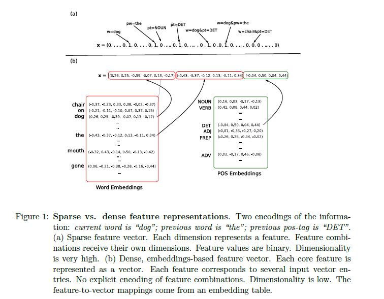
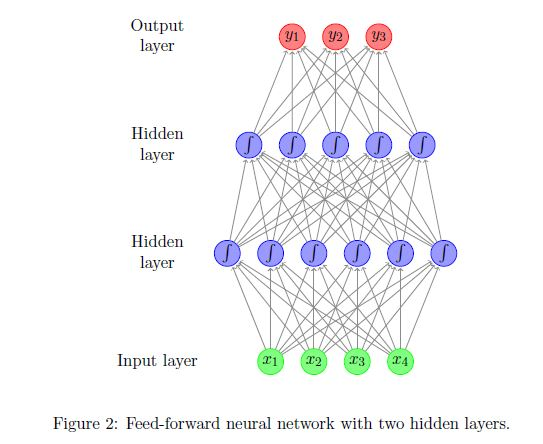

[TOC]

# Feature Representation

When dealing with natural language, the input $x$ encodes features such as words, part-of-speech tags or other linguistic information. Perhaps the biggest jump when moving from sparse-input linear models to neural-network based models is to stop representing **sparse vectors** in which each feature as a unique dimension (the so called **one-hot representation**) and representing them instead as **dense vectors**. That is, each core feature is **embedded** into a $d$ dimensional space, and represented as a vector in that space. 

Note: Those feature **embeddings** (the vector representation of each core feature) are treated as **model parameters** that need to be trained together with the other components of the network.

## Sparse vs. Dense Representations

What are the benefits of representing our features as dense instead of as sparse vectors? Should we always represent features as dense vectors?

### Sparse Representation

Sparse representation is also called **one-hot** representation, it is a sparse vector representation, each feature of input is its own dimension.

* Dimensionality of representation vector is same as number of distinct features of input.
* The input features are completely independent from one another.

### Dense Representation

Each feature of input is a d-dimensional vector in dense representation, in other words, a input feature is represented by a vector of hidden features.

* Dimensionality of representation vector is d.
* Similar input features will have similar vectors, i.e., information is shared between similar features.

### Which one should be used?

One benefits of using dense and low-dimensional vectors is **computational**. And the main benefits of the dense representations is in **generalization** power: if we believe some input features may provide similar clues, it is worthwhile to provide a representation that is able to capture these similarities. 

For example, assume we have observed the word 'dog' many times during training, but only observed the word 'cat' a few times. Can we share knowledge learned from 'dog' to 'cat'? In the dense vectors representation the learned vector for 'dog' may be similar to the learned vector from 'cat', allowing the model to **share statistical strength** between the two events.

It may be the case that under some circumstances, when the feature space is relatively small and the training data is plentiful, or when we do not wish to share statistical information between distinct words, there are gains to be made from using the one-hot representations. However, this is still an open research question, and there are no strong evidence to either side.

Representing words as dense vectors for input to a neural network was introduced by Bengio et al (Bengio et al., 2003) in the context of neural language modeling. It was introduced to NLP tasks in the pioneering work of Collobert, Weston and colleagues (2008, 2011). Using embeddings for representing not only words but arbitrary features was popularized following Chen and Manning (2014).

## Core Features and Combination Features

In the **traditional linear-model-based** NLP systems in which the feature designer had to manually specify not only the **core features** of interests but also interactions between them that called **combination features** (e.g., introducing not only a feature stating word is "X" and a feature stating tag is "Y" but also combined feature stating word is "X" and tag is "Y" or sometimes even "word is X, tag is Y and previous word is Z").

The combination features are crucial in linear models because they introduce more dimensions to the input, transforming it into a space where the data points are closer to being linearly separable. On the other hand, the space of possible combinations is very large, and the feature designer has to spend a lot of time coming up with an effective set of feature combinations.

One of the promises of the **non-linear neural network models** is that one needs to define only the core features. The non-linearity of the classifier, as defined by the network structure, is expected to take care of finding the indicative feature combinations, alleviating the need for feature combination engineering.

**Kernel methods** (Shawe-Taylor & Cristianini, 2004), and in particular polynomial kernels (Kudo & Matsumoto, 2003), also allow the feature designer to specify only core features, leaving the feature combination aspect to the learning algorithm. In contrast to neural network models, kernels methods are **convex**, admitting exact solutions to the optimization problem. However, the classification efficiency in kernel methods **scales linearly with the size of the training data**, making them too slow for most practical purposes, and not suitable for training with large datasets. On the other hand, **neural network** classification efficiency **scales linearly with the size of the network**, regardless of the training data size.

## Representation for sequences of varying length

**Feed-forward networks** assume the input with **fixed size**. However, in some cases the size of input features is not known in advance. For example, in document classification it is common that each word in the document is a feature, and the number of words is varying. We thus need to represent an unbounded number of features using a fixed size vector.

### Bag of words

One way of achieving this is through a bag of words representation. We discard order information, and works by either summing or averaging the one-hot vectors of the corresponding features:

$$
\text{BoW}(d=f_1,f_2,\dots,f_n) = \frac{1}{n} \sum_{i}^{n}{v(f_i)}
$$

where $v(f_i)$ is the **one-hot** encoding for the $f_i$ feature.

But this is really a bad idea. Because features are independent in one-hot representation, summing or averaging operator will discard lots of useful information in the input features.

### Continuous bags of words

Instead of bags of words, we can use the continuous bags of words to convert the varying sequence into a vector with fixed size.

$$
\text{CBoW}(d=f_1,f_2,\dots,f_n) = \frac{1}{n} \sum_{i}^{n}{v(f_i)}
$$

where $v(f_i)$ is the **word embedding** vector for the $f_i$ feature.

### Weighted continuous bags of words

We can assign a weight for each continuous bags of words representation:

$$
\text{WCBoW}(d=f_1,f_2,\dots,f_n) = \frac{1}{\sum_{i}^{n}{a(f_i)}} \sum_{i}^{n}{a(f_i)}{v(f_i)}
$$

where $v(f_i)$ is the **word embedding** vector for the $f_i$ feature; $a(i)$ is the weight of embedding vector.

For example, in a document classification task, a feature $f_{i}$ may correspond to a word in the document, and the associated weight $a(f_i)$ could be the word's TF-IDF score.

## Representation for distance features

The linear distance in between two words in a sentence may serve as an informative feature. 

In the **traditional NLP** setup, distances are usually encoded by binning the distances into several groups (i.e. 1, 2, 3, 4, 5-10, 10+) and associating each bin with a **one-hot** vector. 

In a **neural architecture**, where the input vector is not composed of binary indicator features, it may seem natural to allocate a single input vector entry to the distance feature, where the numeric value of that entry is the distance. However, this approach is not taken in practice. Instead, distance features are encoded similarly to the other feature types: each bin is associated with a **dense vector**, and these **distance embedding** vectors are then trained as regular parameters in the network (Zeng et al., 2014; dos Santos et al., 2015; Zhu et al., 2015a; Nguyen & Grishman, 2015).

## Sharing representation

Image that, when assigning a part-of-speech to a given word, we may have a set of features considering the previous word and the next word. When feeding the input to the classifier, we will concatenate the vector representation of the previous word to the vector representation of the next word.  But should the representation for the previous-word "dog" be the same as the representation of the next-word "dog"? Or should we assign them two distinct representation vectors?

This is mostly an empirical question. If you believe words behave differently when they appear in different positions then it may be a good idea to use two different vocabularies and assign a different set of vectors for each feature type. However, if you believe the words behave similarly in both locations, then something may be gained by using a shared vocabulary for both feature types.

## The dimensionality of dense representation

Assume we should embed words, part-of-speech, and distance features as dense representation in some NLP task. How many dimensions should we allocate for each feature?

Unfortunately, there are no theoretical bounds or even established best-practices. Clearly, the dimensionality should grow with the number of the members in the class (you probably want to assign more dimensions to word embeddings than to part-of-speech embeddings) but how much is enough?

Since the dimensionality of the vectors has a direct effect on memory requirements and processing time, a good rule of thumb would be to experiment with a few different sizes, and choose a good trade-off between speed and task accuracy.

## Dense representation for output

For multi-class classification problems with k classes, the network's output is a k-dimensional vector in which every dimension represents the strength of a particular output class. That is, the output remains as in the traditional linear models - scalar scores to items in a discrete set. 

However, there is a d*k matrix associated with the output layer in some applications. The columns of this matrix can be thought of as d dimensional embeddings of the output classes. The vector similarities between the column vector representations of the k classes indicate the model's learned similarities between the output classes.

# Neural Network Architectures Review

Neural networks are powerful learning models. We will discuss two kinds of neural network
architectures, that can be mixed and matched, **feed-forward networks** and **recurrent /
recursive networks**. Feed-forward networks include networks with fully connected layers,
such as the multi-layer perceptorn, as well as networks with convoluational and pooling
layers. All of the networks act as classifiers, but each with different strengths.

## Fully connected feed-forward neural networks

Fully connected feed-forward neural networks are **non-linear** learners that
can, for the most part, be used as a drop-in replacement wherever a linear learner is used.

The non-linearity of the network, as well as the
ability to easily integrate pre-trained **word embeddings**, often lead to superior classication
accuracy.

## Feed-forward networks with convolutional and pooling layers

Networks with convolutional and pooling layers are useful for classification
tasks in which we expect to find strong local clues regarding class membership, but these
clues can appear in different places in the input.

Convolutional and pooling layers allow the model to learn to find **local features**, regardless of their position.

In natural language we often work with structured data of **arbitrary sizes**, such as
sequences and trees. We would like to be able to capture regularities in such structures,
or to model similarities between such structures. In many cases, this means encoding
the structure as a **fixed width vector**, which we can then pass on to another statistical
learner for further processing.

For sequence input with variable size, While convolutional and pooling architectures allow us to
encode arbitrary large items as fixed size vectors capturing their most **salient features**,
they do so by sacrificing most of the structural information. 

Recurrent and Recursive Networks, on the other hand, allow us to work with sequences
and trees while preserving a lot of the **structural information**.

## Recurrent Networks

Recurrent networks (Elman, 1990) are designed to model **sequences**.

Recurrent models have been shown to produce very strong results for **language modeling**, **sequence tagging**, **machine translation**,  **dependency parsing**, **sentiment analysis** and so on.

## Recursive Networks

Recursive networks (Goller & Kuchler, 1996) are generalizations of recurrent networks that can handle **trees**. We will also discuss an extension of recurrent networks that allow them to model **stacks** (Dyer, Ballesteros, Ling, Matthews, & Smith, 2015; Watanabe & Sumita, 2015).

Recursive models were shown to produce state-of-the-art or near state-of-the-art results
for constituency and dependency parse re-ranking, discourse parsing, semantic relation classication, political ideology detection based on parse trees, question answering and so on.

# Feed-forward neural networks

## Architectures

Neural network consists of computation units called neurons. Each input has an associated weight, reflecting its importance to the output of neuron. The neuron multiplies each input by its weight, and then sums them, applies a non-linear function to the result, and passes it to its output. The neurons are connected to each other, forming a network: the output of a neuron may feed into the inputs of one or more neurons.

Math for the above neural network:

$$
h^{(1)}=\alpha(xW^{(1)} + b^{(1)}) \\
h^{(2)}=\alpha(h^{(1)}W^{(2)} + b^{(2)}) \\
y=h^{(2)}W^{(3)}
$$

where $\alpha$  non-linear activation function has a crucial role in the network's ability to represent complex functions. Without the it, the neural network can only represent linear transformations of the input.

Layers resulting from linear transformations are often referred to as **fully connected**, or **affine**. Other types of architectures exist. In particular, image recognition problems benefit from **convolutional** and **pooling** layers.

## Components

### Input layer

The input of the network is a $d_{\text{in}}$ dimensional vector. The element of input vector can be any real value, this always relates to application.

### Hidden layer

You can have any number of hidden layers as you need. The more hidden layers in the network, the more complex is for your model.

### Output layer

The output of the network is a $d_{\text{out}}$ dimensional vector. 

In case $d_{\text{out}}=1$, the network's output is a scalar. Such networks can be used for regression (or scoring) by considering the value of the output, or for binary classification by consulting the sign of the output.

Networks with $d_{\text{out}}=k>1$ can be used for k-class classification, by associating each dimension with a class, and looking for the dimension with maximal value.

Similarly, if the output vector entries are positive and sum to one, the output can be interpreted as a distribution over k-classes. We can apply a softmax transformation on the output layer to achieve this.

### Parameters

The matrices and the bias terms that define the linear transformations are the parameters of the network. It is common to refer to the collection of all parameters as $\theta$. Together with the input, the parameters determine the network's output. The training algorithm is responsible for setting their values such that the network's predictions are correct.

## Why we need deep learning

Networks with many hidden layers are said to be deep networks, hence the name deep learning.

### Universal approximator

The feed-forward network with just one hidden layer is capable to approximate with any desired non-zero amount of error a family of functions that include all continuous functions and any function mapping from any finite dimensional discrete space to another. So you may ask that why we need the deeper architectures.

### Practical consideration

* the theoretical result does not state how large the hidden layer should be, nor does it say anything about the **learnability** of the neural network (in practice, it may be will hard to learn the network with a very very large hidden layer.)
* With the same number of neurons, the number of features that a deep network can represent is an exponential times of the shallow network.

## Activation functions

The non-linear activation function $\alpha$ can take many forms. There is currently no good theory as to which non-linearity to apply in which conditions, and choosing the correct non-linearity for a given task is for the most part an empirical question. 

**Sigmoid** is an S-shaped function, mapping x into range [0, 1]

$$
\sigma(x)=\frac{1}{1+\exp(-x)}=\frac{exp(x)}{exp(x)+1} \in (0, 1) \\
\sigma^{'}(x)=\sigma(x)(1-\sigma(x))
$$

**Hyperbolic tangent (tanh)** is an S-shaped function, mapping x into range [-1, 1]

$$
\tanh(x)=\frac{\exp(x)-\exp(-x)}{\exp(x)+\exp(-x)}=\frac{exp(2x)-1}{exp(2x)+1}=2\sigma(2x)-1 \in (-1, 1) \\
\tanh^{'}(x)=4\sigma(2x)(1-\sigma(2x))
$$

**Hard tanh** is an approximation of the tanh function which is faster to compute and take derivatives

$$
\begin{equation}
hardtanh(x)=
  \begin{cases}
  -1, & x<-1 \\
  1, & x>1 \\
  x, & otherwise
  \end{cases}

\\

hardtanh^{'}(x)=
  \begin{cases}
  0, & x<-1 \\
  0, & x>1 \\
  1, & otherwise
  \end{cases}
\end{equation}
$$

**Rectified linear unit (ReLU)** is a very simple activation function that is easy to work with and was shown many times to produce excellent results, especially when combined with the dropout regularization technique

$$
\begin{equation}
ReLu(x)=
  \begin{cases}
  0, & x<0 \\
  x, & otherwise
  \end{cases}

\\

ReLU^{'}(x)=
  \begin{cases}
  0, & x<0 \\
  1, & otherwise
  \end{cases}
\end{equation}
$$

The technical advantages of the ReLU over the sigmoid and tanh activation functions is that it does not involve expensive-to-compute functions, and more importantly that it does not **saturate**. The sigmoid and tanh activation are capped at 1, and the gradients at this region of the functions are near zero, driving the entire gradient near zero. The ReLU activation does not have this problem, making it especially suitable for networks with multiple layers, which are susceptible to the **vanishing gradients problem** when trained with the saturating units.

**Cube** activation function $cube(x)=x^{3}$ was suggested by (Chen & Manning, 2014), who found it to be more effective than other non-linearities in a feed-forward network that was used to predict the actions in a greedy transition-based dependency parser.

**Tanh Cube** activation function $tanhcube(x)=tanh(x^{3}+x)$ was proposed by (Pei et al., 2015), who found it to be more effective than other non-linearities in a feed-forward network that was used as a component in a structured-prediction graph-based dependency parser.

## The general framework for NLP tasks

The general structure for an NLP classification system based on a feed-forward neural network as follows:

1. Extract a set of core linguistic features $f_1,f_2,\dots,f_n$ that are relevant for predicting the output class.
2. For each feature $f_{i}$ of interest, retrieve the corresponding representation vector $v(f_{i})$.
3. Combine the vectors (either by concatenation, summation or a combination of both) into an input vector $x$.
4. Feed $x$ into a non-linear feed-forward neural network classifier.

### Embedding layers

#### Embedding matrix

Consider a vocabulary of $|V|$ words, each embedded as a $d$ dimensional vector. The collection of vectors can then be thought of as a embedding matrix $E_{|V| \times d}$ in which each row corresponds to an embedded feature. This matrix, just like other weights and biases, is adjusted during training models.

#### Input Features to embedded features

Assume the input to the network is a collection of one-hot vectors, i.e., the input feature $f_{i}$ is represented as one-hot vector, then the corresponding embedded vector as follows:

$$
v(f_{i})=f_iE
$$

But in practice, we have an efficient implementation, e.g., the input feature is represented as the index of vocabulary, then use a hash-based data structure mapping input features to their corresponding embedding vectors, without going through the one-hot representation.

#### Features combined

In general, the input vector $x$ for feed-forward neural network is composed of various embeddings vectors.  How can we combine those vectors?

**concatenate**

$$
x = [v(f_1);v(f_2);\dots;v(f_n)]
$$

**sum**

$$
x=v(f_1)+v(f_2)+\dots+v(f_n)
$$

The way of combination embedding vectors is an essential part of the network's design, and likewise treat the word embeddings $v(f_{i})$ as resulting from an **embedding layer** or **lookup layer**.

### Implicit embedding

It is important to note that representing features as dense vectors is an integral part of the neural network framework. In fact, using sparse, one-hot vectors as input when training a neural network amounts to dedicating the first layer of the network to learning a dense embedding vector for each feature based on the training data.

Assume we don't have the embedding layer, and the input feature $f_{i}$ is one-hot representation and the network's input is $x=\sum_{i}^{n}{f_{i}}$, the first layer affine transformation as follows:

$$
h^{(1)}=xW^{(1)}=\sum_{i}^{n}{f_{i}}W^{(1)}=\sum_{i}^{n}W_{index(f_i):,}^{(1)}
$$

where $index(f_{i})$ returns the index of non-zero element in the $f_{i}$ feature.

Now assume we have a embedding layer $E$,  the input feature $f_{i}$ is the index of vocabulary and we'll sum all features:

$$
x=\sum_i^n{v(f_i)}=\sum_i^n{E_{f_i,:}}
$$

As you can see, If we don't have a embedding layer, the weights matrix $W^{(1)}$ will be equal to the embedding matrix $E$, and the first hidden layer $h^{(1)}$ will be equal to the input $x$ for the network equipped with embedding layer.

### Output layer transforming

A common transformation for **multi-class** tasks is **softmax**, to make the output as a discrete probability distribution over k possible outcomes:

$$
softmax(score_i)=\frac{exp(score_i)}{\sum_{j}{\exp(score_j)}}
$$

The softmax output transformation is used when we are interested in modeling a probability distribution over the possible output classes. To be effective, it should be used in conjunction with a probabilistic training objective function such as **cross-entropy**.

The likelihood function of data set for softmax output layer is:

$$
\prod_{n}^{N}{\prod_{k}^{K}{o_k}^{l_k}}
$$

where $o$ is the vector of output layer; and $l$ is the ground label vector;

The goal of training is to minimize the objective function as follows:

$$
-\log(\prod_{n}^{N}{\prod_{k}^{K}{o_k}^{l_k}})=-\sum_{n}^{N}{\sum_{k}^{K}{l_k}\log({o_k})}
$$

## Loss functions

When training a neural network, the **training objective** is to **minimize loss function** across the different training examples. The **adjusted parameters** of the network are then set in order to minimize the loss function over the training examples.

Before go further, we should figure out the question: what is a loss function?

A loss function $L(\hat y, y)$ is to measure the loss of predicting $\hat y$ when the true output is $y$. The loss value is always non-negative, and should be zero only for cases where the network's output is correct, i.e., $\hat y = y$.

The loss can be an arbitrary function mapping $(\hat y, y)$ to a scalar. For practical purposes of **optimization**, we restrict ourselves to functions for which we can easily compute **gradients** (or sub-gradients). In most cases, it is sufficient and advisable to rely on a common loss function rather than defining your own.

See more (LeCun, Chopra, Hadsell, Ranzato, & Huang, 2006; LeCun & Huang, 2005; Bengio et al., 2015).

### Hinge Loss

The hinge losses are useful whenever we require a hard decision rule, and do not attempt to model class membership probability.

#### Binary classification

For **binary classification** problems, the network's output is a **single scalar** $\hat y$ and the intended output $y \in \{-1,1\}$. The classification rule is: $prediction=sign(\hat y)$.

The **hinge loss**, also known as **margin loss** or **SVM loss**, is defined as:

$$
L_{hinge}(\hat y, y)=max(0, 1-{\hat y*y})
$$

The loss is zero if and only if $sign(\hat y)=sign(y)$ and $|\hat y|>1$, i.e., the loss attempts to achieve a correct classification with a margin of at least 1.

#### Multi-class classification

The hinge loss was extended to the multi-class setting by Crammer and Singer (2002).

Let the output $\hat y = {\hat y_1}, {\hat y_2}, \dots, {\hat y_k}$ and $y$ be the one-hot vector for the correct output class. The classification rule is defined as selecting the class with the highest score: $prediction = \mathop{\arg \max}_i {\hat y_i}$.

The **multi-class hinge loss** is defined as:

$$
L_{hinge}(\hat y, y)=max(0, 1-(\hat y_t - \hat y_p))
$$

where $t$ is the correct class label and $p$ is the prediction class label with the highest score. The loss attempts to score the correct class above all other classes with a margin of at least 1.

### Log Loss

The log loss is a common variation of the hinge loss, which can be seen as a **soft version of the hinge loss** with an **infinite margin** (LeCun et al., 2006).

Log loss for multi-class is defined as follows:

$$
L_{log}(\hat y, y)=\log(1+\exp(-(\hat y_t - \hat y_p)))
$$

where $t$ is the correct class label and $p$ is the prediction class label with the highest score. The loss attempts to score the correct class above all other classes as large as possible.

### Negative Log Likelihood Loss

Negative  log likelihood loss (**NLL**), also referred to **categorical cross-entropy loss**, is used when a **probabilistic** interpretation of the scores is desired.

The negative log likelihood loss is very common in the neural networks literature, and produces a multi-class classifier which does not only predict the one-best class label but also predicts a distribution over the possible labels. The prediction distribution is achieved by transforming the output of network using softmax.

#### Training example with probability label

Let $y=y_1,y_2,\dots,y_k$ be a vector representing the true multinomial distribution $P(y)$ over the labels ($0 \leq y_{i} \leq 1$) and let $\hat y = {\hat y_1}, {\hat y_2}, \dots, {\hat y_k}$ be the network's output, which was transformed by the **softmax** activation function, and represent the class membership conditional distribution $\hat y_i = P(\hat y=i|x)$. The classification rule is: $prediction = \mathop{\arg \ max}_{i} {\hat y_i}$. 

Negative  log likelihood loss is defined as follows:

$$
L_{NNL}(\hat y, y) = -\log(\prod_i^{k} {P(\hat y = i | x)}^{P(y=i)} )=-\log(\prod_i^{k} {\hat y_i}^{y_i} )= - \sum_{i}^{k} y_i \log(\hat y_i)
$$

Negative  log likelihood loss is also defined as **cross entropy** (so you know why we have an alias categorical cross-entropy loss for the loss) to measure the dissimilarity between the true label distribution $P(y)$ and the predicted label distribution $P(\hat y|x)$:

$$
L_{NNL}(\hat y, y) = - \sum_{i}^{k}P(y_i) \log(P(\hat y_i | x))= - \sum_{i}^{k} y_i \log(\hat y_i)
$$

#### Train example with hard label 

A special case is for the **hard classification problems** in which each training example has a single correct
class assignment, $y$ is a one-hot vector representing the true class, i.e., $y_{i} \in \{0, 1\} \; and \; \sum_i {y_i}=1$. The NNL loss is simplified to:

$$
L_{NNL}(\hat y, y)=-\log(\hat y_t)
$$

where $t$ is the index of the non-zero in the $\hat y$ vector, i.e., the correct class label.

#### The relation with multi-class hinge loss 

The multi-class hinge loss attempts to score the correct class above all other classes with a margin of at least 1; the negative log likelihood loss attempts to maximize the prediction probability for the correct label. Because the prediction is transformed from softmax, thus maximize the correct label means surpass the other incorrect labels.

 ### Ranking Loss

Image a situation, we have only positive examples $x$, and negative examples $x^{'}$ generated by corrupting a positive example, there is no hand-label for training examples. The goal of us to to score positive items above negative ones.

The ranking loss based on the margin loss is defined as:

$$
L_{rank-margin}(x, x^{'})=\max(0, 1-(NN(x) - NN(x^{'})))
$$

The ranking loss based on log loss is defined as:

$$
L_{rank-log}(x, x^{'})=\log(1+\exp(-(NN(x) - NN(x^{'}))))
$$

Examples using the ranking hinge loss in language tasks include training with the auxiliary tasks used for deriving **pre-trained word embeddings**, in which we are given a correct word sequence and a corrupted word sequence, and our goal is to score the correct sequence above the corrupt one (Collobert & Weston, 2008).

