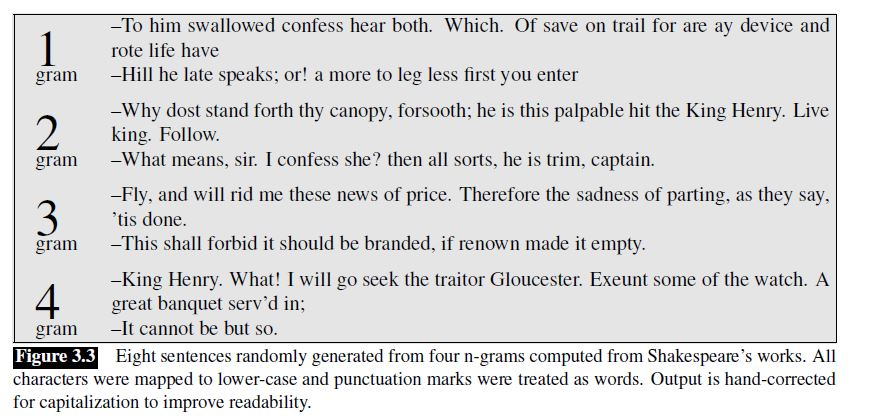
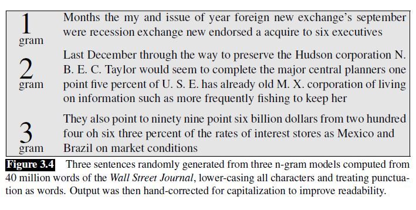
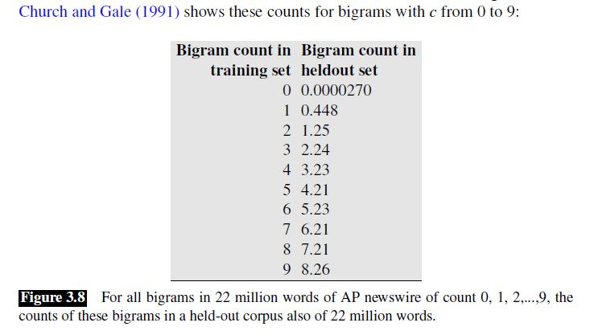

[TOC]

# Chapter 2 - Preprocess

## Words

**How to define word**

Before we talk about processing words, we need to decide what counts as a word.

* Do we count punctuation marks as words?
* Are capitalized tokens like *They* and uncapitalized tokens like *they* the same word?
* How about inflected forms like *cats* versus *cat*? These two words have the same lemma *cat* but are different wordforms.

The definition of words in each applications is different.

**Word types and tokens**

The larger the corpora we look at, the more word types we find, and in fact this relationship between the number of types |V| and number of tokens N is called **Herdan’s Law** or **Heaps’ Law**. It is shown as following:

$$
|V| = kN^\beta \qquad \text {where} \quad 0<\beta<1
$$

**The variations of text**

Any particular piece of text that we study is produced by one or more specific speakers or writers, in a specific dialect of a specific language, at a specific time, in a specific place, for a specific function.

Because language is so situated, when developing computational models for language processing, it’s important to consider who produced the language, in what context, for what purpose, and make sure that the models are fit to the data.

## Text Normalization

We’ll then turn to a set of tasks collectively called text normalization, in which
regular expressions play an important part. Normalizing text means converting it
to a more convenient, standard form.

Before almost any natural language processing of a text, the text has to be normalized.
At least three tasks are commonly applied as part of any normalization process:

1. Segmenting/tokenizing words from running text
2. Normalizing word formats
3. Segmenting sentences in running text.

### Word Tokenization

Tokenization is the task of segmenting running text into words.

For example, english words are often separated from each other
by whitespace, but whitespace is not always sufficient. *New York* and *rock ’n’ roll*
are sometimes treated as large words despite the fact that they contain spaces, while
sometimes we’ll need to separate I’m into the two words I and am. For processing
tweets or texts we’ll need to tokenize emoticons like :) or hashtags like #nlproc.
Some languages, like Chinese, don’t have spaces between words, so word tokenization
becomes more difficult.

**The difficult of tokenization**

* We often want to break off punctuation as a separate token; commas are a useful piece of
  information for parsers, periods help indicate sentence boundaries. But we’ll often
  want to keep the punctuation that occurs word internally, in examples like m.p.h,,
  Ph.D., AT&T, cap’n. Special characters and numbers will need to be kept in prices
  ($45.55) and dates (01/02/06); we don’t want to segment that price into separate tokens
  of “45” and “55”. And there are URLs (http://www.stanford.edu), Twitter
  hashtags (#nlproc), or email addresses (someone@cs.colorado.edu).
* Number expressions introduce other complications as well; while commas normally
  appear at word boundaries, commas are used inside numbers in English, every
  three digits: 555,500.50. Languages, and hence tokenization requirements, differ
  on this; many continental European languages like Spanish, French, and German, by
  contrast, use a comma to mark the decimal point, and spaces (or sometimes periods)
  where English puts commas, for example, 555 500,50.
* A tokenizer can also be used to expand clitic contractions that are marked by
  apostrophes, for example, converting what're to the two tokens what are, and
  we're to we are. A clitic is a part of a word that can’t stand on its own, and can only
  occur when it is attached to another word. Depending on the application, tokenization algorithms may also tokenize multiword expressions like New York or rock 'n' roll as a single token, which requires a multiword expression dictionary of some sort. Tokenization is thus intimately tied up with named entity detection.

**The standard of tokenization**

* [Penn Treebank tokenization standard](ftp://ftp.cis.upenn.edu/pub/treebank/public_html/tokenization.html)
* [Peking University standard](http://sighan.cs.uchicago.edu/bakeoff2005/data/pku_spec.pdf)

**Tokenization for English**

In practice, since tokenization needs to be run before any other language processing,
it is important for it to be very fast. The standard method for tokenization/normalization
is therefore to use deterministic algorithms based on regular expressions
compiled into very efficient finite state automata. Carefully designed deterministic
algorithms can deal with the ambiguities that arise, such as the fact that the apostrophe
needs to be tokenized differently when used as a genitive marker (as in the book’s cover), a quotative as in ‘The other class’, she said, or in clitics like they’re.

**Tokenization for Chinese**

Some languages, including written Chinese, Japanese, and Thai, do not use spaces to
mark potential word-boundaries, and so require alternative segmentation methods.

A simple algorithm that does remarkably well for segmenting Chinese, and often used as a baseline comparison for more advanced methods, is a version of greedy search called **maximum matching** or sometimes **MaxMatch**. The algorithm requires a dictionary (wordlist) of the language.

MaxMatch doesn’t work as well on English, because Chinese has much shorter words than English( Chinese words are about 2.4 characters long on average).

Even in Chinese, however, MaxMatch has problems, for example dealing
with unknown words (words not in the dictionary) or genres that differ a lot from
the assumptions made by the dictionary builder.

The most accurate Chinese segmentation algorithms generally use statistical sequence
models trained via supervised machine learning on hand-segmented training
sets.

**The evaluation of tokenization**

We can quantify how well a segmenter works using a metric called **word error rate**. We compare our output segmentation with a perfect
hand-segmented (‘gold’) sentence, seeing how many words differ. The word error
rate is then the normalized minimum **edit distance** in words between our output and
the gold: the number of word insertions, deletions, and substitutions divided by the
length of the gold sentence in words;

### Word Normalization

Normalization, the task of putting words/tokens in a standard format.

For many natural language processing situations we want two different forms of
a word to behave similarly. For example in web search, someone may type the
string woodchucks but a useful system might want to also return pages that mention
woodchuck with no s. This is especially common in morphologically complex languages
like Russian, where for example the word Moscow has different endings in
the phrases Moscow, of Moscow, from Moscow, and so on.

**Lemmatization** is the task of determining that two words have the same root, despite their surface differences.  For example, the words sang, sung, and sings are forms of the verb sing. The word sing is the
common lemma of these words, and a lemmatizer maps from all of these to sing. The words am, are, and is have the shared lemma be; the words dinner and dinners both have the lemma dinner. Lemmatization is essential for processing morphologically complex languages like Arabic, Russian and so on.

How is lemmatization done? The most sophisticated methods for lemmatization
involve complete morphological parsing of the word. For example,  the word cats consists of two: the morpheme cat and the morpheme -s. A morphological parser takes a word like cats and parses it into the
two morphemes cat and s.

Lemmatization algorithms can be complex. For this reason we sometimes make use
of a simpler but cruder method, which mainly consists of stripping word-final affixes. This naive version of morphological analysis is called **stemming**. One of the the most widely used stemming algorithms is the [Porter Stemmer](https://tartarus.org/martin/PorterStemmer/). Simple stemmers can be useful in cases where we need to collapse across different
variants of the same lemma. Nonetheless, they do tend to commit errors of both
over- and under-generalizing.

Stemming or lemmatizing has another side-benefit. By treating two similar words
identically, these normalization methods help deal with the problem of **unknown words**. For example, if our training corpus contains, say the words low, and lowest, but not lower, but then the word lower appears in our test corpus, our system will not know what to do with it. Stemming or lemmatizing
everything to low can solve the problem, but has the disadvantage that sometimes
we don’t want words to be completely collapsed. For some purposes (for example
part-of-speech tagging) the words low and lower need to remain distinct. 

A solution to this problem is to use a different kind of tokenization in which most tokens are words, but some tokens are frequent word parts like -er, so that an unseen word can be represented by combining the parts.(please see [byte-pair encoding tokenization](https://arxiv.org/abs/1508.07909))

**Case folding** is another kind of normalization. For tasks like speech recognition
and information retrieval, everything is mapped to lower case. For sentiment analysis
and other text classification tasks, information extraction, and machine translation,
by contrast, case is quite helpful and case folding is generally not done.

### Sentence Segmenting

Text normalization also includes **sentence segmentation**: breaking up a text into individual sentences, using cues like periods, question marks, exclamation points. Question marks and exclamation points are relatively unambiguous markers of sentence boundaries. Periods, on the other hand, are more ambiguous. The period character “.” is ambiguous between a sentence boundary marker and a marker of abbreviations like Mr. or Inc. For this reason, sentence tokenization and word tokenization may be addressed jointly.

In general, sentence tokenization methods work by building a binary classifier
(based on a sequence of rules or on machine learning) that decides if a period is part
of the word or is a sentence-boundary marker. In making this decision, it helps to
know if the period is attached to a commonly used abbreviation; thus, an abbreviation
dictionary is useful.

### Summary

Text normalization algorithms has been applied since the beginning of the field.
One of the earliest widely-used stemmers was Lovins (1968). Stemming was also
applied early to the digital humanities, by Packard (1973), who built an affix-stripping
morphological parser for Ancient Greek. 

Currently a wide variety of code for tokenization and normalization is available, such as the Stanford Tokenizer (<http://
nlp.stanford.edu/software/tokenizer.shtml>) or specialized tokenizers for
Twitter (O’Connor et al., 2010), or for sentiment (<http://sentiment.christopherpotts.net/tokenizing.html>). See Palmer (2012) for a survey of text preprocessing.

While the max-match algorithm we describe is commonly used as a segmentation
baseline in languages like Chinese, higher accuracy algorithms like the Stanford
CRF segmenter, are based on sequence models; see Tseng et al. (2005a) and Chang
et al. (2008).

NLTK is an essential tool that offers both useful Python libraries
(http://www.nltk.org) and textbook descriptions (Bird et al., 2009) of many algorithms
including text normalization and corpus interfaces.

## Minimum edit distance

Much of natural language processing is concerned with measuring how similar two
strings are. We’ll introduce a metric called **edit distance** that measures how similar two strings are based on the number of edits it takes to change one string into the other. Edit distance is an algorithm with applications throughout language processing, from spelling correction to speech recognition to coreference resolution.

For example in spelling correction, the user typed some erroneous string—let’s say graffe–and we want to know what the user meant. Another example comes from coreference, the task of deciding whether two strings refer to the same entity.

More formally, the **minimum edit distance** between two strings is defined
as the minimum number of editing operations (operations like **insertion**, **deletion**,
**substitution**) needed to transform one string into another. For example, The distance between *intention* and *execution* is 5, the demonstration as following:

We can also assign a particular cost or weight to each of these operations. The
**Levenshtein distance** between two sequences is the simplest weighting factor in
which each of the three operations has a cost of 1 (Levenshtein, 1966)—we assume
that the substitution of a letter for itself, for example, t for t, has zero cost.

How do we find the minimum edit distance? We can think of this as a search task, in
which we are searching for the shortest path—a sequence of edits—from one string
to another. The shortest path from *intention* to *execution* as following:

We can search the shortest path by using dynamic programming. 

Knowing the minimum edit distance is useful for algorithms like finding potential
spelling error corrections. But the edit distance algorithm is important in another
way; with a small change, it can also provide the minimum cost **alignment** between
two strings. Aligning two strings is useful throughout speech and language processing.
In speech recognition, minimum edit distance alignment is used to compute
the word error rate (Chapter 26). Alignment plays a role in machine translation, in
which sentences in a parallel corpus (a corpus with a text in two languages) need to
be matched to each other.

The **Viterbi** algorithm is a probabilistic extension of
minimum edit distance. Instead of computing the “minimum edit distance” between
two strings, Viterbi computes the “maximum probability alignment” of one string
with another.

# Chapter 3 - N-gram Language Models

## N-gram Language Models

We will introduce models that assign a probability to each possible next
word. And the same models will also serve to assign a probability to an entire sentence. 

Why would you want to predict upcoming words, or assign probabilities to sentences?
Probabilities are essential in any task in which we have to identify words
in noisy, ambiguous input, like **speech recognition** or **handwriting recognition**.  In **spelling correction**, we need to find and correct spelling errors like *Their
are two midterms in this class*, in which *There* was mistyped as *Their*. A sentence
starting with the phrase *There are* will be much more probable than one starting with
*Their are*, allowing a spellchecker to both detect and correct these errors. Assigning probabilities to sequences of words is also essential in **machine translation**.

### Language models

Models that assign probabilities to sequences of words are called language models.

Let’s begin with the task of computing $P(w|h)$, the probability of a word w given
some history h. Suppose the history h is “its water is so transparent that” and we
want to know the probability that the next word is the:
$$
P(\text{the}|\text{its water is so transparent that})
$$

One way to estimate this probability is from relative frequency counts in a very large corpus:

$$
P(\text{the}|\text{its water is so transparent that}) = \frac{C(\text{its water is so transparent that the})}{C(\text{its water is so transparent that})}
$$

Similarly, if we wanted to know the joint probability of an entire sequence of words like "its water is so transparent":

$$
P(\text{its water is so transparent that}) = \frac{C(\text{its water is so transparent})}{|V|^5}
$$

In general, assume the probability of the entire sequences of words as following

$$
P(w_1,w_2, \dots ,w_N)
$$

Apply the chain rule of probability, we'll get

$$
P(w_1,w_2,\dots,w_N)=P(w_1)P(w_2|w_1)P(w_3|w_2w_1) \dots P(w_N|w_{N-1} \dots w_1)
$$

Can we estimate the conditional probability $P(w_k|w_{k-1} \dots w_1)$ from relative frequency counts in a corpus?

No. We can’t just estimate by counting the number of times every word occurs following every long string, because language is creative and any particular context might have never occurred before!

For this reason, we’ll need to introduce cleverer ways of estimating the probability of a word w given a history h, or the probability of an entire word sequence W.

### N-gram models

An n-gram is a sequence of N words: a 2-gram (or bigram) is a two-word sequence of words like “please turn”, “turn your”, or ”your homework”, and a 3-gram (or trigram) is a three-word sequence of words like “please turn your”, or “turn your homework”.

**Assumption**

The intuition of the n-gram model is that instead of computing the probability of a word given its entire history, we can approximate the history by just the last few words.

The assumption in the n-gram model is

$$
P(w_k|w_{k-1} \dots w_1) = P(w_k|w_{k-1} \dots w_{k-n+1}) \qquad \text{where} \; n \; \text{is the n of n-gram}
$$

With this assumption, the probability of the sentence is

$$
P(w_1,w_2, \dots ,w_N)=\prod_{k}^{N} P(w_k|w_{k-1} \dots w_{k-n+1})
$$

For example, the **bigram model**, approximates the probability of a word given all the previous words by using only the conditional probability of the preceding word.

$$
P(\text{the}|\text{its water is so transparent that})=P(\text{the}|\text{that})
$$

The assumption that the probability of a word depends only on the previous word is called a **Markov assumption**. Markov models are the class of probabilistic models that assume we can predict the probability of some future unit without looking too far into the past.

**Estimate models**

How do we estimate these bigram or n-gram probabilities? An intuitive way to estimate probabilities is called maximum likelihood estimation or MLE. We get the MLE estimate for the parameters of an n-gram model by getting counts from a corpus, and normalizing the counts so that they lie between 0 and 1.

Let’s work through an example for bigram. We’ll first need to augment each sentence in the corpus with a special symbol `<s>` at the beginning of the sentence, to give us the bigram context of the first word. We’ll also need a special end-symbol `</s>`. The MLE n-gram parameter estimation:

$$
P(w_k|w_{k-1})=\frac{C(w_{k-1}w_k)}{C(w_{k-1})}
$$

This is a **relative frequency** of bigram and unigram counts. We said above that this use of relative frequencies as a way to estimate probabilities is an example of maximum likelihood estimation or MLE.

**Log probability**

We always represent and compute language model probabilities in log format as log probabilities. Since multiply enough probabilities together would result in numerical underflow.

Instead of raw probabilities

$$
p = p_1*p_2*p_3
$$

by using log probabilities

$$
p = exp(\log{p_1}+\log{p_2}+\log{p_3})
$$

**Summary**

What kinds of linguistic phenomena are captured in bigram statistics?
Some of the bigram probabilities encode some facts that we think of as strictly **syntactic** in nature, like the fact that what comes after eat is usually a noun or an adjective, or that what comes after to is usually a verb.

Although for pedagogical purposes we have only described bigram models, in practice it’s more common to use trigram models, which condition on the previous two words rather than the previous word, or 4-gram or even 5gram models, when there is sufficient training data.

### Evaluating language models

**The way of evaluation**

* *extrinsic evaluation*

  The best way to evaluate the performance of a language model is to embed it in
  an application and measure how much the application improves. Such **end-to-end** evaluation is called **extrinsic evaluation**. Extrinsic evaluation is the only way to know if a particular improvement in a component is really going to help the task at hand. Thus, for speech recognition, we can compare the performance of two language models by running the speech recognizer twice, once with each language
  model, and seeing which gives the more accurate transcription.

* *intrinsic evaluation*

  Unfortunately, sometime running big application systems end-to-end is often very expensive. Instead,
  it would be nice to have a metric that can be used to quickly evaluate potential improvements in a model independent of any application. Such metric is called **intrinsic evaluation**.

An intrinsic improvement does not guarantee an extrinsic improvement in the performance of a real application like speech recognition or machine translation. Nonetheless, because intrinsic evaluation often correlates with such improvements, it is commonly used as a quick check on an algorithm. But a model’s improvement should always be confirmed by an end-to-end evaluation of a real task before concluding the evaluation of the model.

**The data set for evaluation**

For an intrinsic evaluation of a model we need a test set.  As with many of the statistical models in our field, the probabilities of an n-gram model is trained on, the **training set** or training corpus. We can then measure the quality of an n-gram model by its performance on some unseen data called the **test set** or test corpus. We will also sometimes call test sets and other datasets that are not in our training sets **held out set** because we hold them out from the training data.

Sometimes we use a particular test set so often that we implicitly tune to its characteristics. We then need a fresh test set that is truly unseen. In such cases, we call the initial test set the **validation set** or development set. And the final test set to evaluate models performance is called **test set**. In practice, we often just divide our data into 80% training, 10% validation, and 10% test.

**How to compare model**

If we are given a corpus of text and want to compare two different n-gram models, we divide the data into training and test sets, train the parameters of both models on the training set, and then compare how well the two trained models fit the test set.

Given two probabilistic models, the better model is the one that has a tighter fit to the test data or that better predicts the details of the test data, and hence will assign a higher probability to the test data.

Note: Since our evaluation metric is based on test set probability, it’s important not to let the test sentences into the training set.

**The metric of evaluation language models**

In practice we don’t use raw probability as our metric for evaluating language models, but a variant called **perplexity**.

If our language model is bigram, and the perplexity for a test set $W=w_1,w_2,\dots,w_N$ is

$$
\begin{equation}
\begin{split}
\text{perplexity}(W) & = \sqrt[\leftroot{-3}\uproot{3}N]{\frac{1}{P(w_1,w_2,\dots,w_N)}} \\
 & = \sqrt[\leftroot{-3}\uproot{3}N]{\frac{1}{\prod_{k}^{N}{P(w_k|w_{k-1})}}}
\end{split}
\end{equation}
$$

The $W$ is the the entire sequence of words in the test set. Since this sequence will cross many sentence
boundaries, we need to include the begin- and end-sentence markers `<s>` and `</s>` in the probability computation.

The higher the probability of the word sequence, the lower the perplexity. Thus, minimizing perplexity is equivalent to maximizing the test set probability according to the language model.

**How to explain perplexity?**

Perplexity is the **weighted average branching factor** of a language. The **branching factor** of a language is the number of possible next words that can follow any word, it is equal to the size of vocab. And  the perplexity considers the probability of each word to calculate the number of possible next words.

**Perplexity’s relation to entropy**

The perplexity measure actually arises from the information-theoretic concept of cross-entropy. **Entropy** is a measure of information.

The entropy of **a single random variable**:

$$
H(X)=-\sum_{x \in S}P(x)\log{P(x)} \qquad \text{where} \; S \; \text{is the state space for} \; x
$$

The entropy of **a sequence** of random variables:

$$
H(w_1,w_2,\dots,w_n)=-\sum_{W_1^n \in L}P(W_1^n)\log{P(W_1^n)} \qquad \text{where} \; L \; \text{is the state space for} \; W_1^n
$$

The entropy of **a language**:

We could define the **entropy rate** or **per-word entropy** as the entropy of this sequence divided by the number of words. How can we measure the true per-word entropy of a language? We need to consider sequences of infinite length. If we think of **a language as a stochastic process** $L$ that produces a sequence of words, and allow $W_1^n$ to represent the sequence of words, then we have entropy of a language:

$$
H(L)= - \lim_{n \to \infty} \frac{1}{n} \sum_{W_1^n \in L}P(W_1^n)\log{P(W_1^n)}
$$

The Shannon-McMillan-Breiman theorem states that if the language is both stationary and ergodic then:

$$
H(L)= - \lim_{n \to \infty} \frac{1}{n} \log{P(W_1^n)}
$$

That is, we can take a single sequence that is long enough instead of summing over all possible sequences.

A **stochastic process** is said to be **stationary** if the probabilities it assigns to a sequence are invariant with respect to shifts in the time index. In other words, the probability distribution for words at time t is the same as the probability distribution at time t +1.

For example:

* Markov models, and hence n-grams, are stationary.
* Natural language is not stationary, because the probability of upcoming words can be dependent on events that were arbitrarily distant and time dependent.

Thus, we should know our n-grams statistical language models only give an approximation to the correct distributions and entropies of natural language. by making some incorrect but convenient simplifying assumptions, we can compute the entropy of some stochastic process by taking a very long sample of the output and computing its average log probability, so the approximation entropy of language is:

$$
H(L) \approx \frac{-{\log P(w_1,w_2,\dots,w_N)}}{N} \qquad \text{where} \; w_1,w_2,\dots,w_N \; \text{is the sampling sequence}
$$

How can we measure the error due to using the n-gram models to estimate the entropy of the true probability distribution for natural language? Let's introduce a information theoretic tool **cross entropy** to measure the difference between two distributions:

$$
H(Q,P)=- \sum_{x}Q(x) \log{P(x)} \\
H(Q,P)=- \sum_{W_1^n \in L}Q(w_1,w_2,\dots,w_n) \log{P(w_1,w_2,\dots,w_n)}
$$

Assume the $Q$ is the unknown true natural language model and the $P$ is our approximation n-gram models. Because cross entropy is the upper bound on the entropy:

$$
H(Q) \leq H(Q,P)
$$

The more accurate $P$ is, the closer the cross-entropy $H(Q, P)$ will be to the true entropy $H(Q)$. Thus, the difference between them is a measure of how accurate a model $P$ is. Between two models $P_1$ and $P_2$, the more accurate model will be the one with the lower cross-entropy. And If we have a accurate model $P$, then we can use cross entropy $H(Q, P)$ to estimate the entropy $H(Q)$ that is true natural language entropy in here.

Again, following the Shannon-McMillan-Breiman theorem, for a stationary ergodic process:

$$
\begin{equation}
\begin{split}
H(Q,P) & = - \lim_{n \to \infty } \frac{1}{n} \log{P(w_1,w_2,\dots,w_n)} \\
       & \approx - \frac {1}{N}  \log{P(w_1,w_2,\dots,w_n)} \\
       & = \log(\sqrt[\leftroot{-3}\uproot{3}N]{\frac{1}{P(w_1,w_2,\dots,w_N)}})
\end{split}
\end{equation}
$$

We can see that the perplexity of a model $P$ on a sequence of words $W$ is now formally defined as the $\exp$ of $H(Q, P)$ cross-entropy.

## Sampling language models

**Sample unigram**

Imagine all the words of the English language covering the probability space between 0 and 1, each word covering an interval proportional to its frequency. We
choose a random value between 0 and 1 and print the word whose interval includes
this chosen value. We continue choosing random numbers and generating words
until we randomly generate the sentence-final token `</s>`.

**Sample bigram**

We first generate a random bigram that starts with `<s>` (according to its bigram probability). Let's say that bigram is `(<s>, w)`.  We next chose a random bigram starting with `w` (again, drawn according to its
bigram probability), and so on, until we sample a bigram end with `<\s>`.

**Visualize models on different training sets **

Sentences generated from unigram, bigram, trigram, and 4-gram models trained on Shakespeare’s works.

Sentences generated by unigram, bigram, and trigram grammars trained on Wall Street Journal corpus.

Compare Wall Street Journal examples to the Shakespeare examples. While they both
model “English-like sentences”, there is clearly no overlap in generated sentences,
and little overlap even in small phrases. Statistical models are likely to be pretty useless
as predictors if the training sets and the test sets are as different as Shakespeare
and WSJ.

We must be sure to use a training corpus that has a similar **genre** to whatever task we are
trying to accomplish. To build a language model for translating legal documents,
we need a training corpus of legal documents. To build a language model for a
question-answering system, we need a training corpus of questions. It is equally important to get training data in the appropriate **dialect**, especially when processing social media posts or spoken transcripts.

## The problems with n-gram models

In many language-related tasks, it would be extremely useful to know the
probability that a sentence or word sequence will occur in a document. However,
there is not enough data to account for all word sequences. Thus, n-gram
models are used to approximate the probability of word sequences. Making an
independence assumption between the n-grams reduces some of the problems
with **data sparsity**, but even n-gram models can have sparsity problems. For
example, the Google corpus has 1 trillion words of running English text. There
are 13 million words that occur over 200 times, so there are at least 169 trillion
potential bigrams - much more than the 1 trillion words in the corpus.

* unknown words

  Unknown words are the words we simply have never seen before.

* zero counts

  For any n-gram that occurred a sufficient number of times, we might have a good estimate of its probability. But because any corpus is limited, some perfectly acceptable English word sequences are bound to be missing from it. That is, we’ll have many cases of putative “zero probability n-grams” that should really have some non-zero probability.

### Unknown words

Unknown words are the words we have never seen in our training set. How can we build models on the  unknown words?

**Closed vocabulary**

Sometimes we have a language task in which we know all the words that can occur. In such a **closed vocabulary** system the test set can only contain words from this lexicon, and there will be no unknown words. This is a reasonable assumption in some domains, such as speech recognition or machine translation, where we have a pronunciation dictionary or a phrase table that are fixed in advance, and so the language model can only use the words in that dictionary or phrase table.

**Open vocabulary**

In other cases we have to deal with words we haven’t seen before, which we’ll call **unknown words**, or **out of vocabulary** (**OOV**) words. An open vocabulary system is one in which we model these potential unknown words in the test set by adding a pseudo-word called `<UNK>`.

**How to train models with unknown word**

There are two common ways to train models with unknown word `<UNK>`

1. The first one is to turn the problem back into a closed vocabulary one by choosing a fixed vocabulary in advance. We should choose a vocabulary in advance. Convert any words not in the vocabulary to `<UNK>` in a text normalization step. Estimate the probabilities for `<UNK>` from its counts just like any other regular word.
2. The second alternative, in situations where we don’t have a prior vocabulary in advance, is to replace some rare words by `<UNK>`. For example we can replace by `<UNK>` all words that occur fewer than n times in the training set, where n is some small number, or equivalently select a vocabulary size V in advance (say 50,000) and choose the top V words by frequency and replace the rest by `<UNK>`.

The exact choice of `<UNK>` model does have an effect on metrics like perplexity. language model can achieve low perplexity by choosing a small vocabulary and
assigning the unknown word a high probability. For this reason, perplexities should
only be compared across language models with the same vocabularies.

### Zero counts

What do we do with words that are in our vocabulary (they are not unknown words)
but appear in a test set in an unseen context (for example they appear after a word
they never appeared after in training)? To keep a language model from assigning
zero probability to these unseen events, we’ll have to shave off a bit of probability
mass from some more frequent events and give it to the events we’ve never seen. This modification is called **smoothing** or **discounting**. Smoothing is a strategy used to account for **data sparsity**.

#### Add-1 smoothing

The simplest way to do smoothing is to add one to all the counts, before
we normalize them into probabilities. This algorithm is called **Laplace smoothing** or add-1 smoothing. Laplace smoothing does not perform well enough to be used in modern **n-gram models**, but it usefully introduces many of the concepts that we see in other smoothing algorithms, gives a useful baseline, and is also a practical
smoothing algorithm for other tasks like **text classification**.

**smoothed unigram**

The unsmoothed maximum likelihood estimate of the unigram probability is

$$
P(w_i) = \frac{C(w_i)}{N} \qquad \text{where} \;N\; \text{is the number of word tokens in corpus}
$$

The smoothed maximum likelihood estimate of the unigram probability is

$$
P_{\text{Laplace}}(w_i) = \frac{C(w_i)+1}{N+V} \qquad \text{where} \;V\; \text{is the number of word types in corpus, i.e., the size of vocab}
$$

**smoothed bigram**

The unsmoothed maximum likelihood estimate of the bigram probability is

$$
P(w_i|w_{i-1}) = \frac{C(w_{i-1},w_i)}{C(w_{i-1})}
$$

The smoothed maximum likelihood estimate of the bigram probability is

$$
P(w_i|w_{i-1}) = \frac{C(w_{i-1},w_i)+1}{C(w_{i-1})+V}
$$

**smoothed trigram**

The smoothed maximum likelihood estimate of the trigram probability is

$$
P(w_i|w_{i-2},w_{i-1}) = \frac{C(w_{i-2},w_{i-1},w_i)+1}{C(w_{i-1},w_{i-2})+V}
$$

**discounting**

A related way to view smoothing is as discounting some non-zero counts in order to get the probability mass that will be assigned to the zero counts. 

For example, in the unigram estimation, instead of changing both the numerator and denominator, it is convenient to describe how a smoothing algorithm affects the numerator, by defining an **adjusted counts** or **discounted counts**

$$
C^*(w_i) = (C(w_i)+1)*\frac{N}{N+V}
$$

And the smoothed laplace estimation can be represented as following

$$
P_{\text{Laplace}}(w_i)=\frac{C^*(w_i)}{N}
$$

Now we can describe a smoothing algorithm by the ratio of the discounted counts to the original counts

$$
d_c = \frac{C*}{C}
$$

**the problem with add-1 smoothing**

Because the size of vocab is so large in corpus. There are too many probability mass be moved from the seen to the unseen events

#### Add-k smoothing

One alternative to add-one smoothing is to move a bit less of the probability mass from the seen to the unseen events. Instead of adding 1 to each count, we add a factional count. This is called **add-k smoothing**.

For example, the add-k smoothed maximum likelihood estimate of the unigram probability is

$$
P_{\text{Laplace}}(w_i) = \frac{C(w_i)+k}{N+k*V} \qquad \text{where}\;0<k<1
$$

**how to choose the hyperparameter k?**

We can choose the hyperparameter k by optimizing on a validation set.

**the problem with add-k smoothing**

Although add-k is useful for some tasks (including **text classification**), it turns out that it still doesn’t work well for **language modeling**, generating counts with poor variances and often inappropriate discounts

#### Backoff and Interpolation

Let's start discuss the zero counts problem. For example, If we are trying to compute $P(w_i|w_{i-2},w_{i-1})$ but we have no examples of a particular trigram $w_{i-2},w_{i-1},w_{i}$, so we will assign zero probability to it. Is it reasonable to give zero probability mass to the events we never seen before? Obviously, it's totally wrong. Remember that everything is possible.

The discounting or smoothing methods we have been discussing so far can solve this problem by giving 1 or k counts to the events we never seen before. In this section, we'll use a new method to solve the zero counts problem.

If we have no examples of trigram $w_{i-2},w_{i-1},w_{i}$, we can instead estimate its probability by using the bigram $P(w_i|w_{i-1})$, Similarly, if we don’t have counts to compute $P(w_i|w_{i-1})$, we can look back to the unigram $P(w_i)$. In other words, sometimes using **less context** is a good thing, helping to generalize more for contexts that the model hasn’t learned much about. 

There are two ways to use this n-gram hierarchy: **backoff** and **interpolationn**.

**Backoff**

In a backoff n-gram model, if the n-gram we need has zero counts, we approximate it by backing off to the (N-1)-gram. We continue backing off until we reach a history that has some counts.

**normalization**

In order for a backoff model to give a correct probability distribution, we have to discount the higher-order n-grams to save some probability mass for the lower order n-grams.

For example, If $w_{i-2},w_{i-1},w_{i}$ is zero count, we can instead estimate its probability by backoff to the lower-order non-zero n-gram. The probability mass of $w_{i-2},w_{i-1},w_{i}$ has bee increased from zero to the non-zero lower-order n-gram. So we must discount the probability mass of other non-zero higher-order n-grams to make sure the distribution is valid.

This normalized backoff is called **Katz backoff**, showing as following:

$$
\begin{equation}
P_{\text{backoff}}(w_i|w_{i-N+1}^{i-1}) = 
  \begin{cases}
    P^*(w_i|w_{i-N+1}^{i-1}), & \text{if} \; C(w_{i-N+1}^{i})>0 \\
    \alpha(w_{i-N+1}^{i-1})P_{\text{backoff}}(w_i|w_{i-N+2}^{i-1}), & \text{otherwise}
  \end{cases}
\end{equation}
$$

where the $P^*(w_i|w_{i-N+1}^{i-1})$ is the discounted probability distribution for the higher-order n-grams; the $\alpha(w_{i-N+1}^{i-1})$ is a function to distribute the discounted probability mass to the lower-order n-grams.

Katz backoff is often combined with a smoothing method called **Good-Turing**.

**Iterpolation**

In interpolation, we always mix the probability estimates from all the n-gram estimators, weighing and combining the different order n-grams counts.

**simple linear interpolation**

We combine different order n-grams by linearly interpolating all the models with fixed weights.

$$
\begin{equation}
\begin{split}
P(w_i|w_{i-2},w_{i-1}) & = \lambda_1 * P(w_i|w_{i-2},w_{i-1}) \\
 					   & + \lambda_2 * P(w_i|w_{i-1}) \\
 					   & + \lambda_3 * P(w_i) \\
\text{where} \; \sum_{i=1}^{3}\lambda_i = 1
\end{split}
\end{equation}
$$

**context related linear interpolation**

We combine different order n-grams by linearly interpolating all the models with context related weights.

$$
\begin{equation}
\begin{split}
P(w_i|w_{i-2},w_{i-1}) & = \lambda_1(w_{i-2}^{i-1}) * P(w_i|w_{i-2},w_{i-1}) \\
 					   & + \lambda_2(w_{i-2}^{i-1}) * P(w_i|w_{i-1}) \\
 					   & + \lambda_3(w_{i-2}^{i-1}) * P(w_i) \\
\text{where} \; \sum_{i=1}^{3}\lambda_i = 1
\end{split}
\end{equation}
$$

**normalization**

The low order n-gram is a probability distribution and the weights are sum to 1, so the linearly interpolating high order n-gram is a probability.

**the hyperparameter lambdas**

Both the simple interpolation and conditional context related interpolation lambdas are learned from a **held-out** corpus, by choosing the $\lambda$ values that maximize the likelihood of the held-out corpus. There are various ways to find this optimal set of lambdas, one way is to use the **EM** algorithm.

#### Kneser-Ney smoothing

One of the most commonly used and best performing n-gram smoothing methods is the interpolated Kneser-Ney algorithm.

**absolute discounting**

Kneser-Ney has its roots in a method called absolute discounting. **Absolute discounting** is smoothing way by subtracting a fixed (absolute) discount value from each count.

Let's start to figure out a phenomenon. Assume we have a training corpus  and a held-out corpus. First we get all of n-grams if its count is $n$, then we want to know $m$ that is the average count of those n-grams occur in held-out corpus.

We can find that except for $n=0$ or $n=1$, the difference between $n$ and $m$ is about 0.75, so we can discount $n$ by subtracting a fixed value.

**absolute discounting with interpolation**

The estimate probability of bigram:

$$
P(w_i|w_{i-1})=\frac{C(w_{i-1},w_{i})-d}{C(w_{i-1})}+\lambda(w_{i-1})P(w_{i})
$$

where the $d$ is the value of absolute discounting; the $\lambda(w_{i-1})$ is the weight for interpolation.

**Kneser-Ney discounting with interpolation**

Kneser-Ney discounting augments absolute discounting with a more sophisticated way to handle the lower-order n-grams distribution.

The estimate probability of bigram:

$$
P(w_i|w_{i-1})=\frac{\max(C(w_{i-1},w_{i})-d,0)}{C(w_{i-1})}+\lambda(w_{i-1})P_{\text{continuation}}(w_{i})
$$

The main difference with the naive absolute discounting is the $P_{\text{continuation}}(w_{i})$ unigram model. 

Let's first look the disadvantages of $P(w_i)$ unigram model. When we interpolate with the lower-order unigram, the question we want to answer is "How likely is $w_i$ to follow the previous context word $w_{i-1}$ ?", but the model $P(w_i)$ answers another question "How likely is $w_i$ ?". The Kneser-Ney intuition is to base our estimate of $P_{\text{continuation}}$ on the number of different contexts word $w_i$ has appeared in, that is, the number of bigram types it completes. We can estimate the probability of seeing the word $w$ as a novel continuation by the following:

$$
P_{\text{continuation}}(w_i) \propto |\{1:C(v,w_i)>0\}|
$$

The normalization distribution by the total number of word bigram types:

$$
P_{\text{continuation}}(w_i) = \frac{|\{1:C(v,w_i)>0\}|}{|\{1:C(v^{'},w^{'})>0\}|}
$$

How can we choose the interpolation weight?

The $\lambda(w_{i-1})$ is a normalizing constant that is used to distribute the probability mass that we've discounted:

$$
\lambda(w_{i-1})=\frac{d}{C(w_{i-1})}*|\{1:C(w_{i-1},v)\}|
$$

The best-performing version of Kneser-Ney smoothing is called **modified Kneser-Ney smoothing**, and is due to Chen and Goodman (1998).

#### Smoothing for the extremely large language models

By using text from the web, it is possible to build extremely large language models. 

Efficiency considerations are important when building language models that use
very large sets of n-grams. Rather than store each word as a string, it is generally
represented in memory as a 64-bit hash number, with the words themselves stored
on disk. 

Probabilities are generally quantized using only 4-8 bits (instead of 8-byte
floats), and n-grams are stored in reverse tries. 

N-grams can also be shrunk by pruning, for example only storing n-grams with counts greater than some threshold or using entropy to prune less-important n-grams

Another option is to build approximate language models using techniques like **Bloom filters**.

Although with these toolkits it is possible to build web-scale language models
using full Kneser-Ney smoothing, there is a much simpler algorithm may be sufficient. The algorithm is called **stupid backoff**.

Stupid backoff gives up the idea of trying to make the language
model a true probability distribution. There is no discounting of the higher-order
probabilities. If a higher-order n-gram has a zero count, we simply backoff to a
lower order n-gram, weighed by a fixed (context-independent) weight.

$$
\begin{equation}
\text{Score}_(w_i|w_{i-N+1}^{i-1}) = 
  \begin{cases}
  	\frac{C(w_{i-N+1}^{i})}{C(w_{i-N+1}^{i-1})}, & \text{if} \; C(w_{i-N+1}^{i})>0 \\
    \lambda \text{Score}(w_i|w_{i-N+2}^{i-1}), & \text{otherwise}
  \end{cases}
\end{equation}
$$

#### Others smoothing

**Good-Truing smoothing**

For simplicity, we'll choose unigram as example here but Good-turing smoothing is suitable for any n-gram models.

Suppose we have the set of all possible **word types**: $X=\{x_1,x_2,\dots,x_V\}$. We also have a corpus $W=w_1,w_2,\dots,w_N$ with the number of N running **word tokens**. 

We want to estimate the probability  $P(x_i)$ of a work type $x_i$, because of data sparsity we cannot use the relative frequency to estimate the probability. Here we run into a problem: how can we estimate the probability of something we have never seen before?

Now we introduce an assumption a key idea in Good-Turing: if $C(x_i)=C(x_j)$ then $P(x_i)=P(x_j)$.  In other words, if two word types appear the same number of times in the corpus, we assume that they have the same probability of occurring in general.

With this assumption, we introduce the notation $\theta(r)$ to estimate the probability of a word type occurring given that it appeared $r$ times in $W$ corpus. We also let $N_r$ denote the number of word types that occur exactly $r$ times in $W$.

It's easy to get the following:

$$
N = \sum_{r=0}^{\infty}rN_r
$$

The unsmoothed estimate:

$$
\theta(r)=\frac{r}{N}
$$

The Good-Turing estimate:

$$
\theta^*(r) = \frac{r^*}{N} \\
\text{where} \; r^* = (r+1)\frac{N_{r+1}}{N_{r}}
$$

where $r^*$ is the discounted count; the $N_{r+1} < N_{r}$ in general by **Zipf law**. This is a correct probability distribution, i.e., where $\sum_{r}\theta^*(r)=1$.

**Katz** improves the Good-Truing smoothing by setting a threshold $K$ for discounting:

$$
\begin{equation}
r^*=
  \begin{cases}
  	\frac{(r+1)\frac{N_{r+1}}{N_r}-r\frac{(K+1)N_{K+1}}{N_1}}{1-\frac{(K+1)N_{K+1}}{N_1}}, & r<K \\
    r, & otherwise
  \end{cases}
\end{equation}
$$

## Summary

* Language models offer a way to assign a probability to a sentence or other sequence of words, and to predict a word from preceding words.
* n-grams are Markov models that estimate words from a fixed window of previous words. n-gram probabilities can be estimated by counting in a corpus and normalizing (the maximum likelihood estimate).
* n-gram language models are evaluated extrinsically in some task, or intrinsically using perplexity.
* The perplexity of a test set according to a language model is the geometric mean of the inverse test set probability computed by the model.
* Smoothing algorithms provide a more sophisticated way to estimate the probability of n-grams. Commonly used smoothing algorithms for n-grams rely on lower-order n-gram counts through backoff or interpolation.
* Both backoff and interpolation require discounting to create a probability distribution.
* Kneser-Ney smoothing makes use of the probability of a word being a novel continuation. The interpolated Kneser-Ney smoothing algorithm mixes a discounted probability with a lower-order continuation probability.

Starting in the late 1990s, Chen and Goodman produced a highly influential
series of papers with a comparison of different language models (Chen and Goodman
1996, Chen and Goodman 1998, Chen and Goodman 1999, Goodman 2006).
They performed a number of carefully controlled experiments comparing different
discounting algorithms, cache models, class-based models, and other language
model parameters. They showed the advantages of **Modified Interpolated Kneser-
Ney**, which has since become the standard baseline for language modeling, especially
because they showed that caches and class-based models provided only minor
additional improvement. These papers are recommended for any reader with further
interest in language modeling.

Two commonly used toolkits for building language models are **SRILM** (Stolcke,
2002) and **KenLM** (Heafield 2011, Heafield et al. 2013). Both are publicly available.
SRILM offers a wider range of options and types of discounting, while KenLM is
optimized for speed and memory size, making it possible to build web-scale language
models.

The highest accuracy language models at the time of this writing make use of **neural nets**. The problem with standard language models is that the number of parameters
increases exponentially as the n-gram order increases, and n-grams have no
way to generalize from training to test set. Neural networks instead project words
into a continuous space in which words with similar contexts have similar representations.
Both feedforward nets Bengio et al. 2006, Schwenk 2007 and recurrent
nets (Mikolov, 2012) are used.

Other important classes of language models are **maximum entropy** language models (Rosenfeld, 1996), based on logistic regression classifiers that use lots of
features to help predict upcoming words.

Another important technique is language model **adaptation**, where we want to
combine data from multiple domains (for example we might have less in-domain
training data but more general data that we then need to adapt) (Bulyko et al. 2003,
Bacchiani et al. 2004, Bellegarda 2004, Bacchiani et al. 2006, Hsu 2007, Liu et al. 2013).

# Chapter 4 - Sentiment Analysis

## Text Classification

### Some text classification tasks

**Text classification** is the task of assigning a label or category to an entire text or document. There are some common text categorization tasks:

* **Sentiment analysis** is a task of text classification to extract the positive or negative sentiment orientation that a writer expresses toward some object. For example, a review of a movie, book, or product on the web expresses the author’s sentiment toward the product. Extracting consumer or public sentiment is relevant for fields from marketing to politics. The simplest version of sentiment analysis is a binary classification task, and the words of the review provide excellent cues.

* **Spam detection** is another important commercial application, the binary classification task of assigning an email to one of the two classes spam or not-spam. Many lexical and other features can be used to perform this classification.

* The task of **language id** is to identify which language is be used to write the text or document. Texts on social media, for example, can be in any number of languages and we’ll need to apply different processing. The task of language id is thus the first step in most language processing pipelines.

* Tasks like determining a text’s authorship attribution, or **author characteristics** like gender, age, and native language are text classification tasks.

* One of the oldest tasks in text classification is assigning a library subject category or **topic label** to a text.

* Classification is essential for tasks below the level of the document as well. For example, **period disambiguation** (deciding if a period is the end of a sentence or part of a word), **word tokenization** (deciding if a character should be a word boundary), and **language modeling** (classifying the context-so-far into a class for each next word.) are all can be viewed as classification task.

### The method for classifying

The goal of classification is to take a single observation, extract some useful features, and thereby classify the observation into one of a set of discrete classes. Most cases of classification in language processing are  done via **supervised learning**. The goal of the algorithm is to learn a classifier that is capable of mapping from a new document or text to its correct class. 

A **probabilistic classifier** additionally will tell us the probability of the observation being in the class. This full distribution over the classes can be useful information for **downstream decisions**; avoiding making discrete decisions early on can be useful when **combining systems**.

Many kinds of machine learning algorithms are used to build classifiers. There are main two ways to build classifiers:

* **Generative** classifiers like **naive Bayes** build a model of how a class could generate some input data. Given an observation, they return the class most likely to have generated the observation.
* **Discriminative** classifiers like **logistic regression** instead learn what features from the
  input are most useful to discriminate between the different possible classes.

While discriminative systems are often more accurate and hence more commonly used, generative classifiers still have a role.

## Naive Bayes

# Reference

## Terms

**Corpus** (plural corpora), a computer-readable collection of text or speech.

A **utterance** is the spoken correlate of a sentence.

A **lemma** is a set of lexical forms having the same stem, the same major part-of-speech, and the same word sense.

**Morphology** is the study of the way words are built up from smaller meaning-bearing units called morphemes.

**Morpheme** is the smallest meaningful unit in the grammar of a language. There are two broad classes of morphemes can be distinguished: stems and affixes. For example, the word cats consists of two: the morpheme cat and the morpheme -s.

**Stem**, the central morpheme of the word, supplying the main meaning.

**Affix**, the adding “additional” meanings of various kinds.

**Wordforms**  are the different ways a word can exist in the context of a language. In English, there are many words that have the same lemma, but can be changed to be a verb, noun, adjective, or adverb by adding a suffix.

**Word types** are the number of distinct words in a corpus; if the set of words in the vocabulary is V, the number of types is the word token vocabulary size |V|. When we speak about the number of words in the language, we are generally referring to word types.

**Word Tokens** are the total number N of running words in a corpus.

**Code switching**, It’s also quite common for speakers or writers to use multiple languages in a single communicative act, a phenomenon called code switching.

**Unknow words** are words that a system has not seen before.