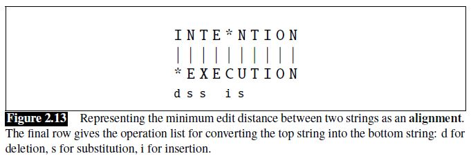
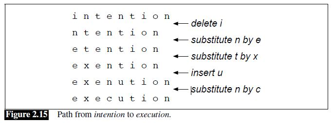

[TOC]

# Chapter 2

## Words

**How to define word**

Before we talk about processing words, we need to decide what counts as a word.

* Do we count punctuation marks as words?
* Are capitalized tokens like *They* and uncapitalized tokens like *they* the same word?
* How about inflected forms like *cats* versus *cat*? These two words have the same lemma *cat* but are different wordforms.

The definition of words in each applications is different.

**Word types and tokens**

The larger the corpora we look at, the more word types we find, and in fact this relationship between the number of types |V| and number of tokens N is called **Herdan’s Law** or **Heaps’ Law**. It is shown as following:

$$
|V| = kN^\beta \qquad \text {where} \quad 0<\beta<1
$$

**The variations of text**

Any particular piece of text that we study is produced by one or more specific speakers or writers, in a specific dialect of a specific language, at a specific time, in a specific place, for a specific function.

Because language is so situated, when developing computational models for language processing, it’s important to consider who produced the language, in what context, for what purpose, and make sure that the models are fit to the data.

## Text Normalization

We’ll then turn to a set of tasks collectively called text normalization, in which
regular expressions play an important part. Normalizing text means converting it
to a more convenient, standard form.

Before almost any natural language processing of a text, the text has to be normalized.
At least three tasks are commonly applied as part of any normalization process:

1. Segmenting/tokenizing words from running text
2. Normalizing word formats
3. Segmenting sentences in running text.

### Word Tokenization

Tokenization is the task of segmenting running text into words.

For example, english words are often separated from each other
by whitespace, but whitespace is not always sufficient. *New York* and *rock ’n’ roll*
are sometimes treated as large words despite the fact that they contain spaces, while
sometimes we’ll need to separate I’m into the two words I and am. For processing
tweets or texts we’ll need to tokenize emoticons like :) or hashtags like #nlproc.
Some languages, like Chinese, don’t have spaces between words, so word tokenization
becomes more difficult.

**The difficult of tokenization**

* We often want to break off punctuation as a separate token; commas are a useful piece of
  information for parsers, periods help indicate sentence boundaries. But we’ll often
  want to keep the punctuation that occurs word internally, in examples like m.p.h,,
  Ph.D., AT&T, cap’n. Special characters and numbers will need to be kept in prices
  ($45.55) and dates (01/02/06); we don’t want to segment that price into separate tokens
  of “45” and “55”. And there are URLs (http://www.stanford.edu), Twitter
  hashtags (#nlproc), or email addresses (someone@cs.colorado.edu).
* Number expressions introduce other complications as well; while commas normally
  appear at word boundaries, commas are used inside numbers in English, every
  three digits: 555,500.50. Languages, and hence tokenization requirements, differ
  on this; many continental European languages like Spanish, French, and German, by
  contrast, use a comma to mark the decimal point, and spaces (or sometimes periods)
  where English puts commas, for example, 555 500,50.
* A tokenizer can also be used to expand clitic contractions that are marked by
  apostrophes, for example, converting what're to the two tokens what are, and
  we're to we are. A clitic is a part of a word that can’t stand on its own, and can only
  occur when it is attached to another word. Depending on the application, tokenization algorithms may also tokenize multiword expressions like New York or rock 'n' roll as a single token, which requires a multiword expression dictionary of some sort. Tokenization is thus intimately tied up with named entity detection.

**The standard of tokenization**

* [Penn Treebank tokenization standard](ftp://ftp.cis.upenn.edu/pub/treebank/public_html/tokenization.html)
* [Peking University standard](http://sighan.cs.uchicago.edu/bakeoff2005/data/pku_spec.pdf)

**Tokenization for English**

In practice, since tokenization needs to be run before any other language processing,
it is important for it to be very fast. The standard method for tokenization/normalization
is therefore to use deterministic algorithms based on regular expressions
compiled into very efficient finite state automata. Carefully designed deterministic
algorithms can deal with the ambiguities that arise, such as the fact that the apostrophe
needs to be tokenized differently when used as a genitive marker (as in the book’s cover), a quotative as in ‘The other class’, she said, or in clitics like they’re.

**Tokenization for Chinese**

Some languages, including written Chinese, Japanese, and Thai, do not use spaces to
mark potential word-boundaries, and so require alternative segmentation methods.

A simple algorithm that does remarkably well for segmenting Chinese, and often used as a baseline comparison for more advanced methods, is a version of greedy search called **maximum matching** or sometimes **MaxMatch**. The algorithm requires a dictionary (wordlist) of the language.

MaxMatch doesn’t work as well on English, because Chinese has much shorter words than English( Chinese words are about 2.4 characters long on average).

Even in Chinese, however, MaxMatch has problems, for example dealing
with unknown words (words not in the dictionary) or genres that differ a lot from
the assumptions made by the dictionary builder.

The most accurate Chinese segmentation algorithms generally use statistical sequence
models trained via supervised machine learning on hand-segmented training
sets.

**The evaluation of tokenization**

We can quantify how well a segmenter works using a metric called **word error rate**. We compare our output segmentation with a perfect
hand-segmented (‘gold’) sentence, seeing how many words differ. The word error
rate is then the normalized minimum **edit distance** in words between our output and
the gold: the number of word insertions, deletions, and substitutions divided by the
length of the gold sentence in words;

### Word Normalization

Normalization, the task of putting words/tokens in a standard format.

For many natural language processing situations we want two different forms of
a word to behave similarly. For example in web search, someone may type the
string woodchucks but a useful system might want to also return pages that mention
woodchuck with no s. This is especially common in morphologically complex languages
like Russian, where for example the word Moscow has different endings in
the phrases Moscow, of Moscow, from Moscow, and so on.

**Lemmatization** is the task of determining that two words have the same root, despite their surface differences.  For example, the words sang, sung, and sings are forms of the verb sing. The word sing is the
common lemma of these words, and a lemmatizer maps from all of these to sing. The words am, are, and is have the shared lemma be; the words dinner and dinners both have the lemma dinner. Lemmatization is essential for processing morphologically complex languages like Arabic, Russian and so on.

How is lemmatization done? The most sophisticated methods for lemmatization
involve complete morphological parsing of the word. For example,  the word cats consists of two: the morpheme cat and the morpheme -s. A morphological parser takes a word like cats and parses it into the
two morphemes cat and s.

Lemmatization algorithms can be complex. For this reason we sometimes make use
of a simpler but cruder method, which mainly consists of stripping word-final affixes. This naive version of morphological analysis is called **stemming**. One of the the most widely used stemming algorithms is the [Porter Stemmer](https://tartarus.org/martin/PorterStemmer/). Simple stemmers can be useful in cases where we need to collapse across different
variants of the same lemma. Nonetheless, they do tend to commit errors of both
over- and under-generalizing.

Stemming or lemmatizing has another side-benefit. By treating two similar words
identically, these normalization methods help deal with the problem of **unknown words**. For example, if our training corpus contains, say the words low, and lowest, but not lower, but then the word lower appears in our test corpus, our system will not know what to do with it. Stemming or lemmatizing
everything to low can solve the problem, but has the disadvantage that sometimes
we don’t want words to be completely collapsed. For some purposes (for example
part-of-speech tagging) the words low and lower need to remain distinct. 

A solution to this problem is to use a different kind of tokenization in which most tokens are words, but some tokens are frequent word parts like -er, so that an unseen word can be represented by combining the parts.(please see [byte-pair encoding tokenization](https://arxiv.org/abs/1508.07909))

**Case folding** is another kind of normalization. For tasks like speech recognition
and information retrieval, everything is mapped to lower case. For sentiment analysis
and other text classification tasks, information extraction, and machine translation,
by contrast, case is quite helpful and case folding is generally not done.

### Sentence Segmenting

Text normalization also includes **sentence segmentation**: breaking up a text into individual sentences, using cues like periods, question marks, exclamation points. Question marks and exclamation points are relatively unambiguous markers of sentence boundaries. Periods, on the other hand, are more ambiguous. The period character “.” is ambiguous between a sentence boundary marker and a marker of abbreviations like Mr. or Inc. For this reason, sentence tokenization and word tokenization may be addressed jointly.

In general, sentence tokenization methods work by building a binary classifier
(based on a sequence of rules or on machine learning) that decides if a period is part
of the word or is a sentence-boundary marker. In making this decision, it helps to
know if the period is attached to a commonly used abbreviation; thus, an abbreviation
dictionary is useful.

### Summary

Text normalization algorithms has been applied since the beginning of the field.
One of the earliest widely-used stemmers was Lovins (1968). Stemming was also
applied early to the digital humanities, by Packard (1973), who built an affix-stripping
morphological parser for Ancient Greek. 

Currently a wide variety of code for tokenization and normalization is available, such as the Stanford Tokenizer (<http://
nlp.stanford.edu/software/tokenizer.shtml>) or specialized tokenizers for
Twitter (O’Connor et al., 2010), or for sentiment (<http://sentiment.christopherpotts.net/tokenizing.html>). See Palmer (2012) for a survey of text preprocessing.

While the max-match algorithm we describe is commonly used as a segmentation
baseline in languages like Chinese, higher accuracy algorithms like the Stanford
CRF segmenter, are based on sequence models; see Tseng et al. (2005a) and Chang
et al. (2008).

NLTK is an essential tool that offers both useful Python libraries
(http://www.nltk.org) and textbook descriptions (Bird et al., 2009) of many algorithms
including text normalization and corpus interfaces.

## Minimum edit distance

Much of natural language processing is concerned with measuring how similar two
strings are. We’ll introduce a metric called **edit distance** that measures how similar two strings are based on the number of edits it takes to change one string into the other. Edit distance is an algorithm with applications throughout language processing, from spelling correction to speech recognition to coreference resolution.

For example in spelling correction, the user typed some erroneous string—let’s say graffe–and we want to know what the user meant. Another example comes from coreference, the task of deciding whether two strings refer to the same entity.

More formally, the **minimum edit distance** between two strings is defined
as the minimum number of editing operations (operations like **insertion**, **deletion**,
**substitution**) needed to transform one string into another. For example, The distance between *intention* and *execution* is 5, the demonstration as following:

We can also assign a particular cost or weight to each of these operations. The
**Levenshtein distance** between two sequences is the simplest weighting factor in
which each of the three operations has a cost of 1 (Levenshtein, 1966)—we assume
that the substitution of a letter for itself, for example, t for t, has zero cost.

How do we find the minimum edit distance? We can think of this as a search task, in
which we are searching for the shortest path—a sequence of edits—from one string
to another. The shortest path from *intention* to *execution* as following:

We can search the shortest path by using dynamic programming. 

Knowing the minimum edit distance is useful for algorithms like finding potential
spelling error corrections. But the edit distance algorithm is important in another
way; with a small change, it can also provide the minimum cost **alignment** between
two strings. Aligning two strings is useful throughout speech and language processing.
In speech recognition, minimum edit distance alignment is used to compute
the word error rate (Chapter 26). Alignment plays a role in machine translation, in
which sentences in a parallel corpus (a corpus with a text in two languages) need to
be matched to each other.

The **Viterbi** algorithm is a probabilistic extension of
minimum edit distance. Instead of computing the “minimum edit distance” between
two strings, Viterbi computes the “maximum probability alignment” of one string
with another.

# Chapter 3

## N-gram Language Models

We will introduce models that assign a probability to each possible next
word. And the same models will also serve to assign a probability to an entire sentence. 

Why would you want to predict upcoming words, or assign probabilities to sentences?
Probabilities are essential in any task in which we have to identify words
in noisy, ambiguous input, like **speech recognition** or **handwriting recognition**.  In **spelling correction**, we need to find and correct spelling errors like *Their
are two midterms in this class*, in which *There* was mistyped as *Their*. A sentence
starting with the phrase *There are* will be much more probable than one starting with
*Their are*, allowing a spellchecker to both detect and correct these errors. Assigning probabilities to sequences of words is also essential in **machine translation**.

### Language models

Models that assign probabilities to sequences of words are called language models.

Let’s begin with the task of computing P(w|h), the probability of a word w given
some history h. Suppose the history h is “its water is so transparent that” and we
want to know the probability that the next word is the:

$$
P(\text{the}|\text{its water is so transparent that})
$$

One way to estimate this probability is from relative frequency counts in a very large corpus:

$$
P(\text{the}|\text{its water is so transparent that}) = \frac{C(\text{its water is so transparent that the})}{C(\text{its water is so transparent that})}
$$

Similarly, if we wanted to know the joint probability of an entire sequence of words like "its water is so transparent":

$$
P(\text{its water is so transparent that}) = \frac{C(\text{its water is so transparent})}{|V|^5}
$$

In general, assume the probability of the entire sequences of words as following

$$
P(w_1,w_2, \dots ,w_N)
$$

Apply the chain rule of probability, we'll get

$$
P(w_1,w_2,\dots,w_N)=P(w_1)P(w_2|w_1)P(w_3|w_2w_1) \dots P(w_N|w_{N-1} \dots w_1)
$$

Can we estimate the conditional probability P(w_k|w_{k-1} \dots w_1) from relative frequency counts in a corpus?

No. We can’t just estimate by counting the number of times every word occurs following every long string, because language is creative and any particular context might have never occurred before!

For this reason, we’ll need to introduce cleverer ways of estimating the probability of a word w given a history h, or the probability of an entire word sequence W.

### N-gram models

An n-gram is a sequence of N words: a 2-gram (or bigram) is a two-word sequence of words like “please turn”, “turn your”, or ”your homework”, and a 3-gram (or trigram) is a three-word sequence of words like “please turn your”, or “turn your homework”.

**Assumption**

The intuition of the n-gram model is that instead of computing the probability of a word given its entire history, we can approximate the history by just the last few words.

The assumption in the n-gram model is

$$
P(w_k|w_{k-1} \dots w_1) = P(w_k|w_{k-1} \dots w_{k-n+1}) \qquad \text{where} \; n \; \text{is the n of n-gram}
$$

With this assumption, the probability of the sentence is

$$
P(w_1,w_2, \dots ,w_N)=\prod_{k}^{N} P(w_k|w_{k-1} \dots w_{k-n+1})
$$

For example, the **bigram model**, approximates the probability of a word given all the previous words by using only the conditional probability of the preceding word.

$$
P(\text{the}|\text{its water is so transparent that})=P(\text{the}|\text{that})
$$

The assumption that the probability of a word depends only on the previous word is called a **Markov assumption**. Markov models are the class of probabilistic models that assume we can predict the probability of some future unit without looking too far into the past.

**Estimate models**

How do we estimate these bigram or n-gram probabilities? An intuitive way to estimate probabilities is called maximum likelihood estimation or MLE. We get the MLE estimate for the parameters of an n-gram model by getting counts from a corpus, and normalizing the counts so that they lie between 0 and 1.

Let’s work through an example for bigram. We’ll first need to augment each sentence in the corpus with a special symbol `<s>` at the beginning of the sentence, to give us the bigram context of the first word. We’ll also need a special end-symbol `</s>`. The MLE n-gram parameter estimation:

$$
P(w_k|w_{k-1})=\frac{C(w_{k-1}w_k)}{C(w_{k-1})}
$$

This is a **relative frequency** of bigram and unigram counts. We said above that this use of relative frequencies as a way to estimate probabilities is an example of maximum likelihood estimation or MLE.

**Log probability**

We always represent and compute language model probabilities in log format as log probabilities. Since multiply enough probabilities together would result in numerical underflow.

Instead of raw probabilities

$$
p = p_1*p_2*p_3
$$

by using log probabilities

$$
p = exp(\log{p_1}+\log{p_2}+\log{p_3})
$$

**Summary**

What kinds of linguistic phenomena are captured in bigram statistics?
Some of the bigram probabilities encode some facts that we think of as strictly **syntactic** in nature, like the fact that what comes after eat is usually a noun or an adjective, or that what comes after to is usually a verb.

Although for pedagogical purposes we have only described bigram models, in practice it’s more common to use trigram models, which condition on the previous two words rather than the previous word, or 4-gram or even 5gram models, when there is sufficient training data.

### Evaluating language models

The best way to evaluate the performance of a language model is to embed it in
an application and measure how much the application improves. Such **end-to-end** evaluation is called **extrinsic evaluation**. Extrinsic evaluation is the only way to know if a particular improvement in a component is really going to help the task at hand. Thus, for speech recognition, we can compare the performance of two language models by running the speech recognizer twice, once with each language
model, and seeing which gives the more accurate transcription.

Unfortunately, running big NLP systems end-to-end is often very expensive. Instead,
it would be nice to have a metric that can be used to quickly evaluate potential
improvements in a language model. An **intrinsic evaluation** metric is one that measures the quality of a model independent of any application.

# Reference

## Terms

**Corpus** (plural corpora), a computer-readable collection of text or speech.

A **utterance** is the spoken correlate of a sentence.

A **lemma** is a set of lexical forms having the same stem, the same major part-of-speech, and the same word sense.

**Morphology** is the study of the way words are built up from smaller meaning-bearing units called morphemes.

**Morpheme** is the smallest meaningful unit in the grammar of a language. There are two broad classes of morphemes can be distinguished: stems and affixes. For example, the word cats consists of two: the morpheme cat and the morpheme -s.

**Stem**, the central morpheme of the word, supplying the main meaning.

**Affix**, the adding “additional” meanings of various kinds.

**Wordforms**  are the different ways a word can exist in the context of a language. In English, there are many words that have the same lemma, but can be changed to be a verb, noun, adjective, or adverb by adding a suffix.

**Word types** are the number of distinct words in a corpus; if the set of words in the vocabulary is V, the number of types is the word token vocabulary size |V|. When we speak about the number of words in the language, we are generally referring to word types.

**Word Tokens** are the total number N of running words in a corpus.

**Code switching**, It’s also quite common for speakers or writers to use multiple languages in a single communicative act, a phenomenon called code switching.

**Unknow words** are words that a system has not seen before.