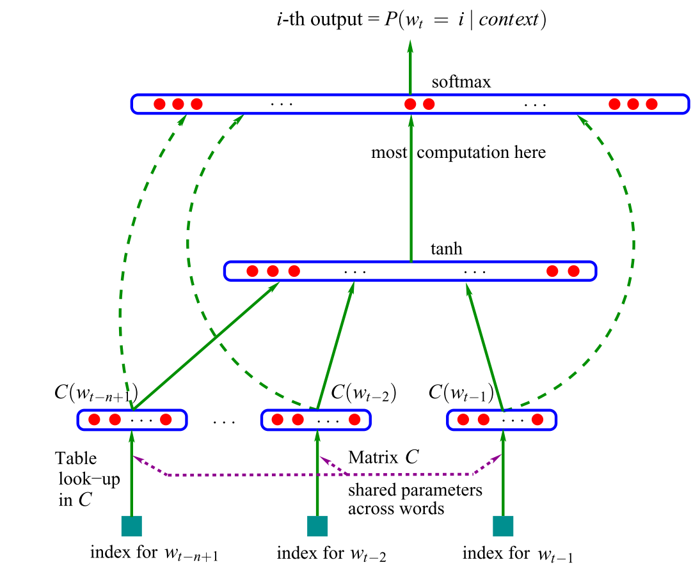
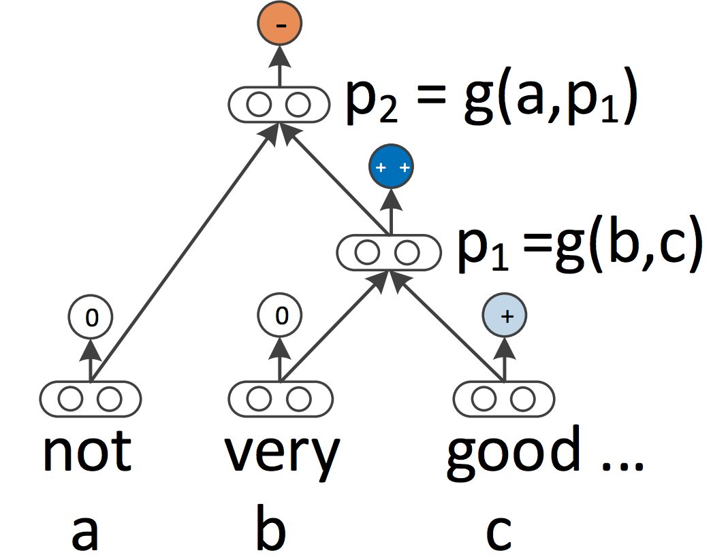
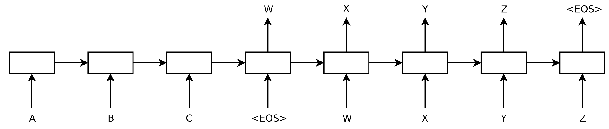
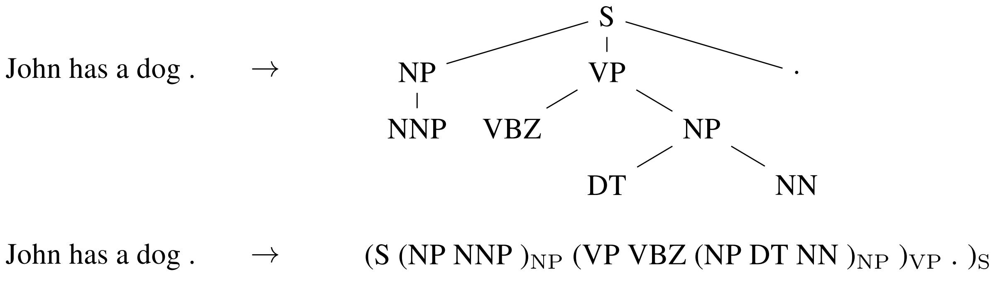

[TOC]

# Introduction

This post will discuss major recent advances in NLP focusing on neural network-based methods. 

This post tries to condense ~15 years' worth of work into eight milestones that are the most relevant today and thus omits many relevant and important developments. In particular, it is heavily skewed towards current neural approaches, which may give the false impression that no other methods were influential during this period. More importantly, many of the neural network models presented in this post build on non-neural milestones of the same era.

# 2001 - Neural language models
Language modeling is the task of predicting the next word in a text given the previous words. It is probably the simplest language processing task with concrete practical applications such as intelligent keyboards, email response suggestion (Kannan et al., 2016), spelling autocorrection, etc. Unsurprisingly, language modelling has a rich history. Classic approaches are based on [n-grams](https://en.wikipedia.org/wiki/N-gram) and employ smoothing ([Kneser & Ney, 1995](https://ieeexplore.ieee.org/abstract/document/479394/)) to deal with unseen n-grams. 

## Language model architectures

The first neural language model, a **feed-forward neural network** was proposed in 2001 by [Bengio et al.](http://www.jmlr.org/papers/volume3/bengio03a/bengio03a.pdf). This model takes as input vector representations of the n previous words, which are looked up in a table C. Nowadays, such vectors are known as word embeddings. These word embeddings are concatenated and fed into a hidden layer, whose output is then provided to a softmax layer.

More recently, feed-forward neural networks have been replaced with **recurrent neural networks** (RNNs; [Mikolov et al., 2010](https://www.fit.vutbr.cz/research/groups/speech/publi/2010/mikolov_interspeech2010_IS100722.pdf)) and **long short-term memory networks** (LSTMs; [Graves, 2013](https://arxiv.org/abs/1308.0850)) for language modeling. Many new language models that extend the classic LSTM have been proposed in recent years (have a look at [this page](http://nlpprogress.com/language_modeling.html)for an overview). Despite these developments, the classic LSTM remains a strong baseline (Melis et al., 2018). Even Bengio et al.'s classic feed-forward neural network is in some settings competitive with more sophisticated models as these typically only learn to consider the most recent words (Daniluk et al., 2017).

Understanding better what information such language models capture consequently is an active research area (Kuncoro et al., 2018; Blevins et al., 2018).

## Is language modeling enough?

Language modeling is a form of unsupervised learning, which Yann LeCun also calls predictive learning and cites as a prerequisite to acquiring common sense (see [here](http://ruder.io/highlights-nips-2016/#generalartificialintelligence) for his Cake slide from NIPS 2016). Probably the most remarkable aspect about language modeling is that despite its simplicity, it is core to many of the later advances discussed in this post:

- Word embeddings: The objective of word2vec is a simplification of language modelling.
- Sequence-to-sequence models: Such models generate an output sequence by predicting one word at a time.
- Pretrained language models: These methods use representations from language models for transfer learning.

This conversely means that many of the most important recent advances in NLP reduce to a form of language modeling. Language modeling isn't enough. In order to do "real" natural language understanding, just learning from the raw form of text likely will not be enough and we will need new methods and models.

# 2008 - Multi-task learning

Multi-task learning is a general method for sharing parameters between models that are trained on multiple tasks. In neural networks, this can be done easily by tying the weights of different layers. The idea of multi-task learning was first proposed in 1993 by [Rich Caruana](https://pdfs.semanticscholar.org/9464/d15f4f8d578f93332db4aa1c9c182fd51735.pdf) and was applied to road-following and pneumonia prediction (Caruana, 1998). Intuitively, *multi-task learning encourages the models to learn representations that are useful for many tasks*. This is particularly useful for learning general, low-level representations, to focus a model's attention or in settings with limited amounts of training data. For a more comprehensive overview of multi-task learning, have a look at [this post](http://ruder.io/multi-task/).

## C&W Model

Multi-task learning was first applied to neural networks for NLP by [Collobert and Weston in 2008](http://www.jmlr.org/papers/volume12/collobert11a/collobert11a.pdf). In their model, the look-up tables (or word embedding matrices) are shared between two models trained on different tasks. Sharing the word embeddings enables the models to collaborate and share general low-level information in the word embedding matrix, which typically makes up the largest number of parameters in a model. This paper proved influential beyond its use of multi-task learning. It spearheaded ideas such as pretraining word embeddings and using convolutional neural networks (CNNs) for text that have only been widely adopted in the last years. 

## Progress

Multi-task learning is now used across a wide range of NLP tasks and leveraging existing or "artificial" tasks has become a useful tool in the NLP repertoire. For an overview of different auxiliary tasks, have a look at [this post](http://ruder.io/multi-task-learning-nlp/). While the sharing of parameters is typically predefined, different sharing patterns can also be learned during the optimization process (Ruder et al., 2017). 

As models are being increasingly evaluated on multiple tasks to gauge their generalization ability, multi-task learning is gaining in importance and dedicated benchmarks for multi-task learning have been proposed recently (Wang et al., 2018; McCann et al., 2018).

# 2013 - Word embeddings

Sparse vector representations of text, the so-called [bag-of-words model](https://en.wikipedia.org/wiki/Bag-of-words_model) have a long history in NLP. Dense vector representations of words or word embeddings have been used as early as 2001 as we have seen above.

## Word2vec models

The main innovation that was proposed in [2011](https://arxiv.org/abs/1301.3781) and [2013](https://papers.nips.cc/paper/5021-distributed-representations-of-words-and-phrases-and-their-compositionality.pdf) by Mikolov et al. was to make the training of these word embeddings more efficient by removing the hidden layer and approximating the objective. While these changes were simple in nature, they enabled---together with the efficient word2vec implementation---large-scale training of word embeddings. Word2vec comes in two flavours: continuous bag-of-words (CBOW) and skip-gram. They differ in their objective: one predicts the centre word based based on the surrounding words, while the other does the opposite.

## Word meaning

While these embeddings are no different conceptually than the ones learned with a feed-forward neural network, training on a very large corpus enables them to capture certain relation between words such as gender, verb tense, and country-capital relations. 

These relations and the meaning behind them sparked initial interest in word embeddings and many studies have investigated the origin of these linear relationships (Arora et al., 2016; Mimno & Thompson, 2017; Antoniak & Mimno, 2018; Wendlandt et al., 2018). What cemented word embeddings as a mainstay in current NLP, however, was that using pretrained embeddings as initialization was shown to improve performance across a wide range of downstream tasks ([Kim, Y. (2014)](https://www.aclweb.org/anthology/D14-1181)).

While the relations word2vec captured had an intuitive and almost magical quality to them, later studies showed that there is nothing inherently special about word2vec: Word embeddings can also be learned via matrix factorization (Pennington et al, 2014; Levy & Goldberg, 2014) and with proper tuning, classic matrix factorization approaches like SVD and LSA achieve similar results (Levy et al., 2015).

Since then, a lot of work has gone into exploring different facets of word embeddings (as indicated by the [staggering number of citations of the original paper](https://scholar.google.de/scholar?hl=en&as_sdt=0%2C5&q=distributed+representations+of+words+and+phrases&btnG=)). Have a look at [this post](http://ruder.io/word-embeddings-2017/) for some trends and future directions. Despite many developments, word2vec is still a popular choice and widely used today.

## Progress

Word2vec's reach has even extended beyond the word level: skip-gram with negative sampling, a convenient objective for learning embeddings based on local context, has been applied to learn representations for sentences (Mikolov & Le, 2014; Kiros et al., 2015) ---and even going beyond NLP---to networks (Grover & Leskovec, 2016) and biological sequences (Asgari & Mofrad, 2015).

One particularly exciting direction is to project word embeddings of different languages into the same space to enable (zero-shot) cross-lingual transfer. It is becoming increasingly possible to learn a good projection in a completely unsupervised way (at least for similar languages) (Conneau et al., 2018; Artetxe et al., 2018; Søgaard et al., 2018), which opens applications for low-resource languages and unsupervised machine translation (Lample et al., 2018; Artetxe et al., 2018). Have a look at (Ruder et al., 2018) for a survey.

# 2013 - Neural networks for NLP

2013 and 2014 marked the time when neural network models started to get adopted in NLP. Three main types of neural networks became the most widely used: recurrent neural networks, convolutional neural networks, and recursive neural networks.

## Recurrent neural networks

Recurrent neural networks (RNNs) are an obvious choice to deal with the dynamic input sequences ubiquitous in NLP. Vanilla RNNs ([Elman, 1990](https://crl.ucsd.edu/~elman/Papers/fsit.pdf)) were quickly replaced with the classic long short-term memory networks ([Hochreiter & Schmidhuber, 1997](https://www.bioinf.jku.at/publications/older/2604.pdf)), which proved more resilient to the [vanishing and exploding gradient problem](https://en.wikipedia.org/wiki/Vanishing_gradient_problem). Before 2013, RNNs were still thought to be difficult to train; [Ilya Sutskever's PhD thesis](https://www.cs.utoronto.ca/~ilya/pubs/ilya_sutskever_phd_thesis.pdf) was a key example on the way to changing this reputation. A bidirectional LSTM (BiLSTM; [Graves et al., 2013](https://www.cs.toronto.edu/~graves/asru_2013.pdf)) is typically used to deal with both left and right context.

## Convolutional neural networks

With convolutional neural networks (CNNs) being widely used in computer vision, they also started to get applied to language (Kalchbrenner et al., 2014; Kim et al., 2014). A convolutional neural network for text only operates in two dimensions, with the filters only needing to be moved along the temporal dimension.

An advantage of convolutional neural networks is that they are more parallelizable than RNNs, as the state at every timestep only depends on the local context (via the convolution operation) rather than all past states as in the RNN. CNNs can be extended with wider receptive fields using dilated convolutions to capture a wider context (Kalchbrenner et al., 2016). CNNs and LSTMs can also be combined and stacked (Wang et al., 2016) and convolutions can be used to speed up an LSTM (Bradbury et al., 2017).

## Recursive neural networks

RNNs and CNNs both treat the language as a sequence. From a linguistic perspective, however, language is [inherently hierarchical](https://en.wikipedia.org/wiki/Chomsky_hierarchy): Words are composed into higher-order phrases and clauses, which can themselves be recursively combined according to a set of production rules. *The linguistically inspired idea of treating sentences as trees rather than as a sequence gives rise to recursive neural networks* ([Socher et al., 2013](https://nlp.stanford.edu/~socherr/EMNLP2013_RNTN.pdf)).

Recursive neural networks build the representation of a sequence from the bottom up in contrast to RNNs who process the sentence left-to-right or right-to-left. At every node of the tree, a new representation is computed by composing the representations of the child nodes. As a tree can also be seen as imposing a different processing order on an RNN, LSTMs have naturally been extended to trees (Tai et al., 2015).

Not only RNNs and LSTMs can be extended to work with hierarchical structures. Word embeddings can be learned based not only on local but on grammatical context (Levy & Goldberg, 2014); language models can generate words based on a syntactic stack (Dyer et al., 2016); and graph-convolutional neural networks can operate over a tree (Bastings et al., 2017).

# 2014 - Sequence-to-sequence models

In 2014, [Sutskever et al.](https://arxiv.org/abs/1409.3215) proposed sequence-to-sequence learning, a general framework for mapping one sequence to another one using a neural network. In the framework, an encoder neural network processes a sentence symbol by symbol and compresses it into a vector representation; a decoder neural network then predicts the output symbol by symbol based on the encoder state, taking as input at every step the previously predicted symbol.

## Machine translation

Machine translation turned out to be the killer application of this framework. In 2016, Google announced that it was starting to replace its monolithic phrase-based MT models with neural MT models (Wu et al., 2016). [According to Jeff Dean](https://www.oreilly.com/ideas/what-machine-learning-means-for-software-development), this meant replacing 500,000 lines of phrase-based MT code with a 500-line neural network model.

## Natural language generation

This framework due to its flexibility is now the go-to framework for natural language generation tasks, with different models taking on the role of the encoder and the decoder. Importantly, the decoder model can not only be conditioned on a sequence, but on arbitrary representations. This enables for instance generating a caption based on an image (Vinyals et al., 2015), text based on a table (Lebret et al., 2016), and a description based on source code changes (Loyola et al., 2017), among many other applications.

## Structured prediction

Sequence-to-sequence learning can even be applied to structured prediction tasks common in NLP where the output has a particular structure. For simplicity, the output is linearized as following.

Neural networks have demonstrated the ability to directly learn to produce such a linearized output given sufficient amount of training data for constituency parsing (Vinyals et al, 2015) and and named entity recognition (Gillick et al., 2016), among others.

## Progress

Encoders for sequences and decoders are typically based on RNNs but other model types can be used. New architectures mainly emerge from work in MT, which acts as a Petri dish for sequence-to-sequence architectures. Recent models are deep LSTMs (Wu et al., 2016), convolutional encoders (Kalchbrenner et al., 2016; Gehring et al., 2017), the Transformer (Vaswani et al., 2017), which will be discussed in the next section, and a combination of an LSTM and a Transformer (Chen et al., 2018).

# 2015 - Attention

Attention (Bahdanau et al., 2015) is one of the core innovations in neural MT (NMT) and the key idea that enabled NMT models to outperform classic phrase-based MT systems. The main bottleneck of sequence-to-sequence learning is that it requires to compress the entire content of the source sequence into a fixed-size vector. Attention alleviates this by allowing the decoder to look back at the source sequence hidden states, which are then provided as a weighted average as additional input to the decoder.

Different forms of attention are available (Luong et al., 2015). Have a look [here](http://ruder.io/deep-learning-nlp-best-practices/index.html#attention) for a brief overview. Attention is widely applicable and potentially useful for any task that requires making decisions based on certain parts of the input. It has been applied to consituency parsing (Vinyals et al., 2015), reading comprehension (Hermann et al., 2015), and one-shot learning (Vinyals et al., 2016), among many others. The input does not even need to be a sequence, but can consist of other representations as in the case of image captioning (Xu et al., 2015. A useful side-effect of attention is that it provides a rare---if only superficial---glimpse into the inner workings of the model by inspecting which parts of the input are relevant for a particular output based on the attention weights.

Attention is also not restricted to just looking at the input sequence; self-attention can be used to look at the surrounding words in a sentence or document to obtain more contextually sensitive word representations. Multiple layers of self-attention are at the core of the Transformer architecture (Vaswani et al., 2017), the current state-of-the-art model for NMT.

# 2015 - Memory-based networks

Attention can be seen as a form of fuzzy memory where the memory consists of the past hidden states of the model, with the model choosing what to retrieve from memory. For a more detailed overview of attention and its connection to memory, have a look at [this post](http://www.wildml.com/2016/01/attention-and-memory-in-deep-learning-and-nlp/). Many models with a more explicit memory have been proposed. They come in different variants such as Neural Turing Machines (Graves et al., 2014), Memory Networks (Weston et al., 2015) and End-to-end Memory Networks (Sukhbaatar et al., 2015), Dynamic Memory Networks (Kumar et al., 2015), the Neural Differentiable Computer (Graves et al., 2016), and the Recurrent Entity Network (Henaff et al., 2017).

Memory is often accessed based on similarity to the current state similar to attention and can typically be written to and read from. Models differ in how they implement and leverage the memory. For instance, End-to-end Memory Networks process the input multiple times and update the memory to enable multiple steps of inference. Neural Turing Machines also have a location-based addressing, which allows them to learn simple computer programs like sorting. Memory-based models are typically applied to tasks, where retaining information over longer time spans should be useful such as language modelling and reading comprehension. The concept of a memory is very versatile: A knowledge base or table can function as a memory, while a memory can also be populated based on the entire input or particular parts of it.

# 2018 - Pretrained language models

Pretrained word embeddings are context-agnostic and only used to initialize the first layer in our models. In 2018, a range of supervised tasks has been used to pretrain neural networks (Conneau et al., 2017; McCann et al., 2017; Subramanian et al., 2018). In contrast, language models only require unlabelled text; training can thus scale to billions of tokens, new domains, and new languages. Pretrained language models were first proposed in 2015 (Dai & Le, 2015); only recently were they shown to be beneficial across a diverse range of tasks. Language model embeddings can be used as features in a target model (Peters et al., 2018) or a language model can be fine-tuned on target task data (Ramachandran et al., 2017; Howard & Ruder, 2018). Adding language model embeddings gives a large improvement over the state-of-the-art across many different tasks.

Pretrained language models have been shown enable learning with significantly less data. As language models only require unlabelled data, they are particularly beneficial for low-resource languages where labelled data is scarce. For more information about the potential of pretrained language models, refer to [this article](https://thegradient.pub/nlp-imagenet/).

# Other milestones based neural

Some other developments are less pervasive than the ones mentioned above, but still have wide-ranging impact.

## Character-based representations   

Using a CNN or an LSTM over characters to obtain a **character-based word representation** is now fairly common, particularly for morphologically rich languages and tasks where morphological information is important or that have many unknown words. 

Character-based representations were first used for part-of-speech tagging and language modeling (Ling et al., 2015) and dependency parsing (Ballesteros et al., 2015). They later became a core component of models for sequence labeling (Lample et al., 2016; Plank et al., 2016) and language modeling (Kim et al., 2016). Character-based representations alleviate the need of having to deal with a fixed vocabulary at increased computational cost and enable applications such as fully character-based NMT (Ling et al., 2016; Lee et al., 2017).

## Adversarial learning

Adversarial methods have taken the field of ML by storm and have also been used in different forms in NLP. Adversarial examples are becoming increasingly widely used not only as a tool to probe models and understand their failure cases, but also to make them more robust (Jia & Liang, 2017). (Virtual) adversarial training, that is, worst-case perturbations (Miyato et al., 2017; Yasunaga et al., 2018) and domain-adversarial losses (Ganin et al., 2016; Kim et al., 2017)are useful forms of regularization that can equally make models more robust. 

Generative adversarial networks (GANs) are not yet too effective for natural language generation (Semeniuta et al., 2018), but are useful for instance when matching distributions (Conneau et al., 2018).

## Reinforcement learning

Reinforcement learning has been shown to be useful for tasks with a temporal dependency such as selecting data during training (Fang et al., 2017; Wu et al., 2018) and modelling dialogue (Liu et al., 2018). RL is also effective for directly optimizing a non-differentiable end metric such as ROUGE or BLEU instead of optimizing a surrogate loss such as cross-entropy in summarization (Paulus et al, 2018; Celikyilmaz et al., 2018) and machine translation (Ranzato et al., 2016). Similarly, inverse reinforcement learning can be useful in settings where the reward is too complex to be specified such as visual storytelling (Wang et al., 2018)

# Non-neural milestones

In 1998 and over the following years, the [FrameNet](https://framenet.icsi.berkeley.edu/fndrupal/) project was introduced (Baker et al., 1998), which led to the task of **semantic role labeling**, a form of shallow semantic parsing that is still actively researched today. 

In the early 2000s, the shared tasks organized together with the Conference on Natural Language Learning (CoNLL) catalyzed research in core NLP tasks such as **chunking** (Tjong Kim Sang et al., 2000), **named entity recognition** (Tjong Kim Sang et al., 2003), and **dependency parsing** (Buchholz et al., 2006), among others. Many of the CoNLL shared task datasets are still the standard for evaluation today.

In 2001, **conditional random fields** (CRF; Lafferty et al., 2001), one of the most influential classes of sequence labelling methods were introduced, which won the [Test-of-time award at ICML 2011](https://www.ml.cmu.edu/news/news-archive/2011-2015/2011/june/icml-test-time-award-2011.html). A CRF layer is a core part of current state-of-the-art models for sequence labelling problems with label interdependencies such as named entity recognition (Lample et al., 2016).

In 2002, the bilingual evaluation understudy (**BLEU**; Papineni et al., 2002) metric was proposed, which enabled MT systems to scale up and is still the standard metric for MT evaluation these days. In the same year, the **structured preceptron** (Collins, 2002) was introduced, which laid the foundation for work in structured perception. At the same conference, **sentiment analysis**, one of the most popular and widely studied NLP tasks, was introduced (Pang et al., 2002). All three papers won the [Test-of-time award at NAACL 2018](https://naacl2018.wordpress.com/2018/03/22/test-of-time-award-papers/).

2003 saw the introduction of **latent dirichlet allocation** (LDA; Blei et al., 2003), one of the most widely used techniques in machine learning, which is still the standard way to do **topic modeling**. 

In 2004, novel **max-margin** models were proposed that are better suited for capturing correlations in structured data than SVMs (Taskar et al., 2004a; 2004b).

In 2006, OntoNotes (Hovy et al., 2006), a large **multilingual corpus** with multiple annotations and high interannotator agreement was introduced. OntoNotes has been used for the training and evaluation of a variety of tasks such as dependency parsing and coreference resolution.

In 2008, Milne and Witten described how Wikipedia can be used to enrich machine learning methods. To this date, Wikipedia is one of the most useful resources for training ML methods, whether for entity linking and disambiguation, language modelling, as a knowledge base, or a variety of other tasks.

In 2009, the idea of distant supervision (Mintz et al., 2009) was proposed. Distant supervision leverages information from heuristics or existing knowledge bases to generate noisy patterns that can be used to automatically extract examples from large corpora. Distant supervision has been used extensively and is a common technique in relation extraction, information extraction, and sentiment analysis, among other tasks.

# The 4 Biggest Open Problems in NLP

[This](http://ruder.io/4-biggest-open-problems-in-nlp/) is the second blog post in a two-part series. The [first post](http://ruder.io/a-review-of-the-recent-history-of-nlp/) discussed major recent advances in NLP focusing on neural network-based methods. This post discusses major open problems in NLP. In the weeks leading up to the Indaba, we asked NLP experts a number of simple but big questions. Based on the responses, we identified the four problems that were mentioned most often:

- Natural language understanding
- NLP for low-resource scenarios
- Reasoning about large or multiple documents
- Datasets, problems, and evaluation

