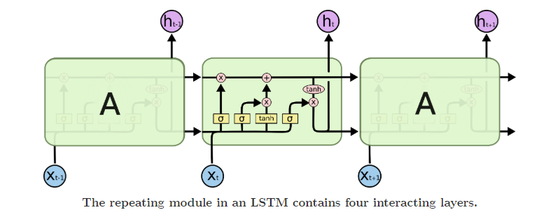
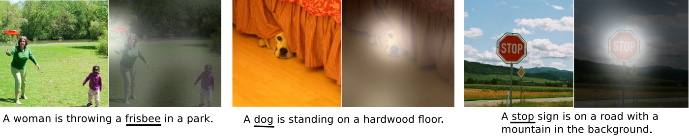
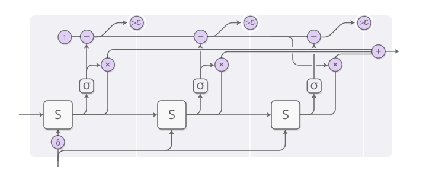
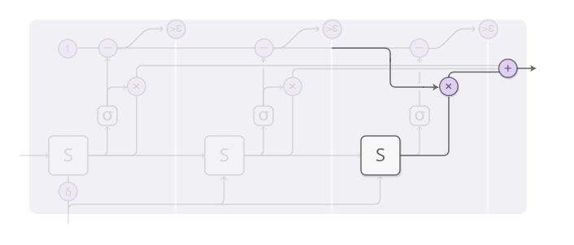

[TOC]

# Augmented RNN

Recurrent neural networks are one of the staples of deep learning, allowing neural networks to work with **sequences** of data like text, audio and video.

(The picture from [colah's LSTM tutorial](http://colah.github.io/posts/2015-08-Understanding-LSTMs/))

The basic RNN design struggles with **longer sequences**, but a special variant—“**long short-term memory**” networks —can even work with these. Such models have been found to be very powerful, achieving remarkable results in many tasks including translation, voice recognition, and image captioning.

(The picture from [colah's LSTM tutorial](http://colah.github.io/posts/2015-08-Understanding-LSTMs/))

As this has happened, we’ve seen a growing number of attempts to **augment RNNs** with new properties. Four directions stand out as particularly exciting:

- **Neural Truing Machines** have external memory that they can read and write to.
- **Attentional Interfaces** all RNNs to focus on parts of their input.
- **Adaptive Computation Time** allows for varying amounts of computation per step.
- **Neural Programmers** can call functions, building programs as they run.

Individually, these techniques are all potent extensions of RNNs, but the really striking thing is that they can be combined, and seem to just be points in a broader space. Further, they all rely on the same underlying trick—something called **attention**—to work.

# Neural Turing Networks

[Neural Turing Machines](http://arxiv.org/pdf/1410.5401.pdf) combine a RNN with an external memory bank ,and the memory is an array of vectors.

## Read and Write

But how does reading and writing work? The challenge is that we want to make them **differentiable**. In particular, we want to make them differentiable with respect to the location we read from or write to, so that we can learn where to read and write. This is tricky because memory addresses seem to be fundamentally discrete. NTMs take a very clever solution to this: *every step, they read and write everywhere, just to different extents*.

As an example, let’s focus on **reading**. Instead of specifying a single location, the RNN outputs an “**attention distribution**” that describes how we spread out the amount we care about different memory positions. As such, the result of the read operation is a weighted sum.

Similarly, we **write** everywhere at once to different extents. Again, an **attention distribution** describes how much we write at every location. We do this by having the new value of a position in memory be a convex combination of the old memory content and the write value, with the position between the two decided by the attention weight.

## Attention distribution

But how do NTMs decide which positions in memory to focus their attention on? They actually use a combination of two different methods: **content-based attention** and **location-based attention**. Content-based attention allows NTMs to search through their memory and focus on places that match what they’re looking for, while location-based attention allows relative movement in memory, enabling the NTM to loop.

## Performance

This capability to read and write allows NTMs to perform many simple algorithms, previously beyond neural networks. For example, they can learn to store a long sequence in memory, and then loop over it, repeating it back repeatedly. They can also learn to mimic a lookup table, or even learn to sort numbers (although they kind of cheat)! On the other hand, they still can’t do many basic things, like add or multiply numbers.

# Attentional Interfaces

When I’m translating a sentence, I pay special attention to the word I’m presently translating. When I’m transcribing an audio recording, I listen carefully to the segment I’m actively writing down.

Neural networks can achieve this same behavior using **attention**, focusing on part of a subset of the information they’re given. For example, an RNN can attend over the output of another RNN. At every time step, it focuses on different positions in the other RNN.

We’d like attention to be **differentiable**, so that we can learn where to focus. To do this, we use the same trick Neural Turing Machines use: we focus everywhere, just to different extents.

## Attention distribution

The attention distribution is usually generated with **content-based attention**. The attending RNN generates a query describing what it wants to focus on. Each item is dot-producted with the query to produce a score, describing how well it matches the query. The scores are fed into a softmax to create the attention distribution.

## Attention in Machine Translation

One use of attention between RNNs is translation ([Neural machine translation by jointly learning to align and translate](https://arxiv.org/abs/1409.0473)). 

A traditional sequence-to-sequence model has to boil the entire input down into a single vector and then expands it back out. 

Attention avoids this by allowing the RNN processing the input to pass along information about each word it sees, and then for the RNN generating the output to focus on words as they become relevant.

## Attention in other applications

### Voice Recognition

This kind of attention between RNNs has a number of other applications. It can be used in voice recognition  (**Listen, Attend and Spell**  [[PDF\]](http://arxiv.org/pdf/1508.01211.pdf)), allowing one RNN to process the audio and then have another RNN skim over it, focusing on relevant parts as it generates a transcript.

### Parsing Text and Conversational Model

Other uses of this kind of attention include parsing text (**Grammar as a foreign language** [PDF](https://arxiv.org/abs/1412.7449)), where it allows the model to glance at words as it generates the parse tree. And for conversational modeling (**A Neural Conversational Model**  [[PDF\]](http://arxiv.org/pdf/1506.05869.pdf)), where attention lets the model focus on previous parts of the conversation as it generates its response.

### Image Caption

Attention can also be used on the interface between a convolutional neural network and an RNN. This allows the RNN to look at different position of an image every step. One popular use of this kind of attention is for image captioning (**Show, attend and tell: Neural image caption generation with visual attention** [PDF](https://arxiv.org/abs/1502.03044)). First, a conv net processes the image, extracting high-level features. Then an RNN runs, generating a description of the image. As it generates each word in the description, the RNN focuses on the conv net’s interpretation of the relevant parts of the image. We can explicitly visualize this:

### Others

More broadly, attentional interfaces can be used whenever one wants to interface with a neural network that has a repeating structure in its output.

# Adaptive Computation Time

Standard RNNs do the same amount of computation for each time step. This seems unintuitive. Surely, one should think more when things are hard? It also limits RNNs to doing $O(n)$ operations for a list of length $n$.

Adaptive Computation Time (**Adaptive Computation Time for Recurrent Neural Networks**  [[PDF\]](http://arxiv.org/pdf/1603.08983.pdf)) is a way for RNNs to do different amounts of computation each step. The big picture idea is simple: allow the RNN to do multiple steps of computation for each time step.

In order for the network to learn how many steps to do, we want the number of steps to be **differentiable**. We achieve this with the same trick we used before: instead of deciding to run for a discrete number of steps, we have an **attention distribution** over the number of steps to run. The output is a weighted combination of the outputs of each step.

There are a few more details, which were left out in the previous diagram. Here’s a complete diagram of **a time step** with three computation steps.

That’s a bit complicated, so let’s work through it step by step. At a high-level, we’re still running the RNN and outputting a weighted combination of the states:

The weight for each step is determined by a “halting neuron.” It’s a sigmoid neuron that looks at the RNN state and gives a halting weight, which we can think of as the probability that we should stop at that step.

We have a total budget for the halting weights of 1, so we track that budget along the top. When it gets to less than epsilon, we stop.

When we stop, might have some left over halting budget because we stop when it gets to less than epsilon. What should we do with it? Technically, it’s being given to future steps but we don’t want to compute those, so we attribute it to the last step.

When training Adaptive Computation Time models, one adds a “ponder cost” term to the cost function. This penalizes the model for the amount of computation it uses. The bigger you make this term, the more it will trade-off performance for lowering compute time.

# Neural Programmer

Neural nets are excellent at many tasks, but they also struggle to do some basic things like arithmetic, which are trivial in normal approaches to computing. It would be really nice to have a way to fuse neural nets with normal programming, and get the best of both worlds.

The neural programmer (**Neural Programmer: Inducing Latent Programs with Gradient Descent**  [[PDF\]](http://arxiv.org/pdf/1511.04834.pdf)) is one approach to this. It learns to create programs in order to solve a task. In fact, it learns to generate such programs *without needing examples of correct programs*. It discovers how to produce programs as a means to the end of accomplishing some task.

The Neural Programmer isn’t the only approach to having neural networks generate programs. Another lovely approach is the Neural Programmer-Interpreter (**Neural Programmer-Interpreters**  [[PDF\]](http://arxiv.org/pdf/1511.06279.pdf)) which can accomplish a number of very interesting tasks, but requires supervision in the form of correct programs.

# The Big Picture

## Intelligence: Intuition and Media

A human with a piece of paper is, in some sense, much smarter than a human without. A human with mathematical notation can solve problems they otherwise couldn’t. Access to computers makes us capable of incredible feats that would otherwise be far beyond us.

In general, it seems like a lot of interesting forms of intelligence are an interaction between the creative heuristic intuition of humans and some more crisp and careful media, like language or equations. Sometimes, the medium is something that physically exists, and stores information for us, prevents us from making mistakes, or does computational heavy lifting. In other cases, the medium is a model in our head that we manipulate. Either way, it seems deeply fundamental to intelligence.

Recent results in machine learning have started to have this flavor, combining the intuition of neural networks with something else. One approach is what one might call “heuristic search.” For example, AlphaGo [19] has a model of how Go works and explores how the game could play out guided by neural network intuition. Similarly, DeepMath [20] uses neural networks as intuition for manipulating mathematical expressions. 

## Reinforcement Learning and Attention

The “augmented RNNs” we’ve talked about in this article are another approach, where we connect RNNs (the intuition of neural netoworks) to engineered media, in order to extend their general capabilities.

Interacting with media naturally involves making a sequence of taking an action, observing, and taking more actions. This creates a major challenge: how do we learn which actions to take? That sounds like a reinforcement learning problem and we could certainly take that approach. But the reinforcement learning literature is really attacking the hardest version of this problem, and its solutions are hard to use. The wonderful thing about attention is that it gives us an easier way out of this problem by partially taking all actions to varying extents. This works because we can design media—like the NTM memory—to allow fractional actions and to be differentiable. Reinforcement learning has us take a single path, and try to learn from that. Attention takes every direction at a fork, and then merges the paths back together.

A major weaknesses of attention is that we have to take every “action” every step. This causes the computational cost to grow linearly as you do things like increase the amount of memory in a Neural Turing Machine. One thing you could imagine doing is having your attention be sparse, so that you only have to touch some memories. However, it’s still challenging because you may want to do things like have your attention depend on the content of the memory, and doing that naively forces you to look at each memory. We’ve seen some initial attempts to attack this problem, such as (**Learning Efficient Algorithms with Hierarchical Attentive Memory**  [[PDF\]](http://arxiv.org/pdf/1602.03218.pdf)), but it seems like there’s a lot more to be done. If we could really make such sub-linear time attention work, that would be very powerful!

