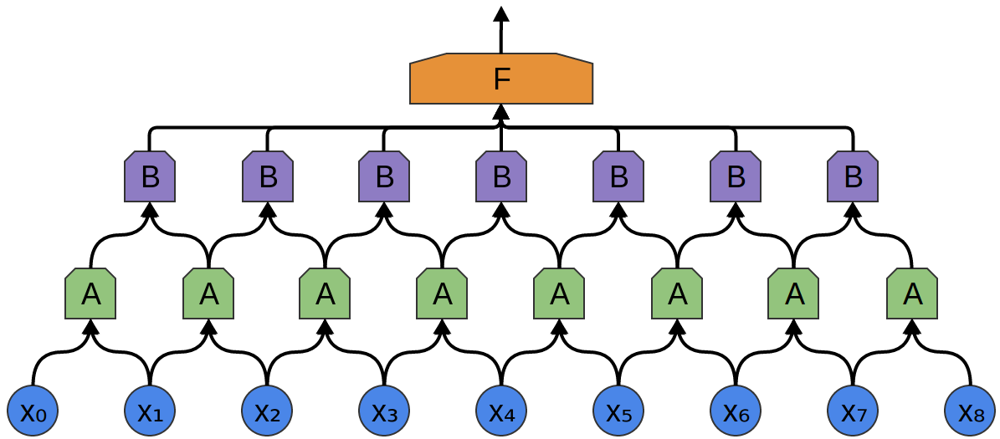
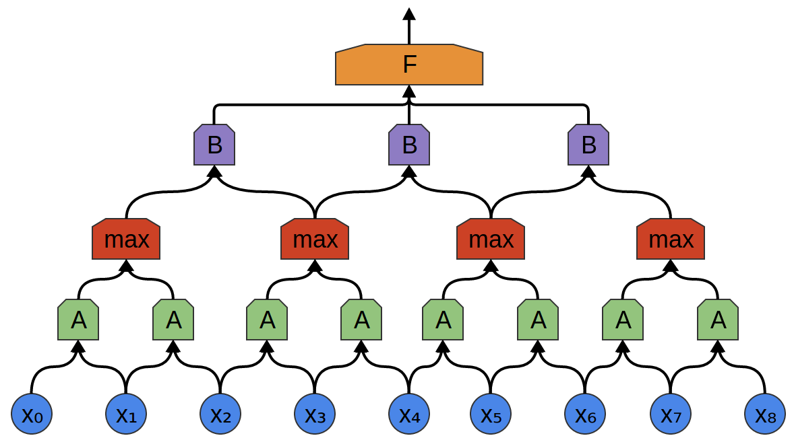
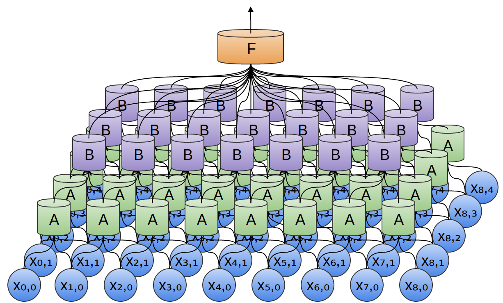
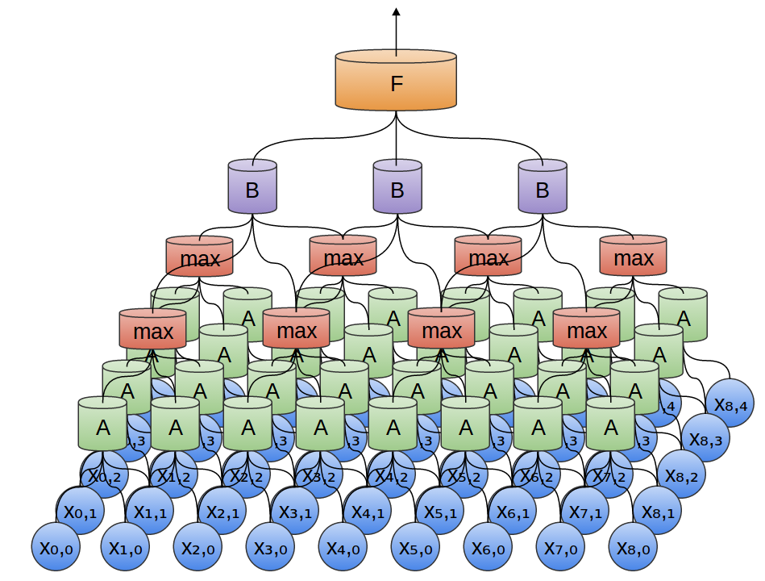
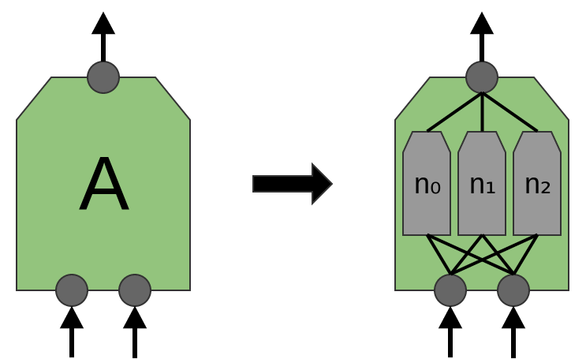
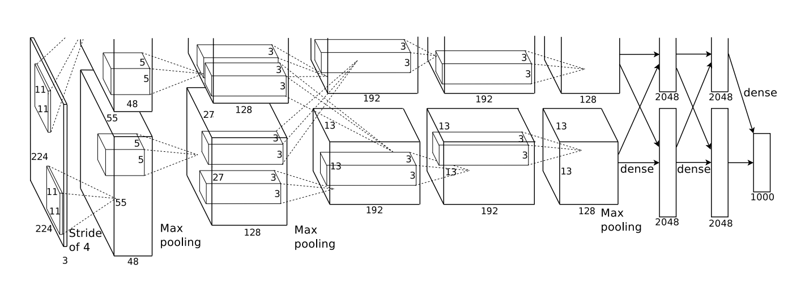

[TOC]

# Introduction

**Convolutional neural networks** can be thought of as a kind of neural network that uses *many identical copies of the same neuron*. This allows the network to have lots of neurons and express computationally large models while keeping the number of actual parameters – the values describing how neurons behave – that need to be learned fairly small.

It should be noted that not all neural networks that use multiple copies of the same neuron are convolutional neural networks. Convolutional neural networks are just one type of neural network that uses the more general trick, **weight-tying**. Other kinds of neural network that do this are **recurrent neural networks** and **recursive neural networks**.

This trick of having multiple copies of the same neuron makes a convolutional neural network can learn a neuron once and use it in many places, making it easier to learn the model and reducing error.

# Architecture

## 1D Convolutional Neural Networks

Suppose you want a neural network to look at audio samples and predict whether a human is speaking or not. You get audio samples at different points in time. The samples are evenly spaced.

The simplest way to try and classify them with a neural network is to just connect them all to a fully-connected layer:

### Local Features in Data

We care a lot about local properties of the data: What frequency of sounds are there around a given time? Are they increasing or decreasing? We care about the same properties at all points in time. It’s useful to know the frequencies at the beginning, it’s useful to know the frequencies in the middle, and it’s also useful to know the frequencies at the end. Again, note that these are local properties, in that we only need to look at a small window of the audio sample in order to determine them.

### One Convolutional Layer

We can create a group of neurons, $A$, that look at small time segments of our data. $A$ looks at all such segments, computing certain **features**. Then, the output of this **convolutional layer** is fed into a fully-connected layer, $F$. (Groups of neurons, like $A$, that appear in multiple places are sometimes called **modules**, and networks that use them are sometimes called **modular neural networks**.)

In the above example, $A$ only looked at segments consisting of two points. This isn’t realistic. Usually, a convolution layer’s window would be much larger. There are multiple copies of the same module $A$ in our convolutional layer.

### Stacked Convolutional Layers

One very nice property of convolutional layers is that they’re **composable**. You can feed the output of one convolutional layer into another. *With each layer, the network can detect higher-level, more abstract features*.

In the following example, we have a new group of neurons, $B$. $B$ is used to create another convolutional layer stacked on top of the previous one.

### Pooling Layers

Convolutional layers are often interweaved with pooling layers. In particular, there is a kind of layer called a **max-pooling layer** that is extremely popular.

Often, from a high level perspective, we don’t care about the precise point in time a feature is present. If a shift in frequency occurs slightly earlier or later, does it matter? I.e. *we want our model has some invariant to some transformations of the data*.

A max-pooling layer takes the maximum of features over small blocks of a previous layer. The output tells us if a feature was present in a region of the previous layer, but not precisely where. Max-pooling layers kind of “zoom out”. They allow later convolutional layers to work on larger sections of the data, because a small patch after the pooling layer corresponds to a much larger patch before it.

## 2D Convolutional Neural Networks

In our previous examples, we’ve used 1-dimensional convolutional layers. However, convolutional layers can work on higher-dimensional data as well. In fact, the most famous successes of convolutional neural networks are applying 2D convolutional neural networks to recognizing images.

In a 2-dimensional convolutional layer, instead of looking at segments, $A$ will now look at patches. For each patch, $A$ will compute features. For example, it might learn to detect the presence of an edge. Or it might learn to detect a texture. Or perhaps a contrast between two colors.

We can also stack multiple convolutional layers for 2D data.

What this really boils down to is that, when considering an entire image, we don’t care about the exact position of an edge, down to a pixel. It’s enough to know where it is to within a few pixels. Thus we can also do max pooling in two dimensions. Here, we take the maximum of features over a small patch.

## 3D Convolutional Neural Networks

Three-dimensional convolutional networks are also sometimes used, for data like videos or volumetric data (eg. 3D medical scans). However, they are not very widely used, and much harder to visualize.

# The Module $A$

Now, we previously said that $A$ was a group of neurons or was a module. But what is $A$ exactly?

## In Traditional Conv

In traditional convolutional layers, $A$ is a bunch of neurons in parallel, that all get the same inputs and compute different features. For example, in a 2-dimensional convolutional layer, one neuron might detect horizontal edges, another might detect vertical edges, and another might detect green-red color contrasts.

## In Modern Conv

That said, in the recent paper ‘Network in Network’ ([Lin *et al.* (2013)](http://arxiv.org/abs/1312.4400)), a new “Mlpconv” layer is proposed. In this model, $A$ would have multiple layers of neurons, with the final layer outputting higher level features for the region. In the paper, the model achieves some very impressive results, setting new state of the art on a number of benchmark datasets.

# Alex CNNs

In 2012, Alex Krizhevsky, Ilya Sutskever, and Geoff Hinton blew existing image classification results out of the water ([Krizehvsky *et al.* (2012)](http://www.cs.toronto.edu/~fritz/absps/imagenet.pdf)).

## Architecture

Their progress was the result of combining together a bunch of different pieces. They used **GPUs** to train a very large, deep, neural network. They used a new kind of neuron (**ReLUs**) and a new technique to reduce a problem called ‘overfitting’ (**DropOut**). They used a very large dataset with lots of image categories ([ImageNet](http://www.image-net.org/)). And, of course, it was a convolutional neural network (**CNN**).

Their architecture, illustrated below, was very deep. It has 5 convolutional layers, with pooling interspersed, and three fully-connected layers. The early layers are split over the two GPUs.

## Performance

They trained their network to classify images into a thousand different categories. Randomly guessing, one would guess the correct answer 0.1% of the time. Krizhevsky, *et al.*’s model is able to give the right answer 63% of the time. Further, one of the top 5 answers it gives is right 85% of the time!

## What CNN learned

We can also examine what the first layer of the network learns to do.

Recall that the convolutional layers were split between the two GPUs. Information doesn’t go back and forth each layer, so the split sides are disconnected in a real way. It turns out that, every time the model is run, the two sides specialize.

Neurons in one side focus on black and white, learning to detect edges of different orientations and sizes. Neurons on the other side specialize on color and texture, detecting color contrasts and patterns. *Remember that the neurons are randomly initialized. No human went and set them to be edge detectors, or to split in this way. It arose simply from training the network to classify images*.

