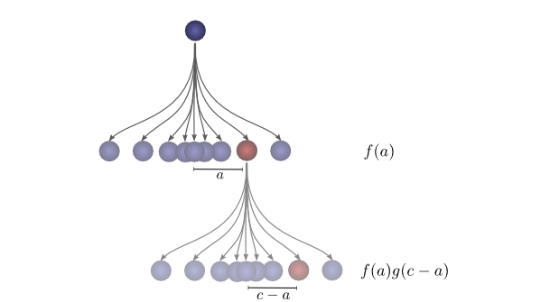

# Introduction

**Convolution** is a mathematical operation. The convolution operation is a powerful tool. In mathematics, it comes up in diverse contexts, ranging from the study of partial differential equations to probability theory. In part because of its role in PDEs, convolution is very important in the physical sciences. It also has an important role in many applied areas, like computer graphics and signal processing.

For us, convolution will provide a number of benefits. Firstly, it will allow us to create much more efficient implementations of convolutional layers than the naive perspective might suggest. Secondly, it will remove a lot of messiness from our formulation. Finally, convolution will give us a significantly different perspective for reasoning about convolutional layers.

Thus it's so important to well understand convolutions.

# Lessons from a Dropped Ball

Imagine we drop a ball from some height onto the ground, where it only has one dimension of motion. *How likely is it that a ball will go a distance $c$ if you drop it and then drop it again from above the point at which it landed?*

Let's break this down:

- After the first drop, it will land $a$ units away from the starting point with probability $f(a)$, where $f$ is the probability distribution.
- Now after this first drop, we pick the ball up and drop it from another height above the point where it first landed. The probability of the ball rolling $b$ units away from the new starting point is $g(b)$, where $g$ may be a different probability distribution if it’s dropped from a different height.

Thus if $a+b=c$, the ball will land $c$ units away from the starting point. So the probability of this happening is simply $f(a) \cdot g(b)$.

In order to find the *total likelihood* of the ball reaching a total distance of $c$, we can’t consider only one possible way of reaching $c$. Instead, we consider *all the possible ways* of partitioning $c$ into two drops $a$ and $b$ and sum over the *probability of each way*. we can denote the total likelihood as:
$$
\sum_{a+b=c} f(a) \cdot g(b)
$$
Turns out, we’re doing a **convolution**! In particular, the convolution of $f$ and $g$, evaluated at $c$ is defined:
$$
(f\ast g)(c) = \sum_{a+b=c} f(a) \cdot g(b)~~~~
$$
If we substitute $b=c-a$, we get:
$$
(f \ast g)(c) = \sum_{a} f(a) \cdot g(c-a)~~~~
$$
This is the standard definition of convolution. We can think, the first drop, it will land at an intermediate position $a$ with probability $f(a)$. If it lands at $a$, it has probability $g(c−a)$ of landing at a position $c$. And to get the convolution, we consider all intermediate positions.

Below, we’re able to visualize the convolution of two box functions:

# Higher Dimensional Convolutions

Convolutions are an extremely general idea. We can also use them in a higher number of dimensions.

Let’s consider our example of a falling ball again. Now, as it falls, it’s position shifts not only in one dimension, but in two.

Convolution is the same as before:
$$
(f\ast g)(c_1, c_2) = \sum_{\begin{array}{c}a_1+b_1=c_1\\a_2+b_2=c_2\end{array}} f(a_1,a_2) \cdot g(b_1,b_2)
$$
Or in the standard definition:
$$
(f\ast g)(c_1, c_2) = \sum_{a_1, a_2} f(a_1, a_2) \cdot g(c_1-a_1,~ c_2-a_2)
$$
Just like one-dimensional convolutions, we can think of a two-dimensional convolution as sliding one function on top of another, multiplying and adding. One common application of this is image processing. We can think of images as two-dimensional functions. Many important *image transformations* are convolutions where you convolve the image function with a very small, local function called a **kernel** or **filter**. (From the [River Trail documentation](http://intellabs.github.io/RiverTrail/tutorial/))

where the kernel just likes $g(c_1 - a_1, c_2 - a_2)$; the image just likes $f(a_1, a_2)$; and the output is $(f  \ast g)$. The kernel slides to every position of the image and computes a new pixel as a weighted sum of the pixels it floats over.

# Convolution in CNN

## Fully-connected neural network

Let's see a fully-connected neural network first.

Recall that a neuron in a neural network is described by:
$$
y = \sigma(w_0x_0 + w_1x_1 + w_2x_2 ~...~ + b)
$$
Typically, we describe all the neurons in a layer at once, rather than individually. The trick is to have a weight matrix, $W$, $\mathbf{y}=\sigma(W\mathbf{x}+\mathbf{b})$, i.e.:
$$
y_0 = \sigma(W_{0,0}x_0 + W_{0,1}x_1 + W_{0,2}x_2 ...) \\
y_1 = \sigma(W_{1,0}x_0 + W_{1,1}x_1 + W_{1,2}x_2 ...) \\
y_2 = \sigma(W_{2,0}x_0 + W_{2,1}x_1 + W_{2,2}x_2 ...)
$$
Thus each row of the matrix $W$ describes the weights connecting a neuron to its inputs:
$$
W = \left[\begin{array}{ccccc} 
W_{0,0} & W_{0,1} & W_{0,2} & W_{0,3} & ...\\
W_{1,0} & W_{1,1} & W_{1,2} & W_{1,3} & ...\\
W_{2,0} & W_{2,1} & W_{2,2} & W_{2,3} & ...\\
W_{3,0} & W_{3,1} & W_{3,2} & W_{3,3} & ...\\
...     &   ...   &   ...   &  ...    & ...\\
\end{array}\right]
$$

## Convolutional neural network

Consider a 1-dimensional convolutional layer:

What's the major difference between fully-connected neural networks and convolutional neural networks? There are multiple copies of the same neuron $A$, many weights appear in multiple positions, i.e. they are **shared weights**.

 

Which corresponds to the equations:
$$
y_0 = \sigma(W_0x_0 + W_1x_1 + b) \\
y_1 = \sigma(W_0x_1 + W_1x_2 + b)
$$
Or we can re-write them with a single equation as the fully-connected neural networks: $\mathbf{y}=\sigma(W\mathbf{x} + \mathbf{b})$. But the matrix $W$ for a convolutional layer looks quite different from the fully-connected networks. The same weights appear in a bunch of positions. And because neurons don’t connect to many possible inputs, there’s lots of zeros:
$$
W = \left[\begin{array}{ccccc} 
w_0 & w_1 &  0  &  0  & ...\\
 0  & w_0 & w_1 &  0  & ...\\
 0  &  0  & w_0 & w_1 & ...\\
 0  &  0  &  0  & w_0 & ...\\
... & ... & ... & ... & ...\\
\end{array}\right]
$$
We can treat matrix multiplication $W\mathbf{x}$ as convolving operation where the kernel or filter is a 1-dimensional vector  $[0,...0, w_1, w_0, 0..., 0]$. The kernel sliding to different positions corresponds to having neurons at those positions. Note convolution operations are more efficient than matrix multiplications because there are many zeros in the matrix $W$ for CNN.

What about two-dimensional convolutional layers?

# Conclusion

What do we gain from phrasing convolutional neural networks in terms of convolutions?

- The first advantage is that we have some very powerful language for describing the wiring of networks. The examples we’ve dealt with so far haven’t been complicated enough for this benefit to become clear, but convolutions will allow us to get rid of huge amounts of unpleasant book-keeping for us.
- Secondly, convolutions come with significant implementational advantages. Many libraries provide highly efficient convolution routines. Further, while convolution naively appears to be an $O(n^2)$ operation, using some rather deep mathematical insights, it is possible to create a $O(n\log(n))$ implementation. In fact, the use of highly-efficient parallel convolution implementations on GPUs has been essential to recent progress in computer vision.

