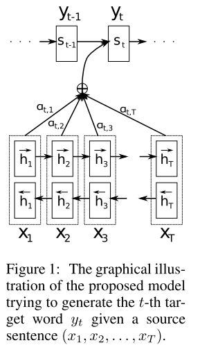

[TOC]

# Introduction

This [post](http://ruder.io/deep-learning-nlp-best-practices/) is a collection of best practices for using neural networks in Natural Language Processing. It will be updated periodically as new insights become available and in order to keep track of our evolving understanding of Deep Learning for NLP.

There has been a [running joke](https://twitter.com/IAugenstein/status/710837374473920512) in the NLP community that an LSTM with attention will yield state-of-the-art performance on any task. While this has been true over the course of the last two years, the NLP community is slowly moving away from this now standard baseline and towards more interesting models. However, we as a community do not want to spend the next two years independently (re-)discovering the *next* LSTM with attention. We do not want to reinvent tricks or methods that have already been shown to work. While many existing Deep Learning libraries already encode best practices for working with neural networks in general, such as initialization schemes, many other details, particularly task or domain-specific considerations, are left to the practitioner. The main goal of this article is to get you up to speed with the relevant best practices so you can make meaningful contributions as soon as possible.

This post is not meant to keep track of the state-of-the-art, but rather to collect best practices that are relevant for a wide range of tasks. In other words, rather than describing one particular architecture, this post aims to collect the features that underly successful architectures. While many of these features will be most useful for pushing the state-of-the-art, I hope that wider knowledge of them will lead to stronger evaluations, more meaningful comparison to baselines, and inspiration by shaping our intuition of what works.

# Best practices

## Word embeddings

Word embeddings are arguably the most widely known best practice in the recent history of NLP. It is well-known that using pre-trained embeddings helps (Kim, 2014).

The optimal dimensionality of word embeddings is mostly task-dependent: a smaller dimensionality works better for more **syntactic tasks** such as named entity recognition (Melamud et al., 2016) or part-of-speech (POS) tagging (Plank et al., 2016), while a larger dimensionality is more useful for more **semantic tasks** such as sentiment analysis (Ruder et al., 2016).

## Depth of Networks

While we will not reach the depths of computer vision for a while, neural networks in NLP have become progressively deeper. State-of-the-art approaches now regularly use deep Bi-LSTMs, typically consisting of 3-4 layers, e.g. for POS tagging (Plank et al., 2016) and semantic role labelling (He et al., 2017). Models for some tasks can be even deeper, cf. Google's NMT model with 8 encoder and 8 decoder layers (Wu et al., 2016). In most cases, however, performance improvements of making the model deeper than 2 layers are minimal (Reimers & Gurevych, 2017).

These observations hold for most sequence tagging and structured prediction problems. For classification, deep or very deep models perform well only with character-level input and shallow word-level models are still the state-of-the-art (Zhang et al., 2015; Conneau et al., 2016; Le et al., 2017).

## Layer connections

For training deep neural networks, some tricks are essential to avoid the [vanishing gradient problem](https://en.wikipedia.org/wiki/Vanishing_gradient_problem). Different layers and connections have been proposed. Here, we will discuss three:

- highway layers
- residual connections
- dense connections

### Highway layers

Highway layers (Srivastava et al., 2015) are inspired by the gates of an LSTM. 

First let us assume a one-layer MLP, which applies an affine transformation followed by a non-linearity $g$ to its input $x$:
$$
\mathbf{h} = g(\mathbf{W}\mathbf{x} + \mathbf{b})
$$
A highway layer then computes the following function instead:
$$
\mathbf{h} = \mathbf{t} \odot g(\mathbf{W} \mathbf{x} + \mathbf{b}) + (1-\mathbf{t}) \odot \mathbf{x}
$$
where $\mathbf{t} = \sigma(\mathbf{W}_T \mathbf{x} + \mathbf{b}_T)$ is called the **transform gate**, and $(1-\mathbf{t})$ is called the **carry gate**. As we can see, highway layers are similar to the gates of an LSTM in that they adaptively *carry* some dimensions of the input directly to the output.

Highway layers have been used pre-dominantly to achieve state-of-the-art results for language modelling (Kim et al., 2016; Jozefowicz et al., 2016; Zilly et al., 2017), but have also been used for other tasks such as speech recognition (Zhang et al., 2016). [Sristava's page](http://people.idsia.ch/~rupesh/very_deep_learning/) contains more information and code regarding highway layers.

### Residual connections

Residual connections (He et al., 2016) have been first proposed for computer vision and were the main factor for winning ImageNet 2016. Residual connections are even more straightforward than highway layers and learn the following function:
$$
\mathbf{h} = g(\mathbf{W}\mathbf{x} + \mathbf{b}) + \mathbf{x}
$$
which simply adds the input of the current layer to its output via a short-cut connection. This simple modification mitigates the vanishing gradient problem, as the model can default to using the identity function if the layer is not beneficial.

### Dense connections

Rather than just adding layers from each layer to the next, dense connections (Huang et al., 2017) (best paper award at CVPR 2017) add direct connections from each layer to all subsequent layers. Dense connections then feed the concatenated output from all previous layers as input to the current layer:
$$
\mathbf{h}^l = g(\mathbf{W}[\mathbf{x}^1; \ldots; \mathbf{x}^l] + \mathbf{b})
$$
Dense connections have been successfully used in computer vision. They have also found to be useful for Multi-Task Learning of different NLP tasks (Ruder et al., 2017), while a residual variant that uses summation has been shown to consistently outperform residual connections for neural machine translation (Britz et al., 2017).

## Dropout regularizer

While **batch normalization** in computer vision has made other regularizers obsolete in most applications, dropout (Srivasta et al., 2014) is still the go-to regularizer for deep neural networks in NLP. A dropout rate of 0.5 has been shown to be effective in most scenarios (Kim, 2014). 

In recent years, variations of dropout such as adaptive (Ba & Frey, 2013) and evolutional dropout (Li et al., 2016) have been proposed, but none of these have found wide adoption in the community. The main problem hindering dropout in NLP has been that it could not be applied to recurrent connections, as the aggregating dropout masks would effectively zero out embeddings over time.

**Recurrent dropout** (Gal & Ghahramani, 2016) addresses this issue by applying the same dropout mask across timesteps at layer $l$. This avoids amplifying the dropout noise along the sequence and leads to effective regularization for sequence models. Recurrent dropout has been used for instance to achieve state-of-the-art results in semantic role labelling (He et al., 2017) and language modelling (Melis et al., 2017).

## Multi-task learning

If additional data is available, multi-task learning (MTL) can often be used to improve performance on the target task.

### Auxiliary objectives

We can often find auxiliary objectives that are useful for the task we care about (Ruder, 2017). While we can already predict surrounding words in order to pre-train word embeddings (Mikolov et al., 2013), we can also use this as an auxiliary objective during training (Rei, 2017). A similar objective has also been used by (Ramachandran et al., 2016) for sequence-to-sequence models.

### Task-specific layers

While the standard approach to MTL for NLP is hard parameter sharing, it is beneficial to allow the model to learn task-specific layers. This can be done by placing the output layer of one task at a lower level (Søgaard & Goldberg, 2016). Another way is to induce private and shared subspaces (Liu et al., 2017; Ruder et al., 2017).

## Attention

Attention is most commonly used in sequence-to-sequence models to attend to encoder states, but can also be used in any sequence model to look back at past states. 

The context vector $\mathbf{c}_i$ at position is calculated as an average of the input hidden states weighted with the attention scores $\mathbf{a}_i$:
$$
\mathbf{c}_i = \sum_j \mathbf{a}_{ij} \mathbf{h}_j \\

\mathbf{a}_{ij} = \frac {\exp(f_{att}(\mathbf{s}_{i-1}, \mathbf{h}_j))} {\sum_k \exp(f_{att}(\mathbf{s}_{i-1}, \mathbf{h}_k))}
$$
where $\mathbf{h}_j$ is the $j$-th time step hidden state.

Then we use the context vector $\mathbf{c}_i$ together with $\mathbf{y}_{i-1}$ and the output hidden state $\mathbf{s}_{i-1}$ to get the next hidden state $\mathbf{s}_i$:
$$
\mathbf{s}_i = f(\mathbf{y}_{i-1}, \mathbf{s}_{i-1}, \mathbf{c}_i)
$$
The attention function $f_{att}(\mathbf{s}_{i-1}, \mathbf{h}_j)$ calculates an unnormalized alignment score between the current output hidden state $\mathbf{s}_{i-1}$ and the input hidden state $\mathbf{h}_j$. In the following, we will discuss four attention variants: i) additive attention, ii) multiplicative attention, iii) self-attention, and iv) key-value attention.

Attention cannot only be used to attend to encoder or previous hidden states, but also to obtain a distribution over other features, such as the word embeddings of a text as used for reading comprehension (Kadlec et al., 2017). However, attention is not directly applicable to classification tasks that do not require additional information, such as sentiment analysis. In such models, the final hidden state of an LSTM or an aggregation function such as max pooling or averaging is often used to obtain a sentence representation.

### Additive attention

The original attention mechanism (Bahdanau et al., 2015) uses a one-hidden layer feed-forward network to calculate the attention alignment:
$$
f_{att}(\mathbf{s}_{i-1}, \mathbf{h}_j) = \mathbf{v}_a{}^\top \text{tanh}(\mathbf{W}_1 \mathbf{s}_{i-1} + \mathbf{W}_2 \mathbf{h}_j)
$$

### Multiplicative attention

Multiplicative attention (Luong et al., 2015) simplifies the attention operation by calculating the following function:
$$
f_{att}(\mathbf{s}_{i-1}, \mathbf{h}_j) = \mathbf{s}_{i-1}^\top \mathbf{W}_a \mathbf{h}_j
$$
Additive and multiplicative attention are similar in complexity, although multiplicative attention is faster and more space-efficient in practice as it can be implemented more efficiently using matrix multiplication. Both variants perform similar for small dimensionality $d_h$ of the decoder states, but additive attention performs better for larger dimensions. One way to mitigate this is to scale $f_{att}(\mathbf{s}_{i-1}, \mathbf{h}_j)$ by $1 / \sqrt{d_h}$ (Vaswani et al., 2017).

### Self-attention

Without any additional information, however, we can still extract relevant aspects from the sentence by allowing it to attend to itself using self-attention (Lin et al., 2017). Self-attention, also called intra-attention has been used successfully in a variety of tasks including reading comprehension (Cheng et al., 2016), textual entailment (Parikh et al., 2016), and abstractive summarization (Paulus et al., 2017).

We can simplify additive attention to compute the unnormalized alignment score for each hidden state:
$$
f_{att}(\mathbf{s}_{i-1}) = \mathbf{v}_a{}^\top \text{tanh}(\mathbf{W}_a \mathbf{s}_{i-1})
$$

### Key-value attention

Finally, key-value attention (Daniluk et al., 2017) is a recent attention variant that separates form from function by keeping separate vectors for the attention calculation. It has also been found useful for different document modelling tasks (Liu & Lapata, 2017).

Specifically, key-value attention splits each hidden vector $\mathbf{s}_{i-1}$ into a key $\mathbf{k}_{i-1}$ and a value $\mathbf{v}_{i-1}$. The keys are used for calculating the attention distribution $\mathbf{a}_{i}$ using additive attention. The values are then used to obtain the context representation $c_i$.

## Optimization

The optimization algorithm and scheme is often one of the parts of the model that is used as-is and treated as a black-box. Sometimes, even slight changes to the algorithm, e.g. reducing the $\beta_2$ value in Adam (Dozat & Manning, 2017) can make a large difference to the optimization behaviour.

**Adam** (Kingma & Ba, 2015) is one of the most popular and widely used optimization algorithms and often the go-to optimizer for NLP researchers. It is often thought that Adam clearly outperforms vanilla stochastic gradient descent (SGD). However, while it converges much faster than SGD, it has been observed that **SGD with learning rate annealing** slightly outperforms Adam (Wu et al., 2016). Recent work furthermore shows that **SGD with properly tuned momentum** outperforms Adam (Zhang et al., 2017).

While Adam internally tunes the learning rate for every parameter (Ruder, 2016), we can explicitly use SGD-style annealing with Adam. In particular, we can perform learning rate annealing with restarts: We set a learning rate and train the model until convergence. We then halve the learning rate and restart by loading the previous best model. In Adam's case, this causes the optimizer to forget its per-parameter learning rates and start fresh. Denkowski & Neubig (2017), show that Adam with 2 restarts and learning rate annealing is faster and performs better than SGD with annealing.

## Ensembling

Combining multiple models into an ensemble by averaging their predictions is a proven strategy to improve model performance. While predicting with an ensemble is expensive at test time, recent advances in distillation allow us to compress an expensive ensemble into a much smaller model (Hinton et al., 2015; Kuncoro et al., 2016; Kim & Rush, 2016).

Ensembling is an important way to ensure that results are still reliable if the diversity of the evaluated models increases (Denkowski & Neubig, 2017). While ensembling different checkpoints of a model has been shown to be effective (Jean et al., 2015; Sennrich et al., 2016), it comes at the cost of model diversity. Cyclical learning rates can help to mitigate this effect (Huang et al., 2017). However, if resources are available, we prefer to ensemble multiple independently trained models to maximize model diversity.

## Hyperparameter optimization

Rather than pre-defining or using off-the-shelf hyperparameters, simply tuning the hyperparameters of our model can yield significant improvements over baselines. Recent advances in Bayesian Optimization have made it an ideal tool for the black-box optimization of hyperparameters in neural networks (Snoek et al., 2012) and far more efficient than the widely used grid search. Automatic tuning of hyperparameters of an LSTM has led to state-of-the-art results in language modeling, outperforming models that are far more complex (Melis et al., 2017).

## LSTM Tricks

### Learning the initial state   

We generally initialize the initial LSTM states with a zero vector. Instead of fixing the initial state, we can learn it like any other parameter, which can improve performance and is also [recommended by Hinton](https://www.cs.toronto.edu/~hinton/csc2535/notes/lec10new.pdf). Refer to [this blog post](https://r2rt.com/non-zero-initial-states-for-recurrent-neural-networks.html) for a Tensorflow implementation.

### Tying input and output embeddings

Input and output embeddings account for the largest number of parameters in the LSTM model. If the LSTM predicts words as in language modelling, input and output parameters can be shared (Inan et al., 2016; Press & Wolf, 2017). This is particularly useful on small datasets that do not allow to learn a large number of parameters.

### Gradient norm clipping

One way to decrease the risk of exploding gradients is to clip their maximum value (Mikolov, 2012). This, however, does not improve performance consistently (Reimers & Gurevych, 2017). Rather than clipping each gradient independently, clipping the global norm of the gradient (Pascanu et al., 2013) yields more significant improvements (a Tensorflow implementation can be found [here](https://stackoverflow.com/questions/36498127/how-to-effectively-apply-gradient-clipping-in-tensor-flow)).

### Down-projection

To reduce the number of output parameters further, the hidden state of the LSTM can be projected to a smaller size. This is useful particularly for tasks with a large number of outputs, such as language modelling (Melis et al., 2017).

# Best practices for specific tasks

In the following, we will discuss task-specific best practices. Most of these perform best for a particular type of task. Some of them might still be applied to other tasks, but should be validated before. We will discuss the following tasks: classification, sequence labelling, natural language generation (NLG), and -- as a special case of NLG -- neural machine translation.

## Classification using CNNs

More so than for sequence tasks, where CNNs have only recently found application due to more efficient convolutional operations, CNNs have been popular for classification tasks in NLP. The following best practices relate to CNNs and capture some of their optimal hyperparameter choices.

**CNN filters**   Combining filter sizes near the optimal filter size, e.g. (3,4,5) performs best (Kim, 2014; Kim et al., 2016). The optimal number of feature maps is in the range of 50-600 (Zhang & Wallace, 2015).

**Aggregation function**   1-max-pooling outperforms average-pooling and  k-max pooling (Zhang & Wallace, 2015).

## Sequence labelling

Sequence labelling is ubiquitous in NLP. While many of the existing best practices are with regard to a particular part of the model architecture, the following guidelines discuss choices for the model's output and prediction stage.

**Tagging scheme**   For some tasks, which can assign labels to segments of texts, different tagging schemes are possible. These are: *BIO*, which marks the first token in a segment with a *B-* tag, all remaining tokens in the span with an *I-* tag, and tokens outside of segments with an *O-* tag; *IOB*, which is similar to BIO, but only uses *B-* if the previous token is of the same class but not part of the segment; and *IOBES*, which in addition distinguishes between single-token entities (*S-*) and the last token in a segment (*E-*). Using IOBES and BIO yield similar performance (Lample et al., 2017)

**CRF output layer**   If there are any dependencies between outputs, such as in named entity recognition the final softmax layer can be replaced with a linear-chain conditional random field (CRF). This has been shown to yield consistent improvements for tasks that require the modelling of constraints (Huang et al., 2015; Max & Hovy, 2016; Lample et al., 2016)

**Constrained decoding**   Rather than using a CRF output layer, constrained decoding can be used as an alternative approach to reject erroneous sequences, i.e. such that do not produce valid BIO transitions (He et al., 2017). Constrained decoding has the advantage that arbitrary constraints can be enforced this way, e.g. task-specific or syntactic constraints.

## Natural language generation/modelling

Most of the existing best practices can be applied to natural language generation (NLG). In fact, many of the tips presented so far stem from advances in language modelling, the most prototypical NLP task.

**Modelling coverage**   Repetition is a big problem in many NLG tasks as current models do not have a good way of remembering what outputs they already produced. Modelling coverage explicitly in the model is a good way of addressing this issue. A checklist can be used if it is known in advances, which entities should be mentioned in the output, e.g. ingredients in recipes (Kiddon et al., 2016). If attention is used, we can keep track of a coverage vector $\mathbf{c}_i$, which is the sum of attention distributions $a_t$ over previous time steps (Tu et al., 2016; See et al., 2017). The coverage vector captures how much attention we have paid to all words in the source. We can now condition additive attention additionally on this coverage vector in order to encourage our model not to attend to the same words repeatedly:
$$
f_{att}(\mathbf{s}_{i-1}, \mathbf{h}_j, \mathbf{c}_{i-1}) = \mathbf{v}_a{}^\top \text{tanh}(\mathbf{W}_1 \mathbf{s}_{i-1} + \mathbf{W}_2 \mathbf{h}_j + \mathbf{W}_3 \mathbf{c}_{i-1})
$$
In addition, we can add an auxiliary loss that captures the task-specific attention behaviour that we would like to elicit: For NMT, we would like to have a roughly one-to-one alignment; we thus penalize the model if the final coverage vector is more or less than one at every index (Tu et al., 2016). For summarization, we only want to penalize the model if it repeatedly attends to the same location (See et al., 2017).

## Neural machine translation

While neural machine translation (NMT) is an instance of NLG, NMT receives so much attention that many methods have been developed specifically for the task. Similarly, many best practices or hyperparameter choices apply exclusively to it.

**Embedding dimensionality**   2048-dimensional embeddings yield the best performance, but only do so by a small margin. Even 128-dimensional embeddings perform surprisingly well and converge almost twice as quickly (Britz et al., 2017).

**Encoder and decoder depth**   The encoder does not need to be deeper than 2−4 layers. Deeper models outperform shallower ones, but more than 4 layers is not necessary for the decoder (Britz et al., 2017).

**Directionality**   Bidirectional encoders outperform unidirectional ones by a small margin. Sutskever et al., (2014) proposed to reverse the source sequence to reduce the number of long-term dependencies. Reversing the source sequence in unidirectional encoders outperforms its non-reversed counter-part (Britz et al., 2017).

**Beam search strategy**   Medium beam sizes around 10 with length normalization penalty of 1.0 (Wu et al., 2016) yield the best performance (Britz et al., 2017).

**Sub-word translation**   Senrich et al. (2016) proposed to split words into sub-words based on a byte-pair encoding (BPE). BPE iteratively merges frequent symbol pairs, which eventually results in frequent character n-grams being merged into a single symbol, thereby effectively eliminating out-of-vocabulary-words. While it was originally meant to handle rare words, a model with sub-word units outperforms full-word systems across the board, with 32,000 being an effective vocabulary size for sub-word units (Denkowski & Neubig, 2017).

