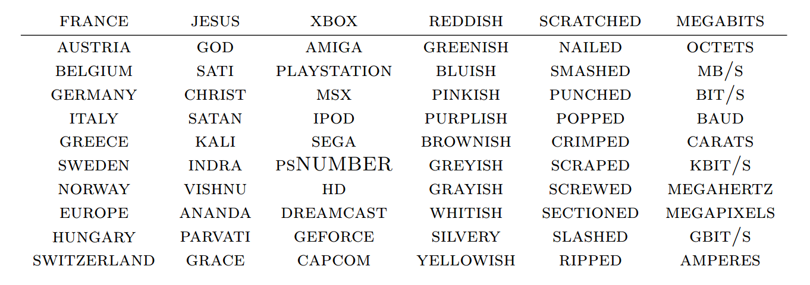

Blog URL: http://colah.github.io/posts/2014-07-NLP-RNNs-Representations/

[TOC]

# Introduction

In the last few years, deep neural networks have dominated pattern recognition. This post reviews some extremely remarkable results in applying deep neural networks to natural language processing (NLP).

# Neural Networks Universality

A neural network with a single hidden layer has **universality**: given enough hidden units, it can approximate any function. It’s true, essentially, because the hidden layer can be used as a lookup table.

For example, let’s consider a perceptron network. A [perceptron](http://en.wikipedia.org/wiki/Perceptron) is a very simple neuron that fires if it exceeds a certain threshold and doesn’t fire if it doesn’t reach that threshold. A perceptron network gets binary (0 and 1) inputs and gives binary outputs.

Note that there are only a finite number of possible inputs. For each possible input, we can construct a neuron in the hidden layer that fires for that input, and only on that specific input. Then we can use the connections between that neuron and the output neurons to control the output in that specific case. And so, it’s true that one hidden layer neural networks are universal.

Universality means that a network can fit to any training data you give it. It doesn’t mean that it will interpolate to new data points in a reasonable way. No, universality isn’t an explanation for why neural networks work so well.

# Word Embeddings

**Word embeddings** were originally developed in ([Bengio et al, 2001](http://www.iro.umontreal.ca/~lisa/publications2/index.php/publications/show/64); [Bengio et al, 2003](http://machinelearning.wustl.edu/mlpapers/paper_files/BengioDVJ03.pdf)), a few years before the 2006 deep learning renewal, at a time when neural networks were out of fashion. The idea of **distributed representations** for symbols is even older, e.g. ([Hinton 1986](http://www.cogsci.ucsd.edu/~ajyu/Teaching/Cogs202_sp13/Readings/hinton86.pdf)).

A word embedding $W: \mathrm{words} \to \mathbb{R}^n$ is a paramaterized function mapping words in some language to high-dimensional vectors. $W$ is initialized to have random vectors for each word. It learns to have meaningful vectors in order to perform some task.

## Learn word embeddings

For example, one task we might train a network for is predicting whether a 5-gram (sequence of five words) is ‘valid.’ We can easily get lots of 5-grams from Wikipedia (eg. “cat sat on the mat”) and then ‘break’ half of them by switching a word with a random word (eg. “cat sat *song* the mat”), since that will almost certainly make our 5-gram nonsensical. The model we train will run each word in the 5-gram through $W$ to get a vector representing it and feed those into another ‘module’ called $R$ which tries to predict if the 5-gram is ‘valid’ or ‘broken.’ In order to predict these values accurately, the network needs to learn good parameters for both $W$ and $R$. (From [Bottou (2011)](http://arxiv.org/pdf/1102.1808v3.pdf))

Thus we can learn the word embedding $W$ through the above task. And we can also learn it by several other tasks – another common one is predicting the next word in the sentence. 

## Visualize word embeddings

One thing we can do to get a feel for the word embedding space is to visualize them with [t-SNE](http://homepage.tudelft.nl/19j49/t-SNE.html), a sophisticated technique for visualizing high-dimensional data. This kind of ‘map’ of words makes a lot of intuitive sense to us. Similar words are close together. (From [Turian *et al.* (2010)](http://www.iro.umontreal.ca/~lisa/pointeurs/turian-wordrepresentations-acl10.pdf))

Another way to get at this is to look at which words are closest in the embedding to a given word. Again, the words tend to be quite similar. (From [Collobert *et al.* (2011)](http://arxiv.org/pdf/1103.0398v1.pdf))

We can conclude that *words with similar meanings have similar vectors* from above pictures.

## The power of word embeddings

### Better generalization for unseen sentences

It seems natural for a network to make words with similar meanings have similar vectors. If you switch a word for a synonym (eg. “a few people sing well” $\to$ “a *couple* people sing well”), the validity of the sentence doesn’t change. While, from a naive perspective, the input sentence has changed a lot, if $W$ maps synonyms (like “few” and “couple”) close together, from $R$’s perspective little changes.

This is very powerful. The number of possible 5-grams is massive and we have a comparatively small number of data points to try to learn from. *Similar words being close together allows us to generalize from one sentence to a class of similar sentences*. This doesn’t just mean switching a word for a synonym, but also switching a word for a word in a similar class (eg. “the wall is blue” $\to$ “the wall is *red*”). Further, we can change multiple words (eg. “the wall is blue” $\to$ “the *ceiling* is *red*”).

It seems quite likely that there are lots of situations where it has seen a sentence like “the wall is blue” and know that it is valid before it sees a sentence like “the wall is red”. We still need to see examples of every word being used, but the analogies allow us to generalize to new combinations of words. You’ve seen all the words that you understand before, but you haven’t seen all the sentences that you understand before. So too with neural networks.

### Analogies encoded with difference vector

Word embeddings exhibit an even more remarkable property: analogies between words seem to be encoded in the difference vectors between words. For example, there seems to be a constant male-female difference vector: (From [Mikolov *et al.*(2013a)](https://www.aclweb.org/anthology/N/N13/N13-1090.pdf))

$$
W(``\text{woman}\!") - W(``\text{man}\!") ~\simeq~ W(``\text{aunt}\!") - W(``\text{uncle}\!") ~\simeq~ W(``\text{queen}\!") - W(``\text{king}\!")
$$
It turns out, though, that much more sophisticated relationships are also encoded in this way. (From [Mikolov *et al.* (2013b)](http://arxiv.org/pdf/1301.3781.pdf))

It’s important to appreciate that all of these properties of $W$ are *side effects*. We didn’t try to have similar words be close together. We didn’t try to have analogies encoded with difference vectors. All we tried to do was perform a simple task, like predicting whether a sentence was valid. These properties more or less popped out of the optimization process.

This seems to be a great strength of neural networks: they learn better ways to represent data, automatically. Representing data well, in turn, seems to be essential to success at many machine learning problems. Word embeddings are just a particularly striking example of learning a representation.

# Shared Representations

## Transfer learning

We learned the word embedding in order to do well on a simple task, but based on the nice properties we’ve observed in word embeddings, you may suspect that they could be generally useful in NLP tasks. In fact, word representations like these are extremely important:

> The use of word representations… has become a key “secret sauce” for the success of many NLP systems in recent years, across tasks including named entity recognition, part-of-speech tagging, parsing, and semantic role labeling. ([Luong *et al.* (2013)](http://nlp.stanford.edu/~lmthang/data/papers/conll13_morpho.pdf))

This general tactic – learning a good representation on a task A and then using it on a task B – is one of the major tricks in the Deep Learning toolbox. It goes by different names depending on the details: pretraining, transfer learning, and multi-task learning. One of the great strengths of this approach is that it allows the representation to learn from more than one kind of data.

For example, $W$ and $F$ learn to perform task A. Later, $G$ can learn to perform B based on $W$:

## Shared embeddings

There’s a counterpart to the transfer learning. Instead of learning a way to represent one kind of data and using it to perform multiple kinds of tasks, we can learn a way to map multiple kinds of data into a single representation!

### Bilingual words with shared representations

One nice example of this is a bilingual word-embedding, produced in [Socher *et al.* (2013a)](http://ai.stanford.edu/~wzou/emnlp2013_ZouSocherCerManning.pdf). We can learn to embed words from two different languages in a single, shared space. In this case, we learn to embed English and Mandarin Chinese words in the same space:

Of course, we observe that the words we knew had similar meanings end up close together. More interesting is that words we *didn’t know* were translations end up close together. Intuitively, it feels a bit like the two languages have a similar ‘shape’ and that by forcing them to line up at different points, they overlap and other points get pulled into the right positions. (t-SNE visualization of the bilingual word embedding from [Socher *et al.* (2013a)](http://ai.stanford.edu/~wzou/emnlp2013_ZouSocherCerManning.pdf))

### Images and words with shared reprensentations

In bilingual word embeddings, we learn a shared representation for two very similar kinds of data. But we can also learn to embed very different kinds of data in the same space. Recently, deep learning has begun exploring models that embed images and words in a single representation.

The basic idea is that one classifies images by outputting a vector in a word embedding. Images of dogs are mapped near the “dog” word vector. Images of horses are mapped near the “horse” vector. Images of automobiles near the “automobile” vector. And so on. The interesting part is what happens when you test the model on new classes of images. For example, if the model wasn’t trained to classify cats – that is, to map them near the “cat” vector – what happens when we try to classify images of cats? (From ([Socher *et al.* (2013b)](http://nlp.stanford.edu/~socherr/SocherGanjooManningNg_NIPS2013.pdf)))

It turns out that the network is able to handle these new classes of images quite reasonably. Images of cats aren’t mapped to random points in the word embedding space. Instead, they tend to be mapped to the general vicinity of the “dog” vector, and, in fact, close to the “cat” vector. Similarly, the truck images end up relatively close to the “truck” vector, which is near the related “automobile” vector.

This was done by members of the Stanford group with only 8 known classes (and 2 unknown classes). The Google group did a much larger version – instead of 8 categories, they used 1,000 – around the same time ([Frome *et al.* (2013)](http://static.googleusercontent.com/media/research.google.com/en//pubs/archive/41473.pdf)) and has followed up with a new variation ([Norouzi *et al.*(2014)](http://arxiv.org/pdf/1312.5650.pdf)). Both are based on a very powerful image classification model (from [Krizehvsky *et al.*(2012)](http://www.cs.toronto.edu/~fritz/absps/imagenet.pdf)), but embed images into the word embedding space in different ways.

The results are impressive. While they may not get images of unknown classes to the precise vector representing that class, they are able to get to the right neighborhood. So, if you ask it to classify images of unknown classes and the classes are fairly different, it can distinguish between the different classes.

Even though I’ve never seen a Aesculapian snake or an Armadillo before, if you show me a picture of one and a picture of the other, I can tell you which is which because I have a general idea of what sort of animal is associated with each word. These networks can accomplish the same thing.

# Recursive Neural Networks

## Sequence representations

In the above example, we use a network to predict if the 5-gram is ‘valid’ or ‘broken.’ The network is composed of $W$ and $R$, we call this type of networks as **modular networks**, in which we have two modules $W$ and $R$. Those networks have an unfortunate limitation: they can only have a fixed number of inputs. We can overcome this by adding an *association module*, $A$, which will take two word or phrase representations and merge them as follows (From [Bottou (2011)](http://arxiv.org/pdf/1102.1808v3.pdf)):

By merging sequences of words, $A$ takes us from representing words to representing phrases or even representing whole *sentences*! And because we can merge together different numbers of words, we don’t have to have a fixed number of inputs.

In order to make representations meaningful, we should merge together words in a special order. For example, if one considers the phrase “the cat sat on the mat”, it can naturally be bracketed into segments: “((the cat) (sat (on (the mat))))”. We can apply $A$ based on this bracketing:

These models are often called **recursive neural networks** (**RecNN**) because one often has the output of a module go into a module of the same type. They are also sometimes called **tree-structured neural networks**.

Recursive neural networks have had significant successes in a number of NLP tasks. For example, [Socher *et al.* (2013c)](http://nlp.stanford.edu/~socherr/EMNLP2013_RNTN.pdf) uses a recursive neural network to predict sentence sentiment:

## Reversible sequence representations

One major goal has been to create a *reversible* sentence representation, a representation that one can reconstruct an actual sentence from, with roughly the same meaning. For example, we can try to introduce a **disassociation module**, $D$, that tries to undo $A$ (From [Bottou (2011)](http://arxiv.org/pdf/1102.1808v3.pdf)):

If we could accomplish such a thing, it would be an extremely powerful tool. For example, we could try to make a bilingual sentence representation and use it for **machine translation**. Unfortunately, this turns out to be very difficult. Very very difficult. And given the tremendous promise, there are lots of people working on it.

Recently, [Cho *et al.* (2014)](http://arxiv.org/pdf/1406.1078v1.pdf) have made some progress on representing phrases, with a model that can encode English phrases and decode them in French.

# Conclusion

The **representation perspective** of deep learning is a powerful view that seems to answer why deep neural networks are so effective. Beyond that, I think there’s something extremely beautiful about it: why are neural networks effective? Because better ways of representing data can pop out of optimizing layered models.

