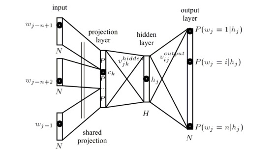
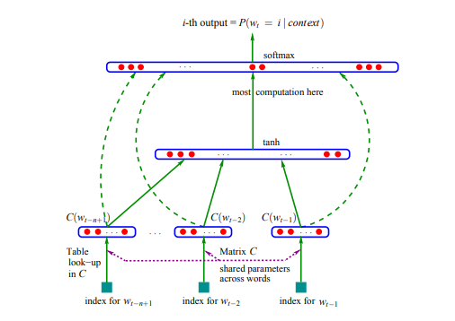
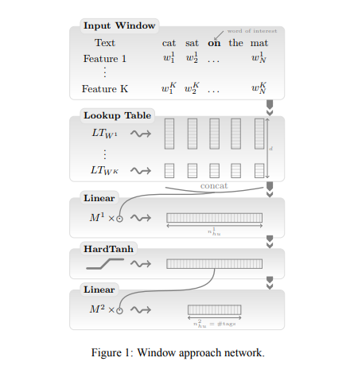
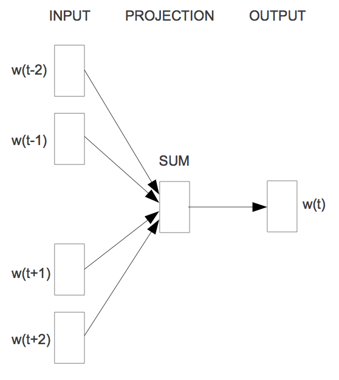
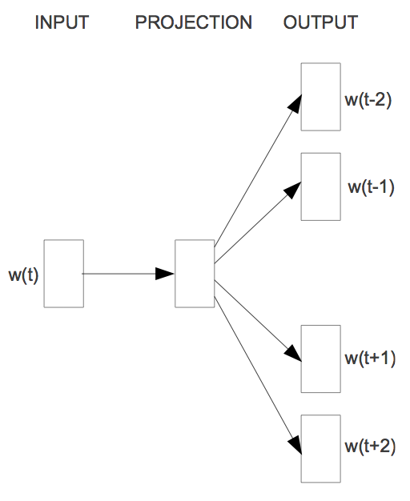

[TOC]

# Introduction

This post presents the most well-known models for learning word embeddings based on language modelling.

Unsupervisedly learned word embeddings have been exceptionally successful in many NLP tasks and are frequently seen as something akin to a *silver bullet*. In fact, in many NLP architectures, they have almost completely replaced traditional distributional features such as **Brown clusters** and **LSA** features.

Semantic relations between word embeddings seem nothing short of magical to the uninitiated and Deep Learning NLP talks frequently prelude with the notorious \(king - man + woman \approx queen \) slide, while [a recent article](http://cacm.acm.org/magazines/2016/3/198856-deep-or-shallow-nlp-is-breaking-out/fulltext) in *Communications of the ACM* hails word embeddings as the primary reason for NLP's breakout.

In the following we will use the currently prevalent term **word embeddings** to refer to **dense representations** of words in a low-dimensional vector space. Interchangeable terms are **word vectors** and **distributed representations**. We will particularly focus on **neural word embeddings**, i.e. word embeddings learned by a neural network.

# History

Since the 1990s, vector space models have been used in distributional semantics. During this time, many models for estimating continuous representations of words have been developed, including **Latent Semantic Analysis** (LSA) and **Latent Dirichlet Allocation** (LDA). Have a look at [this blog post](https://www.gavagai.se/blog/2015/09/30/a-brief-history-of-word-embeddings/) for a more detailed overview of distributional semantics history in the context of word embeddings.

[Bengio et al. in 2003](http://www.jmlr.org/papers/volume3/bengio03a/bengio03a.pdf) coin the term word embeddings and train them in a neural language model jointly with the model's parameters. First to show the utility of pre-trained word embeddings were arguably [Collobert and Weston in 2008](https://dl.acm.org/citation.cfm?id=1390177). Their landmark paper **A unified architecture for natural language processing** not only establishes word embeddings as a useful tool for *downstream tasks*, but also introduces a neural network architecture that forms the foundation for many current approaches. However, the eventual popularization of word embeddings can be attributed to [Mikolov et al. in 2013](https://papers.nips.cc/paper/5021-distributed-representations-of-words-and-phrases-and-their-compositionality.pdf) who created **word2vec**, a toolkit that allows the seamless training and use of pre-trained embeddings. [Pennington et al. in 2014](https://www.aclweb.org/anthology/D14-1162) released **GloVe**, a competitive set of pre-trained word embeddings, signalling that word embeddings had reached the main stream.

Word embeddings are one of the few currently successful applications of unsupervised learning. Their main benefit arguably is that they don't require expensive annotation, but can be derived from large unannotated corpora that are readily available. Pre-trained embeddings can then be used in downstream tasks that use small amounts of labeled data.

# Word embedding models

Naturally, every *regular feed-forward neural network* that takes words from a vocabulary as input and embeds them as vectors into a lower dimensional space, which it then fine-tunes through back-propagation, necessarily yields word embeddings as the weights of the first layer, which is usually referred to as *Embedding Layer*. But generating word embeddings with a very deep architecture is simply too computationally expensive for a large vocabulary.

The main difference between the above networks that produces word embeddings as a by-product and a method such as *word2vec* or *GloVe* whose explicit goal is the generation of word embeddings is its **computational complexity**. This is the main reason why it took until 2013 for word embeddings to explode onto the NLP stage.

Another difference is the **training objective**: *word2vec* and *GloVe* are geared towards producing word embeddings that encode general **semantic relationships**, which are beneficial to many downstream tasks; notably, word embeddings trained this way won't be helpful in tasks that do not rely on these kind of relationships. Note that a task that relies on semantically coherent representations such as language modelling will produce similar embeddings to *word2vec* and *GloVe* models.

As a side-note, *word2vec* and *Glove* might be said to be to NLP what *VGGNet* is to CV (computer vision), i.e. a common weight initialisation that provides generally helpful features without the need for lengthy training.

To facilitate comparison between models, we assume the following notational standards: We assume a training corpus containing a sequence of $T$ training words $w_1, w_2, w_3, \cdots, w_T$ that belong to a vocabulary $V$ whose size is $|V|$. Our models generally consider a context of $n$ words. We associate every word with an input embedding $v_w$ (the eponymous word embedding in the Embedding Layer) with $d$ dimensions and an output embedding $v'_w$ (the representation of the word in the weight matrix of the softmax layer). We finally optimize an objective function $J_{\theta}$ with regard to our model parameters $\theta$ and our model outputs some score $f_{\theta}(x)$ for every input $x$.

# Language Models

Word embedding models are quite closely intertwined with language models. In fact, many state-of-the-art word embedding models try to predict the next word in a sequence to some extent. Additionally, word embedding models are often evaluated using [perplexity](https://en.wikipedia.org/wiki/Perplexity), a cross-entropy based measure borrowed from language modelling.

## n-gram based language models

Language models generally try to compute the probability of a word $w_t$ given its previous words, i.e. $p(w_t | w_{t-1} , \cdots w_{1})$. The probability of the training corpus is:
$$
p(w_1,\dots,w_T)=\prod_t^T {p(w_t | w_{t-1}, \dots, w_1)}
$$
By applying the chain rule together with the Markov assumption, we can approximate the probability of train corpus by the product of the probabilities of each word given its $n-1$ previous words:
$$
p(w_1,\dots,w_T)=\prod_t^T {p(w_t | w_{t-1}, \dots, w_{t-n+1})}
$$
Yeh, it's a **n-gram** based language models. And the $p(w_t | w_{t-1}, \dots, w_{t-n+1})$ can be estimated by counting the relative frequency of n-gram in the training corpus:
$$
p(w_t | w_{t-1}, \dots, w_{t-n+1}) = \frac {count(w_{t-n+1}, \dots, w_{t-1}, w_t)} {count(w_{t-n+1}, \dots, w_{t-1})}
$$
Using some smooth tricks (e.g. Kneser-Ney smoothing), we can fight with the data sparsity in NLP and get better generalization.

## neural based language models

In neural networks, we achieve the same objective using the well-known softmax layer:
$$
p(w_t | w_{t-1}, \dots, w_{t-n+1}) = \frac {\exp(h^\top v'_{w_t})} {\sum_{w_i \in V} \exp(h^\top v'_{w_i})}
$$
where $h$ is the output vector of the second last layer; $v'_{w}$ is the output embedding of word $w$, i.e. its representation in the weight matrix of the softmax layer. Note that even though $v'_{w} $ represents the word $w$, it is learned separately from the input word embedding $v_{w}$.

Note that we need to calculate the probability of every word $w$ in the vocabulary $V$ at the output layer of the neural network. To do this efficiently, we perform a matrix multiplication between the vector $h$ and a weight matrix $W_{out}$ whose rows consist of $v'_{w}$ of all words $w$ in $V$, i.e. $a=W_{out}h$. We then feed the resulting vector $a$ with $d=|V|$ into the softmax, while the softmax layer "squashes" the vector to a probability distribution over the words in $V$. For large vocabulary $V$, the computational complexity is too high to be feasible.

Note here for the $h$ we only takes into account the $n$ previous words: In Bengio's neural language model, the the previous $n$ words will be feed into a feed-forward layer to get $h$; In LSTM based language model, the $n$ previous words will be encoded into the state $h$.

Using this softmax layer, the model tries to maximize the probability of predicting the correct word at every timestep $t$. The whole model thus tries to maximize the averaged log probability of the whole corpus:
$$
\begin{split}
J_\theta &= \frac{1}{T} \text{log} \space p(w_1 , \cdots , w_T) \\
	     &= \frac{1}{T} \sum_t^T {\text{log} \space p(w_t | w_{t-1}, \cdots , w_{t-n+1})}
\end{split}
$$

# Classic neural language model

The classic neural language model proposed by [Bengio et al. in 2003](http://www.jmlr.org/papers/volume3/bengio03a/bengio03a.pdf) consists of a one-hidden layer feed-forward neural network that predicts the next word.

Their model maximizes the prototypical neural language model objective, this is a **cross-entropy criterion** (we omit the regularization term for simplicity):
$$
J_\theta = \frac{1}{T} \sum_t^T {f_{\theta}(w_t, w_{t-1}, \cdots , w_{t-n+1})}
$$
where $f_{\theta}(w_t, w_{t-1}, \cdots , w_{t-n+1})$ is the output of the model, i.e. the probability $p(w_t | w_{t-1}, \cdots, w_{t-n+1})$ as computed by the softmax, where $n$ is the number of the previous words fed into the model.

Bengio et al. are one of the first to introduce what we now refer to as a word embedding. Their architecture forms very much the prototype upon which current approaches have gradually improved. The general building blocks of their model, however, are still found in all current neural language and word embedding models:

- **Embedding Layer**: a layer that generates word embeddings by multiplying an index vector with a word embedding matrix;
- **Intermediate Layer(s)**: one or more layers that produce an intermediate representation of the input, e.g. a fully-connected layer that applies a non-linearity to the concatenation of word embeddings of $n$ previous words;
- **Softmax Layer**: the final layer that produces a probability distribution over words in $V$.

Additionally, Bengio et al. identify two issues that lie at the heart of current state-of-the-art-models:

- They remark that "**Intermediate Layer(s)**" can be replaced by an **LSTM**, which is used by state-of-the-art neural language models, e.g. [Character-Aware Neural Language Models](https://arxiv.org/abs/1508.06615) and [Exploring the Limits of Language Modeling](https://arxiv.org/abs/1602.02410).
- They identify the final **softmax layer** (more precisely: the normalization term) as the network's main **bottleneck**, as the cost of computing the softmax is proportional to the number of words in $V$.

Finding ways to mitigate the **computational complexity** associated with computing the softmax over a large vocabulary is thus one of the key challenges both in *neural language models* as well as in *word embedding models*.

# The Collobert and Weston's language model

[Collobert and Weston in 2008](https://ronan.collobert.com/pub/matos/2008_nlp_icml.pdf) show that word embeddings trained on a sufficiently large dataset carry **syntactic and semantic meaning** and improve performance on *downstream tasks*. They elaborate upon this in their [2011 paper](https://arxiv.org/abs/1103.0398).

Their solution to avoid computing the expensive softmax is to use a different objective function: Instead of the cross-entropy criterion of Bengio et al., which maximizes the probability of the next word given the previous words, Collobert and Weston train a network to output a higher score $f_{\theta}$ for a correct word sequence $x$ than for an incorrect one $x^{(w)}$. For this purpose, they use a **pairwise ranking criterion**, which looks like this:
$$
J_\theta\ = \sum\limits_{x \in X} \sum\limits_{w \in V} \text{max} \lbrace 0, 1 - f_\theta(x) + f_\theta(x^{(w)}) \rbrace
$$
where $x$ is a window containing $n$ words sampled from the set of all possible windows $X$; For each window $x$, they then produce a corrupted, incorrect version $x^{(w)}$ by replacing $x$'s center word with another word $w$ from $V$. By minimizing the objective, the model will now learn to assign a score for the correct window that is higher than the score for the incorrect window by at least a margin of 1. 

The resulting language model produces embeddings that already possess many of the relations word embeddings have become known for, e.g. countries are clustered close together and syntactically similar words occupy similar locations in the vector space. 

While their ranking objective eliminates the complexity of the softmax, they keep the intermediate fully-connected hidden layer of Bengio et al. around (the HarTanh layer in the above picture), which constitutes another source of expensive computation.

# Word2Vec models

Let us now introduce arguably the most popular word embedding model, the model that launched a thousand word embedding papers: **word2vec**, the subject of two papers by [Mikolov et al. in 2013](http://papers.nips.cc/paper/5021-distributed-representations-of-words-and-phrases-and-their-compositionality.pdf).

Note: As word embeddings are a key building block of deep learning models for NLP, word2vec is often assumed to belong to deep learning. Technically however, *word2vec is not be considered to be part of deep learning, as its architecture is neither deep nor uses non-linearities* (in contrast to Bengio's model and the C&W model).

In their first paper, Mikolov et al. propose two architectures for learning word embeddings that are computationally less expensive than previous models (Bengio's model and the C&W model). In their second paper, they improve upon these models by employing additional strategies to enhance training speed and accuracy. There are two main benefits of word2vec models:

- They do away with the expensive hidden layer.
- They enable the language model to take additional context into account.

As we will later show, the success of their model is not only due to these changes, but especially due to certain training strategies.

Before go to the details of the two architectures introduced by Mikolov et al., let's consider a question: Is it necessary to use language models to learn word embeddings? While a language model is only able to look at the past words for its predictions, as it is evaluated on its ability to predict each next word in the corpus, a model that just aims to generate accurate word embeddings does not suffer from this restriction.

## CBOW

Mikolov et al. use both the $n$ words before and after the target word $w_t$ to predict it. They call this continuous bag-of-words (CBOW), as *it uses continuous representations whose order is of no importance*.

The objective function of CBOW in turn is only slightly different than the language model one:
$$
J_\theta = \frac{1}{T}\sum\limits_{t=1}^T\ \text{log} \space p(w_t | w_{t-n} , \cdots , w_{t-1}, w_{t+1}, \cdots , w_{t+n})
$$
Instead of feeding $n$ previous words into the model, the model receives a window of $n$ words around the target word $w_t$ at each time step $t$.

## Skip-gram

While CBOW can be seen as a precognitive language model, skip-gram turns the language model objective on its head: Instead of using the surrounding words to predict the centre word as with CBOW, skip-gram uses the centre word to predict the surrounding words.

The skip-gram objective thus sums the log probabilities of the surrounding $n$ words to the left and to the right of the target word $w_t$ to produce the following objective:
$$
J_\theta = \frac{1}{T} \sum\limits_{t=1}^T \sum\limits_{-n \leq j \leq n, \neq 0}^ \ \text{log} \space p(w_{t+j} | w_t)
$$
As neural based language model, skip-gram use a softmax layer to calculate the probability:
$$
p(w_{t+j} | w_t) = \frac {\exp(h^ v'_{w_{t+j}})} {\sum_{w_i \in V} \exp(h^\top v'_{w_i})}
$$
As the skip-gram architecture does not contain a hidden layer (eliminates the complexity of the hidden layer) that produces an intermediate state vector $h$, $h$ is simply the word embedding $v_{w_t}$ of the input word $w_t$. 
$$
p(w_{t+j} | w_t) = \frac {\exp(v_{w_t}^\top v'_{w_{t+j}})} {\sum_{w_i \in V} \exp(v_{w_t}^\top v'_{w_i})}
$$
Note that the notation in Mikolov's paper differs slightly from ours, as they denote the center word with $w_I$  (i.e. $w_I$ is same with $w_{w_t}$) and the surrounding words with $w_O$ (i.e. $w_O$ is same with $w_{t+j}$).

Again we need to calculate the probability of every word $w$ in the vocabulary $V$. It's very expensive for large vocabulary. In the next post, we will discuss different ways to approximate the expensive softmax as well as key training decisions that account for much of skip-gram's success.

# Reference

> Sebastian Ruder. On word embeddings - Part 1 http://ruder.io/word-embeddings-1/index.html, 2016.

