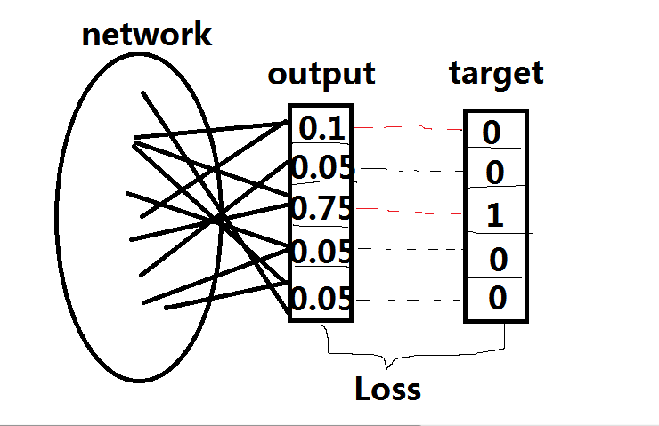
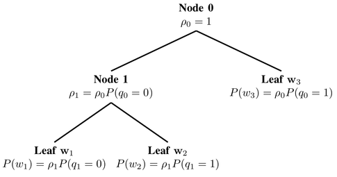
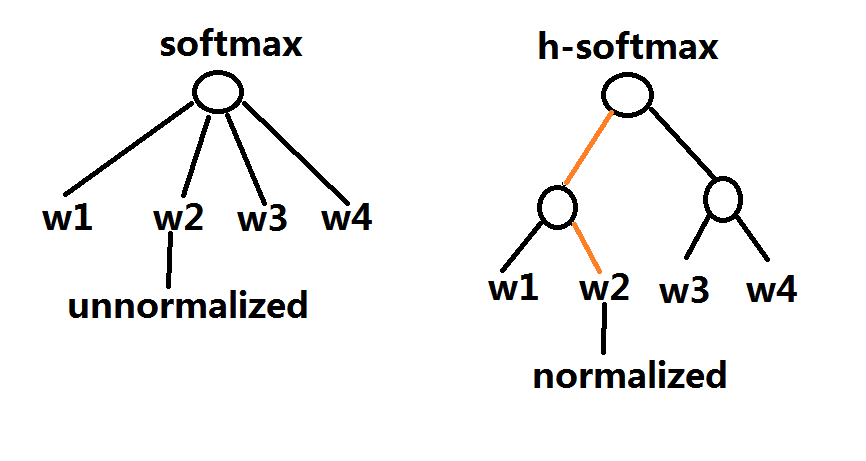

[TOC]

# Motivation

We observed that mitigating the complexity of computing the final softmax layer has been one of the main challenges in devising better word embedding models, a commonality with machine translation (Jean et al., 2015) and language modelling (Jozefowicz et al., 2016). In this post, we will thus focus on giving an overview of various approximations to the softmax layer that have been proposed over the last years, some of which have so far only been employed in the context of language modelling or machine translation.

Recall that the softmax calculates the probability of a word $w$ given its context $c$ and can be computed using the following equation: 
$$
p(w_t|c) = \frac {\exp(h^\top v'_{w_t})} {\sum_{w_i \in V} \exp(h^\top v'_{w_i})}
$$
where $h$ is the encoding of the context words $c$. Computing the softmax is expensive because the inner product between $h$ and the output embedding of every word $w_i$ in the vocabulary $V$ needs to be computed in the normalization term $\sum_{w_i \in V} \exp(h^\top v'_{w_i})$ for each word's probability.

Sometimes, we only concern some of the output neurons, i.e. we only want to calculate part of the probability distribution, is there a way to calculate them effectively? For example, in the following picture, the $0.1$ and $0.75$ output neurons have large affect to the loss. If we just use them to back propagation errors, there is a huge improve for performance.

In the following we will discuss different strategies that have been proposed to approximate the softmax. These approaches can be grouped into:

* **softmax-based** approaches are methods that keep the softmax layer intact, but modify its architecture to improve its efficiency.
* **sampling-based** approaches on the other hand completely do away with the softmax layer and instead optimise some other loss function that approximates the softmax.

# Softmax-based Approaches

## Hierarchical Softmax

Hierarchical softmax (H-Softmax) is an approximation inspired by binary trees that was proposed by [Morin and Bengio in 2005](https://www.iro.umontreal.ca/~lisa/pointeurs/hierarchical-nnlm-aistats05.pdf). H-Softmax essentially replaces the *flat softmax layer* with a *hierarchical layer* that has the words as leaves. This allows us to decompose calculating the probability of one word into a sequence of probability calculations, which saves us from having to calculate the expensive normalization over all words.

### Hierarchical binary tree

A example from [Quora](https://www.quora.com/Word2vec-How-can-hierarchical-soft-max-training-method-of-CBOW-guarantee-its-self-consistence):

There are two node types in the hierarchical softmax binary tree: inner nodes and leaf nodes. Leaves are represented the words in the vocabulary $V$. In contrast to the regular softmax, we no longer have output embeddings $v'_w$ for every word $w$ - instead, we have embeddings $v'_n$ for every inner node $n$. There are $|V|-1$ inner nodes, thus the number of parameters of H-Softmax is almost the same as for the regular softmax.

We can think of the regular softmax as a tree of depth 1, with each word in $V$ as a leaf node. Computing the softmax probability of one word then requires normalizing over the probabilities of all $|V|$ leaves. If we instead structure the softmax as a binary tree, with the words as leaf nodes, then we only need to follow the path from the root to the leaf node of that word, without having to consider any of the other nodes.

Since a balanced binary tree has a depth of $\text{log}_2 (|V|)$, we only need to evaluate at most $\text{log}_2 (|V|)$ nodes to obtain the final probability of a word. Note that this probability is already normalized. To informally verify this, we can reason that at a tree's root node, the probabilities of branching decisions must sum to 1. At each subsequent node, the probability mass is then split among its children, until it eventually ends up at the leaf nodes, i.e. the words. Since no probability is lost along the way and since all words are leaves, the probabilities of all words must necessarily sum to 1 and hence the hierarchical softmax defines a normalized probability distribution over all words in $V$.

### Allocate probability mass

How can we split probability mass among its children? We have introduced a embedding vector $v'_n$ for each inner node $n$, and the probability for the right child of the $n$ node is:
$$
p(\text{right} | c)=\sigma(h^\top v'_n)
$$
and the probability for the left child is $p(\text{left}|c)=1-p(\text{right}|c)$.

The probability of a word $w$ given its context $c$ is then simply the product of the probabilities of taking right and left turns respectively in the path that lead to its leaf node. Hugo Lachorelle gives a more detailed account in his excellent [lecture video](https://www.youtube.com/watch?v=B95LTf2rVWM). Rong (2014) also does a good job of explaining these concepts and also derives the derivatives of H-Softmax.

### Build tree structure

How do we define the structure of the tree? More concrete, how to decide the path of every word in the vocabulary? 

# Reference

> *Sebastian Ruder. On word embeddings - Part 2: Approximating the Softmax. http://ruder.io/word-embeddings-softmax, 2016.*