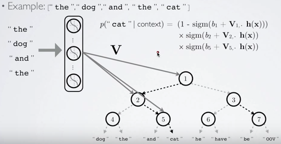

[TOC]

# Motivation

We observed that mitigating the complexity of computing the final softmax layer has been one of the main challenges in devising better word embedding models, a commonality with machine translation (Jean et al., 2015) and language modelling (Jozefowicz et al., 2016). In this post, we will thus focus on giving an overview of various approximations to the softmax layer that have been proposed over the last years, some of which have so far only been employed in the context of language modelling or machine translation.

Recall that the softmax calculates the probability of a word $w$ given its context $c$ and can be computed using the following equation: 
$$
p(w_t|c) = \frac {\exp(h^\top v'_{w_t})} {\sum_{w_i \in V} \exp(h^\top v'_{w_i})}
$$
where $h$ is the encoding of the context words $c$. Computing the softmax is expensive because the inner product between $h$ and the output embedding of every word $w_i$ in the vocabulary $V$ needs to be computed in the normalization term $\sum_{w_i \in V} \exp(h^\top v'_{w_i})$ for each word's probability.

Sometimes, we only concern some of the output neurons, i.e. we only want to calculate part of the probability distribution, is there a way to calculate them effectively? For example, in the following picture, the $0.1$ and $0.75$ output neurons have large affect to the loss. If we just use them to back propagation errors, there is a huge improve for performance.

In the following we will discuss different strategies that have been proposed to approximate the softmax. These approaches can be grouped into:

* **softmax-based** approaches are methods that keep the softmax layer intact, but modify its architecture to improve its efficiency.
* **sampling-based** approaches on the other hand completely do away with the softmax layer and instead optimise some other loss function that approximates the softmax.

# Softmax-based Approaches

## Hierarchical Softmax

Hierarchical softmax (H-Softmax) is an approximation inspired by binary trees that was proposed by [Morin and Bengio in 2005](https://www.iro.umontreal.ca/~lisa/pointeurs/hierarchical-nnlm-aistats05.pdf). H-Softmax essentially replaces the *flat softmax layer* with a *hierarchical layer* that has the words as leaves. This allows us to decompose calculating the probability of one word into a sequence of probability calculations, which saves us from having to calculate the expensive normalization over all words.

### Hierarchical binary tree

A example from [Quora](https://www.quora.com/Word2vec-How-can-hierarchical-soft-max-training-method-of-CBOW-guarantee-its-self-consistence):

There are two node types in the hierarchical softmax binary tree: inner nodes and leaf nodes. Leaves are represented the words in the vocabulary $V$. In contrast to the regular softmax, we no longer have output embeddings $v'_w$ for every word $w$ - instead, we have embeddings $v'_n$ for every inner node $n$. There are $|V|-1$ inner nodes, thus the number of parameters of H-Softmax is almost the same as for the regular softmax.

We can think of the regular softmax as a tree of depth 1, with each word in $V$ as a leaf node. Computing the softmax probability of one word then requires normalizing over the probabilities of all $|V|$ leaves. If we instead structure the softmax as a binary tree, with the words as leaf nodes, then we only need to follow the path from the root to the leaf node of that word, without having to consider any of the other nodes.

Since a balanced binary tree has a depth of $\text{log}_2 (|V|)$, we only need to evaluate at most $\text{log}_2 (|V|)$ nodes to obtain the final probability of a word. Note that this probability is already normalized. To informally verify this, we can reason that at a tree's root node, the probabilities of branching decisions must sum to 1. At each subsequent node, the probability mass is then split among its children, until it eventually ends up at the leaf nodes, i.e. the words. Since no probability is lost along the way and since all words are leaves, the probabilities of all words must necessarily sum to 1 and hence the hierarchical softmax defines a normalized probability distribution over all words in $V$.

### Allocate probability mass

How can we split probability mass among its children? We have introduced a embedding vector $v'_n$ for each inner node $n$, and the probability for the right child of the $n$ node is:
$$
p(\text{right} | c)=\sigma(h^\top v'_n)
$$
and the probability for the left child is $p(\text{left}|c)=1-p(\text{right}|c)$.

The probability of a word $w$ given its context $c$ is then simply the product of the probabilities of taking right and left turns respectively in the path that lead to its leaf node. Hugo Lachorelle gives a more detailed account in his excellent [lecture video](https://www.youtube.com/watch?v=B95LTf2rVWM). Rong (2014) also does a good job of explaining these concepts and also derives the derivatives of H-Softmax.

### Build tree structure

How do we define the structure of the tree? More concrete, how to decide the path of every word in the vocabulary? 

#### balanced binary tree

Obviously, the structure of the tree is of significance. Intuitively, we should be able to achieve better performance, if we make it easier for the model to learn the binary predictors at every node, e.g. by enabling it to assign similar probabilities to similar paths. Based on this idea, Morin and Bengio use the synsets in WordNet as clusters for the tree. However, they still report inferior performance to the regular softmax. Mnih and Hinton (2008) learn the tree structure with a clustering algorithm that recursively partitions the words in two clusters and allows them to achieve the same performance as the regular softmax at a fraction of the computation.

If we assume a `0` bit for turning left and a `1` bit for turning right, we can thus represent the path as binary bits. Further, recall that the path length in a balanced binary tree is $\text{log}_2 |V|$. If we set $|V|=10000$, this amounts to an average path length of about 13.3. Analogously, we can represent every word by the bit vector of its path that is on average 13.3 bits long. In information theory, this is referred to as an information content of 13.3 bits per word.

Notably, we are only able to obtain this speed-up during training, when we know the word we want to predict (and consequently its path) in advance. During testing, when we need to find the most likely prediction, we still need to calculate the probability of all words, although narrowing down the choices in advance helps here.

#### huffman tree

Can we do better? Yes, we can build a Huffman tree to archive a shorter average path length, i.e. we can represent word information less $\text{log}_2 |V|$ bits on average.

The information content $I(w_i)$ of a word $w_i$ is:
$$
I(w_i) = -\log_2 p(w_i)
$$
The entropy $H$ of all words in a corpus is then the expectation of the information content of all words in the vocabulary $V$:
$$
H = \sum_{i\in V} p(w_i)    I(w_i) 
$$
The average word entropy $H$ in a **balanced binary tree** with $|V|=10000$ thus coincides with its average path length:
$$
H = - \sum_{i\in V} \dfrac{1}{10000} \log_2  \dfrac{1}{10000} = 13.3
$$
Morin and Bengio point out that leveraging word probabilities to build tree should work even better; as some words are more likely to occur than others, they can be encoded using less information. They note that the word entropy of their corpus with $|V|=10,000$ is about 9.16. Thus, by taking into account frequencies, we can reduce the average number of bits per word in the corpus from 13.3 to 9.16 in this case, which amounts to a speed-up of 31%.

A Huffman tree, which is used by Mikolov et al. (2013) for their hierarchical softmax, generates such a coding by assigning fewer bits to more common symbols. For instance, "the", the most common word in the English language, would be assigned the shortest bit code in the tree, the second most frequent word would be assigned the second-shortest bit code, and so on. While we still need the same number of codes to designate all words, when we predict the words in a corpus, short codes appear now a lot more often, and we consequently need fewer bits to represent each word on average.

## Differentiated Softmax

Chen et al. (2015) introduce a variation on the traditional softmax layer, the Differentiated Softmax (D-Softmax). D-Softmax is based on the intuition that not all words require the same number of parameters: Many occurrences of frequent words allow us to fit many parameters to them, while extremely rare words might only allow to fit a few.

In order to do this, instead of the dense matrix of the regular softmax layer of size $d \times|V|$ containing the output word embeddings $v'_w \in \R^d$, they use a *sparse matrix*. They then arrange $v'_w$ in *blocks* sorted by frequency, with the embeddings in each block being of a certain dimensionality $d_k$. The number of blocks and their embedding sizes are hyperparameters that can be tuned.

There are $A$, $B$ and $C$ three blocks in the above figure, the dimension of them are $d_A$, $d_B$ and $d_C$ respectively. Each block contains many words that with the same frequency.  As you can see the more frequency of words, the less number of words. The output of the previous hidden layer $h$ is treated as a concatenation of features $h=[h_A;h_B;h_C]$. Instead of computing the matrix-vector product between the entire output embedding matrix and $h$ as in the regular softmax, D-Softmax then computes the product of each partition and its corresponding section in $h$, i.e. $Ah_A$, $Bh_B$ and $Ch_C$.

As many words will only require comparatively few parameters, the complexity of computing the softmax is reduced, which speeds up training and testing. D-Softmax is the fastest method when testing, while being one of the most accurate. However, as it assigns fewer parameters to rare words, D-Softmax does a worse job at modelling them. 

## CNN-Softmax

Another modification to the traditional softmax layer is inspired by recent work by Kim et al. (2016) who produce input word embeddings $v_w$ via a character-level CNN. Jozefowicz et al. (2016) in turn suggest to do the same thing for the output word embeddings $v'_w$ via a character-level CNN -- and refer to this as CNN-Softmax.

While this still requires computing the regular softmax normalization, this approach drastically reduces the number of parameters of the model: Instead of storing an embedding matrix of $d \times |V|$, we now only need to keep track of the parameters of the CNN. During testing, the output word embeddings $v'_w$ can be pre-computed, so that there is no loss in performance.

However, as characters are represented in a continuous space and as the resulting model tends to learn a smooth function mapping characters to a word embedding, character-based models often find it difficult to differentiate between similarly spelled words with different meanings. To mitigate this, the authors add a correction factor that is learned per word, which significantly reduces the performance gap between regular and CNN-softmax. 

# Sampling-based Approaches

While the approaches discussed so far still maintain the overall structure of the softmax, sampling-based approaches on the other hand completely do away with the softmax layer. They do this by approximating the normalization in the denominator of the softmax with some other loss that is cheap to compute. However, sampling-based approaches are only useful at training time -- during inference, the full softmax still needs to be computed to obtain a normalized probability.

In order to gain some intuitions about the softmax denominator's impact on the loss, we will derive the gradient of our loss function $J_{\theta}$ w.r.t. the parameters of our model $\theta$. During training, we aim to minimize the cross-entropy loss of our model $P(w)=\dfrac{\text{exp}(h^\top v'_w)}{\sum_{w_i \in V} \text{exp}(h^\top v'_{w_i})}$ for every word $w$ in the training set. 
$$
\begin {split}
J_\theta &= -    \log    \dfrac{\text{exp}({h^\top v'_{w}})}{\sum_{w_i \in V} \text{exp}({h^\top v'_{w_i}})}  \\
	     &= -h^\top v'_w + \log({\sum_{w_i \in V} \text{exp}({h^\top v'_{w_i}})})
\end {split}
$$
For brevity and to conform with the notation of Bengio and Senécal (2003; 2008), we replace the dot product $h^\top v'_w$ with $- \mathcal{E}(w)$.
$$
J_\theta =    \mathcal{E}(w) + \text{log} \sum_{w_i \in V} \text{exp}( - \mathcal{E}(w_i))
$$

The gradient $\nabla$ of $J_{\theta}$ w.r.t. our model's parameters $\theta $:
$$
\begin {split}
\nabla_\theta J_\theta &=    \nabla_\theta \mathcal{E}(w)  + \nabla_\theta \text{log} \sum_{w_i \in V} \text{exp}(- \mathcal{E}(w_i))  \\
					   &= \nabla_\theta \mathcal{E}(w) + \dfrac{1}{\sum_{w_i \in V} \text{exp}(- \mathcal{E}(w_i))} \nabla_\theta \sum_{w_i \in V} \text{exp}(- \mathcal{E}(w_i) \\
					   &=    \nabla_\theta \mathcal{E}(w)  + \dfrac{1}{\sum_{w_i \in V} \text{exp}(- \mathcal{E}(w_i))} \sum_{w_i \in V} \nabla_\theta    \text{exp}(- \mathcal{E}(w_i))  \\
					   &= \nabla_\theta \mathcal{E}(w) + \dfrac{1}{\sum_{w_i \in V} \text{exp}(- \mathcal{E}(w_i))} \sum_{w_i \in V} \text{exp}(- \mathcal{E}(w_i)) \nabla_\theta (- \mathcal{E}(w_i))  \\
					   &= \nabla_\theta \mathcal{E}(w) + \sum_{w_i \in V} \dfrac{\text{exp}(- \mathcal{E}(w_i))}{\sum_{w_i \in V} \text{exp}(- \mathcal{E}(w_i))} \nabla_\theta (- \mathcal{E}(w_i))  
\end {split}
$$
where $\dfrac{\text{exp}(- \mathcal{E}(w_i))}{\sum_{w_i \in V} \text{exp}(- \mathcal{E}(w_i))}$ is just the softmax probability $P(w_i)$ of word $w_i$. Replacing it yields:
$$
\begin {split}
\nabla_\theta J_\theta &= \nabla_\theta \mathcal{E}(w) + \sum_{w_i \in V} P(w_i) \nabla_\theta (- \mathcal{E}(w_i)) \\
					   &= \nabla_\theta \mathcal{E}(w) - \sum_{w_i \in V} P(w_i) \nabla_\theta (\mathcal{E}(w_i))  \\
					   &= \nabla_\theta \mathcal{E}(w) - \mathbb{E}_{w_i \sim P}[\nabla_\theta \mathcal{E}(w_i)]
\end {split}
$$
Bengio and Senécal (2003) note that the gradient essentially has two parts: the first term is a positive reinforcement for the target word $w$ and the second term is negative reinforcement for all other words $w_i$, which is weighted by their probability, just the the expectation $\mathbb{E}_{w_i \sim P}$ of the gradient of $\mathcal{E}$ for all words $w_i$ in $V$. The crux of most sampling-based approach now is to approximate the second term negative reinforcement in some way to make it easier to compute, since we don't want to sum over the probabilities for all words in $V$.

## Importance Sampling

We can approximate the expected value $\mathbb{E}$ of any probability distribution using the Monte Carlo method, i.e. by taking the mean of random samples of the probability distribution. If we knew the network's distribution, i.e. $P(w)$, we could thus directly sample mm words $w_1 , \cdots , w_m$ from it and approximate the above expectation with:
$$
\mathbb{E}_{w_i \sim P}[\nabla_\theta \mathcal{E}(w_i)] = \sum_{w_i \in V} P(w_i) \nabla_\theta (\mathcal{E}(w_i)) \approx \dfrac{1}{m} \sum\limits^m_{i=1} \nabla_\theta \mathcal{E}(w_i)
$$
However, in order to sample from the probability distribution $P$, we need to compute $P$, which is just what we wanted to avoid in the first place. We therefore have find some other distribution $Q$ (we call this the proposal distribution), from which it is cheap to sample and which can be used as the basis of Monte-Carlo sampling. Preferably, $Q$ should also be similar to $P$, since we want our approximated expectation to be as accurate as possible. A straightforward choice in the case of language modeling is to simply use the **unigram distribution** of the training set for **proposal distribution** $Q$. This is essentially what classical Importance Sampling (IS) does: It uses Monte-Carlo sampling to approximate a target distribution $P$ via a proposal distribution $Q$. 

How can we calculate the weight for sample $w_i$? The probability $P(w_i)$ is too expensive and $\dfrac {1} {m}$ is too simple.

[Bengio and Senécal (2003)](http://www.iro.umontreal.ca/~lisa/publications2/index.php/attachments/single/21) use a biased estimator that was first proposed by Liu (2001). This estimator can be used when $P(w_i)$ is computed as a product, which is the case here, since every division can be transformed into a multiplication. Essentially, instead of weighting the gradient $\nabla_\theta \mathcal{E}(w_i)$ with the expensive to compute probability $P(w_i)$, we weight it with a factor that leverages the proposal distribution $Q$.
$$
\mathbb{E}_{w_i \sim P}[\nabla_\theta \mathcal{E}(w_i)] \approx  \dfrac{1}{R} \sum\limits^m_{i=1} r(w_i) \nabla_\theta    \mathcal{E}(w_i)
$$
where $r(w) = \dfrac{\text{exp}(- \mathcal{E}(w))}{Q(w)}$ and $R = \sum^m_{j=1} r(w_j)$. As we can see, we still compute the numerator $\text{exp}(- \mathcal{E}(w))$ of the softmax, but replace the normalisation $\sum_{w_i \in V} \text{exp}(- \mathcal{E}(w_i))$ in the denominator with the proposal distribution $Q$.  

Note that the fewer samples we use, the worse is our approximation. We additionally need to adjust our sample size during training, as the network's distribution $P$ might diverge from the unigram distribution $Q$ during training, which leads to divergence of the model, if the sample size that is used is too small. Consequently, Bengio and Senécal introduce a measure to calculate the effective sample size in order to protect against possible divergence. Finally, the authors report a speed-up factor of 19 over the regular softmax for this method.

## Adaptive Importance Sampling

(http://www.iro.umontreal.ca/~lisa/publications2/index.php/attachments/single/177)

# Reference

> *Sebastian Ruder. On word embeddings - Part 2: Approximating the Softmax. http://ruder.io/word-embeddings-softmax, 2016.*