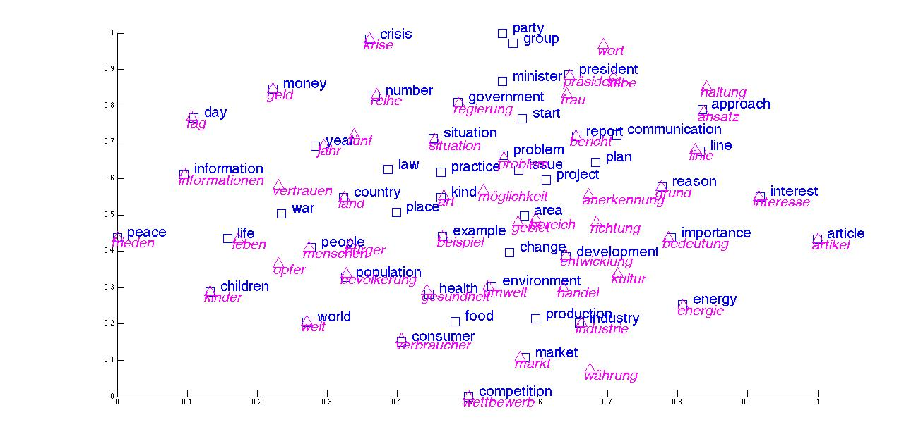

# Introduction

The availability of resources, training data, and benchmarks in English leads to a disproportionate focus on the English language and a negligence of the plethora of other languages that are spoken around the world. In our globalised society, where national borders increasingly blur, where the Internet gives everyone equal access to information, it is thus imperative that we do not only seek to eliminate bias pertaining to gender or race inherent in our representations, but also aim to address our bias towards language.

To remedy this and level the linguistic playing field, we would like to leverage our existing knowledge in English to equip our models with the capability to process other languages.

Perfect machine translation (MT) would allow this. However, we do not need to actually translate examples, as long as we are able to project examples into a common subspace such as the one in Figure 1.

