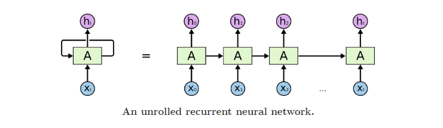
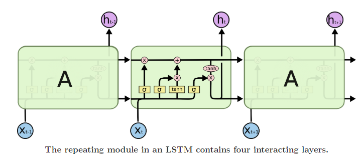
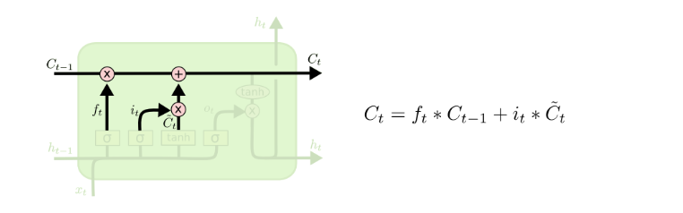

# Recurrent Neural Networks

Humans don’t start their thinking from scratch every second. As you read this essay, you understand each word based on your understanding of previous words. You don’t throw everything away and start thinking from scratch again. Your thoughts have persistence.

The forward-feed neural networks can’t do this, and it seems like a major shortcoming. Recurrent neural networks address this issue. They are networks with loops in them, allowing information to persist.

The loop in the above picture allows information to be passed from one time step of the network to the next.

A recurrent neural network can be thought of as multiple copies of the same network, each passing a message to a successor. Consider what happens if we unroll the loop:

This chain-like nature reveals that recurrent neural networks are intimately related to sequences and lists. They’re the natural architecture of neural network to use for such data.

LSTM is a very special kind of recurrent neural network which works, for many tasks, much much better than the standard version. Almost all exciting results based on recurrent neural networks are achieved with them.

# The Problem of Long-Term Dependencies for RNN

One of the appeals of RNNs is the idea that they might be able to connect previous information to the present task, such as using previous video frames might inform the understanding of the present frame. If RNNs could do this, they’d be extremely useful. But can they? It depends.

**RNN can tackle the short term dependencies**:

Sometimes, we only need to look at recent information to perform the present task. For example, consider a language model trying to predict the next word based on the previous ones. If we are trying to predict the last word in “the clouds are in the *sky*,” we don’t need any further context – it’s pretty obvious the next word is going to be sky. In such cases, where the gap between the relevant information and the place that it’s needed is small, RNNs can learn to use the past information.

**RNN can't tackle the long term dependencies**:

But there are also cases where we need more context. Consider trying to predict the last word in the text “I grew up in France… I speak fluent *French*.” Recent information suggests that the next word is probably the name of a language, but if we want to narrow down which language, we need the context of France, from further back. It’s entirely possible for the gap between the relevant information and the point where it is needed to become very large. As that gap grows, RNNs become unable to learn to connect the information.

In theory, RNNs are absolutely capable of handling such “long-term dependencies.” A human could carefully pick parameters for them to solve toy problems of this form. Sadly, in practice, RNNs don’t seem to be able to learn them. The problem was explored in depth by [Hochreiter (1991) [German\]](http://people.idsia.ch/~juergen/SeppHochreiter1991ThesisAdvisorSchmidhuber.pdf) and [Bengio, et al. (1994)](http://www-dsi.ing.unifi.it/~paolo/ps/tnn-94-gradient.pdf), who found some pretty fundamental reasons why it might be difficult.

Thankfully, LSTMs don’t have this problem!

# LSTM Networks

Long Short Term Memory networks – usually just called “LSTMs” – are a special kind of RNN, capable of learning long-term dependencies. LSTMs are explicitly designed to avoid the long-term dependency problem. Remembering information for long periods of time is practically their default behavior, not something they struggle to learn!

All recurrent neural networks have the form of a chain of repeating modules of neural network. In standard **RNNs**, this repeating module will have a very simple structure, such as a single tanh layer.

**LSTMs** also have this chain like structure, but the repeating module has a different structure. Instead of having a single neural network layer, there are four, interacting in a very special way.

In the above diagram, each line carries an entire vector, from the output of one node to the inputs of others. The pink circles represent pointwise operations, like vector addition, while the yellow boxes are learned neural network layers. Lines merging denote concatenation, while a line forking denote its content being copied and the copies going to different locations.

The key to LSTMs is the **cell state**, the horizontal line running through the top of the diagram. The cell state is kind of like a conveyor belt. *It runs straight down the entire chain, with only some minor linear interactions. It’s very easy for information to just flow along it unchanged*.

The LSTM does have the ability to remove or add information to the cell state, carefully regulated by structures called **gates**. *Gates are a way to optionally let information through. They are composed out of a sigmoid neural net layer and a pointwise multiplication operation*. The sigmoid layer outputs numbers between zero and one, describing how much of each component should be let through. A value of zero means “let nothing through,” while a value of one means “let everything through!”. An LSTM has three of these gates, to protect and control the cell state.

# Step-by-Step LSTM Walk Through

## information throw away from the cell state

The first step in our LSTM is to decide what information we’re going to throw away from the cell state. This decision is made by a sigmoid layer called the **forget gate layer**. It looks at $h_{t-1}$ and $x_t$, and outputs a number between 0 and 1 for each number in the cell state $C_{t-1}$. A 1 represents “completely keep this” while a 0 represents “completely get rid of this.”

## new information store in the cell state

The next step is to decide what new information we’re going to store in the cell state. This has two parts. First, a sigmoid layer called the **input gate layer** decides which values we’ll update. Next, a tanh layer creates a vector of new **candidate state**, $\tilde C_{t}$, that could be added to the state. 

## update the old cell state into the new cell state

It’s now time to update the old cell state, $C_{t-1}$, into the new cell state $C_{t}$. We multiply the old state $C_{t-1}$ by $f_t$, forgetting the things we decided to forget earlier. Then we add $i_t * {\tilde C_{t}}$. This is the new candidate values, scaled by how much we decided to update each state value.

## output the cell state

Finally, we need to decide what we’re going to output. This output will be based on our cell state, but will be a filtered version. First, we run a sigmoid layer which decides what parts of the cell state we’re going to output, it's called **output gate layer**. Then, we put the cell state through tanh (to push the values to be between −1−1 and 11) and multiply it by the output of the sigmoid gate, so that we only output the parts we decided to.

## summary

$$
\begin{equation}
\begin{split}

h_t &= o_t \odot \tanh(C_t) \\
C_t &= f_t \odot C_{t-1} + i_t \odot \tilde C_{t} \\
\\
f_t &= \sigma(W_f[x_t,h_{t-1}]+b_f) \\
i_t &= \sigma(W_i[x_t,h_{t-1}]+b_i) \\
o_t &= \sigma(W_o[x_t,h_{t-1}]+b_o) \\
\tilde C_{t} &= \tanh(W_c[x_t,h_{t-1}]+b_c) \\
\end{split}
\end{equation}
$$

# LSTM Variants

What I’ve described so far is a pretty normal LSTM. But not all LSTMs are the same as the above. In fact, it seems like almost every paper involving LSTMs uses a slightly different version. The differences are minor, but it’s worth mentioning some of them.

One popular LSTM variant, introduced by [Gers & Schmidhuber (2000)](ftp://ftp.idsia.ch/pub/juergen/TimeCount-IJCNN2000.pdf), is adding “peephole connections.” This means that we let the gate layers look at the cell state.

Another variation is to use coupled forget and input gates. Instead of separately deciding what to forget and what we should add new information to, we make those decisions together. We only forget when we’re going to input something in its place. We only input new values to the state when we forget something older.

A slightly more dramatic variation on the LSTM is the Gated Recurrent Unit, or **GRU**, introduced by [Cho, et al. (2014)](http://arxiv.org/pdf/1406.1078v3.pdf). It combines the forget and input gates into a single “update gate.” It also merges the cell state and hidden state, and makes some other changes. The resulting model is simpler than standard LSTM models, and has been growing increasingly popular.

These are only a few of the most notable LSTM variants. There are lots of others, like Depth Gated RNNs by [Yao, et al. (2015)](http://arxiv.org/pdf/1508.03790v2.pdf). There’s also some completely different approach to tackling long-term dependencies, like Clockwork RNNs by [Koutnik, et al. (2014)](http://arxiv.org/pdf/1402.3511v1.pdf).

Which of these variants is best? Do the differences matter? [Greff, et al. (2015)](http://arxiv.org/pdf/1503.04069.pdf) do a nice comparison of popular variants, finding that they’re all about the same. [Jozefowicz, et al. (2015)](http://jmlr.org/proceedings/papers/v37/jozefowicz15.pdf)tested more than ten thousand RNN architectures, finding some that worked better than LSTMs on certain tasks.

# Conclusion

LSTMs were a big step in what we can accomplish with RNNs. It’s natural to wonder: is there another big step? A common opinion among researchers is: “Yes! There is a next step and it’s attention!” The idea is to let every step of an RNN pick information to look at from some larger collection of information. For example, if you are using an RNN to create a caption describing an image, it might pick a part of the image to look at for every word it outputs. In fact, [Xu, *et al.*(2015)](http://arxiv.org/pdf/1502.03044v2.pdf) do exactly this – it might be a fun starting point if you want to explore attention! There’s been a number of really exciting results using attention, and it seems like a lot more are around the corner…

Attention isn’t the only exciting thread in RNN research. For example, Grid LSTMs by [Kalchbrenner, *et al.* (2015)](http://arxiv.org/pdf/1507.01526v1.pdf) seem extremely promising. Work using RNNs in generative models – such as [Gregor, *et al.* (2015)](http://arxiv.org/pdf/1502.04623.pdf), [Chung, *et al.* (2015)](http://arxiv.org/pdf/1506.02216v3.pdf), or [Bayer & Osendorfer (2015)](http://arxiv.org/pdf/1411.7610v3.pdf) – also seems very interesting. The last few years have been an exciting time for recurrent neural networks, and the coming ones promise to only be more so!