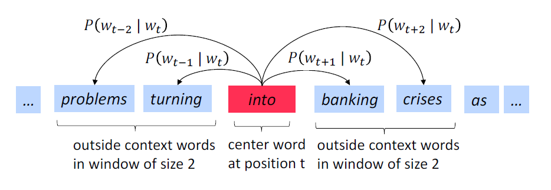

# Introduction

The **skip-gram neural network model** is actually surprisingly simple in its most basic form. The model is proposed by [Mikolov el at.](https://arxiv.org/abs/1301.3781) in 2013.

Let’s start with a high-level insight about where we’re going. Word2Vec uses a **trick** you may have seen elsewhere in machine learning: We’re going to train a simple neural network with a single hidden layer to perform a certain fake task, but then we’re not actually going to use that neural network for the task we trained it on! Instead, the goal is actually just to learn the weights of the hidden layer–we’ll see that these weights are actually the “word vectors” that we’re trying to learn.

Another place you may have seen this trick is in unsupervised feature learning, where you train an **auto-encoder** to compress an input vector in the hidden layer, and decompress it back to the original in the output layer. After training it, you strip off the output layer (the decompression step) and just use the hidden layer--it's a trick for learning good image features without having labeled training data.

# The fake task for word2vec

So now we need to talk about this “fake” task that we’re going to build the neural network to perform. We’re going to train the neural network to do the following. Given a specific word in the middle of a sentence (the input word or **center word**), look at the words nearby (**context words**) and pick one at random. The network is going to tell us the probability for every word in our vocabulary of being the “nearby word” that we chose.

There is a hyper-parameter **window size** to determine the range of the context words of the center word. In the above picture (From [cs224n](http://web.stanford.edu/class/cs224n)), the window size is 2. For real applications, a typical window size might be 5, meaning 5 words behind and 5 words ahead (10 in total).

We’ll train the neural network to do this by feeding it **word pairs** found in our training corpus, a word pair is a tuple `(center-word, context-word)`. The network is going to learn the statistics from the number of times each pairing shows up. For example, the sentence “The quick brown fox jumps over the lazy dog.”, we will find the following word pairs:

# The architecture of the neural network

## Overview

- First, we need build a **vocabulary **of words from our training corpus - let’s say we have a vocabulary of 10,000 unique words. We’re going to represent each word in the vocabulary as a **one-hot** vector.
- The input one-hot vector passes through the **linear** hidden layer to get the "word vector". You can think the hidden layer just likes a **lookup table**.
- Then we put the word vector into the output layer and use **softmax** to convert the activations into a probability distribution vector. The output of the network is a single vector (also with 10,000 components) containing, for every word in our vocabulary, the probability that a randomly selected nearby word is that vocabulary word.

When training this network on word pairs, the input is a one-hot vector representing the center word and the training target is also a one-hot vector representing the context word. But when you evaluate the trained network on an input word, the output vector of the network will actually be a probability distribution.

## The hidden layer

For our example, we’re going to say that we’re learning word vectors with 300 features, i.e. the dimension of word embedding is 300. So there is a weight matrix $W_{1000 \times 300}^{(1)}$ for the linear hidden layer, each row of the matrix is the "word vector" for one word in the vocabulary, and each column of the word vector is the output value of one hidden layer neuron. So the end goal of all of this is really just to learn this hidden layer weight matrix.

Note: The number of features is a "hyper parameter" that you would just have to tune to your application (that is, try different values and see what yields the best results).

Assuming our input word $x_{1 \times 1000}$ is a row vector, the output vector $a_{1 \times 300}^{(1)}$ of the hidden layer as follows:
$$
a_{1 \times 300}^{(1)} = x_{1 \times 1000} \cdot W_{1000 \times 300}^{(1)}
$$
Because the input vector is one-hot vector, multiplication with the weight matrix just likes select the matrix row corresponding to the “1” of the one-hot vector. A example as follows:

This means that the hidden layer of this model is really just operating as a **lookup table**. The output of the hidden layer is just the “word vector” for the input word.

## The output layer

The word vector $a_{1 \times 300}^{(1)}$ will be fed to the output layer. And the output layer is a **softmax regression classifier**.

Specifically, each output neuron has a weight vector which it multiplies against the word vector from the hidden layer, then it applies the function `exp` to the result. Finally, in order to get the outputs to sum up to 1, we divide this result by the sum of the results from all 10,000 output nodes.

Let's show some mathematics. The $j$-th output neuron is given by multiplying the word vector with a weight vector: 
$$
a_{j}^{(2)} = a_{1 \times 300}^{(1)} \cdot W_{:,j}^{(2)}
$$
where $W_{:,j}^{(2)}$ is the $j$-th column vector in the weight matrix $W^{(2)}$ of the output layer.

Then we apply softmax for the $j$-th output neuron:
$$
a_{j}^{(2)} = \frac {\exp(a_{j}^{(2))}} {\sum_i^{1000} \exp(a_{i}^{(2)})}
$$
Now we get a probability distribution vector $a_{1 \times 1000}^{(2)}$ as the output of the output layer.

# Intuition

If two different words have very similar “contexts” (that is, what words are likely to appear around them), then our model needs to output very similar results for these two words. And one way for the network to output similar context predictions for these two words is if *the word vectors are similar*. So, if two words have similar contexts, then our network is motivated to learn similar word vectors for these two words! Ta da!

And what does it mean for two words to have similar contexts? I think you could expect that synonyms like “intelligent” and “smart” would have very similar contexts. Or that words that are related, like “engine” and “transmission”, would probably have similar contexts as well.

This can also handle stemming for you – the network will likely learn similar word vectors for the words “ant” and “ants” because these should have similar contexts.

# Reference

> McCormick, C. (2016, April 19). *Word2Vec Tutorial - The Skip-Gram Model*. Retrieved from http://www.mccormickml.com

> http://web.stanford.edu/class/cs224n/syllabus.html