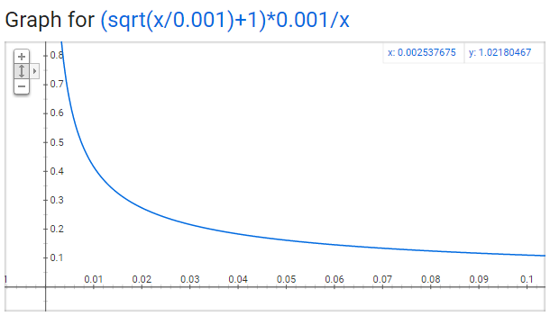

# Motivation

The skip-gram model for Word2Vec a huge neural network! It's very difficult for training.

In the example I gave, we had word vectors with 300 features, and a vocabulary of 10,000 words. Recall that the neural network had two weight matrices–a hidden layer and output layer. Both of these layers would have a weight matrix with 300 x 10,000 = 3 million weights each! Running gradient descent on a neural network that large is going to be slow. And to make matters worse, you need a huge amount of training data in order to tune that many weights and avoid over-fitting.

# Improve the skip-gram model

The authors (Mikolov el at.) of the skip-gram Word2Vec addressed these issues in their second [paper](http://arxiv.org/pdf/1310.4546.pdf).

There are three innovations in this second paper:

1. Treating common word pairs or phrases as single “words” in their model.
2. Subsampling frequent words to decrease the number of training examples.
3. Modifying the optimization objective with a technique they called “Negative Sampling”, which causes each training sample to update only a small percentage of the model’s weights.

It’s worth noting that subsampling frequent words and applying Negative Sampling not only reduced the compute burden of the training process, but also improved the quality of their resulting word vectors as well.

## Phrase vectors

The common phrases should own itself word vector representation.

The authors pointed out that a word pair like “Boston Globe” (a newspaper) has a much different meaning than the individual words “Boston” and “Globe”. So it makes sense to treat “Boston Globe”, wherever it occurs in the text, as a single word with its own word vector representation.

**Phrase detection** is covered in the “Learning Phrases” section of their [paper](http://arxiv.org/pdf/1310.4546.pdf). I don’t think their phrase detection approach is a key contribution of their paper, but I’ll share a little about it anyway since it’s pretty straightforward:

- The tool counts the number of times each combination of two words appears in the training text, and then these counts are used in an equation to determine which word combinations to turn into phrases. The equation is designed to make phrases out of words which occur together often relative to the number of individual occurrences. It also favors phrases made of infrequent words in order to avoid making phrases out of common words like “and the” or “this is”.

- Each pass of their tool only looks at combinations of 2 words, but you can run it multiple times to get longer phrases. So, the first pass will pick up the phrase “New_York”, and then running it again will pick up “New_York_City” as a combination of “New_York” and “City”.

## Subsampling Frequent Words

We know that the training examples is created from the word pairs of the source text. 

There are two “problems” with the **frequent words** like “the”:

1. When looking at word pairs, (“fox”, “the”) doesn’t tell us much about the meaning of “fox”. “the” appears in the context of pretty much every word.
2. We will have many more samples of (“the”, …) than we need to learn a good vector for “the”.

Word2Vec implements a **subsampling** scheme to address this. For each word we encounter in our training text, there is a chance that we will effectively delete it from the text. The probability that we delete the word is related to the word’s frequency.

For example, if we have a window size of 10, and we remove a specific instance of “the” from our text:

1. As we train on the remaining words, “the” will not appear in any of their context windows. 
2. We’ll have 10 fewer training samples where “the” is the input word. 

Word2Vev calculates a probability with which to keep a given word in the vocabulary. I.e. $P(w_i)$ is the probability of *keeping* the word:
$$
P(w_i) = (\sqrt{\frac{z(w_i)}{0.001}} + 1) \cdot \frac{0.001}{z(w_i)}
$$
where $z(w_i)$ is the fraction of the total words in the corpus that are that word $w_i$; and the constant $0.001$ controls how much subsampling occurs.

The plot of the relationship between $y=P(w_i)$ and $x=z(w_i)$ as follows:

We can see from the picture, the more common a word is (with larger $x$), the lower keeping probability it has (with smaller $y$).

## Negative Sampling

Training a neural network means taking a training example and adjusting all of the neuron weights slightly so that it predicts that training sample more accurately. In other words, each training sample will tweak *all* of the weights in the neural network. Thus it's infeasible for our neural network to update the huge weight matrix when feed in each training sample.

Negative sampling addresses this by having each training sample only modify a small percentage of the weights, rather than all of them: When training the network on the word pair (“fox”, “quick”), recall that the label or correct output of the network is a one-hot vector. We call the 

# Reference

> McCormick, C. (2017, January 11). *Word2Vec Tutorial Part 2 - Negative Sampling*. Retrieved from http://www.mccormickml.com