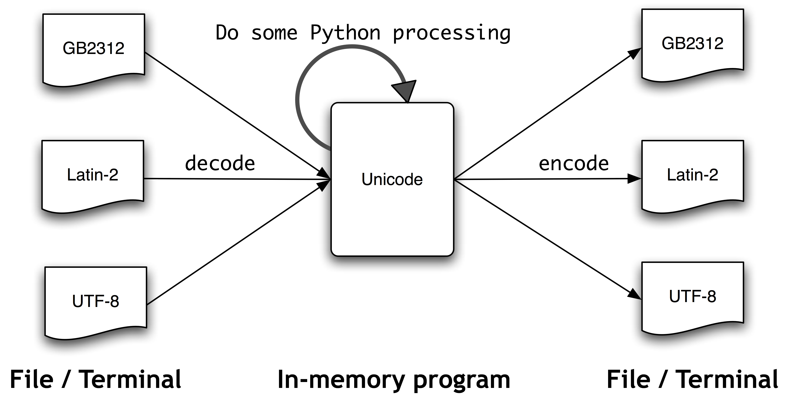

title: "NLTK - 自然语言处理库"
date: 2017-01-12T14:17:00+08:00
draft: false
categories: ["nlp"]
tags: ["nlp", "nltk", "python"]
featured_img: ""
description: ""
page_header: ""

[TOC]

# Chapter 0: Preface

## 自然语言处理

自然语言是经过一代一代人类传承的、用于交流沟通的语言，是不同于编程语言、数学公式这类人造语言的。自然语言处理（Natural Language Processing，简称 [NLP](https://en.wikipedia.org/wiki/Natural_language_processing)，又被称为 Computational Linguistics）是涉及甚广的技术，在手写体识别、信息检索、机器翻译、文本挖掘都发挥着重要的作用。

>  By "natural language" we mean a language that is used for everyday communication by humans; languages like English, Hindi or Portuguese. In contrast to artificial languages such as programming languages and mathematical notations, natural languages have evolved as they pass from generation to generation, and are hard to pin down with explicit rules. 
>
> We will take Natural Language Processing — or NLP for short — in a wide sense to cover any kind of computer manipulation of natural language.

研究自然语言处理的最终目的是，使机器可以理解自然语言的含义，构建人类和机器之间的自然语言交互接口。

> By providing more natural human-machine interfaces, and more sophisticated access to stored information, language processing has come to play a central role in the multilingual information society.

## 用 Python 处理自然语言

基于 Python 的第三方库 Natural Language Toolkit（简称 [NLTK](http://nltk.org)），提供了自然语言处理所需的常用工具以及丰富的语料数据等。NLTK 对常见的自然语言处理任务，比如词性标注、语义分析、文本分类等，都提供了支持。本文主要基于 NLTK [官方教程](http://www.nltk.org/book)而写。

Why Python?

> We chose Python because it has a shallow learning curve, its syntax and semantics are transparent, and it has good string-handling functionality. As an interpreted language, Python facilitates interactive exploration. As an object-oriented language, Python permits data and methods to be encapsulated and re-used easily. As a dynamic language, Python permits attributes to be added to objects on the fly, and permits variables to be typed dynamically, facilitating rapid development. Python comes with an extensive standard library, including components for graphical programming, numerical processing, and web connectivity.

Why NLTK?

> NLTK defines an infrastructure that can be used to build NLP programs in Python. It provides basic classes for representing data relevant to natural language processing; standard interfaces for performing tasks such as part-of-speech tagging, syntactic parsing, and text classification; and standard implementations for each task which can be combined to solve complex problems.

## NLTK 使用简介

### 安装

0. 安装 Python 3.2+

1. 安装 NLTK 3.0

    ```
    pip install nltk
    ```

2. 下载 NLTK 资源数据

   ```
   import nltk
   nltk.download()
   ```

   输入以上命令后会弹出一个下载管理器，可以用它来下载自己需要的数据，为了运行 NLTK book 官方教程中提供的样例，需要下载 `book` 数据集：

   测试 `book` 数据是否安装成功：`from nltk import book`

3. 安装相关第三方库 Numpy 和 Matplotlib

    ```
    pip install numpy
    pip install matplotlib
    ```
4. 安装斯坦福大学的 NLP库，NLTK 可以调用该库，详见：http://nlp.stanford.edu/software/


### NLTK 模块概览

| 模块                   | 功能                                                         |
| ---------------------- | ------------------------------------------------------------ |
| corpus                 | 访问语料库（corpus）和词典（lexicon）的标准化接口            |
| tokenize, stem         | 分词（tokenize），句子切分（sentence tokenize）以及解析词干（stem） |
| collocations           | 查找固定搭配（collocation）；支持 t-test，chi-squared, mutual information 等各种方法； |
| tag                    | 词性标注（part-of-speech tagging）；支持 n-gram, backoff, HMM 等各种方法； |
| classify, cluster, tbl | 常用机器学习方法：决策树，最大熵，朴素贝叶斯，EM算法，K-Mean 等 |
| chunk                  | 用于命名实体识别、名词短语识别等 Chunking 任务               |
| parse, ccg             | 句法解析（syntactic parsing）                                |
| sem, inference         | 语义分析（semantic analysis）                                |
| metrics                | 模型评估的度量方法，如 precision, recall 等                  |
| probability            | 统计概率估计相关工具                                         |
| app, chat              | 小程序                                                       |
| toolbox                | 语言学相关工具                                               |

### NLTK 能用来做哪些工作

NLTK 的目标是提供一个简单、一致、易扩展易模块化的自然语言处理工具包。可以用 NLTK 提供的工具包轻易的处理很多常见的自然语言处理任务，但是这些实现并没有经过深入的优化，没有采用复杂的算法和底层语言去实现，因此如果对性能要求较高或者需要处理特殊的自然语言处理任务，就不建议使用 NLTK 来完成。

NLTK 的设计哲学：

> Simplicity: To provide an intuitive framework along with substantial building blocks, giving users a practical knowledge of NLP without getting bogged down in the tedious house-keeping usually associated with processing annotated language data
> Consistency:	To provide a uniform framework with consistent interfaces and data structures, and easily-guessable method names
> Extensibility:	To provide a structure into which new software modules can be easily accommodated, including alternative implementations and competing approaches to the same task
> Modularity:	To provide components that can be used independently without needing to understand the rest of the toolkit

# Chapter 1: Language Processing and Python

Here we will treat text as **raw data** for the programs we write, programs that manipulate and analyze it in a variety of interesting ways.

## NLTK 初识

首先需要下载 `nltk.book` 数据集，并导入它：

```python
# 导入数据，数据都被封装成对象来使用的
# 导入后将有 text1,text2,..,text9 等对象供使用
import nltk
from nltk.book import *
```

查看单词所在上下文环境（context）：

```python
# 查看单词上下文环境（context），即提取单词所在句子
# 可以看到单词搭配的左邻词和右邻词比较固定
# A concordance permits us to see words in context. 
text1.concordance('monstrous')

# 查找具有相似上下文环境的单词
# What other words appear in a similar range of contexts?
text1.similar('monstrous')

# 查找多个单词共同的上下文环境
# to examine just the contexts that are shared by two or more words
text1.commo_contexts(['monstrous', 'very'])
```

查看单词出现在文本中的位置，即绘制 dispersion plot：

```python
# 单词在文本中出现位置的图表 
# text4 是按年份组织的美国总统就职演说文本，
# 因此以下单词位置可以体现用词习惯随时间的变化
# Google 的用词频率统计服务 https://books.google.com/ngrams
text4.dispersion_plot(["citizens", "democracy", "freedom", "duties", "America"])
```

对文本进行词表（vocabulary）统计：

```python
# The vocabulary of a text is just the *set* of tokens that it uses.

# 统计文本的 token 数目，又被称为 word token 或 item token
# 所谓 token 就是一个字符序列，该字符序列如何划定边界是比较复杂的逻辑，
# 简单来说在英语中可以用空格、标点符号等来为 token 定界
len(text1)

# 统计文本词汇表大小
# 即统计各不相同的 token 数目，又被称为 word type 或 item type
len(set(text1))

# 统计文本中词汇多样性 lexical diversity
len(set(text1)) / len(text1)

# 统计单词在文本中的频率 
text1.count('mouse') / len(text1)
```

## 对文本进行简单的统计

### Frequency Distribution 单词的频率分布

如何识别出文本中最具信息量的词汇？现在姑且假设，出现次数多的词汇，所含信息量也大（真的是这样吗？）。

> How can we automatically identify the words of a text that are most informative about the topic and genre of the text? Imagine how you might go about finding the 50 most frequent words of a book. 

我们需要构建一个词频统计表：

It tells us the frequency of each vocabulary item in the text. It is a "distribution" because it tells us how the total number of word tokens in the text are distributed across the vocabulary items.

用 NLTK 构建频率分布 : 

```python
# distribution of word
fd = FreqDist(text1)
# how many times does 'house' appear in the text1
print(fd['house'])
# the 50 most frequent words in the text1
print(fd.most_common(50))
# generate a cumulative frequency plot for the 50 most frequent words
fd.plot(50, cumulative=True)
# **hapaxes** are words that occur once only
fd.hapaxes()

# distribution of word length
fd = FreqDist([len(w) for w in text1])
# the most frequent word lengths of text1
print(fd.most_common())
# the most word length
fd.max()
# the occurences of 5 word-length
fd[5]
# frequency of a given sample
fd.freq(5)
```

通过上面的实验可以看出不管是高频词、还是低频词都无法为文本提供足够的信息量，没办法反映文本的话题或流派。

那么较长的单词能否提供有用的信息呢？可惜较长的单词往往是 **hapaxes**，是低频词，看来它们也无法提供有用信息。不过如果同时考虑词长度以及词频率，效果会稍微好一些（不过依然没有实用价值，后面我们会介绍更加复杂的技术来解决此问题）。

Let's look at the *long* words of a text; perhaps these will be more characteristic and informative. Because long words are often hapaxes, so it would be better to consider with the frequently occuring of those long words.(i.e, eliminates frequent short words and infrequent long words)

```python
fd = FreqDist(text1)
sorted(w for w in set(text1) if len(w) > 7 and fd[w] > 10)
```

频率分布对象的其它方法有：


### Collocations and Bigrams 固定搭配和二元文法

固定搭配就是经常在一起出现的词，也即固定搭配是一个短语。固定搭配的一个特性是，对使用同义词进行替换具有抗性，即不支持同义词替换。

A **collocation** is a sequence of words that occur together unusually often. A characteristic of collocations is that they are resistant to substitution with words that have similar senses; for example, maroon wine sounds definitely odd.

直观来看固定搭配就是高频的二元文法以及那些虽然出现次数少但组合在一起概率高的低频二元文法

To get a handle on collocations, we start off by extracting from a text a list of word pairs, also known as **bigrams**. Collocations are essentially just frequent bigrams, except that we want to pay more attention to the cases that involve rare words. 

 In particular, we want to find bigrams that occur more often than we would expect based on the frequency of the individual words. You should know that collocations that emerge are very specific to the genre of the texts.

提取文本的二元文法：

```python
list(bigrams(['more', 'is', 'said', 'than', 'done']))
```

提取文本的固定搭配：

```python
text1.collocations()
```

## Language Understanding Technologies

### Word Sense Disambiguation 词义消歧

词在不同上下文中往往具有不同的含义，确定特定上下文环境中某个词的含义就是消除歧义的过程。

In word sense disambiguation we want to work out which sense of a word was intended in a given context.

### Pronoun Resolution 代词解析
自然语言处理中经常需要理解 “谁对谁做了什么”，其中的关键是要理解文本中的主语和宾语。主要涉及到找代词的先行词，利用对照分析识别代词名字的含义，以及利用语义角色标注识别名词短语如何同动词相联系的。

A deeper kind of language understanding is to work out "who did what to whom" — i.e., to detect the subjects and objects of verbs. Answering this question involves finding the antecedent of pronoun, **anaphora resolution** — identifying what a pronoun or noun phrase refers to — and **semantic role labeling** — identifying how a noun phrase relates to the verb.

### Generating Language Output 生成语言输出

If we can automatically solve such problems of language understanding, we will be able to move on to tasks that involve generating language output, such as **question answering**, a machine should be able to answer a user's questions relating to collection of texts.

### Machine Traslation 机器翻译
For a long time now, machine translation (MT) has been the holy grail of language understanding, ultimately seeking to provide high-quality, idiomatic translation between any pair of languages.

Machine translation is difficult because a given word could have several possible translations (depending on its meaning), and because word order must be changed in keeping with the grammatical structure of the target language. Today these difficulties are being faced by collecting massive quantities of **parallel corpus** from news and government websites that publish documents in two or more languages. Given a document in German and English, and possibly a bilingual dictionary, we can automatically pair up the sentences, a process called **text alignment**. Once we have a million or more sentence pairs, we can detect corresponding words and phrases, and build a model that can be used for translating new text.

### Spoken Dialog Systems 对话系统

In the history of artificial intelligence, the chief measure of intelligence has been a linguistic one, namely the Turing Test: can a dialogue system, responding to a user's text input, perform so naturally that we cannot distinguish it from a human-generated response? In contrast, today's commercial dialogue systems are very limited, but still perform useful functions in narrowly-defined domains.


NLTK 简单的对话系统原型：

	nltk.chat.chatbots()

### Textual Entailment

The challenge of language understanding has been brought into focus in recent years by a public "shared task" called Recognizing Textual Entailment (RTE).

### Limitations of NLP 自然语言处理不能干什么

自然语言处理不能以鲁棒的方式进行推理或者理解现实世界的知识，这些人工智能的问题需要留待以后解决。对自然语言处理的定位应该在于，利用相关技术来理解自然语言，而不是解决推理或者知识理解方面的问题。

Despite the research-led advances in tasks like RTE, natural language systems that have been deployed for real-world applications still cannot perform common-sense reasoning or draw on world knowledge in a general and robust manner. We can wait for these difficult artificial intelligence problems to be solved, but in the meantime it is necessary to live with some severe limitations on the reasoning and knowledge capabilities of natural language systems. Accordingly, right from the beginning, an important goal of NLP research has been to make progress on the difficult task of building technologies that "understand language," using superficial yet powerful techniques instead of unrestricted knowledge and reasoning capabilities.

# Chapter 2: Accessing Text Corpora and Lexical Resources

## Corpus 语料库

Practical work in Natural Language Processing typically uses large bodies of linguistic data, or **corpora**. A text corpus is a large body of text. Many corpora are designed to contain a careful balance of material in one or more genres.

语料库（corpus，复数 corpora）是进行自然语言处理的数据基础，一般来说语料库会包含各种不同流派的文本，我们说这样的语料库是均衡的。

### Gutenberg Corpus 古登堡语料库

NLTK含有[古登堡电子书计划](http://www.gutenberg.org)的部分语料数据

```python
# 语料库按照文件来划分
# the file identifiers in the Gutenberg corpus
nltk.corpus.gutenberg.fileids()
# 每个文件代表一本书
# get the words in the austen-emma.txt
# return a list to hold words
nltk.corpus.gutenberg.words('austen-emma.txt')
# return as a Text object
nltk.Text(nltk.corpus.gutenberg.words('austen-emma.txt'))
```

对 Gutenberg corpus 进行简单的统计:

```python
from nltk.corpus import gutenberg
for fileid in gutenberg.fileids():
    # The raw() function gives us the contents of the file without any linguistic processing.
	num_chars = len(gutenberg.raw(fileid))
	num_words = len(gutenberg.words(fileid))
	num_sents = len(gutenberg.sents(fileid))
	num_vocab = len(set(w.lower() for w in gutenberg.words(fileid)))
    print(fileid, "单词平均长度:{},句子平均长度:{},单词平均出现次数:{}".format(
    	round(num_chars/num_words), round(num_words/num_sents), round(num_words/num_vocab)))
```

由以上分析结果可知，不同书籍的单词的平均长度为固定，但句子长度和词汇多样性则因书籍而异。

### Web and Chat Corpus 网络和聊天语料库

Although Project Gutenberg contains thousands of books, it represents established literature. It is important to consider less formal language as well. NLTK's small collection of web text from some web site. There is also a corpus of instant messaging chat sessions, originally collected by the Naval Postgraduate School for research on automatic detection of Internet predators.

除了上面的古登堡电子书外，NLTK 还提供了别的语料库，毕竟古登堡文本太过书面式，webtext 和 nps chat 语料库内容分别采集自网上论坛以及即时通讯工具：

```python
nltk.corpus.webtext.fileids()
nltk.corpus.webtext.raw('grail.txt')
nltk.corpus.nps_chat.fileids()
nltk.corpus.nps_chat.posts('10-19-20s_706posts.xml')
```

### Brown Corpus 布朗语料库

The Brown Corpus was the first million-word electronic corpus of English, created in 1961 at Brown University. This corpus contains text from 500 sources, and the sources have been categorized by genre, such as news, editorial, reviews, hobbies, fiction, and so on.(a complete list of its genre, see <http://icame.uib.no/brown/bcm-los.html>)

布朗语料库十分庞大，收录内容都根据流派进行了分类，因此布朗语料库很适合用于研究不同流派文本的差异性：

```python
from nltk.corpus import brown
brown.categories() # text categories of the brown corpus
brown.words(categories='news') # words belong to the news category
brown.words(categories=['news', 'reviews'])
brown.sents(categories='news') # sentences belong to the news category
brown.fileids()  # the file identifiers in brown corpus
brown.words(fileids=['cg62']) # words belong to the cg62 file
```

对 Brown 语料库的简单统计：

```python
# 新闻流派的文本中情态动词（modal verbs ）的出现次数
fd = nltk.FreqDist(w.lower() for w in brown.words(categories='news'))
modals = ['can', 'could', 'may', 'might', 'must', 'will']
for m in modals:
	print(m, ':', fd[m], end=' ')
# 情态动词在各种流派文本中使用次数的对比
cfd = nltk.ConditionalFreqDist((genre, word) for genre in brown.categories() for word in brown.words(categories=genre))
genres = ['news', 'religion', 'hobbies', 'science_fiction', 'romance', 'humor']
modals = ['can', 'could', 'may', 'might', 'must', 'will']
cfd.tabulate(conditions=genres, samples=modals)
```

### Reuters Corpus 路透语料库

The Reuters Corpus contains 10,788 news documents totaling 1.3 million words. The documents have been classified into 90 topics, and grouped into two sets, called "training" and "test"; thus, the text with fileid 'test/14826' is a document drawn from the test set. This split is for training and testing algorithms that automatically detect the topic of a document. Unlike the Brown Corpus, categories in the Reuters corpus overlap with each other, simply because a news story often covers multiple topics.

路透语料库含有大量的新闻文档，文档被分成 90 个话题类别，并且被分成了训练组和测试组。一篇新闻往往会涉及到若干个话题，因此不同话题的文档会有重叠。我们可以查看文档包含哪些话题，也可以查看涉及到某个话题的有哪些文档：

```python
from nltk.corpus import reuters
reuters.fileids()
reuters.categories() # all of the avaiable topics
reuters.categories('training/9865') # topcis covered by the document training/9865
reuters.categories(['training/9865', 'training/9890'])
reuters.fileids('barley') # all of files belong to the topic barley
reuters.fileids(['barley', 'corn'])
reuters.words('training/9865')
reuters.words(['training/9865', 'training/9880'])
reuters.words(categories='barley')
reuters.words(categories=['barley', 'corn'])
```

### Inaugural Address Corpus 总统就职演说语料库

this corpus is actually a collection of 55 texts, one for each presidential address. An interesting property of this collection is its time dimension, its fileid's first 4 chars is the year of the text

绘制单词 america 和 citizen 在语料库文本中的使用次数（注：这里没有对文档长度归一化）

```python
from nltk.corpus import inaugural
cfd = nltk.ConditionalFreqDist((target, fileid[:4]) 
	for fileid in inaugural.fileids()
    for w in inaugural.words(fileid) 
    for target in ['america', 'citizen'] if w.lower().startswith(target))
cfd.plot()
```

### Annotated Text Corpora 带有标注的语料库

Many text corpora contain linguistic annotations, representing POS tags, named entities, syntactic structures, semantic roles, and so forth. NLTK provides convenient ways to access several of these corpora, and has data packages containing corpora and corpus samples, freely downloadable for use in teaching and research(<http://nltk.org/data>)

NLTK 提供了很多标注的语料库，可供免费下载使用，这些语料库一般含有词性、句法结构、语义角色等标注。

你也可以制作自己的标注语料库，A good tool for creating annotated text corpora is called Brat, and available from <http://brat.nlplab.org/>。

### Corpora in Other Languages 非英语的语料库

NLTK comes with corpora for many languages. there is a example, the corpora named *udhr*, contains the Universal Declaration of Human Rights in over 300 languages. Let's use a conditional frequency distribution to examine the differences in word lengths for a selection of languages included in the udhr corpus.

NLTK 提供了很多非英语语料库，这里以 udhr 语料库为例，该语料库包含 300 多种语言的人权申明文本，我们可以使用条件频率分布来观察，不同语言单词长度的分布情况：

```python
from nltk.corpus import udhr
languages = ['Chickasaw', 'English', 'German_Deutsch', 'Greenlandic_Inuktikut', 'Hungarian_Magyar', 'Ibibio_Efik']
cfd = nltk.ConditionalFreqDist((lang, len(word)) for lang in languages for word in udhr.words(lang + '-Latin1'))
cfd.plot(cumulative=True)
```

### Corpus Structure 语料库的结构

Common Structures for Text Corpora: The simplest kind of corpus is a collection of isolated texts with no particular organization; some corpora are structured into categories like genre (Brown Corpus); some categorizations overlap, such as topic categories (Reuters Corpus); other corpora represent language use over time (Inaugural Address Corpus).

语料库的组织结构一般有一下几种：

* 没有任何结构，仅仅只是文本的集合
* 按照流派（genre）、作者（author）、话题（topic）等类别，进行分类组织，如：Brown Corpus；并且有的类别之间可能存在重叠，如：Reuters Corpus。
* 按照时间顺序组织，如：Inaugural Address Corpus

### NLTK Corpus 对象使用方法

NLTK 各个语料库都被封装在一个 Corpus 对象中，它们拥有类似的访问接口：


### Loading Your Corpus 加载自定义语料库

If you have your own collection of text files that you would like to access using the above methods, you can easily load them with the help of NLTK's *PlaintextCorpusReader*.

NLTK 支持加载自定义语料库：

```python
from nltk.corpus import PlaintextCorpusReader
# 语料文件所在目录
corpus_root = '/usr/share/dict'
# 语料文件名的匹配模式
fileids_regx = '*.txt' # a regular expression
# 加载并返回语料对象
c = PlaintextCorpusReader(corpus_root, fileids_regx)
c.fileids()
```

加载本地的 Penn Treebank 语料库：

```python
# load your local copy of PennTreeBank
from nltk.corpus import BracketParseCorpusReader
corpus_root = r"C:\corpora\penntreebank\parsed\mrg\wsj"
file_pattern = r".*/wsj_.*\.mrg"
ptb = BracketParseCorpusReader(corpus_root, file_pattern)
ptb.fileids()
```

## Conditional Frequency Distribution 条件频率分布

Frequency Distribution would compute the number of occurrences of each item in the collection.

频率分布将会计算每个项的出现次数，而条件频率分布可以看成是频率分布的一般化形式。

When the texts of a corpus are divided into several categories, by genre, topic, author, etc, we can maintain separate frequency distributions for each category. This will allow us to study systematic differences between the categories.  A conditional frequency distribution is a collection of frequency distributions, each one for a different "condition". The condition will often be the category of the text.

所谓条件频率分布，就是每个项都有一个“条件”，一般来说“条件”是类别信息，在统计频率时，会依照不同条件分别计算对应条件下的频率分布。语料库往往会被组织成若干分类，如果可以对照不同分类下的分布情况，对研究分类间的差异很有意义。也即当文本按照流派、话题、作者等类别组织时，我们可以利用 CFD 来分别统计各个类别下的频率分布，这就是条件频率分布。或者我们也可以将 CFD 看成是一系列频率分布的集合。


### CFD 创建

NLTK 中 FD 和 CFD 的使用：

```python
import nltk
fd = nltk.FreqDist(['event1', 'event2', 'event1'])
cfd = nltk.ConditionalFreqDist([('condition1', 'event1'), ('condition2', 'event2')])
```

比如统计 Brown 语料库中每个流派中的词频：

```python
import nltk
from nltk.corpus import brown


# (condition, event) pair as parameter for CFD
cfd = nltk.ConditionalFreqDist((genre, word) 
                               for genre in brown.categories() 
                               for word in brown.words(categories=genre))

print(cfd.conditions())
print(cfd['reviews'].most_common(5))
print(cfd['reviews']['the'])
```

### CFD plot and tabulate

CFD 对象支持对条件频率分布以图表形式展示，分别对应方法 `plot` 和 `tabulate`，这两个方法默认会展示所有类别中的所有项的频率分布，此外可以提供参数 `conditions`，`samples` 来限制展示的类别以及项目。This makes it possible to load a large quantity of data into a conditional frequency distribution, and then to explore it by plotting or tabulating selected conditions and samples：

```python
# conditions to be display
genres = ['news', 'religion', 'hobbies', 'science_fiction', 'romance', 'humor']
# events to be display
modals = ['can', 'could', 'may', 'might', 'must', 'will']
# display a table consist of the above conditions&events
cfd.tabulate(conditions=genres, samples=modals)
```

### CFD and Bigrams 生成随机文本

我们可以利用 Bigrams 和 CFD 来实现一个 2-gram 语言模型，并用该语言模型来生成随机文本。

```python
import random

def get_language_model():
    words = nltk.corpus.genesis.words('english-kjv.txt')
    # bigrams() takes a list of words and builds a list of consecutive word pairs.
    bigrams = nltk.bigrams(words)
    # the first item of bigram as condition, the second item of bigram as event
    cfd = nltk.ConditionalFreqDist(bigrams)
    return cfd

def generate_language(cfd, word, num=20, top_k=5):
    words = [word]
    for i in range(num):
        if top_k > 0:
            word = random.choice(cfd[word].most_common(top_k))[0]
        else:
            word = cfd[word].max()
        words.append(word)
    return words

words = generate_language(get_language_model(), 'There')
print(' '.join(words))
```

将 bigram 的第一项当成 condition，第二项当成 event，对上面生成的 bigrams 序列进行条件频率建模。假设当前输出的单词（既是当前条件，又是当前上下文环境）是 home，直观上来看 CFD 建模后，下一个输出的单词应该是在条件 home 下，频率最高的那个单词，以此类推直到生成了预定数目的单词


## Lexicon 词库
A lexicon, or lexical resource, is a collection of words and/or phrases along with associated information. Lexical resources are secondary to texts, and are usually created and enriched with the help of texts. 

词库就是一系列单词（word）或短语（pharse）及其关联信息的集合。

A **lexical entry** consists of a **headword** (also known as a **lemma**) along with additional information such as the part of speech and the sense definition. Two distinct words having the same spelling are called **homonyms**.

一般来说一条词汇项由：词条，读法，词性，含义组成。拼写一致的不同单词被叫做 homonyms。


### Wordlist Corpora 单词表词库

The simplest kind of lexicon is nothing more than a sorted list of words. Sophisticated lexicons include complex structure within and across the individual entries.

#### 系统单词表

Unix 系统自带的英语单词表可以通过 NLTK 直接访问，下面是利用该单词表实现不常见单词过滤：

```python
def unusual_words(text):
	text_vocab = set(w.lower() for w in text if w.isalpha())
	english_vocab = set(w.lower() for w in nltk.corpus.words.words())
	unusual = text_vocab - english_vocab
	return sorted(unusual)

unusual_words(nltk.corpus.gutenberg.words('austen-sense.txt'))
```

#### 停止词表

There is also a corpus of **stopwords**, that is, high-frequency words like 'the', 'to' and 'also' that we sometimes want to filter out of a document before further processing. 

因为停止词数量少且出现频率高，且跟文本主题信息关系较小。通常对文本进行进一步处理前，我们都要过滤掉文本中的停止词：

	nltk.corpus.stopwords.words('english')

#### 姓氏词表

NLTK 含有姓氏的词典，该词典根据性别分类，下面我们要找出具有性别二义性的姓氏（即男女都有使用的姓氏）：

	names = nltk.corpus.names
	[w for w in names.words('male.txt') if w in names.words('female.txt')]

姓氏中最后字母在男女名字中使用情况的分布：

	cfd = nltk.ConditionalFreqDist((fileid, name[-1]) for fileid in nltk.corpus.names.fileids() for name in nltk.corpus.names.words(fileid))
	cfd.plot()

### Pronouncing Dictionary 语音词库

A slightly richer kind of lexical resource is a table (or spreadsheet), containing a word plus some properties in each row. NLTK includes the CMU Pronouncing Dictionary for US English, which was designed for use by speech synthesizers.

NLTK 含有针对美式英语的带有读音的词典

	entries = nltk.corpus.cmudict.entries()
	entries[42379] # ('fireball', ['F', 'AY1', 'ER0', 'B', 'AO2', 'L'])

每个词汇项含有单词以及读音代码表，读音代码表采用 [Arpabet](http://en.wikipedia.org/wiki/Arpabet)。

The following program finds all words whose pronunciation ends with a syllable sounding like nicks. You could use this method to find rhyming words.

查找尾音相同的单词，可以利用该方法查找押韵的单词：

	syllable = ['N', 'IH0', 'K', 'S']
	entries = nltk.corpus.cmudict.entries()
	[word for word, pron in entries if pron[-4:] == syllable]

we define a function to extract the stress digits and then scan our lexicon to find words having a particular stress pattern.

发现具有特定重音模式的单词：

	def stree(pron):
		return [char for phone in pron for char in phone if char.isdigit()]
	
	[w for w, pron in entries if stress(pron) == ['0', '1', '0', '2', '0']]

### Comparative wordlist 多语言对照词库

Another example of a tabular lexicon is the comparative wordlist. NLTK includes so-called Swadesh wordlists, lists of about 200 common words in several languages. The languages are identified using an ISO 639 two-letter code.

NLTK 含有多语言对照词典，语言使用 ISO-639 两字符标识

	from nltk.corpus import swadesh
	swadesh.fileids()
	swadesh.words('en') # english wordlist
	swadesh.entries(['fr', 'en']) # comparative wordlist

### Shoebox and Toolbox 词库

Perhaps the single most popular tool used by linguists for managing data is Toolbox, previously known as Shoebox since it replaces the field linguist's traditional shoebox full of file cards. Toolbox is freely downloadable from <http://www.sil.org/computing/toolbox/>.

A Toolbox file consists of a collection of entries, where each entry is made up of one or more fields. Most fields are optional or repeatable, which means that this kind of lexical resource cannot be treated as a table or spreadsheet.

Toolbox 是一个有力的语言数据工具，每个 toolbox 文件含有很多 entries，且每个 entry 含有不定数目的 fields，因此不能将其当成表结构来处理，更适合用 XML 进行处理

```
nltk.corpus.toolbox.entries('rotokas.dic')
```

## WordNet

WordNet is a semantically-oriented dictionary of English, similar to a traditional thesaurus but with a richer structure. NLTK includes the English WordNet, with 155,287 words and 117,659 synonym sets. We'll begin by looking at synonyms and how they are accessed in WordNet.

WordNet 是一个基于语义的词典，不同于传统词典的是它含有更加丰富的结构，NLTK 包含了 WordNet 的 155,287 个单词以及 117,659 个同义词集

### Synonyms 同义词

Explore synonyms with the help of WordNet:

1. 查找单词对应的所有同义词集合

2. 查看同义词集合中的单词

3. 查看同义词集的定义

4. 查看同义词集的例句

5. 查看同义词集中的所有 lemmas（lemma 同义词集中唯一标识一个词）


```
from nltk.corpus import wordnet as wn
wn.synsets('motorcar') # synonyms sets, output [Synset('car.n.01')]
wn.synset('car.n.01').lemma_names() # synonymous words or lemmas
wn.synset('car.n.01').definition() # definition
wn.synset('car.n.01').examples() # example sentences
wn.synset('car.n.01').lemmas()
wn.lemma('car.n.01.automobile')
wn.lemma('car.n.01.automobile').synset()
wn.lemma('car.n.01.automobile').name()

wn.synsets('car') # car has several synonyms sets
wn.lemmas('car') #  all the lemmas involving the word car
```

### WordNet Hierarchy

First you should to know that synsets in WordNet are linked by a complex network of lexical relations.

WordNet synsets correspond to abstract concepts, and they don't always have corresponding words in English. These concepts are linked together in a hierarchy. Some concepts are very general, such as Entity, State, Event — these are called unique beginners or root synsets. Others, such as gas guzzler and hatchback, are much more specific. 

WordNet 的同义词集以层级树状结构进行组织，节点是同义词集，边表示同义词集从抽象到具体的关联，越位于上层的集概念越抽象，位于下层的是概念越具体。

访问同义词集的子集：

	wn.synset('car.n.01').hyponyms()
	[lemma.name() for s in wn.synset('car.n.01').hyponyms() for lemma in s.lemmas()]

访问同义词集的父集，也许含有多个父集：

	wn.synset('car.n.01').hypernyms()
	wn.synset('car.n.01').hypernym_paths() # synset paths to root
	wn.synset('car.n.01').root_hypernyms() # the root synsets

Hypernyms and hyponyms are called lexical relations because they relate one synset to another. These two relations navigate up and down the "is-a" hierarchy. Another important way to navigate the WordNet network is from items to their components (meronyms) or to the things they are contained in (holonyms)

除了上面提到的从抽象概念到具体概念，以及从具体概念到抽象概念的同义词集访问方法外，还有从部分到整体以及从整体到部分的方法，比如树含有树干，树枝等部分 `part_meronyms()`；树由心材和边材构成 `substance_meronyms()`；一些树构成了森林 `member_holonyms()`：

	wn.synset('tree.n.01').part_meronyms()
	wn.synset('tree.n.01').substance_meronyms()
	wn.synset('tree.n.01').member_holonyms()
	wn.synset('tree.n.01').part_holonyms()	

There are also relationships between verbs. For example, the act of walking involves the act of stepping, so walking entails stepping. Some verbs have multiple entailments

此外动词之间还有构成关系，比如走路由迈步构成;吃有咀嚼和吞咽构成；挑逗有高兴和失望构成：

	wn.synset('walk.v.01').entailments()
	wn.synset('eat.v.01').entailments()
	wn.synset('tease.v.03').entailments()

由 lemmas 构成的词汇关系：

	wn.lemma('horizontal.a.01.horizontal').antonyms()


We have seen that synsets are linked by a complex network of lexical relations. Given a particular synset, we can traverse the WordNet network to find synsets with related meanings. Knowing which words are semantically related is useful for indexing a collection of texts, so that a search for a general term like *vehicle* will match documents containing specific terms like *limousine*.

WordNet 通过同义词集间的词汇关系构成了复杂的网络关系，知道同义词集语义上的关联性对检索一段文本很有用处，比如检索 vehicle 时，会返回包含 limousine 的文档（因为 limousine 是一种 vehicle）

查看两个同义词集最近公共父同义词集，即最近的公共抽象概念：

	one_synset.lowest_common_hypernyms(another_synset)

度量同义词集所有路径中离根节点最近的路径长度，也即反应同义词集在概念上的具体程度：

	wn.synset('vertebrate.n.01').min_depth() # 8
	wn.synset('entity.n.01').min_depth() # 0

查看两个同义词集到根节点上路径的相似度：

	one_synset.path_similarity(another_synset) # [0, 1] or -1

### VerbNet

 NLTK also includes VerbNet, a hierarhical verb lexicon linked to WordNet. It can be accessed with `nltk.corpus.verbnet`.

## Zipf's Law

Let f(w) be the frequency of a word w in free text. Suppose that all the words of a text are ranked according to their frequency, with the most frequent word first. Zipf's law states that the frequency of a word type is inversely proportional to its rank (i.e. f × r = k, for some constant k). For example, the 50th most common word type should occur three times as frequently as the 150th most common word type.

将一段文本中的单词按照其在该文本中的出现次数进行排序，根据 Zipf's Law 单词出现次数和单词排名是成反比的，也就是说对于任意单词，该单词排名乘以该单词出现次数应该是一个常量

1. Write a function to process a large text and plot word frequency against word rank using `pylab.plot`. Do you confirm Zipf's law? (Hint: it helps to use a logarithmic scale). What is going on at the extreme ends of the plotted line? 绘制大段文本的单词出现次数以及单词排名，看是否符合Zipf's Law
2. Generate random text, e.g., using `random.choice("abcdefg ")`, taking care to include the space character. You will need to import random first. Use the string concatenation operator to accumulate characters into a (very) long string. Then tokenize this string, and generate the Zipf plot as before, and compare the two plots. What do you make of Zipf's Law in the light of this? 随机生成大量的文本并切分为单词，对其进行分析，看是否符合Zipf's Law

# Chapter 3: Processing Raw Text

## Text Sources 文本数据来源

### Electronic Books

A small sample of texts from Project Gutenberg appears in the NLTK corpus collection. However, you may be interested in analyzing other texts from [Project Gutenberg](). Although 90% of the texts in Project Gutenberg are in English, it includes material in over 50 other languages.

NLTK 语料库中只含有古登堡项目（Project Gutenberg）的一小部分文本，我们可以从利用[古登堡项目](http://www.gutenberg.org/)的其他电子书数据来作为我们文本的数据来源：

	from urllib import request
	import nltk
	url = "http://www.gutenberg.org/files/2554/2554.txt"
	response = request.urlopen(url)
	raw = response.read().decode('utf8')
	tokens = nltk.word_tokenize(raw)
	text = nltk.Text(tokens)
	text.collocations()

### HTML Documents

Much of the text on the web is in the form of HTML documents. You can use a web browser to save a page as text to a local file, then access this as described in the section on files below. However, if you're going to do this often, it's easiest to get Python to do the work directly. To get text out of HTML we will use a Python library called *BeautifulSoup*.

使用 BeautifulSoup 库来解析 HTML 文档中的文本数据

	from bs4 import BeautifulSoup
	url = "http://news.bbc.co.uk/2/hi/health/2284783.stm"
	html = request.urlopen(url).read().decode('utf8')
	raw = BeautifulSoup(html).get_text()
	tokens = nltk.word_tokenize(raw)
	text = nltk.Text(tokens)
	text.concordance('gene')

### Web Documents and Search Engine Results

The web can be thought of as a huge corpus of unannotated text. Web search engines provide an efficient means of searching this large quantity of text for relevant linguistic examples. The main advantage of search engines is size: since you are searching such a large set of documents, you are more likely to find any linguistic pattern you are interested in.  A second advantage of web search engines is that they are very easy to use. Thus, they provide a very convenient tool for quickly checking a theory, to see if it is reasonable.

Web 页面可以看成是海量的未标注语料库。而利用搜索引擎可以查询语义相关的词汇，因为文本基数大，搜索引擎返回的结果是十分丰富的，即词汇多样性足够强。

### RSS Feeds

The blogosphere is an important source of text, in both formal and informal registers. With the help of a Python library called the *Universal Feed Parser*, we can access the content of a blog

博客是因为同时含有正式以及非正式文本，所以博客是很好的文本来源，借助于 feedparser 库，可以很方便的从博客的 RSS 中提取文本数据

	import feedparser
	llog = feedparser.parse("http://languagelog.ldc.upenn.edu/nll/?feed=atom")
	llog['feed']['title']
	post = llog.entries[2]
	post.title
	content = post.content[0].value
	raw = BeautifulSoup(content).get_text()

### Local Files

	path = nltk.data.find('corpora/gutenberg/melville-moby_dick.txt') # NLTK 语料库中文件的位置
	f = open(path, 'rU') # 'U' 用来表明，打开文件时忽略换行符的差异，\r\n, \r, \n
	raw = f.read()

### PDF MSWord and other Binary Formats

Text often comes in binary formats — like PDF and MSWord — that can only be opened using specialized software. Third-party libraries such as *pypdf* and *pywin32* provide access to these formats. Extracting text from multi-column documents is particularly challenging.

从二进制文件中解析文本数据可以借助 pypdf，pywin32，即使这样，从二进制中解析文本数据也是充满挑战的，也许更好的办法是自己手动用应用程序打开文件后导出文本数据。

## The Processing Pipeline for Raw text

用 NLTK 从文本数据来源（raw text）到生成语料数据（corpus）的过程：

1. 从网络下载或从本地加载特定格式的数据，这里要注意编码问题
2. 根据数据格式提取其中的文本内容
3. 对文本内容 tokenization 处理
4. 对 token 进行 normalization 处理
5. 将 tokens 转换为 Text 对象，该对象支持各种分析文本的方法


### Text Processing with Unicode

Our programs will often need to deal with different languages, and different character sets. The concept of "plain text" is a fiction. If you live in the English-speaking world you probably use ASCII, possibly without realizing it. If you live in Europe you might use one of the extended Latin character sets. How about the non-ascii charsets? We can use unicode to encode non-ascii charsets. 

详解 Unicode 相关概念：

Unicode supports over a million characters. Each character is assigned a number, called a **code point**. In Python, code points are written in the form `\uxxxx`. 

Within a program, we can manipulate Unicode strings just like normal strings. However, when Unicode characters are stored in files or displayed on a terminal, they must be **encoded as a stream of bytes**. Some encodings (such as ASCII and Latin-2) use **a single byte** per code point, so they can only support a small subset of Unicode, enough for a single language. Other encodings (such as UTF-8) use **multiple bytes** and can represent the full range of Unicode characters.

Text in files will be in a particular encoding, so we need some mechanism for translating it into Unicode — translation into Unicode is called **decoding**. Conversely, to write out Unicode to a file or a terminal, we first need to translate it into a suitable encoding — this translation out of Unicode is called **encoding**.



From a Unicode perspective, characters are abstract entities which can be realized as one or more **glyphs**. Only glyphs can appear on a screen or be printed on paper. A **font** is a mapping from characters to glyphs.


文本数据的处理往往涉及到编码解码的问题, Python 支持 unicode 字符集,可以使用 `\uxxxx` 来表示任何 unicode 字符，在内部 Python 将字符当成 unicode 字符进行处理，但是当涉及到跟外部数据交互时，我们需要考虑文件、网页数据或者命令行终端的编码是怎样的，当从外部读取时需要解码为 unicode，当写入外部时需要将数据编码成外部适应的格式。

一个常见的问题是，从特定编码的文件中读出数据无法在命令行终端显示，这一般是由于命令行的编码格式无法解读文件中的字符数据，此时可以将不可编码字符以 unicode 代码格式输出 `line.encode('unicode_escape')`。

### Tokenization 分词

Tokenization is the task of cutting a string into identifiable linguistic units that constitute a piece of language data. Although it is a fundamental task, we have been able to delay it until now because many corpora are already tokenized, and because NLTK includes some tokenizers.

许多语料库文本已经经过了 tokenization 处理，并且 NLTK 也提供了 tokenizer 工具对文本处理。不过我们也可以尝试用正则表达式开发自己的玩具 tokenizer。

#### 根据空白分割

最简单 tokenization 的方法，根据文本中的空白进行分割：

```python
import re

re.split(r'\s+', raw) # 缺点：没有考虑标点符号
```

#### 根据单词边界分割

	re.split(r'\W+', raw)

#### 根据标点符号分割

```
re.findall(r"\w+(?:[-']\w+)*|'|[-.(]+|\S\w*", raw)
```

#### 更加复杂的正则表达式

NLTK 支持使用正则表达式 tokenization 的工具

	text = 'That U.S.A. poster-print costs $12.40...'
	pattern = r'''(?x)    # set flag to allow verbose regexps
		([A-Z]\.)+        # abbreviations, e.g. U.S.A.
		| \w+(-\w+)*        # words with optional internal hyphens
		| \$?\d+(\.\d+)?%?  # currency and percentages, e.g. $12.40, 82%
		| \.\.\.            # ellipsis
		| [][.,;"'?():-_`]  # these are separate tokens; includes ], [
	'''
	
	tokens = nltk.regexp_tokenize(text, pattern)
	#set(tokens).difference(nltk.corpus.words.words('en'))


Tokenization turns out to be a far more difficult task than you might have expected. No single solution works well across-the-board, and we must decide what counts as a token depending on the application domain.

When developing a tokenizer it helps to have access to raw text which has been manually tokenized, in order to compare the output of your tokenizer with high-quality (or "gold-standard") tokens. The NLTK corpus collection includes a sample of Penn Treebank data, including the raw Wall Street Journal text (nltk.corpus.treebank_raw.raw()) and the tokenized version (nltk.corpus.treebank.words()).

正则表达式并不能解决 tokenization 问题，该问题比我们想象的更加复杂。tokenization 并没有针对所有情形下一致的解决方案，我们通常需要根据不同应用场景来设计不同的 tokenization策略，NLTK 语料库提供了人工 tokenization 后的数据和原始的文本数据，这样有利于程序员比对自己的tokenizatin 是否精准。

### Text Normalization 文本规范化

We want to convert uppercase into lowercase char, and strip off any affixes, a task known as **stemming**. 

A further step is to make sure that the resulting form is a known word in a dictionary, a task known as **lemmatization**.

通常我们要对文本进行某些预处理，比如转换大小写以及移除后缀，这个任务被叫做 stemming，更进一步的，我们希望将提取的词转换为字典中的合法单词，该任务叫做 lemmatization。

#### Stemming

NLTK includes several off-the-shelf stemmers, and if you ever need a stemmer you should use one of these in preference to crafting your own using regular expressions, since these handle a wide range of irregular cases. Stemming is not a well-defined process, and we typically pick the stemmer that best suits the application we have in mind.

NLTK 自带了很多 stemmer 的工具，不同提取词根工具使用的规则不同，所以产生的结果也不同，在提取词根时工具无所谓好坏，只是不同的工具有不同的适应情形：

```python
raw = 'a mandate from the masses, not from some farcical aquatic ceremony'
tokens = nltk.word_tokenize(raw)	
porter = nltk.PorterStemmer()
lancaster = nltk.LancasterStemmer()
[porter.stem(t) for t in tokens]
[lancaster.stem(t) for t in tokens]	
```

利用 stemmer 来构建一个词索引表，即单词经过 stemming 处理后作为索引键：

```python
class IndexedText(object):

    def __init__(self, stemmer, text):
        self._text = text
        self._stemmer = stemmer
        self._index = nltk.Index((self._stem(word), i)
                                 for (i, word) in enumerate(text))

    def concordance(self, word, width=40):
        key = self._stem(word)
        wc = int(width/4)                # words of context
        for i in self._index[key]:
            lcontext = ' '.join(self._text[i-wc:i])
            rcontext = ' '.join(self._text[i:i+wc])
            ldisplay = '{:>{width}}'.format(lcontext[-width:], width=width)
            rdisplay = '{:{width}}'.format(rcontext[:width], width=width)
            print(ldisplay, rdisplay)

    def _stem(self, word):
        return self._stemmer.stem(word).lower()
```

#### Lemmatization

lemmatization 处理只有在移除词后缀，仍是词典中的合法单词时，才会移除词缀：

```
wnl = nltk.WordNetLemmatizer()
[wnl.lemmatize(t) for t in tokens]
```

The WordNet lemmatizer is a good choice if you want to compile the vocabulary of some texts and want a list of valid lemmas (or lexicon headwords).

Another normalization task involves identifying non-standard words including numbers, abbreviations, and dates, and mapping any such tokens to a special vocabulary.

此外文本的一般化处理还包括对数字，缩写，日期等非标准 token 的识别和处理。

### Segmentation 分割问题

Tokenization 可以认为是 segmentation 问题的特例，segmentation 不仅仅包括分割单词，还包括分割句子。

#### Sentence Segmentation 句子分割

Manipulating texts at the level of individual words often pre-supposes the ability to divide a text into individual sentences. As we have seen, some corpora already provide access at the sentence level. 

将文本分割为单词通常以将文本分割为句子为基础，NLTK 的部分语料库提供了从语句级别和单词级别来访问文本的方法：

	# 计算句子的平均长度
	len(nltk.corpus.brown.words()) / len(nltk.corpus.brown.sents())

In other cases, the text is only available as a stream of characters. Before tokenizing the text into words, we need to segment it into sentences. NLTK facilitates this by including the Punkt sentence segmenter

而在另外一些情形下我们得到的仅仅只是字符数据流，需要我们自己将其分割为语句，NLTK 同样提供了语句分割工具：

	text = nltk.corpus.gutenberg.raw('chesterton-thursday.txt')
	sents = nltk.sent_tokenize(text)

Sentence segmentation is difficult because period is used to mark abbreviations, and some periods simultaneously mark an abbreviation and terminate a sentence, as often happens with acronyms like U.S.A.

语句分割是比较困难的问题，因为句点常用作语句结尾，但同时也会被用在单词简写（如 U.S.A）中。

#### Word Segmentation 单词分割

For some writing systems, tokenizing text is made more difficult by the fact that there is no visual representation of word boundaries. A similar problem arises in the processing of spoken language, where the hearer must segment a continuous speech stream into individual words.

像中文词之间没有明显的边界，所以分词是更难的，同时像手写识别以及语音识别中也面临同样单词边界模糊的问题。

Our first challenge is simply to represent the problem: we need to find a way to separate text content from the segmentation. We can do this by annotating each character with a boolean value to indicate whether or not a word-break appears after the character. Now the segmentation task becomes a search problem: find the bit string that causes the text string to be correctly segmented into words. With enough data, it is possible to automatically segment text into words with a reasonable degree of accuracy. Such methods can be applied to tokenization for writing systems that don't have any visual representation of word boundaries.

让我们先来形式化这个问题，给定一个文本字符串，再给定一个二进制串，二进制串的意思是当前位置如果为 1 则表示相应位置字符为分词的边界，如果当前位置为 0 则表示处于单词内部。因此问题转换为寻找合适的二进制串使得得到的分词结果尽可能的好，如何评价分词结果呢？给定特定的二进制串后可以推导出由该二进制串分割文本产生的单词表以及表示句子的单词表索引序列，然后我们定义一个 objective function，该函数值为单词表中所有词汇字符数（额外加 1 表示单词边界字符）之和加上单词索引序列长度来表示，我们的目标是求 objective function 的最小值。只要给的数据足够充分，可以使用该分词方法可以给出较好的结果。

Simulated annealing is a heuristic for finding a good approximation to the optimum value of a function in a large, discrete search space, based on an analogy with annealing in metallurgy

模拟退火是用来在较大离散空间中搜索近似最优化问题的启发式方法：

```python
# 根据二进制串分词
def segment(text, segs):
    words = []
    last = 0
    for i in range(len(segs)):
        if segs[i] == '1':
            words.append(text[last:i+1])
            last = i+1
    words.append(text[last:])
    return words

# 评价分词结果
def evaluate(text, segs):
    words = segment(text, segs)
    text_size = len(words)
    lexicon_size = sum(len(word) + 1 for word in set(words))
    return text_size + lexicon_size

# 查找使得objective function最小化的二进制串（基于非确定性的模拟退火）
from random import randint

def flip(segs, pos):
    return segs[:pos] + str(1-int(segs[pos])) + segs[pos+1:]

def flip_n(segs, n):
    for i in range(n):
        segs = flip(segs, randint(0, len(segs)-1))
    return segs

def anneal(text, segs, iterations, cooling_rate):
    temperature = float(len(segs))
    while temperature > 0.5:
        best_segs, best = segs, evaluate(text, segs)
        for i in range(iterations):
            guess = flip_n(segs, round(temperature))
            score = evaluate(text, guess)
            if score < best:
                best, best_segs = score, guess
        score, segs = best, best_segs
        temperature = temperature / cooling_rate
        print(evaluate(text, segs), segment(text, segs))
    print()
    return segs

# 运行结果
text = "doyouseethekittyseethedoggydoyoulikethekittylikethedoggy"
seg1 = "0000000000000001000000000010000000000000000100000000000"
anneal(text, seg1, 5000, 1.2)
```

# Chapter 5: Categorizing and Tagging Words

Back in elementary school you learnt the difference between nouns, verbs, adjectives, and adverbs. These "word classes" are not just the idle invention of grammarians, but are useful categories for many language processing tasks.

我们在语文课本上学到的动词，名词，形容词等并非单纯语法上的发明，它们在自然语言处理中具有特定的作用。

 We will also see how tagging is the second step in the typical NLP pipeline, following tokenization. The process of classifying words into their parts of speech and labeling them accordingly is known as **part-of-speech tagging**, **POS-tagging**, or simply **tagging**. Parts of speech are also known as **word classes** or **lexical categories**. The collection of tags used for a particular task is known as a **tag set**. Our emphasis in this chapter is on exploiting tags, and tagging text automatically.

词性标注通常在自然语言处理第一步 tokenization 之后进行。对单词根据词性进行分类的过程通常被称为词性标注或者 tagging，词性也即词类别。我们想要实现的就是文本的自动标注。

We evaluate the performance of a tagger relative to the tags a human expert would assign. Since we don't usually have access to an expert and impartial human judge, we make do instead with **gold standard test data**. This is a corpus which has been manually annotated and which is accepted as a standard against which the guesses of an automatic system are assessed. The tagger is regarded as being correct if the tag it guesses for a given word is the same as the gold standard tag. Of course, the humans who designed and carried out the original gold standard annotation were only human. Further analysis might show mistakes in the gold standard, or may eventually lead to a revised tagset and more elaborate guidelines. Nevertheless, the gold standard is by definition "correct" as far as the evaluation of an automatic tagger is concerned.

对标注器的评判是基于标准测试数据集的，这些数据集是经过人工标注的文本，在机器标注文本的过程中会以这些数据集作为标准来评价并改进机器标注的性能。

## NLTK Tagger 词性标注器

A part-of-speech tagger, or POS-tagger, processes a sequence of words, and attaches a part of speech tag to each word.

NLTK 词性标注器为单词附加一个表示词性的标记：

```python
# 第一步 tokenization
text = nltk.word_tokenize("And now for something completely different")
# 第二步 tagging
print(nltk.pos_tag(text))
# [('And', 'CC'), ('now', 'RB'), ('for', 'IN'), ('something', 'NN'), ('completely', 'RB'), ('different', 'JJ')]

nltk.help.upenn_tagset('RB') # 查询tag的意义
```

### 相同词性暗示着相似的上下文环境

词性标注之所以重要，是因为相同词性的单词在文本中具有相似的分布性质。NLTK 提供了一个`Text.similar(word)` 方法，用来统计在文本中同 word 类似的单词，所谓“类似”是指当文本出现同时出现 `word1Pword2` 和 `word1Qword2` 序列时，则单词 P 跟 Q 是类似的，即寻找具有相同上下文环境的单词，利用该函数我们可以发现具有相同上下文的单词往往也会具有相同的词性：

```python
text = nltk.Text(word.lower() for word in nltk.corpus.brown.words())
text.similar('woman')
text.similar('the')
```
### 根据词性推断未登录词

A tagger can also model our knowledge of unknown words, e.g. we can guess that scrobbling is probably a verb, with the root scrobble, and likely to occur in contexts like he was scrobbling.

## Tagged Corpora 词性标注语料库

### 表示被标注的 token

在 nltk 中 tagged token 被写作 tuple，其中包含 token 和 tag，并且支持我们用特定语法来创建 tagged token

```python
text = text = nltk.word_tokenize("there is an apple")
nltk.pos_tag(text) # [('there', 'EX'), ('is', 'VBZ'), ('an', 'DT'), ('apple', 'NN')]

tagged_token = nltk.tag.str2tuple('fly/NN') # ('fly', 'NN')
tagged_token = nltk.tag.str2tuple("The/AT grand/JJ jury/NN commented/VBD on/IN a/AT number/NN of/IN")
```

### 查看语料库的标注
nltk 中的某些语料库是经过标注的，我们可以直接查看其标注文件，格式类似下面：

The/at Fulton/np-tl County/nn-tl Grand/jj-tl Jury/nn-tl said/vbd Friday/nr an/at investigation/nn of/in Atlanta's/np

我们也可以通过接口来访问， `tagged_words` 来访问被标注的单词，并且当语料库提供了分割的语句时，则可以通过 `tagged_sents` 来访问标注后的语句

	nltk.corpus.brown.tagged_words()
	nltk.corpus.brown.tagged_words(tagset='universal')
	nltk.corpus.nps_chat.tagged_words()
	nltk.corpus.conll2000.tagged_words()
	nltk.corpus.treebank.tagged_words()

Tagged corpora for several other languages are distributed with NLTK, including Chinese, Hindi, Portuguese, Spanish, Dutch and Catalan.

### 词性和上下文

词性往往是上下文相关的，也即一个词往往会被标注为若干词性，在不同的上下文中该词的词性也许会不同，由此可以区分该词在不同上下文具有不同含义。

统计单词 often 之后不同词性出现的频率：

```
from nltk.corpus import brown
brown_lrnd_tagged = brown.tagged_words(categories='learned', tagset='universal')
tags = [b[1] for (a, b) in nltk.bigrams(brown_lrnd_tagged) if a[0] == 'often']
fd = nltk.FreqDist(tags)
fd.tabulate()
```

统计所有“动词+to+动词”的短语：

```
from nltk.corpus import brown
for tagged_sent in brown.tagged_sents():
	for (w1, t1), (w2, t2), (w3, t3) in nltk.trigrams(tagged_sent):
		if t1.startswith('V') and t2 == 'TO' and t3.startswith('V'):
			print(w1, w2, w3)
```

单词的词性往往具有歧义：

```
from nltk.corpus import brown
brown_news_tagged = brown.tagged_words(categories='news', tagset='universal')
data = nltk.ConditionalFreqDist((word.lower(), tag) for in brown_news_tagged)
for word in sorted(data.conditions()):
	if len(data[word]) > 3:
		tags = [tag for (tag, _) in data[word].most_common()]
		print(word, ' '.join(tags))
```

## Tagset 标注集

所谓标注集就是指单词类别；不同的语料库一般都会有自己定义的标注集。

### A Universal Part-of-Speech Tagset 标注集


统计哪些标注用的比较多


	from nltk.corpus import brown
	brown_news_tagged = brown.tagged_words(categories='news', tagset='universal')
	tag_fd = nltk.FreqDist(tag for (word, tag) in brown_news_tagged)
	tag_fd.plot(cumulative=True)

We can use these tags to do powerful searches using a graphical POS-concordance tool `nltk.app.concordance()`. Use it to search for any combination of words and POS tags.

### Nouns 名词

Nouns generally refer to people, places, things, or concepts, e.g.: woman, Scotland, book, intelligence. Nouns can appear after determiners and adjectives, and can be the subject or object of the verb

名词通常用来表示人，物或地点等，名词可以出现在冠词和形容词后，名词可以充当动词的主语或者宾语，普通名词标注为 N，专有名词标注为 NP

统计名词经常出现在什么词后面：

```python
from nltk.corpus import brown
brown_news_tagged = brown.tagged_words(categories='news', tagset='universal')
word_tag_pairs = nltk.bigrams(brown_news_tagged) # 构造经过标注后的单词二元组
noun_preceders = [a[1] for (a, b) in word_tag_pairs if b[1] == 'NOUN'] # 统计名词前面单词的词性
fdist = nltk.FreqDist(noun_preceders)
fdist.most_common() # 根据结果可知名词经常出现在冠词，形容词，动词后面
```

### Verbs 动词

Verbs are words that describe events and actions. In the context of a sentence, verbs typically express a relation involving the referents of one or more noun phrases.

动词通常用来表示多个名词之间的某种关系。

统计单词 refuse 的不同词性出现频率：

	wsj = nltk.corpus.treebank.tagged_words(tagset='universal')
	cfd = nltk.ConditionalFreqDist(wsj)
	cfd['refuse'].most_common()

统计动词词性相应的单词：

	wsj = nltk.corpus.treebank.tagged_words(tagset='universal')
	cfd = nltk.ConditionalFreqDist((tag, word) for (word, tag) in wsj)
	cfd['VBN'].most_common()


观察过去式（past tense）和过去分词（past participle）前面是什么词汇：

	wsj = nltk.corpus.treebank.tagged_words()
	idx1 = wsj.index(('kicked', 'VBD'))
	idx2 = wsj.index(('kicked', 'VBN'))
	wsj[idx1-4:idx1+1]
	wsj[idx2-4:idx2+1] # 可以看到过去分词前有 has

### Adjectives and Adverbs 形容词和副词
 Adjectives describe nouns, and can be used as modifiers (e.g. large in the large pizza), or in predicates (e.g. the pizza is large)

形容词用来描述名词，可以作为修饰名词的成分或者也可作为谓语。

Adverbs modify verbs to specify the time, manner, place or direction of the event described by the verb (e.g. quickly in the stocks fell quickly). Adverbs may also modify adjectives (e.g. really in Mary's teacher was really nice).

副词用来修饰动词，为动词指定时间，地点，方式等，此外副词还可以用来修饰形容词。

### Morphology in Part of Speech Tagsets 含有词形态信息的标注集

Common tagsets often capture some morpho-syntactic information; that is, information about the kind of morphological markings that words receive by virtue of their syntactic role. 

在标注单词时如果可以标注出单词在语句中的用法将会很有用，比如单词 go 有 gone，goes，went 等形式，显然应该予以区分，还有系动词会被标注为：be/BE, being/BEG, am/BEM, are/BER, is/BEZ, been/BEN, were/BED and was/BEDZ。这样的标注有利用对文本进行 morphological analysis。

如 Brown 语料库对 go/gone/goes/went 的标注：


Most part-of-speech tagsets make use of the same basic categories, such as noun, verb, adjective, and preposition. However, tagsets differ both in how finely they divide words into categories, and in how they define their categories.

This variation in tagsets is unavoidable, since part-of-speech tags are used in different ways for different tasks. In other words, there is no one 'right way' to assign tags, only more or less useful ways depending on one's goals.

不同标注集对类别的划分以及定义都是不同的，没有哪种是最好的，都是根据具体的应用场景来定义最为合适的标注集而已。

For tagset documentation, see `nltk.help.upenn_tagset()` and `nltk.help.brown_tagset()`.

## Automatic Tagging 自动标注词性

we will explore various ways to automatically add part-of-speech tags to text. We will see that the tag of a word depends on the word and its context within a sentence. For this reason, we will be working with data at the level of (tagged) sentences rather than words. 

单词的词性标注以来于单词自身以及单词所处的上下文，并且需要借助人工标注好的文本来实现计算机自动文本标注。由于词性标注会依赖上下文，因此标注工作一般以句子为单位进行。

### The Default Tagger 基线标注器

The simplest possible tagger assigns the same tag to each token. In order to get the best result, we tag each word with the most likely tag.

最简单的标注器，将所有单词统一标注为最可能的词性（即文本中出现频率最高的词性）。可以将该标注器作为其它标注器的 baseline。该标注器有个特点，即使在人工标注中未出现的单词也会被标注词性。

```python
import nltk
from nltk.corpus import brown
brown_tagged_sents = brown.tagged_sents(categories='news')
brown_sents = brown.sents(categories='news')

# 从人工标记文本中找出最高频率的词性
tags = [tag for (word, tag) in brown.tagged_words(categories='news')]
tag = nltk.FreqDist(tags).max() # 是名词NN

raw = 'I do not like green eggs and ham, I do not like them Sam I am!'
tokens = nltk.word_tokenize(raw)
default_tagger = nltk.DefaultTagger(tag)
default_tagger.tag(tokens) # 将所有token标注为名词

default_tagger.evaluate(brown_tagged_sents) # 同人工标注数据进行对比评价，正确率在1/8左右
```

### The Regular Expression Tagger 正则标注器
The regular expression tagger assigns tags to tokens on the basis of matching patterns. For instance, we might guess that any word ending in "ed" is the past participle of a verb, and any word ending with 's is a possessive noun.

基于正则表达式的标注器，如果单词匹配了正则表达式，则赋予相应的词性。该标注器基于一些规则，如：过去式一般以 ed 结尾，名词所有格一般以 's 结尾等。

```python
import nltk
from nltk.corpus import brown
brown_tagged_sents = brown.tagged_sents(categories='news')
brown_sents = brown.sents(categories='news')
# 根据下面顺序，匹配的第一个作为单词的词性
patterns = [
	(r'.*ing$', 'VBG'),               # gerunds
	(r'.*ed$', 'VBD'),                # simple past
	(r'.*es$', 'VBZ'),                # 3rd singular present
	(r'.*ould$', 'MD'),               # modals
	(r'.*\'s$', 'NN$'),               # possessive nouns
	(r'.*s$', 'NNS'),                 # plural nouns
	(r'^-?[0-9]+(.[0-9]+)?$', 'CD'),  # cardinal numbers
	(r'.*', 'NN')                     # nouns (default)
]

regexp_tagger = nltk.RegexpTagger(patterns)
regexp_tagger.tag(brown_sents[3])

regexp_tagger.evaluate(brown_tagged_sents) # 大概1/5的准确率
```

### The Lookup Tagges 查表标注器

A lot of high-frequency words do not have the NN tag. Let's find the hundred most frequent words and store their most likely tag. We can then use this information as the model for a "lookup tagger" 

许多高频词并不是名词，为了准确标注这些高频词，可以先从人工标注文本中查询这些高频词最可能的词性，并将查询结果制作为一个表，自动标注文本时，通过查询该表来标注高频词（其余词标注为名词），下面的例子仅仅有了前 100 个高频词得词性表就可以达到 50% 的标注正确率：

	import nltk
	from nltk.corpus import brown
	
	brown_sents = brown.sents(categories='news')
	brown_tagged_sents = brown.tagged_sents(categories='news')
	
	# 用于查找前 100 高频词
	fd = nltk.FreqDist(w for w in brown.words(categories='news'))
	# 用于查找高频词最可能的词性
	cfd = nltk.ConditionalFreqDist((w, t) for (w, t) in brown.tagged_words(categories='news'))
	# 生成词性查询表
	likely_tags = dict((w, cfd[w].max()) for (w, _) in fd.most_common(100))
	
	baseline_tagger = nltk.UnigramTagger(model=likely_tags)
	baseline_tagger.tag(brown_sents[3])
	baseline_tagger.evaluate(brown_tagged_sents) # 大概1/2的准确率
	
	baseline_tagger = nltk.UnigramTagger(model=likely_tags, backoff=nltk.DefaultTagger('NN')) # 当单词不在高频词表中时，指定一个回退的 tagger 来估计词性
	baseline_tagger.evaluate(brown_tagged_sents) # 现在准确率将近有60%

观察高频词标注表大小，对标准准确率的影响，一开始增加词表的大小，标注准确率显著上升，后来增加词表大小对标准准确率的影响变小：

	def performance(cfd, wordlist):
	    lt = dict((word, cfd[word].max()) for word in wordlist)
	    baseline_tagger = nltk.UnigramTagger(model=lt, backoff=nltk.DefaultTagger('NN'))
	    return baseline_tagger.evaluate(brown.tagged_sents(categories='news'))
	
	def display():
	    import pylab
		# 计算所有高频词
	    word_freqs = nltk.FreqDist(brown.words(categories='news')).most_common()
	    words_by_freq = [w for (w, _) in word_freqs]
	    # 计算所有单词的词性分布
		cfd = nltk.ConditionalFreqDist(brown.tagged_words(categories='news'))
	    sizes = 2 ** pylab.arange(15) # 一个长度为15的list
	    # 求高频词表大小不同时，标注的准确率大小
		perfs = [performance(cfd, words_by_freq[:size]) for size in sizes]
		# 不同词表大小下，标注准确率的图表
	    pylab.plot(sizes, perfs, '-bo')
	    pylab.title('Lookup Tagger Performance with Varying Model Size')
	    pylab.xlabel('Model Size')
	    pylab.ylabel('Performance')
	    pylab.show()

### N-Gram Tagging N-元文法标注器

Unigram taggers are based on a simple statistical algorithm: for each token, assign the tag that is most likely for that particular token. A unigram tagger behaves just like a lookup tagger, except there is a more convenient technique for setting it up, called training.

Unigram Tagger 基于一个简单的统计假设，将单词标注为人工标注集中该单词出现频率最高的词性。该标注类似于查表标注器，不过该标注器有一个根据数据训练的过程，训练的实质就是根据给定的训练数据，标注器内部会记录每个单词出现频率最高的词性，以便在标注文本时使用：

	from nltk.corpus import brown
	brown_tagged_sents = brown.tagged_sents(categories='news')
	brown_sents = brown.sents(categories='news')
	unigram_tagger = nltk.UnigramTagger(brown_tagged_sents) # 利用人工标注数据进行训练
	unigram_tagger.evaluate(brown_tagged_sents) # 评分有90%以上，因为我们进行训练的数据集和进行测试的数据集是同一个，这样显然是不合理的，为此需要将人工标注的数据集分为两部分，一部分用来训练，另一部分用来测试
	
	size = int(len(brown_tagged_sents) * 0.9)
	train_sents = brown_tagged_sents[:size]
	test_sents = brown_tagged_sents[size:]
	unigram_tagger = nltk.UnigramTagger(train_sents)
	unigram_tagger.evaluate(test_sents) # 测试tagger时，使用训练tagger时没有用到的数据

When we perform a language processing task based on unigrams, we are using one item of context. In the case of tagging, we only consider the current token, in isolation from any larger context. Given such a model, the best we can do is tag each word with its a priori most likely tag. This means we would tag a word such as wind with the same tag, regardless of whether it appears in the context the wind or to wind. An n-gram tagger is a generalization of a unigram tagger whose context is the current word together with the part-of-speech tags of the n-1 preceding tokens.

前面的标注器，假设单词的上下文只是自己，根据自己先验的可能性来对文本进行词性标注，但在现实中单词往往具有上下文环境的，n-gram tagger 正是基于这一点提出的，假设单词的跟前面的 n-1 个单词是上下文相关的，也就是说当前单词的词性取决于单词自己以及前面 n-1 个单词的词性，下面是一个构建的三元模型，可以利用它来标注文本：


	from nltk.corpus import brown
	brown_tagged_sents = brown.tagged_sents(categories='news')
	size = int(len(brown_tagged_sents) * 0.9)
	train_sents = brown_tagged_sents[:size]
	test_sents = brown_tagged_sents[size:]
	
	trigrams = []
	for sent in train_sents:
	    for t in nltk.trigrams(sent):
	        trigrams.append(t)
	
	cfd = nltk.ConditionalFreqDist(((t1, t2, w3), t3) for ((w1, t1), (w2, t2), (w3, t3)) in trigrams)
	
	cfd[('VERB', 'NN', 'quick')].max() # 单词quick前两个词分别为动词和名词时，quick的词性

3-gram tagger 的逻辑：


NLTK 自带了可以训练 N-Gram Tagger 的工具：

	# 2-gram tagger，该标注器遇到训练集中未出现的单词时将词性标注为 None，这样会导致后续单词的上下文为None，因此导致后续单词词性都被标注为 None，因此它的评分很低
	bigram_tagger = nltk.BigramTagger(train_sents)
	bigram_tagger.evaluate(test_sents)

### Combining Tagger 组合标注器

As *n* gets larger, the specificity of the contexts increases, as does the chance that the data we wish to tag contains contexts that were not present in the training data. This is known as the **sparse data** problem, and is quite pervasive in NLP. As a consequence, there is a trade-off between the **accuracy** and the **coverage** of our results. One way to address the trade-off between accuracy and coverage is to use the more accurate algorithms when we can, but to fall back on algorithms with wider coverage when necessary. 

上面的问题是，当遇到训练集中未出现的单词时（未登录词），也即遇到了未知的上下文，此时标注失败，当前单词标注失败又会导致后续单词的标注失败，且随着 n-gram 的 n 增大，遇到未知上下文的情况会变多，这样导致了该标注器准确率很低，这是在自然语言处理中经常遇到的数据稀疏的问题，当考虑的上下文越丰富则意味着标注越准确，但是丰富的上下文意味着小样本，对于很多文本结构没有覆盖到。一种折中的方案是，使用多个标注器，当精度较高的 tagger 失效时，回退到覆盖率高的 tagger

	# 如果bigram tagger失效时，则使用uigram tagger，当uigram tagger失效时，则使用默认标注器
	t0 = nltk.DefaultTagger('NN')
	t1 = nltk.UnigramTagger(train_sents, backoff=t0)
	t2 = nltk.BigramTagger(train_sents, backoff=t1)
	t2.evaluate(test_sents) # 准确率达80%以上

### Tagging Unknown Words 标注未登录词
Our approach to tagging unknown words still uses backoff to a regular-expression tagger or a default tagger. These are unable to make use of context. Thus, if our tagger encountered the word blog, not seen during training, it would assign it the same tag, regardless of whether this word appeared in the context the blog or to blog. How can we do better with these **unknown words**, or **out-of-vocabulary items**? 

A useful method to tag unknown words based on context is to limit the vocabulary of a tagger to the most frequent n words, and to replace every other word with a special word UNK.

当我们能遇到训练集中没有出现的单词时，没有上下文可以参考，这时会回退到 default tagger 或者 regular-expression tagger，这样的缺点是：不论该单词出现在什么上下中都会被标注为同一词性。

一个可以让未登录词标注时也依赖上下文环境的方法是：将低频词都替换为特殊 token，例如 UNK，这样在训练时 n-gram tagger 会为 UNK 进行词性标注。

### Storing Taggers 保存标注器
Training a tagger on a large corpus may take a significant time. Instead of training a tagger every time we need one, it is convenient to save a trained tagger in a file for later re-use.

基于大语料库训练 tagger 需要花费很多时间，我们没必要每次都训练 tagger，可以训练好后保存到文件中

```python
# dump
from pickle import dump
t0 = nltk.DefaultTagger('NN')
output = open('t0.pkl', 'wb')
dump(t0, output, -1)
output.close()

# load
from pickle import load
input = open('t0.pkl', 'r')
tagger = load(input)
input.close()
```

### N-gram Tagger Performance Limitations 标注器的性能
#### 性能上限

What is the upper limit to the performance of an n-gram tagger? Consider the case of a trigram tagger. How many cases of part-of-speech ambiguity does it encounter?

下面让我们来衡量一下 n-gram tagger 的性能，这里以 3-gram 为例。标注语料库中词性歧义所占比例将是 n-gram tagger 标注器所能够达到的性能上限，所谓词性歧义是指已知上下文时，单词有多个词性对应：

	cfd = nltk.ConditionalFreqDist(((x[1], y[1], z[0]), z[1]) for tagged_sent in nltk.corpus.brown.tagged_sents(categories='news') for (x, y, z) in nltk.trigrams(tagged_sent))
	
	ambiguous_contexts = [c for c in cfd.conditions() if len(cfd[c])>1]
	
	sum([cfd[c].N() for c in ambiguous_contexts])/cfd.N() # 上下文歧义大概不到5%，如果我们再从歧义上下文中挑选最可能的词性来建模，我们 tagger 的准确程度会更高一些，这就是 n-gram tagger 所能达到的性能上限

#### confusion matrix 查看标注结果

此外我们可以通过跟人工标注文本对比标注器的结果

```python
t2 = nltk.DefaultTagger('NN')
test_tags = [tag for sent in brown.sents(categories='editorial') for (word, tag) in t2.tag(sent)]
gold_tags = [tag for (word, tag) in brown.tagged_words(categories='editorial')]

print(nltk.ConfusionMatrix(gold_tags, test_tags)) # 利用ConfusionMatrix来比较差异
```

#### n-gram tagger 的缺陷

In general, observe that the tagging process collapses distinctions: e.g. lexical identity is usually lost when all personal pronouns are tagged PRP. At the same time, the tagging process introduces new distinctions and removes ambiguities: e.g. deal tagged as VB or NN. This characteristic of collapsing certain distinctions and introducing new distinctions is an important feature of tagging which facilitates classification and prediction. When we introduce finer distinctions in a tagset, an n-gram tagger gets more detailed information about the left-context when it is deciding what tag to assign to a particular word. However, the tagger simultaneously has to do more work to classify the current token, simply because there are more tags to choose from. Conversely, with fewer distinctions (as with the simplified tagset), the tagger has less information about context, and it has a smaller range of choices in classifying the current token.

通常来说 tagging 的过程会消除差异性 distinctions，比如所有人物代词都被标注为 PRP；但同时 tagging 过程也引入了差异性 distinctions，比如同一词汇在不同上下文中被标注为不同词性。当在 tagset 引入更细微的区别时，n-gram tagger 的上下文信息将更加丰富，同时上下文对应的 tags 也更多了；相反的，当使用区分弱的 tagset 时（例如：精简标注集），tagger 上下文信息简单，备选 tags 变少。

We have seen that ambiguity in the training data leads to an upper limit in tagger performance. Sometimes more context will resolve the ambiguity. In other cases however, the ambiguity can only be resolved with reference to syntax, or to world knowledge. Despite these imperfections, part-of-speech tagging has played a central role in the rise of statistical approaches to natural language processing. In the early 1990s, the surprising accuracy of statistical taggers was a striking demonstration that it was possible to solve one small part of the language understanding problem, namely part-of-speech disambiguation, without reference to deeper sources of linguistic knowledge.

训练数据中的词性歧义导致了 tagger 的性能上限，有些时候更加丰富的上下文信息可以解决歧义，但有时歧义需要借助语法或者别的知识来解决。词性标注尽管存在缺点，但仍然在基于统计的自然语言处理中扮演了核心的角色。

### Transformation-Based Tagging 基于变换的标注器 Bril Tagger
A potential issue with n-gram taggers is the size of their n-gram table (or language model). If tagging is to be employed in a variety of language technologies deployed on mobile computing devices, it is important to strike a balance between model size and tagger performance. An n-gram tagger with backoff may store trigram and bigram tables, large sparse arrays which may have hundreds of millions of entries. A second issue concerns context. The only information an n-gram tagger considers from prior context is tags, even though words themselves might be a useful source of information.

n-gram tagger 的两个缺点：

* n-gram tagger 需要构建庞大的上下文词性表格，无法在小型计算设备上部署
* 仅仅考虑了上下文词性而没有考虑上下文的单词本身

Brill tagging, an inductive tagging method which performs very well using models that are only a tiny fraction of the size of n-gram taggers.

Brill tagging is a kind of transformation-based learning, named after its inventor. The general idea is very simple: guess the tag of each word, then go back and fix the mistakes. In this way, a Brill tagger successively transforms a bad tagging of a text into a better one. As with n-gram tagging, this is a supervised learning method, since we need annotated training data to figure out whether the tagger's guess is a mistake or not. However, unlike n-gram tagging, it does not count observations but compiles a list of transformational correction rules.

Brill tagging 是基于转换的学习方法：该 tagger 先为每个单词估计一个 tag，然后不断的去更正错误的 tag，也就是说不断为文本标记更合适的 tag，跟 n-gram tagger 同样都是监督学习算法，因为 brill tagger 在更正错误 tag 时需要参照训练数据，不过 brill tagger 并不需要计算庞大的上下文词性表，只需要定义一些 correction rulles 用以更正错误的 tag。

The process of Brill tagging is usually explained by analogy with painting. Suppose we were painting a tree, with all its details of boughs, branches, twigs and leaves, against a uniform sky-blue background. Instead of painting the tree first then trying to paint blue in the gaps, it is simpler to paint the whole canvas blue, then "correct" the tree section by over-painting the blue background. In the same fashion we might paint the trunk a uniform brown before going back to over-paint further details with even finer brushes. Brill tagging uses the same idea: begin with broad brush strokes then fix up the details, with successively finer changes

可以将 brill tagger 的过程比作画画，先将画布背景涂满蓝色，再用棕色涂出一个树的轮廓，在继续画出树的细节。

All such rules are generated from a template of the following form: "replace T1 with T2 in the context C". Typical contexts are the identity or the tag of the preceding or following word, or the appearance of a specific tag within 2-3 words of the current word. During its training phase, the tagger guesses values for T1, T2 and C, to create thousands of candidate rules. Each rule is scored according to its net benefit: the number of incorrect tags that it corrects, less the number of correct tags it incorrectly modifies.

correction rule 定义形式如下：replace T1 with T2 in the context C，其中上下文一般是前置或者后置词的tags。在训练过程中 tagger 估计 T1，T2，C 的值来构造候选规则，如果该规则应用在文本上使得更正错误 tag 的数目大于将正确 tag 改错的数目，则将其作为 correction rule。通过训练过程，最终 bril tagger 会学习到一系列的 correction rule，以用于将来的词性标注。

## How to Determine the Category of a Word （语言学角度）

In general, linguists use morphological, syntactic, and semantic clues to determine the category of a word.

语言学家通常通过词形态，句法，语义等线索来确定一个词的类型。

### Morphological 词形态

Morphological is the internal structure of a word, may give useful clues as to the word's category. For example, -ness is a suffix that combines with an adjective to produce a noun, e.g. happy → happiness, ill → illness. So if we encounter a word that ends in -ness, this is very likely to be a noun. Similarly, -ment is a suffix that combines with some verbs to produce a noun, e.g. govern → government and establish → establishment.

单词的内部结构往往跟单词类别相关，比如形容词添加 -ness 后缀构词为名词（happy->happiness），再比如动词添加后缀 -ment 构词为名词（govern->government）。

### Syntactic 句法


Another source of information is the typical contexts in which a word can occur. For example, assume that we have already determined the category of nouns. Then we might say that a syntactic criterion for an adjective in English is that it can occur immediately before a noun, or immediately following the words be or very.

语法规则也可以判断单词的类型，假设文本中名词已经被标注，根据语法规则形容词在名词前，并且形容词在副词和系动词后面，因此可以根据语句 the near window 和 the end is very near 确定 near 是形容词。

### Semantic 语义

Finally, the meaning of a word is a useful clue as to its lexical category. For example, the best-known definition of a noun is semantic: "the name of a person, place or thing". Within modern linguistics, semantic criteria for word classes are treated with suspicion, mainly because they are hard to formalize. Nevertheless, semantic criteria underpin many of our intuitions about word classes, and enable us to make a good guess about the categorization of words in languages that we are unfamiliar with.

语义规则因为难以被形式化而不太被现代语言学家接受，语义规则利用单词的含义来推测单词的类型，从直观上来讲该方法是容易理解的，尤其对于我们不熟悉的语言，该方法可以猜测单词的类型。

### New words 新词


All languages acquire new lexical items. A list of words recently added to the Oxford Dictionary of English includes cyberslacker, fatoush, blamestorm, SARS, cantopop. Notice that all these new words are nouns, and this is reflected in calling nouns an open class. By contrast, prepositions are regarded as a closed class.

语言的新词，最近被添加进牛津词典的单词都是名词，名词被称作开放类别，相应的介词被称作关闭类别，因为介词的数量以及用法变化是平缓的。

# Chapter 6: Learning to Classify Text

Detecting patterns is a central part of Natural Language Processing. Words ending in -ed tend to be past tense verbs. Frequent use of will is indicative of news text. These observable patterns — word structure and word frequency — happen to correlate with particular aspects of meaning, such as tense and topic. But how did we know where to start looking, which aspects of form to associate with which aspects of meaning?

模式识别是自然语言处理的一个核心问题。以 -ed 结尾的单词往往表示过去式，文本中出现 will 较多则可能是新闻稿，像这样的文本特征往往表示的特定的意义，如何选取文本特征呢，什么样的特征可以用来对文本分类呢？

## Supervised Classification

### Classification Task

Classification is the task of choosing the correct class label for a given input. In basic classification tasks, each input is considered in isolation from all other inputs, and the set of labels is defined in advance. The basic classification task has a number of interesting variants. For example, in multi-class classification, each instance may be assigned multiple labels; in open-class classification, the set of labels is not defined in advance; and in sequence classification, a list of inputs are jointly classified.

分类任务是为输入指定一个标签。在基本的分类问题中，每个输入被认为是独立的，且标签集是预先定义好的。基本分类问题有若干变体：如 **multi-class classification** 为每个输入指定多个标签；**open-class classification** 标签集并非事先定义的；**sequence classification** 则是为一系列输入被一并给予分类标签。

### Supervised Learning

Supervised Classification. During training, a feature extractor is used to convert each input value to a feature set. These feature sets, which capture the basic information about each input that should be used to classify it, are discussed in the next section. Pairs of feature sets and labels are fed into the machine learning algorithm to generate a model. During prediction, the same feature extractor is used to convert unseen inputs to feature sets. These feature sets are then fed into the model, which generates predicted labels.

监督分类器工作过程：在 training 时，给定 (input, label) 数据，使用一个 feature extractor 从 input 中提取feature-set，将 (feature-set, label) 提供给机器学习算法来生成一个 model。在 prediction 时，使用相同的 feature extractor 提取特征，并将 (input, feature-set) 传入之前训练出来的model来预测 label。


## Some Classification Tasks in NLP

### Gender Identification 性别识别

The first step in creating a classifier is deciding what features of the input are relevant, and how to encode those features. 

构造分类器的第一步是特征选取，选取什么特征以及如何对特征编码，这些由特征提取器来完成，特征提取的基本功能是，给定输入返回特征集，下面构造一个根据名字最后一个字母（最后一个字母是名字的特征）进行性别分类的分类器：

```python
import random
import nltk
from nltk.corpus import names

# 定义feature extactor
def gender_features(name):
	return {'last_letter': name[-1:]} # return feature set

# 构造(input, label)数据
labeled_names = [(name, 'male') for name in names.words('male.txt')] + [(name, 'female') for name in names.words('female.txt')]
random.shuffle(labeled_names)

# 构造(feature-set, label)，并将数据划分为training和testing集
featuresets = [(gender_features(name), label) for (name, label) in labeled_names]
train_set, test_set = featuresets[500:], featuresets[:500]

# 构造训练集和测试集时节省内存的方法
from nltk.classify import apply_features
train_set = apply_features(gender_features, labeled_names[500:])
test_set = apply_features(gender_features, labeled_names[:500])

# 训练分类器
classifier = nltk.NaiveBayesClassifier.train(train_set)

# 对名字分类，注这里使用了训练时的特征提取器
classifier.classify(gender_features('Neo'))
classifier.classify(gender_features('Trinity'))

# 使用测试数据对分类器评分
nltk.classify.accuracy(classifier, test_set)

# 查看前5个特征在分类时的贡献
classifier.show_most_informative_features(5)
```

#### Choosing Features and Dateset Divide 特征选择和数据集划分

Selecting relevant features and deciding how to encode them for a learning method can have an enormous impact on the learning method's ability to extract a good model. Much of the interesting work in building a classifier is deciding what features might be relevant, and how we can represent them. Although it's often possible to get decent performance by using a fairly simple and obvious set of features, there are usually significant gains to be had by using carefully constructed features based on a thorough understanding of the task at hand. Typically, feature extractors are built through a process of **trial-and-error**, guided by intuitions about what information is relevant to the problem. It's common to start with a "**kitchen sink**" approach, including all the features that you can think of, and then checking to see which features actually are helpful.

选取怎样的特征以及如何对特征编码对于学习算法的能力有至关重要的影响，因此构造分类器的过程中特征选取和特征表示是十分重要的，而特征的构建是基于对当前任务的透彻理解。特征提取器的构建过程是不断试错的过程，一开始有一个直观的方案，然后利用领域知识不断去改进它，比较常见的方案是，一开始考虑尽可能多的特征，然后去观察哪些特征对分类是有帮助的，然后在不断去改进它，下面是升级版的名字特征提取器：

	def gender_features2(name):
	    features = {}
	    features["first_letter"] = name[0].lower()
	    features["last_letter"] = name[-1].lower()
	    for letter in 'abcdefghijklmnopqrstuvwxyz':
	        features["count({})".format(letter)] = name.lower().count(letter)
	        features["has({})".format(letter)] = (letter in name.lower())
	    return features

However, there are usually limits to the number of features that you should use with a given learning algorithm — if you provide too many features, then the algorithm will have a higher chance of relying on idiosyncrasies of your training data that don't generalize well to new examples. This problem is known as **overfitting**, and can be especially problematic when working with small training sets.

特征数量如果太多，会出现过拟合情况，当特征太多时，学习算法产生的模型将更多的依赖于给定的测试数据集，不能很好的一般化到新数据集上，这个问题在小训练集上尤为明显，像上面改进过后的名字特征提取器，最终预测准确度其实是变低了。

Once an initial set of features has been chosen, a very productive method for refining the feature set is **error analysis**. First, we select a development set, containing the corpus data for creating the model. This **development set** is then subdivided into the **training set** and the **dev-test set**. The training set is used to train the model, and the dev-test set is used to perform error analysis. The test set serves in our final evaluation of the system.

错误分析来细化特征集，特征选取是一个 trial and error 的过程，所以应该将数据集化为 development set 和test set，再将 development set 划分为 training set 和 dev-test set，这样在开发时，使用 training set 训练分类器，然后用 dev-test 测试分类器，并根据测试结果改进分类器（如：进行特征选择），而 test set 则作为最终评估分类器性能的数据集：

	# 将数据集分为训练集，开发测试集，发布测试集
	train_names = labeled_names[1500:]
	devtest_names = labeled_names[500:1500]
	test_names = labeled_names[:500]
	
	train_set = [(gender_features(n), gender) for (n, gender) in train_names]
	devtest_set = [(gender_features(n), gender) for (n, gender) in devtest_names]
	test_set = [(gender_features(n), gender) for (n, gender) in test_names]
	
	classifier = nltk.NaiveBayesClassifier.train(train_set)
	nltk.classify.accuracy(classifier, devtest_set)
	
	# 利用开发测试集统计分类器预测错误的情况
	errors = []
	for (name, label) in devtest_names:
		guess = classifier.classify(gender_features(name))
		if guess != label:
			errors.append((label, guess, name))
	for (label, guess, name) in sorted(errors):
		print('correct={:8} guess={:<8s} name={:<30}'.format(label, guess, name))
	
	# 根据上述错误分析对特征提取器进行改进，并重复错误分析过程
	def gender_features(word):
		return {
			'suffix1': word[-1:], 'suffix2': word[-2:]
		}	


this error analysis procedure can then be repeated, checking for patterns in the errors that are made by the newly improved classifier. Each time the error analysis procedure is repeated, we should select a different dev-test/training split, to ensure that the classifier does not start to reflect idiosyncrasies in the dev-test set. But once we've used the dev-test set to help us develop the model, we can no longer trust that it will give us an accurate idea of how well the model would perform on new data. It is therefore important to keep the test set separate, and unused, until our model development is complete. At that point, we can use the test set to evaluate how well our model will perform on new input values.

重复该错误分析过程，检查改进后分类器的错误模式。每次错误分析时，我们应该选择不同的开发测试/训练分割集，以确保分类器不会固定依赖一个 devtest 集的特性。一旦我们使用开发/测试集来帮助我们开发模型，我们就不能再相信它会给我们一个准确的对模型的评估。模型评估应该使用未参与训练以及测试的新数据集，因此将一部分数据作为 test set，用来最终对模型评估是重要的。

### Document Classification 文档情感分类
NLTK 自带的语料库中含有文档分类信息，利用这些信息可以构建文档分类器

	import random
	from nltk.corpus import movie_reviews
	
	# feature extractor
	# 以文档中是否含有文本集中高频的2000单词作为特征集
	word_features = list(nltk.FreqDist(w.lower() for w in movie_reviews.words()))[:2000] # 2000 most frequent words as feature-words
	
	def document_features(document):
		document = set(document) # set faster than list to check if contains a element
		features = {}
		for w in word_features:
			features['contains({})'.format(w)] = (w in document)
		return features
	
	# build (document-words, label)
	documents = [(list(movie_reviews.words(fileid)), category) for category in movie_reviews.categories() for fileid in movie_reviews.fileids(category)] # 'pos' and 'neg' categories
	random.shuffle(documents)
	
	# build (featureset, label), and split into trainingt/test set
	featuresets = [(document_features(document), label) for (document, label) in documents]
	train_set, test_set = featuresets[:100], featuresets[100:]
	
	# build classifier
	classifier = nltk.NaiveBayesClassifier(train_set)
	nltk.classify.accuracy(classifier, test_set)
	classifier.show_most_informative_features(5)

### Part-Of-Speech 词性标注
我们可以基于正则表达式来根据单词内部不同结构对其进行词性标注，但是寻找单词内部结构往往是人工的。其实我们可以用分类方法来解决词性标注问题，下面根据单词后缀为提取单词特征进行词性分类，进而我们可以知道哪些后缀可能会作为词性特征：


```python
import nltk
from nltk.corpus import brown

# build feature extractor
fd = nltk.FreqDist()
for word in brown.words():
	word = word.lower()
	fd[word[-1:]] += 1
	fd[word[-2:]] += 1
	fd[word[-3:]] += 1
common_suffixes = [suffix for (suffix, count) in fd.most_common(100)]

def pos_features(word):
	features = {}
	for suffix in common_suffixes:
		features['endswith({})'.format(suffix)] = word.lower().endswith(suffix)

# build (featureset, label) and split into train/test set
featuresets = [(pos_features(n), g) for (n,g) in brown.tagged_words(categories='news')]
size = int(len(featuresets) * 0.1)
train_set, test_set = featuresets[size:], featuresets[:size]

# build DecisionTreeClassifier
classifier = nltk.DecisionTreeClassifier.train(train_set)
classifier.classify(pos_features('cats'))
nltk.classify.accuracy(classifier, test_set)

print(classifier.classify(pos_features('cats')))
```

上面训练的分类器是决策树，决策树解释性很好，我们可以将其打印为伪代码形式：

```
print(classifier.pseudocode(depth=4))
```

By augmenting the feature extraction function, we could modify this part-of-speech tagger to leverage a variety of other word-internal features, such as the length of the word, the number of syllables it contains, or its prefix. However, as long as the feature extractor just looks at the target word, we have no way to add features that depend on the context that the word appears in. But contextual features often provide powerful clues about the correct tag — for example, when tagging the word "fly," knowing that the previous word is "a" will allow us to determine that it is functioning as a noun, not a verb. In order to accommodate features that depend on a word's context, we must revise the pattern that we used to define our feature extractor. Instead of just passing in the word to be tagged, we will pass in a complete (untagged) sentence, along with the index of the target word.

根据单词内部结构，我们可以继续优化单词的特征提取器，比如可以将单词长度，音节长度，前缀等作为特征。但是我们的特征提取器只关注单词内部结构，却忽略了单词的上下文，其实上下文提供了很多信息，比如如果单词fly 出现在单词 a 后面，显然单词 fly 是名词。为了考虑上下文，将上面词性特征提取重写如下：

```python
def pos_features(sentence, i): [1]
    # 单词后缀特征
    features = {"suffix(1)": sentence[i][-1:],
                "suffix(2)": sentence[i][-2:],
                "suffix(3)": sentence[i][-3:]}
    # 单词上下文特征
    if i == 0:
        features["prev-word"] = "<START>"
    else:
        features["prev-word"] = sentence[i-1]
    return features

tagged_sents = brown.tagget_sents(categories='news')
featuresets = []

for tagged_sent in tagged_sents:
	untagged_sent = nltk.tag.untag(tagged_sent)
	for i, (word, tag) in enumerate(tagged_sent):
		featuresets.append((pos_features(untagged_sent, i), tag))

size = int(len(featuresets) * 0.1)
train_set, test_set = featuresets[size:], featuresets[:size]
classifier = nltk.NaiveBayesClassifier.train(train_set)
nltk.classify.accuracy(classifier, test_set)
```

### Sequence Classification of POS 基于序列的词性标注

However, it is unable to learn the generalization that a word is probably a noun if it follows an adjective, because it doesn't have access to the previous word's part-of-speech tag. In general, simple classifiers always treat each input as independent from all other inputs. In many contexts, this makes perfect sense. For example, decisions about whether names tend to be male or female can be made on a case-by-case basis. However, there are often cases, such as part-of-speech tagging, where we are interested in solving classification problems that are closely related to one another.

前面的方案虽然将单词上下文作为词性特征解决了部分问题，更为棘手的问题是，在一段文本中单词的词性是相关的，比如形容词后是名词，也就是说 input 之间是彼此关联的，某个 input 的分类结果会影响到别的 input 的分类结果，下面我们介绍针对这种情况的解决方案

In order to capture the dependencies between related classification tasks, we can use **joint classifier** models, which choose an appropriate labeling for a collection of related inputs. In the case of part-of-speech tagging, a variety of different **sequence classifier** models can be used to jointly choose part-of-speech tags for all the words in a given sentence. 

各个 input 之间是关联依赖的，因此要使用 joint classifier 来处理，为某些相关联的 input 集合计算 lable，而不是单独为某个 input 计算 label，在上面的词性标注例子中，即使用 sequence classifier 来为整个句子标注词性。

若干序列分类器都可以应用于词性标注问题，下面将分别介绍：

* consecutive classifier
* transformational joint classifier
* HMM
* MEMM

One sequence classification strategy, known as **consecutive classification** or **greedy sequence classification**, is to find the most likely class label for the first input, then to use that answer to help find the best label for the next input. The process can then be repeated until all of the inputs have been labeled. 

一个常见的 sequence classifier 策略是：greedy sequence classification，即为第一个单词标注好词性后，然后使用第一个单词的词性来对第二个单词标注，然后使用前两个单词标注好的词性来标注第三个单词，以此类推直到标注完整个句子

```python
# feature extractor使用了列表history来记录单词sentence[i]之前所有单词的词性，对sentence[i]标注词性时，会参考前一个单词的词性history[i]（至于想要参考前面几个单词的词性取决于设计，另外虽然不能将后续单词词性作为特征，但可以将后续单词作为特征）
def pos_features(sentence, i, history):
     features = {"suffix(1)": sentence[i][-1:],
                 "suffix(2)": sentence[i][-2:],
                 "suffix(3)": sentence[i][-3:]}
     if i == 0:
         features["prev-word"] = "<START>"
         features["prev-tag"] = "<START>"
     else:
         features["prev-word"] = sentence[i-1]
         features["prev-tag"] = history[i-1]
     return features

class ConsecutivePosTagger(nltk.TaggerI):

    def __init__(self, train_sents):
        train_set = []
        for tagged_sent in train_sents:
            untagged_sent = nltk.tag.untag(tagged_sent)
            history = []
            for i, (word, tag) in enumerate(tagged_sent):
                featureset = pos_features(untagged_sent, i, history)
                train_set.append( (featureset, tag) )
                history.append(tag)
        self.classifier = nltk.NaiveBayesClassifier.train(train_set)

    def tag(self, sentence):
		# 不仅仅训练时要使用feature extractor，对文本分类时也要使用feature extractor将input转换为featureset
        history = []
        for i, word in enumerate(sentence):
            featureset = pos_features(sentence, i, history)
            tag = self.classifier.classify(featureset)
            history.append(tag)
        return zip(sentence, history)

tagged_sents = brown.tagged_sents(categories='news')
size = int(len(tagged_sents) * 0.1)
train_sents, test_sents = tagged_sents[size:], tagged_sents[:size]
tagger = ConsecutivePosTagger(train_sents)
print(tagger.evaluate(test_sents))
```

One shortcoming of this approach is that we commit to every decision that we make. One solution to this problem is to adopt a transformational strategy instead. **Transformational joint classifiers** work by creating an initial assignment of labels for the inputs, and then iteratively refining that assignment in an attempt to repair inconsistencies between related inputs. Another solution is to assign scores to all of the possible sequences of part-of-speech tags, and to choose the sequence whose overall score is highest. This is the approach taken by **Hidden Markov Models**. Hidden Markov Models are similar to consecutive classifiers in that they look at both the inputs and the history of predicted tags. However, rather than simply finding the single best tag for a given word, they generate a probability distribution over tags. These probabilities are then combined to calculate probability scores for tag sequences, and the tag sequence with the highest probability is chosen. Unfortunately, the number of possible tag sequences is quite large. Given a tag set with 30 tags, there are about 600 trillion (30^10) ways to label a 10-word sentence. In order to avoid considering all these possible sequences separately, Hidden Markov Models require that the feature extractor only look at the most recent tag (or the most recent n tags, where n is fairly small). Given that restriction, it is possible to use **dynamic programming** to efficiently find the most likely tag sequence. In particular, for each consecutive word index i, a score is computed for each possible current and previous tag. This same basic approach is taken by two more advanced models, called **Maximum Entropy Markov Models** and **Linear-Chain Conditional Random Field Models**; but different algorithms are used to find scores for tag sequences.

上述方案依然存在问题，单词标注词性不依赖于后续标注的结果，即不能根据后续标注的结果对之前的标注进行修正。可以采用类似于Brill Tagger的transformational策略，或者使用采用隐含马尔科夫链模型。HMM类似于sequence classifier都会考虑inputs和之前预测的tags，不同之处在于，HMM并不是简单的为某个单词计算一个tag，而是为tags生成概率分布，然后对tag sequences进行概率估算，然后选取评分最高的那个tag sequence。不过由于tag sequence数量庞大，例如给定tag set为30大小，句子长度为10个单词，在tag sequence数量等于30的10次方，HMM基于了一个假设当前单词的tag只受到最近若干个单词的影响，这样可以显著降低tag sequence的数量规模，结合动态规划可以容易的找出可能性最大的tag sequence，在实践中通常使用 Maximum Entropy Markov Model和Linear-Chain Conditional Random Field Models

### Sentence Segmentation 句子分割
Sentence segmentation can be viewed as a classification task for punctuation: whenever we encounter a symbol that could possibly end a sentence, such as a period or a question mark, we have to decide whether it terminates the preceding sentence.

分句问题可以看成标点分类问题，即判断某个标点是否代表了当前句子的结束：

```python
# corpus data
sents = nltk.corpus.treebank_raw.sents()
tokens = []
boundaries = []
offset = 0
for sent in sents:
    tokens.extend(sent)
    offset += len(sent)
	# store sentence boundary index
    boundaries.append(offset-1)

# feature extractor, how to description sentence's puncation
def punct_features(tokens, i):
    return {
        'next-word-capitalized': tokens[i+1][0].isupper(),
        'prev-word': tokens[i-1].lower(),
        'punct': tokens[i],
        'prev-word-is-one-char': len(tokens[i-1]) == 1
    }

# build featuresets and split into train set and test set
featuresets = [(punct_features(tokens, i), (i in boundaries)) for i in range(1, len(tokens)-1) if tokens[i] in '.?!']
size = int(len(featuresets) * 0.1)
train_set, test_set = featuresets[size:], featuresets[:size]

classifier = nltk.NaiveBayesClassifier.train(train_set)
nltk.classify.accuracy(classifier, test_set)

# sentence segmentation using the above classifier
def segment_sentences(words):
    start = 0
    sents = []
    for i, word in enumerate(words):
        if word in '.?!' and classifier.classify(punct_features(words, i)) == True:
            sents.append(words[start:i+1])
            start = i+1
    if start < len(words):
        sents.append(words[start:])
    return sents
```

### Identifying Dialogue Act Types 对话动作类型识别

对话动作类型指的是一段文本是表示提问的，回答的，疑问的，欢迎的，声明的等等，在 NLTK 语料库提供了关于对话动作类型的分类：

```python
# get the xml version of post
posts = nltk.corpus.nps_chat.xml_posts()[:10000]

# feature extractor
# 这里假设对话动作类型取决于对话中的单词
def dialogue_act_features(post):
    features = {}
    for word in nltk.word_tokenize(post):
        features['contains({})'.format(word.lower())] = True
    return features

featuresets = [(dialogue_act_features(post.text), post.get('class')) for post in posts]
size = int(len(featuresets) * 0.1)
train_set, test_set = featuresets[size:], featuresets[:size]
classifier = nltk.NaiveBayesClassifier.train(train_set)
print(nltk.classify.accuracy(classifier, test_set))
```

###  Recognizing Textual Entailment 识别文本蕴含
Recognizing textual entailment (RTE) is the task of determining whether a given piece of text T entails another text called the "hypothesis" . It should be emphasized that the relationship between text and hypothesis is not intended to be logical entailment, but rather whether a human would conclude that the text provides reasonable evidence for taking the hypothesis to be true.


识别文本含义任务，判断给定的一段文本是否隐含着另一个假设文本的含义。应当强调的是，文本和假设之间的关系不是在是逻辑上的蕴涵，而是一个人是否会得出结论认为文本提供了合理的证据来使假设成为真实。本质上来讲这是一个分类问题，给定 (text, hypothesis) 为其打标签 true 或 false，要想成功的推断蕴含问题需要复杂的文本，语义分析技术，下面我们对文本进行了简单分析，假设如果 hypothesis 中表示的所有信息在 text 中出现了，则蕴含关系成立，如果 hypothesis 中表示的信息在 text 中没有出现则不存在蕴含关系：

```python
# feature extractor
def rte_features(rtepair):
    extractor = nltk.RTEFeatureExtractor(rtepair)
    features = {}
    # 同时出现的单词数
    features['word_overlap'] = len(extractor.overlap('word'))
    # 在hypothesis且不在text中的单词数
    features['word_hyp_extra'] = len(extractor.hyp_extra('word'))
    # 统计命名实体的数量，即人名，地名，组织名等单词
    features['ne_overlap'] = len(extractor.overlap('ne'))
    features['ne_hyp_extra'] = len(extractor.hyp_extra('ne'))
    return features
```

### Scaling Up to Large Datasets 分类器应用于大数据集
Python provides an excellent environment for performing basic text processing and feature extraction. However, it is not able to perform the numerically intensive calculations required by machine learning methods nearly as quickly as lower-level languages such as C. Thus, if you attempt to use the pure-Python machine learning implementations (such as nltk.NaiveBayesClassifier) on large datasets, you may find that the learning algorithm takes an unreasonable amount of time and memory to complete.

If you plan to train classifiers with large amounts of training data or a large number of features, we recommend that you explore NLTK's facilities for interfacing with external machine learning packages. Once these packages have been installed, NLTK can transparently invoke them (via system calls) to train classifier models significantly faster than the pure-Python classifier implementations. See the NLTK webpage for a list of recommended machine learning packages that are supported by NLTK.

NLTK 中的机器学习算法是用 python 写的，在处理大型数据集时会很耗时，为了效率的考虑可以使用 NLTK 提供的接口来同外部的机器学习算法库来交互。

## Evaluation 模型评估

In order to decide whether a classification model is accurately capturing a pattern, we must evaluate that model. The result of this evaluation is important for deciding how trustworthy the model is, and for what purposes we can use it. Evaluation can also be an effective tool for guiding us in making future improvements to the model.

对模型评估不仅仅可以指导我们改进模型，还可以帮助我们确定模型的可信度。

### Test Set

Most evaluation techniques calculate a score for a model by comparing the labels that it generates for the inputs in a test set (or evaluation set) with the correct labels for those inputs. This test set typically has the same format as the training set. However, it is very important that the test set be distinct from the training corpus: if we simply re-used the training set as the test set, then a model that simply memorized its input, without learning how to generalize to new examples, would receive misleadingly high scores.

When building the test set, there is often a trade-off between the amount of data available for testing and the amount available for training. For classification tasks that have a small number of well-balanced labels and a diverse test set, a meaningful evaluation can be performed with as few as 100 evaluation instances. But if a classification task has a large number of labels, or includes very infrequent labels, then the size of the test set should be chosen to ensure that the least frequent label occurs at least 50 times. Additionally, if the test set contains many closely related instances — such as instances drawn from a single document — then the size of the test set should be increased to ensure that this lack of diversity does not skew the evaluation results. When large amounts of annotated data are available, it is common to err on the side of safety by using 10% of the overall data for evaluation.

评分过程通常是这样的，根据模型打的 label 跟测试集的 label 比较来确定准确率，因此保证测试集跟训练集的差异化是极其重要的，如果在评分过程中继续使用原来的训练集会导致模型完全依赖训练集，不能推广到一般数据集上，当构建测试集时常常需要权衡测试集跟训练集的大小比例，当测试集中 label 多样性和均衡性足够好时可以进行较少的评分次数，当数据集中的 label 数量多且有的 label 出现次数很少时，需要测试集足够大到可以涵盖哪些低频的 label，此外如果测试集中含有许多相关性数据时（比如来自同一个文档中的文本），测试集必须足够大以弥补多样性的缺失，当数据集足够大时，建议使用不少于 10% 的数据作为测试集。

Another consideration when choosing the test set is the degree of similarity between instances in the test set and those in the development set. The more similar these two datasets are, the less confident we can be that evaluation results will generalize to other datasets. 

如果训练集和测试集是十分相似的，那么我们对模型的可信度会降低，因为训练到的模型无法很好的泛化到其它的数据集上，如下仅仅使用了 news 数据集，是无法泛化到其它类型的文本的：

```
tagged_sents = list(brown.tagged_sents(categories='news'))
random.shuffle(tagged_sents)
size = int(len(tagged_sents) * 0.1)
train_set, test_set = tagged_sents[size:], tagged_sents[:size]
```

并且上例还存在一个问题，经过 shuffle 打乱后，训练集和测试集可能会出现来自同一个文档中的单词，要避免这样做，最好让它们使用不同文档的文本：

```
file_ids = brown.fileids(categories='news')
size = int(len(file_ids) * 0.1)
train_set = brown.tagged_sents(file_ids[size:])
test_set = brown.tagged_sents(file_ids[:size])
```

### Metric Methods 度量方法

#### Accuracy

The simplest metric that can be used to evaluate a classifier, accuracy, measures the percentage of inputs in the test set that the classifier correctly labeled.

最简单的评分方法是，计算模型预测正确 label 跟总量的比例，即精确度（accuracy） `nltk.classify.accuracy()` 但是像搜索引擎这样用来计算检索跟文档相关性的模型，因为文档数量巨大，必然有很多文档跟检索是不相关的（这个比例可能近100%），如果以精确度作为评分方法，显然将所有文档标记为不相关的模型，其精确度却接近100%，一般化描述这个问题，当 label 在数据集中分布极其不均匀时，精确度评分的方法是失效的，下面介绍几种新的评分方法。

#### Precision and Recall

首先我们将分类（信息检索）结果划分为如下四种

* True positives are relevant items that we correctly identified as relevant.
* True negatives are irrelevant items that we correctly identified as irrelevant.
* False positives (or Type I errors) are irrelevant items that we incorrectly identified as relevant.
* False negatives (or Type II errors) are relevant items that we incorrectly identified as irrelevant.

TP 表示将相关结果标记为相关的；TN 表示将不相关的结果标记为不相关的；FP 表示将不相关的结果标记为相关的；FN 表示将相关的结果标记为不相关的。


Precision 记作：TP/(TP+FP)，即相关标记中的正确率

Recall 记作：TP(TP+FN)，即相关标记占实际相关量的比率

F-Score 记作： (2PrecisionRecall)/(Precision+Recall)，即 precision 和 recall 的调和平均

#### Confusion Matrix

When performing classification tasks with three or more labels, it can be informative to subdivide the errors made by the model based on which types of mistake it made. A confusion matrix is a table where each cell [i,j] indicates how often label j was predicted when the correct label was i. Thus, the diagonal entries indicate labels that were correctly predicted, and the off-diagonal entries indicate errors. You can create confusion matrix by NLTK: `nltk.ConfusionMatrix`.

#### Cross Validation

In order to evaluate our models, we must reserve a portion of the annotated data for the test set. As we already mentioned, if the test set is too small, then our evaluation may not be accurate. However, making the test set larger usually means making the training set smaller, which can have a significant impact on performance if a limited amount of annotated data is available.

One solution to this problem is to perform multiple evaluations on different test sets, then to combine the scores from those evaluations, a technique known as cross-validation. In particular, we subdivide the original corpus into N subsets called folds. For each of these folds, we train a model using all of the data except the data in that fold, and then test that model on the fold. Even though the individual folds might be too small to give accurate evaluation scores on their own, the combined evaluation score is based on a large amount of data, and is therefore quite reliable.

A second, and equally important, advantage of using cross-validation is that it allows us to examine how widely the performance varies across different training sets. If we get very similar scores for all N training sets, then we can be fairly confident that the score is accurate. On the other hand, if scores vary widely across the N training sets, then we should probably be skeptical about the accuracy of the evaluation score.

交叉检验，前面提到对训练集和测试集比例分配需要我们权衡，交叉检验是针对数据集较小时，一种有效的方案，即不影响训练集大小，又不影响测试集大小。过程如下，先将数据集分成 N 份，然后将第一份数据作为测试集，其他数据用来训练模型，接着以第二个数据作为测试集，其他所有数据作为训练集，以此类推训练 N 个模型，然后对其综合评分，这样的好处在于训练集和测试集都充分利用了数据，此外如果各个模型的评分比较相似的话，我们可以认为评分是精确的，反之，则会怀疑模型的可信度。

## Classification Models

In the next three sections, we'll take a closer look at three machine learning methods that can be used to automatically build classification models: decision trees, naive Bayes classifiers, and Maximum Entropy classifiers. As we've seen, it's possible to treat these learning methods as black boxes, simply training models and using them for prediction without understanding how they work. But there's a lot to be learned from taking a closer look at how these learning methods select models based on the data in a training set. An understanding of these methods can help guide our selection of appropriate features, and especially our decisions about how those features should be encoded. And an understanding of the generated models can allow us to extract information about which features are most informative, and how those features relate to one another.

### Decision Tree
#### 决策树结构以及使用它进行预测

A decision tree is a simple flowchart that selects labels for input values. This flowchart consists of **decision nodes**, which check feature values, and **leaf nodes**, which assign labels. To choose the label for an input value, we begin at the flowchart's initial decision node, known as its root node. This node contains a condition that checks one of the input value's features, and selects a branch based on that feature's value. Following the branch that describes our input value, we arrive at a new decision node, with a new condition on the input value's features. We continue following the branch selected by each node's condition, until we arrive at a leaf node which provides a label for the input value.

决策树为input指定label，决策树中含有决策节点和叶节点，叶节点中包含label，决策节点包含测试条件，对input的某个feature进行测试，然后根据测试结果选取树分支，然后继续在分支树上进行测试，直到到达叶节点后，输出相应label作为input的label。

#### 如何训练决策树

But before we look at the learning algorithm for building decision trees, we'll consider a simpler task: picking the best "decision stump" for a corpus. A decision stump is a decision tree with a single node that decides how to classify inputs based on a single feature. It contains one leaf for each possible feature value, specifying the class label that should be assigned to inputs whose features have that value. In order to build a decision stump, we must first decide which feature should be used. The simplest method is to just build a decision stump for each possible feature, and see which one achieves the highest accuracy on the training data, although there are other alternatives that we will discuss below. Once we've picked a feature, we can build the decision stump by assigning a label to each leaf based on the most frequent label for the selected examples in the training set (i.e., the examples where the selected feature has that value).

根据训练集构建决策树，先让我们看个简单情形，仅含有一个决策节点（包含一个feature的测试）以及若干叶节点（每个节点对应一个可能的feature value的情况，也对应一个label）。首先需要考虑的问题是，应该选取哪个feature用来决策测试，简单粗暴的方法是，依次选取所有features，观察选取哪个feature时，在训练集上的准确率最高，即将该feature作为决策条件，然后每个feature value对应一个叶节点，此叶节点的label由属于该叶节点的所有样本中最高频的那个label决定。

然后不断递归的应用上述算法就可以构建基于整个训练集的决策树，先选取最佳feature构建根节点以及叶节点，然后评估叶节点分类结果的准确率，如果准确率难以接受，则基于父节点分类传递下来的样本集为基础继续构建决策树，直到所有叶节点分类结果准确率都可接受。接下来我们会介绍更为数学严谨的决策树构建方法。

#### 利用信息增益准则构建决策树

Information Gain，利用信息增量来选取决策feature，即用来度量根据给定feature对输入集分类后使得数据集更加organized。可以使用基于labels的熵来度量数据集的disorganized程度，大致来说当数据集对应的label较多时，熵较大，当数据集对应的label较少时，熵较小，更进一步根据熵的定义公式可知，当某个label的概率很小或者很大时都对熵值的贡献不大，对熵值起决定性作用的是那些概率大小中等的lable。下面我们将Inforamtion Gain和Entropy应用于决策树构建过程，首先计算原始数据集labels的熵，在选取feature划分数据集后为叶节点计算熵，然后对叶节点熵值进行加权平均（权重为落在叶节点中的样本点数量），用原始数据集labels的熵减去叶节点加权平均熵等于信息增量（也即熵减量），显然信息增量越高则说明对数据集的划分越好，因此在选取feature时可以将使得信息增量最大为依据

熵的计算：

	import math
	def entropy(labels):
		freqdist = nltk.FreqDist(labels)
		probs = [freqdist.freq(l) for l in freqdist]
		return -sum(p * math.log(p,2) for p in probs)

Another consideration for decision trees is **efficiency**. The simple algorithm for selecting decision stumps described above must construct a candidate decision stump for every possible feature, and this process must be repeated for every node in the constructed decision tree. A number of algorithms have been developed to cut down on the training time by storing and reusing information about previously evaluated examples.

Decision trees have a number of useful qualities. To begin with, they're simple to understand, and easy to interpret. This is especially true near the top of the decision tree, where it is usually possible for the learning algorithm to find very useful features. However, decision trees also have a few disadvantages. One problem is that, since each branch in the decision tree splits the training data, the amount of training data available to train nodes lower in the tree can become quite small. As a result, these lower decision nodes may overfit the training set, learning patterns that reflect idiosyncrasies of the training set rather than linguistically significant patterns in the underlying problem. One solution to this problem is to stop dividing nodes once the amount of training data becomes too small. Another solution is to grow a full decision tree, but then to prune decision nodes that do not improve performance on a dev-test. A second problem with decision trees is that they force features to be checked in a specific order, even when features may act relatively independently of one another. For example, when classifying documents into topics (such as sports, automotive, or murder mystery), features such as hasword(football) are highly indicative of a specific label, regardless of what other the feature values are. Since there is limited space near the top of the decision tree, most of these features will need to be repeated on many different branches in the tree. And since the number of branches increases exponentially as we go down the tree, the amount of repetition can be very large.

A related problem is that decision trees are not good at making use of features that are weak predictors of the correct label. Since these features make relatively small incremental improvements, they tend to occur very low in the decision tree. But by the time the decision tree learner has descended far enough to use these features, there is not enough training data left to reliably determine what effect they should have. If we could instead look at the effect of these features across the entire training set, then we might be able to make some conclusions about how they should affect the choice of label.

决策树有很多优良的性质，特别是它很好的体现数据集的特征，它在层次分类数据集上有巨大的优势，但同时决策树也有一些缺点，由于每个决策节点将数据集划分为更小的数据集，越往下在数据集越小，这样会出现过拟合的情况，为了躲避这个弊端，可以在数据集太小时停止决策树构建，或者在后续测试决策树时去掉过拟合的部分，决策树的另外一个问题是检测的特征必须按照决策树自顶向下的顺序进行，并且往往这些特征之间并没有关联性

### Naive Bayes Classifier

朴素贝叶斯分类器大致思路是：在给某个input打label时，input对应的每个feature都对打label有一定影响，这样会得到每个label的评分，选其中最高的评分作为input的label。显然需要事先根据训练集计算好先验概率，P(feature|label)以及P(label)。对某个label打分公式如下：P(feature1|label)P(feature2|label)...P(label)，其实可以将打分公式看成减小可能性的过程，假设一开始input对应label，即可能性为P(label)，然后每从input获得信息feature后，乘以P(feature|label)，降低了可能性，因此选label的过程就是，根据input提供的信息features来降低各个可选label可能性的过程，最后可能性最高的label被作为input的label（既考虑了P(label)越大则越有可能赋给input，又考虑了feature可能性越低则越可能赋给input）

朴素贝叶斯分类器基于一个假设：每个feature之间是相互独立的，这样计算各个feature对打label的贡献时就不需要考虑各个feature之间的相互影响，将问题简化了，当然现实问题中feature之间往往是相关联的

朴素贝叶斯分类器概率公式推导：

1. 为input（对应features）计算label的可能性大小

   P(label|features)

2. 根据贝叶斯公式有

   P(label|features) = P(features, label)/P(features)

3. 因为对于任意label，P(features)是不会变的，因此欲求最大可能性的label，也即求下式最大值时对应的label

   P(features, label)

4. 根据条件概率有

   P(features, label) = P(features|label)*P(label)

5. 根据各个feature之间相互独立的假设有

   P(features, label) = P(f1|label)*P(f2|label)...P(label)

6. 从上式可以看出求最可能label的实质就是，根据训练集计算先验概率P(label)，然后乘以每个featrue对该label的可能性贡献P(feature|label)


数据平滑技术，因为训练集有限常常出现count(feature, label)等于0的情况，也即某个feature对label的贡献为0，利用上面的公式计算label的可能性结果也为0，即当某个feature对label的贡献在训练集中不可见时，忽略了其它feature对label的贡献。更加形式化的描述：当count(feature, label)较大时，count(feature, label)/count(label)是对P(feature|label)较好的估算方法；当count(feature, label)较小时，count(feature, label)/count(label)对P(feature|label)则不再是好的估算方案，为此需要使用统计中的数据平滑技术来计算P(feature|label)，例如Expected Likelihood Estimation技术，通过为所有feature的count(feature, label)都增加一个数值来消除这个问题

特征值的二值化，有的feature可能有多个离散取值，有的特征值可能有一个连续取值范围，都可以将其转换为二值范围，比如多个离散值的二值形式是：是不是等于某个离散值，连续范围则可以通过binning来将取值转换到区间中，此外连续值也可以使用分布函数来估算其可能性

忽略特征相互独立的影响，在现实问题中如果想要构造完全相互独立且富含信息的特征集是很难的，因此特征集往往是相关联的，分类器会对关联特征产生double-counting效果，使得分类结果更加趋向关联特征对应的label，导致double-counting的实质是在根据训练集计算P(feature|label)时，不同feature是独立计算的，但是在估算P(features, label)时却结合了每个feature的贡献，也即在估算P(features, label)时没有考虑feature之间的相关性

### Maximum Entropy Classifier

### Modeling Linguistic Pattern

Classifiers can help us to understand the linguistic patterns that occur in natural language, by allowing us to create explicit models that capture those patterns. Either way, these explicit models serve two important purposes: they help us to understand linguistic patterns, and they can be used to make predictions about new language data. The extent to which explicit models can give us insights into linguistic patterns depends largely on what kind of model is used. Some models, such as decision trees, are relatively transparent, and give us direct information about which factors are important in making decisions and about which factors are related to one another. Other models, such as multi-level neural networks, are much more opaque. But all explicit models can make predictions about new "unseen" language data that was not included in the corpus used to build the model. These predictions can be evaluated to assess the accuracy of the model. Once a model is deemed sufficiently accurate, it can then be used to automatically predict information about new language data. These predictive models can be combined into systems that perform many useful language processing tasks, such as document classification, automatic translation, and question answering.

分类器可以帮助我们了解语言中出现的模式，并且可以用来预测新的语言数据。分类器模型展现语言模式有的直观，例如决策树分类器，有的晦涩，例如多层神经网络。当分类器可以很好的预测新的语言数据时，就可以很好的集成在别的系统中，例如文档分类，机器翻译等

It's important to understand what we can learn about language from an automatically constructed model. One important consideration when dealing with models of language is the distinction between descriptive models and explanatory models. Descriptive models capture patterns in the data but they don't provide any information about why the data contains those patterns. For example, the synonyms absolutely and definitely are not interchangeable: we say absolutely adore not definitely adore, and definitely prefer not absolutely prefer. In contrast, explanatory models attempt to capture properties and relationships that cause the linguistic patterns. For example, we might introduce the abstract concept of "polar verb", as one that has an extreme meaning, and categorize some verb like adore and detest as polar. Our explanatory model would contain the constraint that absolutely can only combine with polar verbs, and definitely can only combine with non-polar verbs. In summary, descriptive models provide information about correlations in the data, while explanatory models go further to postulate causal relationships.

要注意descriptive model和explanatory model之间的区别，descriptive model用来捕获数据中的模式并不对为什么数据中包含这种模式进行解释，而explanatory model则试图发现数据模式背后的原因，例如descriptive model告诉我们，单词absolutely和definitely是不可互换的，而explanatory model则告诉我们absolutely可以与adore，detest等表示极端情感的单词一起使用，而definitely则不可以，总的来说，descriptive model用来发现数据的相关性，

Most models that are automatically constructed from a corpus are descriptive models; in other words, they can tell us what features are relevant to a given pattern or construction, but they can't necessarily tell us how those features and patterns relate to one another. If our goal is to understand the linguistic patterns, then we can use this information about which features are related as a starting point for further experiments designed to tease apart the relationships between features and patterns. On the other hand, if we're just interested in using the model to make predictions (e.g., as part of a language processing system), then we can use the model to make predictions about new data without worrying about the details of underlying causal relationships.


## Examples

统计文本中双元音出现频率

	import re
	import nltk
	
	fd = nltk.FreqDist(i for word in nltk.corpus.words.words('en') for i in re.findall(r'[aeiou]{2,}', word))

英文单词通常是冗余的，一般来说去掉单词中间（单词开头和尾部的元音字母不能去掉）的元音字母也不会影响阅读，下面是一个对文本去冗余的程序

	import re, nltk
	
	def compress(word):
		regexp = r'^[AEIOUaeiou]+|[AEIOUaeiou]+$|[^AEIOUaeiou]+'
		pieces = re.findall(regexp, word)
		return ''.join(pieces)
	
	english_udhr = nltk.corpus.udhr.words('English-Latin1')
	print(nltk.tokenwrap(compress(w) for w in english_udhr[:75]))

英语单词存在词根问题，一个单词往往会有多个形式，在搜索引擎中我们常常想将用户提供的单词提取词根后再进行文档的搜索，下面是一个提取单词词根的程序

	import re, nltk
	
	def stem(word):
		regexp = r'^(.*?)(ing|ly|ed|ious|ies|ive|es|s|ment)?$'
		stem, suffix = re.findall(regexp, word)[0]
		return stem
	
	raw = 'government moving proxies happily'
	[stem(word) for word in nltk.word_tokenize(raw)]

从文本中查找潜在的具有包含概念的单词（即具有父类子类关系的单词）

	from nltk.corpus import brown
	hobbies_learned = nltk.Text(brown.words(categories=['hobbies', 'learned']))
	hobbies_learned.findall(r"<\w*> <and> <other> <\w*s>") # 注这里的findall方法是Text对象提供的

为文本基于词根构建索引工具

	class IndexedText(object):
	
	    def __init__(self, stemmer, text):
	        self._text = text
	        self._stemmer = stemmer
	        self._index = nltk.Index((self._stem(word), i)
	                                 for (i, word) in enumerate(text))
	
	    def concordance(self, word, width=40):
	        key = self._stem(word)
	        wc = int(width/4)                # words of context
	        for i in self._index[key]:
	            lcontext = ' '.join(self._text[i-wc:i])
	            rcontext = ' '.join(self._text[i:i+wc])
	            ldisplay = '{:>{width}}'.format(lcontext[-width:], width=width)
	            rdisplay = '{:{width}}'.format(rcontext[:width], width=width)
	            print(ldisplay, rdisplay)
	
	    def _stem(self, word):
	        return self._stemmer.stem(word).lower()


	porter = nltk.PorterStemmer()
	grail = nltk.corpus.webtext.words('grail.txt')
	text = IndexedText(porter, grail)
	text.concordance('lie')

自己格式化显示统计数据

	def tabulate(cfdist, words, categories):
	    print('{:16}'.format('Category'), end=' ')                    # column headings
	    for word in words:
	        print('{:>6}'.format(word), end=' ')
	    print()
	    for category in categories:
	        print('{:16}'.format(category), end=' ')                  # row heading
	        for word in words:                                        # for each word
	            print('{:6}'.format(cfdist[category][word]), end=' ') # print table cell
	        print()                                                   # end the row
	
	from nltk.corpus import brown
	cfd = nltk.ConditionalFreqDist(
		(genre, word)
		for genre in brown.categories()
		for word in brown.words(categories=genre))
	
	genres = ['news', 'religion', 'hobbies', 'science_fiction', 'romance', 'humor']
	modals = ['can', 'could', 'may', 'might', 'must', 'will']
	tabulate(cfd, modals, genres)

Soundex算法,根据英语单词的发音来索引单词,将发音类似的单词编码为同一代码，代码格式为一个英文字母跟随三个数字（许多数据库内置对该算法的支持）


	def soundex(word):
		tbl = {}
		tbl['b'] = 1
		tbl['f'] = 1
		tbl['p'] = 1
		tbl['v'] = 1
		tbl['c'] = 2
		tbl['g'] = 2
		tbl['j'] = 2
		tbl['k'] = 2
		tbl['q'] = 2
		tbl['s'] = 2
		tbl['x'] = 2
		tbl['z'] = 2
		tbl['d'] = 3
		tbl['t'] = 3
		tbl['l'] = 4
		tbl['m'] = 5
		tbl['n'] = 5
		tbl['r'] = 6
		word = word.lower()
		first = word[0]
		word = ''.join([c for c in word if c != 'h' and c != 'w'])
		word = ''.join([str(tbl.get(c, c)) for c in word])
		s = ''
		last = ''	
		for i in range(len(word)):
			if word[i] == last:
				continue
			s += word[i]
			last = word[i]
		word = s
		word = ''.join([word[0]]+[c for c in word[1:] if c not in 'aeiouy'])
		if word[0].isdigit():
			word = first + word[1:]
		if len(word) < 4:
			word += '0000'
		return word[:4].upper()

n-grams提取文本中相邻词对

	nltk.bigrams(text)
	nltk.trigrams(text)
	nltk.ngrams(text, n)
	
	n = 3
	[text[i:i+n] for i range(len(text)-n+1)]

trie树

	def insert(trie, key, value):
	    if key:
	        first, rest = key[0], key[1:]
	        if first not in trie:
	            trie[first] = {}
	        insert(trie[first], rest, value)
	    else:
	        trie['value'] = value
	
	trie = {}
	insert(trie, 'chat', 'cat')
	insert(trie, 'name', 'wen')

多文档检索，建立了关键字到文档路径列表的索引表

	def raw(file):
	    contents = open(file).read()
	    contents = re.sub(r'<.*?>', ' ', contents)
	    contents = re.sub('\s+', ' ', contents)
	    return contents
	
	def snippet(doc, term):
	    text = ' '*30 + raw(doc) + ' '*30
	    pos = text.index(term)
	    return text[pos-30:pos+30]
	
	print("Building Index...")
	files = nltk.corpus.movie_reviews.abspaths()
	idx = nltk.Index((w, f) for f in files for w in raw(f).split())
	
	query = ''
	while query != "quit":
	    query = input("query> ")     # use raw_input() in Python 2
	    if query in idx:
	        for doc in idx[query]:
	            print(snippet(doc, query))
	    else:
	        print("Not found")

单词到id对应，将文本转换为id数据

	def preprocess(tagged_corpus):
	    words = set()
	    tags = set()
	    for sent in tagged_corpus:
	        for word, tag in sent:
	            words.add(word)
	            tags.add(tag)
	    wm = dict((w, i) for (i, w) in enumerate(words))
	    tm = dict((t, i) for (i, t) in enumerate(tags))
	    return [[(wm[w], tm[t]) for (w, t) in sent] for sent in tagged_corpus]

利用matplotlib绘制条形图

	from numpy import arange
	from matplotlib import pyplot
	
	colors = 'rgbcmyk' # red, green, blue, cyan, magenta, yellow, black
	
	def bar_chart(categories, words, counts):
	    "Plot a bar chart showing counts for each word by category"
	    ind = arange(len(words))
	    width = 1 / (len(categories) + 1)
	    bar_groups = []
	    for c in range(len(categories)):
	        bars = pyplot.bar(ind+c*width, counts[categories[c]], width,
	                         color=colors[c % len(colors)])
	        bar_groups.append(bars)
	    pyplot.xticks(ind+width, words)
	    pyplot.legend([b[0] for b in bar_groups], categories, loc='upper left')
	    pyplot.ylabel('Frequency')
	    pyplot.title('Frequency of Six Modal Verbs by Genre')
	    pyplot.show()
	
	genres = ['news', 'religion', 'hobbies', 'government', 'adventure']
	modals = ['can', 'could', 'may', 'might', 'must', 'will']
	cfdist = nltk.ConditionalFreqDist(
		(genre, word)
		for genre in genres
		for word in nltk.corpus.brown.words(categories=genre)
		if word in modals)
	counts = {}
	for genre in genres:
		counts[genre] = [cfdist[genre][word] for word in modals]
	bar_chart(genres, modals, counts)

利用networkx操纵图数据

	# https://networkx.lanl.gov/
	import networkx as nx
	import matplotlib
	from nltk.corpus import wordnet as wn
	
	def traverse(graph, start, node):
	    graph.depth[node.name] = node.shortest_path_distance(start)
	    for child in node.hyponyms():
	        graph.add_edge(node.name, child.name)
	        traverse(graph, start, child)
	
	def hyponym_graph(start):
	    G = nx.Graph()
	    G.depth = {}
	    traverse(G, start, start)
	    return G
	
	def graph_draw(graph):
	    nx.draw_graphviz(graph,
	         node_size = [16 * graph.degree(n) for n in graph],
	         node_color = [graph.depth[n] for n in graph],
	         with_labels = False)
	    matplotlib.pyplot.show()
	
	dog = wn.synset('dog.n.01')
	graph = hyponym_graph(dog)
	graph_draw(graph)

查找各个词性使用最多的单词

	def findtags(tag_prefix, tagged_text):
		cfd = nltk.ConditionalFreqDist((tag, word) for (word, tag) in tagged_text if tag.startswith(tag_prefix))
		
		return dict((tag, cfd[tag].most_common(5)) for tag in cfd.conditions())
	
	tagdict = findtags('NN', nltk.corpus.brown.tagged_words(categories='news')) # 名词类型的词性NN$表示所有格，NNS表示复数，NNP表示专有名词

自然语言处理过程要要构建许多键值对象，例如

	Linguistic-Object 	Maps From 		Maps To
	Document-Index 		Word 			List of pages (where word is found)
	Thesaurus 			Word sense 		List of synonyms
	Dictionary 			Headword 		Entry (part-of-speech, sense definitions, etymology)
	Comparative 		Wordlist 		Gloss term 	Cognates (list of words, one per language)
	Morph Analyzer 		Surface form 	Morphological analysis (list of component morphemes)

将低频词替换为一致的token

	from collections import defaultdict
	mapping = defaultdict(lambda: 'UNK') # UNK 作为替换低频词的token，该token必须是词典中不存在的词
	alice = nltk.corpus.gutenberg.words('carroll-alice.txt')
	v1000 = [w for (w, _) in nltk.FreqDist(alice).most_common(1000)]
	for w in v1000:
		mapping[w] = w
	
	[mapping[w] for w in alice]

统计不同词性的频率

	from collections import defaultdict
	from operator import itemgetter
	
	counts = defaultdict(int)
	for word, tag in nltk.corpus.brown.tagged_words(categories='news', tagset='universal'):
		counts[tag] += 1
	[k for k, v in sorted(counts.items(), key=itemgetter(1), reverse=True)]

根据单词后两位索引单词

	from collections import defaultdict
	mapping = defaultdict(list)
	
	for w in nltk.corpus.words.words('en'):
		mapping[w[-2:]].append(w)

根据单词含有的字符构建索引

	mapping = defaultdict(list)
	for w in nltk.corpus.words.words('en'):
		key = ''.join(sorted(w))
		mapping[key].append(w)


	# 或者直接使用NLTK的Index，本质上是defaultdict(list)的扩展
	# 同理nltk.FreqDist是defaultdict(int)的扩展
	mapping = nltk.Index((''.join(sorted(w)), w) for w in words)

某单词前置词性确定时，统计该单词的词性，也即已知前置词性，推断当前单词的词性

	from nltk.corpus import brown
	
	pos = defaultdict(lambda: defaultdict(int))
	brown_news_tagged = brown.tagged_words(categories='news', tagset='universal')
	for ((w1, t1), (w2, t2)) in nltk.bigrams(brown_news_tagged):
		pos[(t1, w2)][t2] += 1
	
	pos[('DET', 'right')] # 由结果可知，当单词right前面是冠词时

构建反转字典

	dict((value, key) for (key, value) in d.items()) # 仅当键值对一一对应时适用
	
	# 支持多个键对应同一值的反转
	from collections import defaultdict
	rd = defaultdict(list)
	for k, v in d.items()
		rd[v].append(k)
	
	# NLTK 自带的索引表
	rd = nltk.Index((value, key) for (key, value) in d.items())


​	