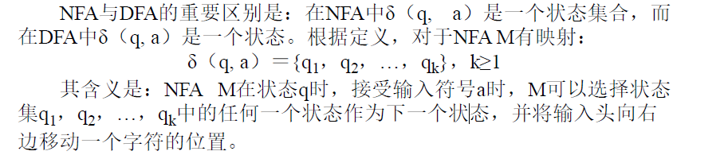
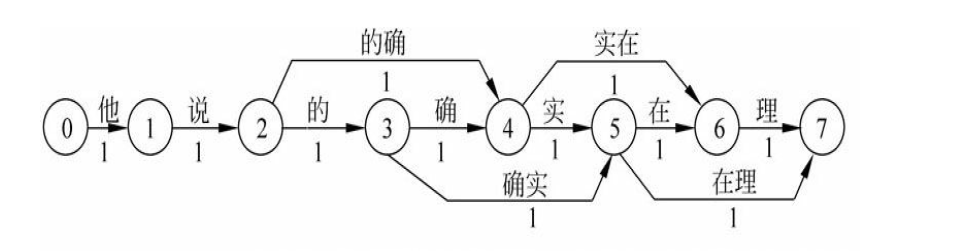

[TOC]

# 第一章 绪论

## 基本概念

### 语音和语言

语音和文字是构成
语言的两个基本属性，语音是语言的物质外壳，文字则是记录语言的书
写符号系统［黄伯荣等，1991］。

语音学（phonetics）是研究人类发音特点，特别是语音发音特点，
并提出各种语音描述、分类和转写方法的科学。

### 自然语言处理和计算语言学

自然语言处理（natural language processing, NLP）也称自然语言理解
（natural language understanding, NLU），从人工智能研究的一开始，它
就作为这一学科的重要研究内容探索人类理解自然语言这一智能行为的
基本方法。

**计算语言学**实际上包括以语音为主要研究对象的语音学基础及其语音处理技术研
究和以词汇、句子、话语或语篇（discourse）及其词法、句法、语义和
语用等相关信息为主要研究对象的处理技术研究。

**自然语言处理**一般不再被看作是计算语言学范畴内的一个研究分支，而两者
基本上是处于同一层次上的概念。

从术语的字面上来看，似乎“计算语言学”更侧重于计算方法和语言
学理论等方面的研究，而“自然语言理解”更偏向于对语言认知和理解过
程等方面问题的研究，相对而言，“自然语言处理”包含的语言工程和应
用系统实现方面的含义似乎更多一些，但是，在很多情况下我们很难绝
对地区分开“计算语言学”、“自然语言理解”与“自然语言处理”三个术语
之间到底存在怎样的包含或重叠关系以及各自不同的内涵和外延。

### 图灵测试

实际上，人们在自然语言处理领域研究的任何一个应用系统都可以
拿来做图灵测试。按照人的标准对这些系统的输出结果进行评价，从而
判断计算机系统是否达到了“理解”的效果。显然，被测试系统所表现出
来的性能反映了计算机系统的“理解”能力。因此，我们从事自然语言理
解研究的任务也就是研究和探索针对具体应用目的的新方法和新技术，
使实现系统的性能表现尽量符合人类理解的标准和要求。

## 研究内容

### 语言的研究层级

如果撇开语音学研究的层面，自然语言处理研究的问题一般会涉及
自然语言的形态学、语法学、语义学和语用学等几个层次。

**形态学（morphology）**：形态学（又称“词汇形态学”或“词法”）是
语言学的一个分支，研究词的内部结构，包括屈折变化和构词法两个部
分。

**语法学（syntax）**：研究句子结构成分之间的相互关系和组成句子
序列的规则。其关注的中心是：为什么一句话可以这么说，也可以那么
说？

**语义学（semantics）**：是一门研究意义，特别是语言意义的学科
［毛茂臣，1988］。语义学的研究对象是语言的各级单位（词素、词、
词组、句子、句子群、整段整篇的话语和文章，乃至整个著作）的意
义，以及语义与语音、语法、修辞、文字、语境、哲学思想、社会环
境、个人修养的关系，等等［陆善采，1993］。它所关注的重点
是：这个语言单位到底说了什么？

**语用学（pragmatics）**：是现代语言学用来指从使用者的角度研究
语言，特别是使用者所作的选择、他们在社会互动中所受的制约、他们
的语言使用对信递活动中其他参与者的影响。，语
用学可以是集中在句子层次上的语用研究，也可以是超出句子，对语言
的实际使用情况的调查研究，甚至与会话分析、语篇分析相结合，研究
在不同上下文中的语句应用，以及上下文对语句理解所产生的影响。其
关注的重点在于：为什么在特定的上下文中要说这句话？

### 研究难点

所有自然语言应用都需要解决的关键问题就是**歧义消解**（disambiguation）问题
和**未知语言现象**的处理问题。

一方面，自然语言中大量存在的歧义现
象，无论在词法层次、句法层次，还是在语义层次和语用层次，无论哪
类语言单位，其歧义性始终都是困扰人们实现应用目标的一个根本问
题。因此，如何面向不同的应用目标，针对不同语言单位的特点，研究
歧义消解和未知语言现象的处理策略及实现方法，就成了自然语言处理
面临的核心问题。

另一方面，对于一个特定系统来说，总是有可能遇到未知词汇、未
知结构等各种意想不到的情况，而且每一种语言又都随着社会的发展而
动态变化着，新的词汇（尤其是一些新的人名、地名、组织机构名和专
用词汇）、新的词义、新的词汇用法（新词类），甚至新的句子结构都
在不断出现，尤其在口语对话或计算机网络对话（通过MSN、QQ、
GTalk、Skype等形式）、微博、博客等中，稀奇古怪的词语和话语结构
更是司空见惯。因此，一个实用的自然语言处理系统必须具有较好的未
知语言现象的处理能力，而且有足够的对各种可能输入形式的容错能
力，即我们通常所说的系统的鲁棒性（robustness）问题。

## 研究方法

### 理性主义和经验主义

一般认为，自然语言处理中存在着两种不同的研究方法，一种是理
性主义（rationalist）方法，另一种是经验主义（empiricist）方法。

**理性主义**方法认为，人的很大一部分语言知识是与生俱来的，由遗
传决定的。持这种观点的代表人物是美国语言学家乔姆斯基（Noam
Chomsky），他的内在语言官能（innate language faculty）理论被广泛地
接受。乔姆斯基认为，很难知道小孩在接收到极为有限的信息量的情况
下，在那么小的年龄如何学会了如此之多复杂的语言理解的能力。因
此，理性主义的方法试图通过假定人的语言能力是与生俱来的、固有的
一种本能来回避这些困难的问题。

在具体的自然语言问题研究中，理性主义方法主张建立符号处理系
统，由人工整理和编写初始的语言知识表示体系（通常为规则），构造
相应的推理程序，系统根据规则和程序，将自然语言理解为符号结构
——该结构的意义可以从结构中的符号的意义推导出来。按照这种思
路，在自然语言处理系统中，一般首先由词法分析器按照人编写的词法
规则对输入句子的单词进行词法分析，然后，语法分析器根据人设计的
语法规则对输入句子进行语法结构分析，最后再根据一套变换规则将语
法结构映射到语义符号（如逻辑表达式、语义网络、中间语言等）。

而**经验主义**的研究方法也是从假定人脑所具有的一些认知能力开始
的。因此，从这种意义上讲，两种方法并不是绝对对立的。但是，经验
主义的方法认为人脑并不是从一开始就具有一些具体的处理原则和对具
体语言成分的处理方法，而是假定孩子的大脑一开始具有处理联想
（association）、模式识别（pattern recognition）和通用化
（generalization）处理的能力，这些能力能够使孩子充分利用感官输入
来掌握具体的自然语言结构。在系统实现方法上，经验主义方法主张通
过建立特定的数学模型来学习复杂的、广泛的语言结构，然后利用统计
学、模式识别和机器学习等方法来训练模型的参数，以扩大语言使用的
规模。因此，经验主义的自然语言处理方法是建立在统计方法基础之上
的，因此，我们又称其为统计自然语言处理（statistical natural language
processing）方法。

在统计自然语言处理方法中，一般需要收集一些文本作为统计模型
建立的基础，这些文本称为语料（corpus）。经过筛选、加工和标注等
处理的大批量语料构成的数据库叫做语料库（corpus base）。由于统计
方法通常以大规模语料库为基础，因此，又称为基于语料（corpusbased）
的自然语言处理方法。

实际上，理性主义和经验主义试图刻画的是两种不同的东西。
Chomsky的生成语言学理论试图刻画的是人类思维（I-language）的模式
或方法。对于这种方法而言，某种语言的真实文本数据（E-language）
只是提供间接的证据，这种证据可以由以这种语言为母语的人来提供。
而经验主义方法则直接关心如何刻画这些真实的语言本身（Elanguage）
。Chomsky把语言的能力（linguistic competence）和语言的表
现（linguistic performance）区分开来了。他认为，语言的能力反映的是
语言结构知识，这种知识是说话人头脑中固有的，而语言表现则受到外
界环境诸多因素的影响，如记忆的限制、对环境噪声的抗干扰能力等。

### 发展历程

理性主义和经验主义在基本出发点上的差异导致了在很多领域中都
存在着两种不同的研究方法和系统实现策略，这些领域在不同的时期被
不同的方法主宰着。

* 在20世纪20年代到60年代的近40年时间里，经验主义方法在语言
  学、心理学、人工智能等领域中处于主宰的地位，人们在研究语言运用
  的规律、言语习得、认知过程等问题时，都是从客观记录的语言、语音
  数据出发，进行统计、分析和归纳，并以此为依据建立相应的分析或处
  理系统。

* 大约从20世纪60年代中期到20世纪80年代中后期，语言学、心理
  学、人工智能和自然语言处理等领域的研究几乎完全被理性主义研究方
  法控制着，这一时期的计算语言学理论得到了长足
  的发展并逐渐成熟，出现了一系列重要的理论研究成果，其中，乔姆斯
  基的形式语言理论［Chomsky,1956］是影响最大的早期计算语言学句法
  理论。后来乔姆斯基又分别在20世纪50年代和70年代提出了转换生成语
  法和约束管辖理论。随后，很多学者又提出了扩充转移网络、词汇功能
  语法、功能合一语法、广义短语结构语法和中心驱动的短语结构语法等。

  1969年厄尔利（J.Earley）提出了Earley句法分析算法
  ［Earley,1970］；1980年马丁·凯（Martin Kay）提出了线图句法分析算
  法（chart parsing）［Allen,1995］；1985年富田胜（M.Tomita）提出了
  Tomita句法分析算法［Tomita,1985］。这些研究成果为自然语言自动句
  法分析奠定了良好的理论基础。在语义分析方面，1966年菲尔摩
  （C.J.Filmore）提出了格语法；1968年美国心理学家奎廉
  （M.R.Quilian）在研究人类联想记忆时提出了语义网络（semantic
  network）的概念；1972年美国人工智能专家西蒙斯（Simmous）等人首
  先将语义网络用于自然语言理解系统中；1974年威尔克斯（Y.Wilks）提
  出了优选语义学；20世纪70年代初，美国数理逻辑学家蒙塔格（Richard
  Montague）提出的蒙塔格语法，首次提出了利用数理逻辑来研究自然语
  言的句法结构和语义关系的设想，为自然语言处理研究开辟了一条新的
  途径。

* 大约在20世纪80年代后期，人们越来越多地关注工程化、实用化的
  解决问题方法，经验主义方法被人们重新认识并得到迅速发展。在自然
  语言处理研究中，重要的标志是基于语料库的统计方法被引入到自然语
  言处理中，并发挥出重要作用，很多人开始研究和关注基于大规模语料
  的统计机器学习方法及其在自然语言处理中的应用，并客观地比较和评
  价各种方法的性能。

  在这一时期，基于
  语料库的机器翻译（corpus-based machine translation）方法得到了充分发
  展，尤其是IBM的研究人员提出的基于噪声信道模型（noisy channel
  model）的统计机器翻译（statistical machine translation）模型［Brown et
  al.,1990,1993］及其实现的Candide翻译系统［Berger et al.,1994］，为经
  验主义方法的复苏和兴起吹响了号角，并成为机器翻译领域的里程碑。

  隐马尔可夫模型（hidden Markov model,
  HMM）等统计方法在语音识别中的成功运用对自然语言处理的发展也
  起到了推波助澜甚至是关键的作用，统计机器翻译中的许多思想都来源
  于语音识别中统计模型成功运用的经验，或在某种程度上受到了统计语
  音识别研究思路的启发。实践证明，除了语音识别和机器翻译以外，很
  多自然语言处理的研究任务，包括汉语自动分词和词性标注、文字识
  别、拼音法汉字输入等，都可以用噪声信道模型来描述和实现。

* 在20世纪80年代末期和90年代初期，曾经引发了关于理性主义和经
  验主义两种不同观点的激烈争论。但随着时间的推移，当人们从那些空
  泛的辩论中冷静下来以后，逐渐认识到，无论是理性主义也好，还是经
  验主义也罢，任何一种方法都不可能完全解决自然语言处理这一复杂问
  题，只有将两种方法很好地结合起来，寻找一种融合的解决问题办法，
  甚至建立一种新的理论方法才是自然语言处理研究的真正出路。

回顾自然语言处理技术半个多世纪的发展历程，黄昌宁等
（2002b）认为这一领域的研究取得了两点重要认识，即：①对于句法
分析，基于单一标记的短语结构规则是不充分的；②短语结构规则在真
实文本中的分布呈现严重的扭曲。换言之，有限数目的短语结构规则不
能覆盖大规模真实语料中的语法现象，这与原先的预期大相径庭。NLP
技术的发展在很大程度上受到这两个事实的影响。从这个意义上说，本
领域中称得上里程碑式的成果有三个：①复杂特征集和合一语法的提
出；②语言学研究中词汇主义的建立；③语料库方法和统计语言模型的
广泛运用。

### 研究现状

如果我们不考虑具体的
技术分支，从自然语言处理研究的总体状况来看，可以简单地用以下三
点来粗略地反映自然语言处理技术研究的现状：

* 已开发完成一批颇具影响的语言资源库，部分技术已达到或
  基本达到实用化程度，并在实际应用中发挥着巨大作用。例如，北京大
  学语料库和综合型语言知识库［俞士汶等，2003a,2003b］、
  HowNet〔10〕、LDC（Linguistic Data Consortium）〔11〕语言资源等
* 许多新的研究方向不断出现。正如我们前面指出的，受实际
  应用的驱动，自然语言处理技术不断与新的相关技术相结合，用于研究
  和开发越来越多的实用技术。
* 许多理论问题尚未得到根本性的解决。尽管许多理论模型在
  自然语言处理研究中发挥着重要作用，并且很多方法已经得到实际应用，如上下文无关文法、HMM、噪声信道模型等，但是，许多重要的
  问题仍未得到彻底、有效的解决，如语义理解问题、句法分析问题、指
  代歧义消解问题、汉语自动分词中的未登录词（unknown word）识别问
  题等。纵观整个自然语言处理领域，尚未建立起一套完整、系统的理论
  框架体系。许多理论研究仍处于盲目的探索阶段，如尝试一些新的机器
  学习方法或未曾使用过的数学模型，这些尝试和实验带有很强的主观性
  和盲目性。在技术实现上，许多改进往往仅限于对一些边角问题的修修
  补补，或者只是针对特定条件下一些具体问题的处理，未能从根本上建
  立一套广泛适用的、鲁棒的处理策略。总之，面对自然语言问题的复杂
  性和多变性，现有的理论模型和方法还远远不够，有待于进一步改进和
  完善，并期待着新的更有效的理论模型和方法的出现。

当然我们不能忘记，自然语言处理毕竟是认知科学、语言学和计算
机科学等多学科交叉的复杂问题，当我们从外层（或表层）研究语言理
解的理论方法和数学模型的同时，不应该忽略从内层揭示人类理解语言
机制的秘密，从人类认知机理和智能的本质上为自然语言处理寻求依
据。

# 第三章 形式语言与自动机

形式语言与自动机在自然语言处理中具有重要的用途。形式语言理
论是自然语言描述和分析的基础，自动机理论在自然语言的词法分析、
拼写检查和短语识别等很多方面都有着广泛的用途。

## 形式语言

### 什么是语言

乔姆斯基（Noam Chomsky）曾经把**语言**定义为：按照一定规律构成
的句子和符号串的有限或无限的集合。根据这个定义，无论哪一种语言
都是句子和符号串的集合，当然自然语言也不例外，汉语、英语等所有
自然语言，都是一个无限集合。

**语言描述**的三种途径：

* 穷举法：把语言中的所有句子都枚举出来。显然，这种方法
  只适合句子数目有限的语言。
* **文法**（产生式系统）描述：语言中的每个句子用严格定义的
  规则来构造，利用规则生成语言中合法的句子。
* **自动机法**：通过对输入的句子进行合法性检验，区别哪些是
  语言中的句子，哪些不是语言中的句子。

用文法来定义语言的优点是：由文法给予语言
中的句子以结构，各成分之间的结构关系清楚、明了。但是，如果要直
接用这些规则来确定一个字符串是否属于这套规则所定义的语言似乎并
不十分明确。而由自动机来识别一个字符串是否属于该语言则相对简
单，但自动机很难描述语言的结构。所以自然语言处理中的识别和分析
算法，大多兼取两者之长。

可以将文法看成是对语言集合的枚举过程；而自动机则是测试元素是否在集合中。

### 形式语言的定义

形式语言（formal language）是用来精确地描述语言（包括人工语言和自然语言）及其
结构的手段。形式语言学也称代数语言学。

如果每步推导中只改写最左边的那个非终结符，这种推导称为“最左推导”。反之，如果每次都只改写最右边的非
终结符，则为最右推导。最右推导又称规范推导。

### Chomsky 层级

在乔姆斯基的语法理论中，文法被划分为4种类型：3型文法、2型
文法、1型文法和0型文法，分别称为正则文法、上下文无关文法、上下
文相关文法和无约束文法。

在这种书写格式中，由于规则右部的非终结符号 B（如果有的话）出现在最左边，所以，这种形式的正则文法又叫左线性正则文法。类似的，也有右线性正则文法。总之，非终结符号只能出现在一侧。

从定义中我们可以看出，2型文法比3型文法少了一层限制，其规则
右端的格式没有约束。也就是说，规则左部的非终结符可以被改写成任
何形式。

根据上述定义我们不难看出，从0型文法到3型文法，对规则的约束
越来越多，每一个正则文法都是上下文无关文法，每一个上下无关文法
都是上下文有关文法，而每一个上下文有关文法都可以认为是0型文
法。因此，从0型文法到3型文法所识别的语言集合越来越小。

### 上下文无关文法和语法树

上下文无关文法产生句子的过程可以由语法书（syntactic tree）或者叫解析树（parsing tree）来表示。

正如上图所见，如果文法G对于同一个句子存在两棵或
两棵以上不同的分析树，那么，该句子是二义性的，文法G为二义性文
法。这就是句法分析中的消除歧义问题。

## 自动机

自动机是一种理想化的“机器”，它只是抽象分析问题的理论工具，
并不具有实际的物质形态。它是科学定义的**演算机器**，用来表达某种不
需要人力干涉的机械性演算过程。根据不同的构成和功能，自动机分成
以下4种类型：有限自动机（finite automata, FA）、下推自动机（pushdown
automata, PDA）、线性界限自动机（linear-bounded automata）和图
灵机（Turing machine）。

### 有限自动机

有限自动机又分为确定性有限自动机（definite finite state automata, DFSA）和不
确定性有限自动机（non-definite finite state automata, NFSA）两种。

#### DFSA

#### 用 DFSA 描述语言

所有被自动机接受的句子而所组成的语言就是被自动机 M 定义的语言。

#### NDFSA

#### 用 NDFSA 描述语言

同样可以用类似 DFSA 的原理考查一个句子是否可以被 NDFSA 接受，所有被接收的句子集合就是 NDFSA 所定义的语言。

由于给定一个 NDFSA 必然存在一个等价的 DFSA 跟它对应。因此其实二者描述语言的能力也是等价的。

#### 有限自动机描述正则语言

对于任意一个正则文法所产生的语言，总可以构造一个确定的有限自动机识别它。

### 下推自动机

下推自动机（PDA）可以看成是一个带有附加下推存储器的有限自动机，下推存储器是一个堆栈（stack）。

#### 用下推自动机描述语言

对于下推自动机，判断一种语言（或者一个句子）是否被PDA接受的标准有两种：句子结束时自动机是否处于终止状态；句子结束时下推储存器是否为空。

#### 下推自动机描述上下文无关语言

对于任意一个上下文无关文法所产生的语言，总可以构造一个确定的下推自动机识别它。

### 线性界限自动机

线性界限自动机是一个确定的单带图灵机，其读／写头不能超越原
输入带上字符串的初始和终止位置，即线性界限自动机的存储空间被输
入符号串的长度所限制。

如果L是一个上下文相关语言，则L由一个不确定的线性
界限自动机所接受。反之，如果L被一个线性界限自动机所接受，则L是
一个上下文相关语言。

### 图灵机

图灵机与有限自动机的区别在于图灵机可以通过其读写头改变输入
带上的字符，而有限自动机不能做到这一点。

图灵机相应的可以描述 0 型文法（即无约束文法）语言。

### 总结

归纳起来，各类自动机之间的主要区别是它们能够使用的**信息存储
空间**的差异：有限状态自动机只能用状态来存储信息；下推自动机除了
使用状态以外，还可以用下推存储器（堆栈）；线性界限自动机可以利
用状态和输入／输出带本身，因为输入／输出带没有“先进后出”的限
制，因此，其功能大于堆栈；而图灵机的存储空间没有任何限制。
从识别语言的能力上来看，有限自动机等价于正则文法；下推自动
机等价于上下文无关文法；线性界限自动机等价于上下文有关文法，而
图灵机等价于无约束文法。

## 自动机在自然语言处理中的应用

### 单词拼写

K.Oflazer曾将有限自动机用于英语单词的拼写检查［Oflazer,1996］。

一个基于有限状态机的识别器可以看作是一个弧上有字母标记a∈A
的有向图，字母表A上的字母构成的所有合法单词都是有限状态机中的
一条路径。那么，字符串识别的过程就是对有向图从初始状态到终止状
态遍历的过程，一条路径从初始状态到终止状态经过的所有弧上的字母
连接起来构成一个字符串。如果给定一个输入串，对其进行拼写检查的
过程实际上就是在给定阈值t（t＞0）的范围内，寻找所有那些与输入串
的编辑距离（minimum edit distance）小于t的路径，这些路径从初始状态到终止状态经过的所有
弧上的字母连接起来就是要找的与输入串最相似的单词。

为了提高搜索速度，可以把搜索空间限定在一个较小的范围内，尽
早把那些编辑距离超过给定阈值t的路径剪枝。为了判断哪些路径应该
被剪枝，Oflazer提出了剪除编辑距离或剪除距离（cut-off edit distance）
的概念。

### 单词形态分析

在实际应用中，除了有限状态机以外，我们还常常使用有限状态转
换机（finite state transducer, FST）的概念。简单地讲，有限状态转换机
与有限自动机（或有限状态机）的区别在于：FST在完成状态转移的同
时产生一个输出，而FA（或FSM）只实现状态的转移，不产生任何输
出。

用有限状态转换机进行英语单词的形态分析是常用的方法。例如，形容词
heavy在英文句子中可能以三种不同的形式出现：原型、比较级和最高
级。对于变形后的heavy，为了正确分析出其原型，可以通过构造状态
转换机的方法实现

这个状态图实际上表示的是除了识别heavy单词原型
以外，还可产生如下两条关于单词heavy的形态分析规则：
heavier→heavy＋er
heaviest→heavy＋est

### 词性消歧

一个词往往具有多种词性，如何根据上下文环境对词性消除歧义呢？

词性标注的方法很多，有限状态转换机方法是其中的一种。Roche
and Schabes（1995）在Brill（1992）建立的词性消歧规则的基础上通过
构造状态转换机，实现了一种词性消歧方法。

考虑到在词性标注的第一步需要对处理句子中的每个单词查
找词典，以获取其可能的词性。为了快速实现词典查找这一过程，
Roche and Schabes（1995）对词典的存储也采用了确定的有限状态自动
机的思想：

# 第四章 语料库与语言知识库

任何一个信息处理系统都离不开数据和知识库的支持，自然语言处
理系统也不例外。语料库和语言知识库作为基本的资源，尽管在不同方
法的自然语言处理系统中所起的作用不同，但是，它们在不同层面共同
构成了各种自然语言处理方法赖以实现的基础，有时甚至是建立或改进
一个自然语言处理系统的“瓶颈”。

## 语料库语言学

语料库（corpus base）就是存放语言材
料的数据库。那么，顾名思义，语料库语言学（corpus linguistics）就是
基于语料库进行语言学研究的一门学问。具体一点讲，语料库语言学是
研究自然语言机读文本（或称“电子文本”）的采集、存储、标注、检
索、统计等方法的一门学问，其目的是通过对客观存在的大规模真实文
本中的语言事实进行定量分析，为语言学研究或自然语言处理系统开发
提供支持。（**文本数据+统计方法+语言知识**）
有专家认为，语料库语言学这一术语有两层含义，一是利用语料库
对语言的某个方面进行研究，也就是说“语料库语言学”不是一个新学科
的名称，而仅仅反映了一个新的研究手段。二是依据语料库所反映出来
的语言事实对现行语言学理论进行批判，提出新的观点或理论。只有在
这个意义上“语料库语言学”才是一个新学科的名称

## 发展历程

早期的语料库语言学指的是20世纪50年代中期以前，即乔姆斯基提
出的转换生成语法理论之前所有基于语言材料的语言研究。

1957年乔姆斯基的《句法理论》及其以后一系列著作的发表，从根
本上改变了语料库语言学的发展状况。**乔姆斯基及其转换生成语法学派**
否定早期的语料库研究方法的主要依据有如下两点：

* 语料研究的方向有误。乔姆斯基认为，语言研究的主要目标
  是建立一种能够反映说话人心理现实的语言认知模式，即语言能力模
  式。因为只有语言能力才能对说话人的语言知识做出合理的解释和描
  述，而语言运用只是语言能力的外在证据。它往往会因超语言因素而发
  生变化，因此，它不能确切地反映语言能力。语料从本质上只是外在化
  的话语的汇集，基于语料建立的经验模式充其量只是对语言能力做出的部分解释，因而，语料并非语言学家从事语言研究的得力工具。
* 语料的不充分性。乔姆斯基在《句法理论》一书中首次发现
  英语短语结构规则具有递归性。这种递归性表明，自然语言的句子是无
  限的，而作为语料基本单位的句子具有无限性，这种无限性决定了语料
  是难以穷尽的。换句话说，语料永远是不完整、不充分的。

转换生成语法学派的上述批评从根本上改变了20世纪50年代结构主
义语言学的研究方向，在随后的近20年里，整个语言学界几乎唯直觉是
从，基于语料的研究方法由此进入沉寂时期。

在沉寂了近20年之后，语料库语言学自20世纪80年代开始复苏，并
得到迅猛发展，从此进入一个空前繁荣阶段。这主要表现在如下两个方
面：

* 第二代语料库相继建成。
* 基于语料的研究项目大量增加。

语料库语言学在20世纪80年代再度崛起的主要原因可以粗略归结为
如下两条：（1）基于规则的句法—语义分析方法赖以利用的语言知识
无论是词典信息还是语法规则，主要通过语言学家的内省来获取的，而
实际上这种知识不可能覆盖真实文本中出现的所有语言事实；（2）计
算机和计算技术的迅猛发展，使语料库的规模急速增长，从早期的百万
词次猛增到数亿词次。

语料库语言学的复兴，除了与计算机技术的迅速发展和普及有直接
关系以外，还有一方面的原因就是，转换生成语言学派对语料库语言学
的批判和否定在经过20多年的实践检验之后，证明是错误的或者是片面
的。因此，20世纪80年代以来语料库语言学的复兴，在很大程度上反映
了语言学界一种较为普遍的心态，就是建立语言研究中人工数据和自然
数据的平衡，实现语料统计方法和唯理分析方法的优势互补。

## 语料库的类型

根据不同的划分标准，语料库可以分为多种类型。这里主要介绍以下几种划分方法。

### 平衡语料库与平行语料库
**平衡语料库**着重考虑的是语料的代表性与平衡性。

黄昌宁等（2002a）认为，语料库的代表性和平衡性是一个迄今都
没有公认答案的复杂问题。G.N.Leech（1992）曾指出，一个语料库具
有代表性是指在该语料库上获得的分析结果可以概括成为这种语言整体
或其指定部分的特性。早期的Brown语料库和LOB语料库的结构是经过
精心设计的，因此，它们被分别视为美国英语和英国英语在那一特定时
期的代表。

由于语言是动态发展的，每一时期总会有一些词汇被“淘汰”，也总
会有一些新的词语产生，即使同一词语在不同的历史时期使用的频度也
不一样。因此，如何把握语料的平衡性的确是一个复杂的问题。

所谓的**平行语料**一般有两种含义，一种是指在同一种语言的语料上
的平行，例如，“国际英语语料库”，共有20个平行的子语料库，分别来
自以英语为母语或官方语言以及主要语言的国家，如英国、美国、加拿
大、澳大利亚、新西兰等。其平行性表现为语料选取的时间、对象、比
例、文本数、文本长度等几乎是一致的。建库的目的是对不同国家的英
语进行对比研究。对平行语料库的另一种理解是指两种或多种语言之间的平行采样和
加工。例如，机器翻译中的双语对齐语料库（句子对齐或段落对齐）。

### 通用语料库与专用语料库
所谓的通用语料库实际上与平衡语料库是从不同角度看问题的结
果，或者说是与专用领域对举的结果。为了某种专门的目的，只采集某
一特定领域、特定地区、特定时间、特定类型的语料构成的语料库就是
专用语料库。例如，新闻语料库、科技语料库、中小学语料库、北京口
语语料库等。

### 共时语料库与历时语料库
所谓共时语料库是为了对语言进行共时研究而建立的语料库。

无论所采集语料的时
间段有多长，只要研究的是一个平面上的元素或元素的关系，就是共时
研究，所建立的语料库就是共时语料库。

所谓的历时语料库是为了对语言进行历时研究而建立的语料库。根据历时
语料库得到的统计结果就不像共时语料库的统计结果是一个频次点，而
是依据时间轴的等距离抽样得到的若干频次变化形成的演变曲线。

### 生语料与标注语料库
所谓生语料是指没有经过任何加工处理的原始语料数据（corpora
with raw data）。组织者只是简单地把语料收集起来，不加任何标注信
息。

标注语料库是指经过加工处理、标注了特定信息的语料库。根据加
工程度不同，标注语料库又可以细分为分词语料库（主要指汉语）、分
词与词性标注语料库、树库（tree bank）（以句法结构信息为主要标注内容）、命题库（proposition
bank）（以谓词-论元结构信息为主要标注内容）、篇章树库（discourse tree bank）（以篇章结构信息为主要内容）等。

## 汉语语料库建设问题

如下两个问题在汉语语料库建设中表现尤为突出。

### 语料库建设的规范问题
语料库加工的规范问题是语料库建设中的关键问题之一，如果没有
公认的、统一的语料库加工规范，语料库的建设和利用势必会受到严重
制约。

尽管目前我国政府主管部门已经意识到制定中文信息处理所需要的
有关语言文字规范和标准的重要性和紧迫性，并及时提出了《信息处理
用现代汉语词类标记集规范》的立项，但是，到目前为止，这种“规
范”并没有被普遍接受和使用。而且，目前提出的一些“规范”往往只重
视了文本内的语言标记，没有及时制定语料库的规范。对于文本的属性
这一更高层次的规范，至今没有立项。没有规范语料库的属性，没有规
范语料库中文本的属性，语料库的资源就很难重复使用，很难进行语料
库与语料库之间的整合，很难由一些母语料库去整合生成一些新的子语
料库［张普，2003］。实际上，这也是语料资源长期无法共享，大量语
料库处于小规模、低水平、重复建设状态的主要原因之一。

### 产权保护和国家语料库建设问题
张普认为，汉语语料库和世界各国的语料库一样都面临知识产权的
问题，这个问题不从根本上解决，将严重影响我国的语料库建设及其应
用。

在信息社会和数字化生存时代，我们要把语言资源的收集、
保护、开发提高到一种对待国家资源的高度来认识。国家要像对待人力
资源、地矿资源、国土资源、森林资源、水源资源一样对待语言资源，
语言资源是国家最重要的信息资源。语料库的建设、保护、开发要站在
国家面向未来的一种战略决策高度，要作为一种对待国家资源的行为，
才能得到法律的保护，纳入法制的轨道［张普，2003］。

## 典型语料库

详见书籍

## 语言知识库

语言知识库在自然处理和语言学研究中具有重要的用途，无论是词
汇知识库、句法规则库，还是语法信息库、语义概念库等各类语言知识
资源，都是自然语言处理系统赖以建立的重要基础，甚至是不可或缺的
基础。

需要说明的是，“语言知识库”比“语料库”包含更广泛的内容。概括
起来讲，语言知识库可分为两种不同的类型：一类是词典、规则库、语
义概念库等，其中的语言知识表示是显性的，可采用形式化结构描述；
另一类语言知识存在于语料库之中，每个语言单位的出现，其范畴、意
义、用法都是确定的。语料库的主体是文本，即语句的集合，每个语句
都是线性的非结构化的文字序列，其中包含的知识都是隐性的。语料加
工的目的就是要把隐性的知识显性化，以便于机器学习和引用。

### WordNet

WordNet是由美国普林斯顿大学（Princeton University）认知科学实
验室（Cognitive Science Laboratory〔22〕）George A.Miller领导的研究组
开发的英语机读词汇知识库。

WordNet的建立有三个基本前提：①“可分离性假设（separability
hypothesis）”，即语言的词汇成分可以被离析出来并专门针对它加以研
究。 ②“模式假设（patterning hypothesis）”：一个人不可能掌握他运用
一种语言所需的所有词汇，除非他能够利用词义中存在的系统的模式和
词义之间的关系。 ③“广泛性假设（comprehensiveness hypothesis）”：计
算语言学如果希望能像人那样处理自然语言，就需要像人那样储存尽可
能多的词汇知识［Miller et al.,1993］。

WordNet描述的对象包含英语复合词（compound）、短语动词
（phrasal verb）、搭配词（collocation）、成语（idiomatic phrase）和单
词（word），其中，单词（word）是最基本的单位。

它既不同于传统的词典（dictionary），也不同于同义词词典（thesaurus），而
是混合了这两种类型的词典：

* WordNet与同义词词林相似，它也是
  以同义词集合（synset）作为基本的建构单位（building block）组织的，
  如果用户自己有一个已知的概念，就可以在同义词集合中找到一个适合
  的词去表达这个概念。与传统的词典相似的是WordNet给出了同义词集
  合的定义和例句，在同义词集合中包含对这些同义词的定义。对一个同
  义词集合中的不同词，分别用适当的例句加以区分。
* WordNet不只是用同义词
  集合的方式罗列概念，而且同义词集合之间是以一定数量的关系类型相
  互关联的。这些关系包括同义关系（synonymy）、反义关系
  （antonymy）、上下位关系（hypernymy/hyponymy）、整体与部分关系
  （meronymy）和继承关系（entailment）等，其基础语义关系是同义关
  系。
* 但WordNet中不包括发音、派生形态、词源信
  息、用法说明、图示举例等，而是尽量使词义之间的关系明晰并易于使
  用。
* 在WordNet中，大多数同义词集合（synset）有说明性的注释
  （explanatory gloss）

综上所述，WordNet是一个按语义关系网络组织的巨大词库，多种
**词汇关系**和**语义关系**被用来表示词汇知识的组织方式。词形式（word
form）和词义（word meaning）是WordNet源文件中可见的两个基本构
件，词形式以规范的词形表示，词义以同义词集合（synset）表示。词
汇关系是两个词形式之间的关系，而语义关系是两个词义之间的关系。

### FrameNet

在FrameNet中，框架是组织词汇语义知识的基本手段。每个词汇单
元（lexical unit, LU）是由词和对应的一个词义构成的词汇－词义对。

对自然语言处
理的研究者来说，FrameNet是一个标注了170000多个句子的训练集，可
用于语义角色标注研究。从事FrameNet研究的Berkeley课题组还定义了
1000多个语义框架，通过一个框架关系系统将它们连接在一起，为事件
和意图行为推理提供了基础。

### 北京大学综合型语言知识库

北京大学计算语言学研究所（ICL/PKU）俞士汶教授领导建立的综
合型语言知识库（简称CLKB）涵盖了词、词组、句子、篇章各单位和
词法、句法、语义各层面，从汉语向多语言辐射，从通用领域深入到专
业领域。CLKB是目前国际上规模最大且获得广泛认可的汉语语言知识
资源。

GKB以复杂特征集和合一运算理论为依据，采用“属性—属性值”的
形式详细描述词语的句法知识。

现代汉语多级标注语料库（word-sense tagging corpus, STC）是
ICL/PKU在对《人民日报》语料进行词语切分和词性标注，建立的大规
模现代汉语基本标注语料库（规模达6000万字）的基础上，以《语法信
息词典》和《语义词典》为参考，加注不同粒度的词义信息之后形成
的。基本标注语料库中的人名、地名及团体机构名等命名实体，都用相
应标记予以了标识。

### HowNet

知网（HowNet）是机器翻译专家董振东和董强经过十多年的艰苦
努力创建的语言知识库，是一个以汉语和英语的词语所代表的概念为描
述对象，以揭示概念与概念之间以及概念所具有的属性之间的关系为基
本内容的常识知识库。

（1）自然语言处理系统最终需要强大的知识库支持。
（2）关于什么是知识，尤其关于什么是计算机可处理的知识，他
提出：知识是一个系统，是一个包含着各种概念与概念之间的关系，以
及概念的属性与属性之间的关系的系统。
（3）关于如何建立知识库，他提出应首先建立一种可以被称为知
识系统的常识性知识库，它以通用的概念为描述对象，建立并描述这些
概念之间的关系。
（4）关于由谁来建立知识库，他指出知识掌握在千百万人的手
中，知识又是那么博大精深，靠三五个人甚至三五十人是不可能建立真
正意义上的全面的知识库的。他指出：首先应该由知识工程师来设计知
识库的框架，并建立常识性知识库原型。在此基础上再向专业性知识库
延伸和发展。专业性知识库或称百科性知识库，主要靠专业人员来完
成。

基于上述观点，董振东提出了知网系统的哲学思想：世界上一切事
物（物质的和精神的）都在特定的时间和空间内不停地运动和变化。它
们通常是从一种状态变化到另一种状态，并通常由其属性值的改变来体
现。比如，人的生、老、病、死是一生的主要状态，这个人的年龄（属
性）一年比一年大{属性值}，随着年龄的增长头发的颜色（属性）变为
灰白{属性值}。

知网是一个知识系统，而不是一部语义词典。知网用概念与概念之
间的关系以及概念的属性与属性之间的关系形成一个网状的知识系统，
这是它与其他树状词汇数据库的本质不同。

### 概念层次网络

概念层次网络（Hierarchical Network of Concepts, HNC）是中国科学
院声学研究所黄曾阳建立的面向整个自然语言理解的理论框架。，HNC理论创立了基于语义的自然语言表述和处理模式。

传统的语言表示和处理模式以语法为基础。语法有狭义与广义之分，狭
义语法是指以形态变化和虚词搭配为依托的语言法则，这些法则里本来
包含语义信息，但语法学从自身研究的便利出发曾长期有意脱离语义而
自成体系。这个状况直到乔姆斯基的转换生成语法和菲尔墨的格语法出
现以后才发生了变化，随后的功能语法继承了乔姆斯基和菲尔墨的传
统，这些语法应称为广义语法，它包含了语义甚至语用。但是，广义语
法学虽然融入了语义知识，并未对语义表述给出完善的理论框架。HNC
理论从根本上改变了这一状况，“根本”的具体表现就是建立了表述自然
语言概念和语句的两套数学表示式［苗传江，1998］。

## 语言知识库与本体论

详见书籍

# 第五章 语言模型

语言模型（language model, LM）在自然语言处理中占有重要的地
位，尤其在基于统计模型的语音识别、机器翻译、汉语自动分词和句法
分析等相关研究中得到了广泛应用。目前主要采用的是n元语法模型
（n-gram model），这种模型构建简单、直接，但同时也因为数据缺乏
而必须采取平滑（smoothing）算法。

## N元语法模型

详见书籍

## 各种平滑技术

详见书籍

## 自适应语言模型

在自然语言处理系统中，语言模型的性能好坏直接影响整个系统的
性能。尽管语言模型的理论基础已比较完善，但在实际应用中常常会遇
到一些难以处理的问题。其中，模型对跨领域的脆弱性（brittleness
across domains）和独立性假设的无效性（false independence
assumption）是两个最明显的问题。也就是说，一方面在训练语言模型
时所采用的语料往往来自多种不同的领域，这些综合性语料难以反映不
同领域之间在语言使用规律上的差异，而语言模型恰恰对于训练文本的
类型、主题和风格等都十分敏感；另一方面，n元语言模型的独立性假
设前提是一个文本中的当前词出现的概率只与它前面相邻的n-1个词相
关，但这种假设在很多情况下是明显不成立的。另外，香农实验
（Shannon-style experiments）表明，相对而言，人更容易运用特定领域
的语言知识、常识和领域知识进行推理以提高语言模型的性能（预测文
本的下一个成分）［Rosenfeld,2000］。因此，为了提高语言模型对语
料的领域、主题、类型等因素的适应性，［Kupiec,1989］和［Kuhn and
De Mori, 1990］等提出了自适应语言模型（adaptive language model）的
概念。

### 基于缓存的语言模型

基于缓存的语言模型自适应方法针对的问题是，在文本中刚刚出现
过的一些词在后边的句子中再次出现的可能性往往较大，比标准的n元
语法模型预测的概率要大。针对这种现象，cache-based自适应方法的基
本思路是，语言模型通过n元语法和缓存概率的线性插值求得：

其中缓存概率求解的直观是：人们希望越是临近的词，对缓存概率的贡献越大。

### 基于混合方法的自适应语言模型

基于混合方法的自适应语言模型针对的问题是，由于大规模训练语
料本身是异源的（heterogenous），来自不同领域的语料无论在主题
（topic）方面，还是在风格（style）方面，或者同时在这两方面都有一
定的差异，而测试语料一般是同源的（homogeneous），因此，为了获
得最佳性能，语言模型必须适应各种不同类型的语料对其性能的影响。
基于混合方法的自适应语言模型的基本思想是，将语言模型划分成
n个子模型M1，M2，…，Mn，整个语言模型的概率通过下面的线性插值
公式计算得到：

### 基于最大熵的语言模型

上面介绍的两种语言模型自适应方法采用的思路都是分别建立各个
子模型，然后，将子模型的输出组合起来。基于最大熵的语言模型却采
用不同的实现思路，即通过结合不同信息源的信息构建一个语言模型。
每个信息源提供一组关于模型参数的约束条件，在所有满足约束的模型
中，选择熵最大的模型。

由于最大熵模型能够较好地将来自不同信息源的模型结合起来，获
得性能较好的语言模型，因此，有些学者研究将基于主题的语言模型
（topic-based LM）（主题条件约束）与n元语法模型相结合，用于对话
语音识别、信息检索（information retrieval, IR）和隐含语义分析

# 第六章 概率图模型

动态贝叶斯网络（dynamic Bayesian networks, DBN）用于处理随时
间变化的动态系统中的推断和预测问题。其中，隐马尔可夫模型
（hidden Markov model, HMM）在语音识别、汉语自动分词与词性标注
和统计机器翻译等若干语音语言处理任务中得到了广泛应用；卡尔曼滤
波器则在信号处理领域有广泛的用途。马尔可夫网络（Markov
network）又称马尔可夫随机场（Markov random field, MRF）。马尔可夫
网络下的条件随机场（conditional random field, CRF）广泛应用于自然语
言处理中的序列标注、特征选择、机器翻译等任务，波尔兹曼机
（Boltzmann machine）近年来被用于依存句法分析［Garg and Henderson,
2011］和语义角色标注［庄涛，2012］等。

由于自然语言处理中需要解决的问题大多数属于“线”的序列结构，因此我们分别
以HMM（生成式）和线性链式CRF（判别式）为例来介绍自然语言处
理中的概率图模型。其中，HMM以朴素贝叶斯（naΪve Bayes）为基础，
CRF以逻辑回归为基础。

## 贝叶斯网络 - BN

贝叶斯网络又称为信度网络或信念网络（belief networks），是一种
基于概率推理的数学模型，其理论基础是贝叶斯公式。贝叶斯网络的概
念最初是由Judea Pearl于1985年提出来的〔1〕，其目的是通过概率推理处
理不确定性和不完整性问题。

形式上，一个贝叶斯网络就是一个有向无环图（directed acyclic
graph, DAG），结点表示随机变量，可以是可观测量、隐含变量、未知
参量或假设等；结点之间的有向边表示条件依存关系，箭头指向的结点
依存于箭头发出的结点（父结点）。

### 马尔可夫模型 - MM

马尔可夫模型是一种用于对随机过程建模的贝叶斯网络模型。

我们知道，随机过程又称随机函数，是随时间而随机变化的过程。
马尔可夫模型（Markov model）描述了一类重要的随机过程。我们常常
需要考察一个随机变量序列，这些随机变量并不是相互独立的，每个随
机变量的值依赖于这个序列前面的状态。如果一个系统有N个有限状态
S＝{s1，s2，…，sN}，那么随着时间的推移，该系统将从某一状态转移
到另一状态。Q＝（q1，q2，…，qT）为一个随机变量序列，随机变量
的取值为状态集S中的某个状态，假定在时间t的状态记为qt。对该系统
的描述通常需要给出当前时刻t的状态和其前面所有状态的关系：

可见马尔可夫模型对序列数据做出了很强的条件独立假设。马尔科夫模型由状态集合、初始状态概率以及状态转移概率来定义。

马尔可夫模型又可视为**随机的有限状态机**。对于每个状态来说，发出弧上的概率和为1。从图可以看出，马尔可夫模型可以看作是一个转移弧上有概率的非确定的有限状态自动机。

此外，我们可以看出n元语法模型就是n-1阶马尔可夫模型。

### 隐马尔可夫模型 - HMM

在马尔可夫模型中，每个状态代表了一个可观察的事件，所以，马
尔可夫模型有时又称作可视马尔可夫模型（visible Markov model，
VMM），这在某种程度上限制了模型的适应性。在隐马尔可夫模型
（HMM）中，我们不知道模型所经过的状态序列，只知道状态的概率
函数，也就是说，观察到的事件是状态的随机函数，因此，该模型是一
个双重的随机过程。其中，模型的状态转换过程是不可观察的，即隐蔽
的，可观察事件的随机过程是隐蔽的状态转换过程的随机函数。

一般地，一个HMM记为一个五元组μ＝（S，K，A，B，π），其
中，S为状态的集合，K为输出符号的集合，π，A和B分别是初始状态的
概率分布、状态转移概率和符号发射概率。为了简单，有时也将其记为
三元组μ＝（A，B，π）。

### HMM 三个要求解的问题

#### 观察序列的概率求解

前向算法；后向算法；

#### 最可能状态序列求解

Viterbi 算法

#### HMM 模型的参数估计

EM 算法

### 层次化的隐马尔可夫模型 - HHMM

当序列长度较大时，隐马尔可夫模型的复杂度将会急剧增大，因此，Shai
Fine等人提出了层次化隐马尔可夫模型（hierarchical hidden Markov
models, HHMM）

## 马尔可夫网络 - MRF

马尔可夫网络（又称为马尔可夫随机场 Markov random field）与贝叶斯网络有类似之处，也可用于表示变量之间的
依赖关系。但是，它又与贝叶斯网络有所不同。一方面，它可以表示贝
叶斯网络无法表示的一些依赖关系，如循环依赖；另一方面，它不能表
示贝叶斯网络能够表示的某些关系，如推导关系。

马尔可夫网络是一组有马尔可夫性质的随机变量的联合概率分布模
型，它由一个无向图G和定义于G上的势函数组成。

## 最大熵模型 - MEM

最大熵模型的基本原理是：在只掌握关于未知分布的部分信息的情
况下，符合已知知识的概率分布可能有多个，但使熵值最大的概率分布
最真实地反映了事件的分布情况，因为熵定义了随机变量的不确定性，
当熵最大时，随机变量最不确定，最难准确地预测其行为。也就是说，
在已知部分信息的前提下，关于未知分布最合理的推断应该是符合已知
信息最不确定或最大随机的推断。

## 最大熵马尔可夫模型 - MEMM

最大熵马尔可夫模型（maximum-entropy Markov model, MEMM）又
称条件马尔可夫模型（conditional Markov model, CMM），由Andrew
McCallum, Dayne Freitag和Fernando Pereira三人于2000年提出［McCallum
et al., 2000］。它结合了隐马尔可夫模型和最大熵模型的共同特点，被
广泛应用于处理序列标注问题。

文献［McCallum et al., 2000］认为，在HMM模型中存在两个问
题：①在很多序列标注任务中，尤其当不能枚举观察输出时，需要用大
量的特征来刻画观察序列。如在文本中识别一个未见的公司名字时，除
了传统的单词识别方法以外，还需要用到很多特征信息，如大写字母、
结尾词、词性、格式、在文本中的位置等。也就是说，我们需要用特征
对观察输出进行参数化。②在很多自然语言处理任务中，需要解决的问
题是在已知观察序列的情况下求解状态序列，HMM采用生成式的联合
概率模型（状态序列与观察序列的联合概率P（ST，OT））来求解这种
条件概率问题P（ST|OT）（参见6.4节），这种方法不适合处理用很多特
征描述观察序列的情况。为此，MEMM直接采用条件概率模型
P（ST|OT），从而使观察输出可以用特征表示，借助最大熵框架进行特
征选取。

在HMM中，当前时刻的观察输出只取决于当前状态，而在MEMM中，当前时刻的观察输出还可能
取决于前一时刻的状态。

HMM 解码时求解：

MEMM 解码时求解：

MEMM是有向图和无向图的混合模型，其主体还是有向图框架。与
HMM相比，MEMM的最大优点在于它允许使用任意特征刻画观察序
列，这一特性有利于针对特定任务充分利用领域知识设计特征。MEMM
与HMM和条件随机场（conditional random fields, CRFs）模型（见6.9
节）相比，MEMM的参数训练过程非常高效，在HMM和CRF模型的训
练中，需要利用前向后向算法作为内部循环，而在MEMM中估计状态转
移概率时可以逐个独立进行。MEMM的缺点在于存在标记偏置问题
（label bias problem），其中一个原因是熵低的状态转移分布会忽略它
们的观察输出，而另一个原因是MEMM像HMM一样，其参数训练过程
是自左向右依据前面已经标注的标记进行的，一旦在实际测试时前面的
标记不能确定时，MEMM往往难以处理。

## 条件随机场 - CRF

条件随机场（conditional random fields, CRFs）由J. Lafferty等人
（2001）提出，近几年来在自然语言处理和图像处理等领域中得到了广
泛的应用。
CRF是用来标注和划分序列结构数据的概率化结构模型。言下之
意，就是对于给定的输出标识序列Y和观测序列X，条件随机场通过定
义条件概率P（Y|X），而不是联合概率分布P（X，Y）来描述模型。
CRF也可以看作一个无向图模型或者马尔可夫随机场（Markov random
field）［Wallach, 2004］。

相对于HMM，CRF的主要优点在于它的条件随机性，只需要考虑
当前已经出现的观测状态的特性，没有独立性的严格要求，对于整个序
列内部的信息和外部观测信息均可有效利用，避免了MEMM和其他针对
线性序列模型的条件马尔可夫模型会出现的标识偏置问题。CRF具有
MEMM的一切优点，两者的关键区别在于，MEMM使用每一个状态的
指数模型来计算给定前一个状态下当前状态的条件概率，而CRF用单个
指数模型来计算给定观察序列与整个标记序列的联合概率。因此，不同
状态的不同特征权重可以相互交替代换

# 第七章 自动分词、命名实体识别与词性标注
由于词是最小的能够独立运用的语言单位，而很多孤立语和黏着语
（如汉语、日语、越南语、藏语等）的文本不像西方屈折语的文本，词
与词之间没有任何空格之类的显式标志指示词的边界，因此，自动分词
问题就成了计算机处理孤立语和黏着语文本时面临的首要基础性工。

## 汉语分词难点

简单地讲，汉语自动分词就是让计算机系统在汉语文本中的词与词之间自动加上空格或其他边界标记。汉语自动分词的主要困难来自如下三个方面：**分词规范**、**歧义切分**和**未登录词的识别**。

### 分词规范

正如刘开瑛（2000）指出的，“词”这个概念一直是汉语语言学界纠
缠不清而又挥之不去的问题。“词是什么”（词的抽象定义）及“什么是
词”（词的具体界定），这两个基本问题有点飘忽不定，迄今拿不出一
个公认的、具有权威性的词表来。主要困难出自两个方面：

* 一方面是单字词与词素之间的划界
* 另一方面是词与短语（词组）的划界

此外，对于汉语“词”的认识，普通说话人的语感与语言学家的标准也有较大的
差异。有关专家的调查表明，在母语为汉语的被试者之间，对汉语文本
中出现的词语的认同率只有大约70％，从计算的严格意义上说，自动分
词是一个没有明确定义的问题［黄昌宁等，2003］。也即对汉语认识上的差异，必然会给自动
分词造成困难。

1992年国家标准局颁布了作为国家标准的《信息处理用现代汉语分
词规范》［刘源等，1994；刘开瑛，2000］。在这个规范中，大部分规
定都是通过举例和定性描述来体现的（而非定量，因此没有很大的实际指导意义）。

### 歧义切分

梁南元（1987a）最早对歧义字段进行了比较系统的考察。他定义了以下两种基本的切分歧义类型：

* 交集型切分歧义：汉字串AJB称作交集型切分歧义，如果满足AJ、JB同时为词，此时汉字串J称作交集串。这种情况在汉语文本中非常普遍，如：“大学生”、“研究生物”、“从小学起”、“为人民工作”等。

  一个交集型切分歧义所拥有的交集串的集合称为交集串链，它的个数称为链长。例如，交集型切分歧义“结合成分子”、“结合”、“合成”、“成分”、“分子”均成词，交集串的集合为｛“合”，“成”，“分”｝，因此，链长为3。

* 组合型切分歧义：汉字串AB称作多义组合型切分歧义，如果满足A、B、AB同时为词。例如：“将来”、“现在”、“才能”、“学生会”等。

侯敏等（1995）认为，汉语自动分词中的歧义现象并不能简单地划分为交集型和组合型两种，就字段的结构形式而言，至少还可以分出一种“混合型”。混合类型的歧义字段在语言事实中并不少见，它集交集型与组合型的特点于一身，而且情况更复杂。如：“太平淡”是交集型歧义，而其中“太平”是组合型歧义。

综上所述，汉语词语边界的歧义切分问题比较复杂，处理这类问题
时往往需要进行复杂的上下文语义分析，甚至韵律分析，包括语气、重
音、停顿等。

### 未登录词的识别

未登录词又称为生词（unknown word），可以有两种解释：一是指
已有的词表中没有收录的词；二是指已有的训练语料中未曾出现过的
词。在第二种含义下，未登录词又称为集外词（out of vocabulary,
OOV），即训练集以外的词。由于目前很多自然语言处理都基于
大规模训练语料，来获取词表，因此通常情况下将OOV与未登录词看作一回事。

未登录词的情况比较复杂，可以粗略划分为如下几种类型：①新出
现的普通词汇，如博客、超女、恶搞、房奴、给力、奥特等，尤其在网
络用语中这种词汇层出不穷。②专有名词（proper names）。指人名、地名和组织机构名、时间和数字表达（日期、时刻、时段、数量值、百分比、序数、货币数量等），即命名实体（named entity）。。③专业名词和研究领域名称。如三聚氰胺、苏丹红、禽流感、堰塞湖等；④其他专用名词，如新出现的产
品名，电影、书籍等文艺作品的名称，等等。

对于大规模真实文本来说，未登录词对于分词精度的影响远远超过了歧义切分，未登录词中又以命名实体对分词的影响最大。也就是说在汉语分词系统中对于未登录词的处理，尤其是对命名实体的处理，远比对切分歧义词的处理重要得多。

未登录词的识别面临很多困难。一方面，很多未登录词都是由普通词汇构成的，长度不定，也没有明显的边
界标志词；另一方面，有些专有名词的首词和尾词可能与上下文中的其他词汇存在交集型歧义切分：

人在辨识这种用语时主要靠对文字语义的理解，甚至涉及时代和社会背景
知识，对计算机分词系统来说，这恐怕是很难做到的事情。计算机网
络、通信和各种媒体技术的快速发展为新词的创造和传播提供了极大便
利，在口语和网络通信语言中，大量涌现的新词语（如博客、微博、
BBS、电子邮件、聊天室等）常常让人目不暇接。同时，很多新词语的
生存周期也非常短暂，如昙花一现，甚至有些用语还没有来得及被大众
接受，更没有来得及讨论其界定标准，就已经消失了。

因此，对于一个分词系统来说，如果不能实时获取和更
新训练语料，并及时地调整系统参数（这个过程本身就涉及新词的界定
问题），一旦这类词语出现在待切分文本中，其切分结果几乎可以肯定
是错误的。不过从某种意义上讲，这类错误没有理由成为我们关注的重
点，至少不应该是汉语分词系统研究的核心问题。

## 汉语分词方法

刘源等（1994）曾简要介绍了16种不同的分词方
法，包括正向最大匹配法（forward maximum matching method, FMM）、
逆向最大匹配法（backward maximum matching method, BMM）、双向扫
描法、逐词遍历法等，这些方法基本上都是在20世纪80年代或者更早的
时候提出来的。由于这些分词方法大多数都是基于词表进行的，因此，
一般统称为**基于词表**的分词方法。

随着统计方法的迅速发展，人们又提
出了若干**基于统计模型**（包括基于HMM和n元语法）的分词方法，以及
**基于规则**方法与统计方法相结合的分词技术，使汉语分词问题得到了更加深
入的研究。

本节主要介绍几种性能较好的基于统计模型的分词方法，并对这些分词技术进行简要的比较。更多其它方法详见：［刘源等，1994；梁南元，1987b；揭春雨，1989；朱巧明等，2005］

### N-最短路径方法

考虑到汉语自动分词中存在切分歧义消除和未登录词识别两个主要
问题，因此，有专家将分词过程分成两个阶段：首先采用切分算法对句
子词语进行初步切分，得到一个相对最好的粗分结果，然后，再进行歧
义排除和未登录词识别。张华平等（2002）
提出了旨在提高召回率并兼顾准确率的词语粗分模型——基于N-最短路
径方法的汉语词语粗分模型。这种方法的基本思想是：根据词典，找出
字串中所有可能的词，构造词语切分有向无环图。每个词对应图中的一
条有向边，并赋给相应的边长（权值）。然后针对该切分图，在起点到
终点的所有路径中，求出长度值按严格升序排列（任何两个不同位置上
的值一定不等，下同）依次为第1、第2、…、第i、…、第N（N≥1）的
路径集合作为相应的粗分结果集。

简单来，以字符作为节点，可能成为分词边界的字符之间用边连接，使用某种机制为边赋予权重，然后问题转换为寻找有向无环图中的最短路径问题。

张华平等人（2002）根据边权重又将该方法分为非统计粗分模型和统计粗分模型两种。所
谓的非统计粗分模型即假定切分有向无环图G中所有词的权重都是对等
的，即每个词对应的边长均设为1。

考虑到在非统计模型构建粗切分有向无环图的过程中，给每个词对
应边的长度赋值为1。随着字串长度n和最短路径数N的增大，长度相同
的路径数急剧增加，同时粗切分结果数量必然上升。

张华平等人（2002）又给出了一种基于统计信息的粗分模型。假定一个词串W经过信道传送，由于噪声干扰而丢失了词界的切分标志，到输出端便成了汉字串C。N-最短路径方法词语粗分模型可以相应地改进为：求N个候选切分W，使概率P（W|C）为前N个最大值：

简单来说就是利用语料库的词频知识为边匹配概率。

### 基于统计语言模型的分词方法

基本思想如下：利用词典提取单词，然后利用语言模型为边指定权重，最后通过搜索有向无环图的最短路径来查找最佳切分。

上面的方法只是处理了歧义切分问题，不过专家认为未登录词的识别与歧义切分应该是一体化处理的过程，而不
是相互分离的。Richard Sproat等人（1996）曾提出了基于加权的有限状
态转换机（weighted finite-state transducer）模型与未登录词识别一体化
切分的实现方法。受这种方法的启发，J.Gao等人（2003）提出了基于
改进的信源信道模型的分词方法。现在简要介绍一下这种基于统计语言
模型的分词方法。

详见文献［黄昌宁等，2003］

### 由字构词的汉语分词方法

由字构词（character-based tagging）的汉语分词方法由
N.Xue（薛念文）等人提出，其论文发表在2002年的第一届国际计算语
言学学会（ACL）汉语特别兴趣小组SIGHAN〔3〕组织的研讨会上［Xue
and Converse,2002］。2003年N.Xue等人在最大熵模型上实现的由字构词
的汉语自动分词系统［Xue and Shen,2003］参加了第二届SIGHAN研讨
会组织的首次汉语分词评测（Chinese Word Segmentation Bakeoff）。

在2005年的Bakeoff评测中［Emerson,2005］，J.Low和H.Tseng等
人实现的基于该方法的分词系统几乎分别囊括了开放测试和封闭测试的
全部冠军［Low et al.,2005;Tseng et al.,2005］，只不过前者采用最大熵模
型，而后者选用条件随机场模型。在2006年的Bakeoff评测中
［Levow,2006］，微软亚洲研究院用条件随机场模型实现的由字构词的
分词系统［Zhao et al.,2006a］参加了6项评测任务，获得了4个第一和两
个第三的好成绩。

主要思想：将分词过程看
作字的分类问题。在以往的分词方法中，无论是基于规则的方法还是基
于统计的方法，一般都依赖于一个事先编制的词表，自动分词过程就是
通过查词表作出词语切分的决策。与此相反，由字构词的分词方法认为
每个字在构造一个特定的词语时都占据着一个确定的构词位置（即词
位）。假如规定每个字只有4个词位：词首（B）、词中（M）、词尾
（E）和单独成词（S），那么，下面句子（1）的分词结果就可以直接
表示成如（2）所示的字标注形式［黄昌宁等，2006］。
（1）上海／计划／到／本／世纪／末／实现／人均／国内／生产
／总值／五千美元／。/
（2）上／B海／E计／B划／E到／S本／S世／B纪／E末／S实／B
现／E人／B均／E国／B内／E生／B产／E总／B值／E五／B千／M美／
M元／E。/S

分词结果表示成字标注形式之后，分词问题就变成了序列标注问题。

通常情况下，使用基于字的判别式模型时需要在当前字的上下文中
开一个w个字的窗口（一般取w＝5，前后各两个字），在这个窗口里抽
取分词相关的特征。有了这些特征以
后，我们就可以利用常用的判别式模型，如最大熵、条件随机场、支持
向量机和感知机（感知器）等进行参数训练，然后利用解码算法找到最
优的切分结果。
由字构词的分词技术的重要优势在于，它能够平衡地看待词表词和
未登录词的识别问题，文本中的词表词和未登录词都是用统一的字标注
过程来实现的，分词过程成为字重组的简单过程。在学习构架上，既可
以不必专门强调词表词信息，也不用专门设计特定的未登录词识别模
块，因此，大大简化了分词系统的设计［黄昌宁等，2006］。

### 基于词感知机算法的汉语分词方法

在2007年的ACL国际大会上Y. Zhang和S. Clark提出了一种基于词的
判别式模型，该模型采用平均感知机（averaged perceptron）［Collins,
2002a］作为学习算法，直接使用词相关的特征，而不是基于字的判别
式模型中经常使用的字相关特征［Zhang and Clark, 2007, 2011］。

基于感知机算法的汉语自动分词方法的基本思路是，对于任意给定
的一个输入句子，解码器每次读一个字，生成所有的候选词。生成候选
词的方式有两种：①作为上一个候选词的末尾，与上一个候选词组合成
一个新的候选词；②作为下一个候选词的开始。这种方式可以保证在解
码过程中穷尽所有的分词候选。在解码的过程中，解码器维持两个列
表：源列表和目标列表。开始时，两个列表都为空。解码器每读入一个
字，就与源列表中的每个候选组合生成两个新的候选（合并为一个新的
词或者作为下一个词的开始），并将新的候选词放入目标列表。当源列
表中的候选都处理完成之后，将目标列表中的所有候选复制到源列表
中，并清空目标列表。然后，读入下一个字，如此循环往复直到句子结
束。最后，从源列表中可以获取最终的切分结果。

### 生成式和判别式相结合的分词方法

根据前面的介绍，在汉语分词中基于词的n元语法模型（生成式模
型）和基于字的序列标注模型（区分式模型）是两大主流方法。其中，
基于词的生成式模型对于集内词（词典词）的处理可以获得较好的性能
表现，而对集外词（未登录词）的分词效果欠佳；基于字的区分式模型
则恰好相反，它一般对集外词的处理有较好的鲁棒性，对集内词的处理
却难以获得很好的性能，比基于词的生成式模型差很多［Zhang et al.,
2006a, 2006b; Wang et al., 2012］。其主要原因归结为两种方法采用的不
同处理单元（分别是字和词）和模型（分别为生成式模型和区分式模
型），在基于字的区分式模型中，将基本单位从词换成字以后，所有可
能的“字-标记”对（character-tag-pairs）候选集要远远小于所有可能的词
候选集合。［Wang et al., 2012］通过实验分析发现，两个处于词边界的
字之间的依赖关系和两个处于词内部的字之间的依赖关系是不一样的。

基于词的生成式模型实际上隐含地考虑了这种处于不同位置字之间
的依赖关系，而在基于字的判别式模型中却无法考虑这种依赖关系。但
是，区分式模型能够充分利用上下文特征信息等，有较大的灵活性。因
此，基于字的区分式模型具有较强的鲁棒性。基于这种考虑，［Wang et
al., 2009, 2010a, 2012］提出了利用基于字的n元语法模型以提高其分词
的鲁棒性，并将基于字的生成式模型与区分式模型相结合的汉语分词方
法，获得了很好的分词效果。

### 其它分词方法

长期以来，对汉语自动分词问题感兴趣的学者们从来没有停止过对
新方法的探索，不断尝试把机器学习和处理自然语言其他问题的新方法
引入分词问题研究。Wu（2003a）曾考虑到一般汉语自动分词方法对歧
义消解的局限性，尝试了将分词与句法分析技术融为一体的方法，用整
个句子的句法结构来消除不正确的切分。这种方法对消解组合型歧义十
分有效，如分辨“才能”或“将来”在某个特定的句子里究竟是一个词还是
两个词。但遗憾的是，组合型歧义在切分歧义中毕竟占少数，而在频繁
出现的交集型歧义的消解方面，使用句子分析器并没有明显优势，所以
在他的实验中句法分析器并没有对分词算法起到显著的辅助效果。这里
的根本原因是句法分析本身就有很多歧义。

Gao et al. （2005）提出了一种汉语分词的语用方法（pragmatic
approach）。该方法已经应用于微软亚洲研究院开发的适应性汉语分词系统
（MSRSeg）中。关于第一点和第三点的处理思路，A. Wu早在文献
［Wu, 2003b］中就有详细的讨论。

自从薛念文等人提出由字构词的分词方法以后，该模型迅速成为汉
语分词的主流方法。在2005年SIGHAN Bakeoff评测任务上，所有获得第
一名的系统［Low et al., 2005; Tseng et al., 2005］都采用了基于字的判别
式模型。为了提升该模型的词典词召回率（recall），张瑞强等人提出
了基于“子词”（sub-word）的判别式模型方法：首先用最大匹配方法切
分出常用词，然后将sub-word和字混合作为标注的基本单位［Zhang et
al., 2006a, 2006b］。赵海等人还比较了不同词位数量对该模型的影响，
他们的实验表明，基于6个词位的效果最好［Zhao et al., 2006a, 2010］。
从近几年的研究情况来看，基于字的判别式模型仍然是汉语分词的主流
方法。

基于词的判别式模型［Zhang and Clark, 2007］有效提升了基于词的
分词方法的性能。孙薇薇比较了基于字的判别式模型和基于词的判别式
模型的性能，并利用Bagging将两种方法结合，取得了不错的效果［Sun,
2010］。

另外值得指出的是，将汉语分词与词性标注两项任务同时进行，以
达到同时提升两项任务性能的目的，一直是这一领域研究的一个重要方
向，这种方法往往需要耗费更多的时间代价。关于这方面的研究工作，
除了20世纪90年代到2000年前后发表的一些早期论文以外，近年来又发
表了一些研究成果，包括［Jiang et al., 2008; Zhang and Clark, 2010;
Kruengkrai et al., 2009］，有兴趣的读者可以参考这些文献。

### 各种方法比较

自开展汉语自动分词方法研究以来，人们提出的各类方法不下几十
种甚至上百种，不同方法的性能各不相同，尤其在不同领域、不同主题
和不同类型的汉语文本上，性能表现出明显的差异。

各种系统在2005年SIGHAN Bakeoff评测数据的对比结果详见书籍。

总之，随着自然语言处理技术整体水平的提高，尤其近几年来新的
机器学习方法和大规模计算技术在汉语分词中的应用，分词系统的性能
一直在不断提升。特别是在一些通用的书面文本上，如新闻语料，领域
内测试（训练语料和测试语料来自同一个领域）的性能已经达到相当高
的水平。但是，跨领域测试的性能仍然很不理想，例如用计算机领域或
者医学领域的测试集测试用新闻领域的数据训练出来的模型。由于目前
具有较好性能的分词系统都是基于有监督的学习方法训练出来的，需要
大量有标注数据的支撑，而标注各个不同领域的语料需要耗费大量的人
力和时间，因此，如何提升汉语自动分词系统的跨领域性能仍然是目前
面临的一个难题。

另外，随着互联网和移动通信技术的发展，越来越多的非规范文本
大量涌现，如微博、博客、手机短信等。正如7.1.3节的分析，这些网络
文本与正规出版的书面文本有很大的不同，大多数情况下它们不符合语
言学上的语法，并且存在大量网络新词和流行语，有很多还是非正常同
音字或词的替换，例如，“温拿”、“卢瑟”等。这些文字的出现都给分词
带来了一定的困难，传统的分词方法很难直接使用，而且这些网络新词
的生命周期都不是很长，消亡较快，所以，很难通过语料规模的随时扩
大和更新来解决这些问题。值得庆幸的是，研究人员已经关注到这些问
题，并开始研究。

## 命名实体识别

根据美国NIST自动内容抽取（automatic content extraction, ACE）评
测计划〔5〕的解释，实体概念在文本中的引用（entity mention，或称“指
称项”）有三种形式：命名性指称、名词性指称和代词性指称。例如，
在句子“［［中国］乒乓球男队主教练］［刘国梁］出席了会议，
［他］指出了当前经济工作的重点。”中，实体概念“刘国梁”的指称项
有三个，其中，“中国乒乓球男队主教练”是名词性指称，“刘国梁”是命
名性指称，“他”是代词性指称［赵军，2009］。
在MUC-6中首次使用了命名实体（named entity）这一术语，由于当
时关注的焦点是信息抽取（information extraction）问题，即从报章等非
结构化文本中抽取关于公司活动和国防相关活动的结构化信息，而人
名、地名、组织机构名、时间和数字表达（包括时间、日期、货币量和
百分数等）是结构化信息的关键内容，因此，MUC-6组织的一项评测任
务就是从文本中识别这些实体指称及其类别，即命名实体识别和分类
（named entity recognition and classification, NERC）任务［Grishman and
Sundheim,1996］。除了MUC会议以外，其他相关的评测会议还有：
CoNLL（Conference on Computational Natural Language Learning）、ACE
和IEER（Information Extraction-Entity Recognition Evaluation）等。

在MUC-6组织NERC任务之前，主要关注的是人名、地名和组织机
构名这三类专有名词的识别。自MUC-6起，地名被进一步细化为城市、
州和国家。后来也有人将人名进一步细分为政治家、艺人等小类
［Fleischman and Hovy, 2002］。
在CoNLL组织的评测任务中扩大了专有名词的范围，包含了产品名
的识别。在其他一些研究工作中也曾涉及电影名、书名、项目名、研究
领域名称、电子邮件地址和电话号码等。

甚至在有些研究中并不限定“实体”的类型，而是
将其看作开放域的NERC，把“命名实体”的类别按层次化结构划分，试
图涵盖在报章中出现较高频率的名字和严格的指称词，类别总数达到约
200种［Nadeau and Sekine, 2007］。

与自然语言处理研究的其他任务一样，早期的命名实体识别方法大
都是基于规则的。系统的实现代价较高，而且其可移植性受到一定的限
制。
自20世纪90年代后期以来，尤其是进入21世纪以后，基于大规模语
料库的统计方法逐渐成为自然语言处理的主流，一大批机器学习方法被
成功地应用于自然语言处理的各个方面：

微软亚洲研究院和上海交通大学的赵海分别开发了汉语命名实体识
别系统，并在网上开放共享。微软亚洲研究院发布的S-MSRSeg汉语分
词与命名实体识别工具是基于Gao et al.（2005）的工作实现的〔11〕。赵
海开发的BaseNER未切分中文文本的命名实体识别工具是基于CRF++模
型实现的，使用n元语法特征设置进行参数训练［Zhao and Kit, 2008］

### 基于条件随机场的方法

McCallum等最先将条件随机场（CRF）模型用于命名实体识别
［McCallum and Li, 2003］。由于该方法简便易行，而且可以获得较好
的性能，因此受到很多学者的青睐，已被广泛地应用于人名、地名和组
织机构等各种类型命名实体的识别，并在具体应用中不断得到改进，可
以说是命名实体识别中最成功的方法。

基于CRF的命名实体识别与前面介绍的基于字的汉语分词方法的原
理一样，就是把命名实体识别过程看作一个序列标注问题。其基本思路
是（以汉语为例）：将给定的文本首先进行分词处理，然后对人名、简
单地名和简单的组织机构名进行识别，最后识别复合地名和复合组织机
构名。

基于CRF的命名实体识别方法属于有监督的学习方法，因此，需要
利用已标注的大规模语料对CRF模型的参数进行训练。北京大学计算语
言学研究所标注的现代汉语多级加工语料库被众多研究者用于汉语命名
实体识别的模型训练。

国内学者做了大量基于CRF的中文命名实体识别研究［张祝玉等，
2008；郭家清，2007；向晓雯，2006］。大量的实验表明，在人名、地
名、组织机构名三类实体中，组织机构名识别的性能最低。一般情况
下，英语和汉语人名识别的F1值都可以达到90％左右，而组织机构名识
别的F1值一般都在85％左右，这也反映出组织机构名是最难识别的一种
命名实体。当然，对于不同领域和不同类型的文本，测试性能会有较大
的差异。

### 基于多特征的命名实体识别方法

在命名实体识别中，无论采用哪一种方法，都是试图充分发现和利
用实体所在的上下文特征和实体的内部特征，只不过特征的颗粒度有大
（词性和角色级特征）有小（词形特征）的问题。考虑到大颗粒度特征
和小颗粒度特征有互相补充的作用，应该兼顾使用的问题，吴友政
（2006）提出了基于多特征相融合的汉语命名实体识别方法，该方法是
在分词和词性标注的基础上进一步进行命名实体的识别。

## 词性标注

词性（part-of-speech）是词汇基本的语法属性，通常也称为词类。
词性标注就是在给定句子中判定每个词的语法范畴，确定其词性并加以
标注的过程。词性标注是自然语言处理中一项非常重要的基础性工作。
汉语词性标注同样面临许多棘手的问题，其主要难点可以归纳为如
下三个方面［刘开瑛，2000］：
（1）汉语是一种缺乏词形态变化的语言，词的类别不能像印欧语
那样，直接从词的形态变化上来判别。
（2）常用词兼类现象严重。《现代汉语八百词》（吕叔湘主编．
北京：商务印书馆，1996）收取的常用词中，兼类词所占的比例高达
22.5％，而且越是常用的词，不同的用法越多。而根据张虎等人
（2004）对北京大学计算语言学研究所在网上公布的200万汉字语料进
行的统计，兼类词占到11％，但兼类词的词次却占到了47％。所以，尽
管兼类现象仅占汉语词汇很小的一部分，但由于兼类使用的程度高，兼
类现象纷繁，覆盖面广，涉及汉语中大部分词类，因而造成在汉语文本
中词类歧义排除的任务量大，而且面广，复杂多样。
（3）研究者主观原因造成的困难。语言学界在词性划分的目的、
标准等问题上还存在分歧。与汉语分词规范类似，到目前为止，还没有
一个统一的被广泛认可汉语词类划分标准，词类划分的粒度和标记符号
都不统一。例如，在LDC标注语料中，将汉语词性一级标注集划分为33
类［Xia,2000］；北京大学计算语言学研究所开发的语料库加工规范中
有26个基本词类代码，74个扩充代码，标记集中共有106个代码［俞士
汶等，2003a］；而山西大学提出的汉语词类标记集共有25类，包括17
个大类和前缀、后缀、语素等其他类型［刘开瑛，2000］等，不一而
足。词类划分标准和标记符号集的差异，以及分词规范的含混性，给中
文信息处理带来了极大的困难。一方面，各研究单位各持己见，重复进
行大量的低水平劳动；另一方面，大量的标注语料得不到充分利用和共
享，从而造成了极大的人力、物力和资源的浪费。

### 基于统计模型的词性标注方法

实现基于HMM的词性标注方法时，模型的参数估计是其中的关键
问题。根据前面的介绍，我们可以随机地初始化HMM的所有参数，但
是，这将使词性标注问题过于缺乏限制。因此，通常利用词典信息约束
模型的参数：

* 一种方法是1985年由F.Jelinek提出的
* 还有一种方法是采用将词汇划分成若干等价类的策略，以类
  为单位进行参数估计，从而避免了为每个单词单独调整参数，大大减少
  了参数的总个数［Kupiec,1992］

此外，在HMM模型实现中，还有另外一个问题需要注意，就是模
型参数对训练语料的适应性。也就是说，由于不同领域语料的概率有所
差异，HMM的参数也应随着语料的变化而变化。这个问题涉及两个方
面，一个是对原有的训练语料增加新的语料以后，模型的参数需要重新
调整；另一个是在经典HMM理论框架下，利用标注过的语料对模型初
始化以后，已标注的语料就难以再发挥作用。而这两方面问题Baum-
Welch方法都不能解决。为此，王挺等（1997）对原训练方法做了改进。

### 基于规则的词性标注方法

基于规则的词性标注方法是人们提出较早的一种词性标注方法，其
基本思想是按兼类词搭配关系和上下文语境建造词类消歧规则。早期的
词类标注规则一般由人工构造，如美国布朗大学开发的TAGGIT词类标
注系统。然而，随着标注语料库规模的逐步增大，可利用资源越来越多，以
人工提取规则的方式显然是不现实的，于是，人们提出了基于机器学习
的规则自动提取方法。

E.Brill提出了通过机器学习方法从大规模语料中自动获取规则的思
想［Brill,1992,1995］，从而为实现基于规则的词性标注系统提供了极
大的便利。E.Brill提出的基于转换的错误驱动的（transformation-based
and error-driven）学习方法。

### 统计方法与规则方法相结合的词性标注方法

理性主义方法与经验主义方法相结合的处理策略一直是自然语言处
理领域的专家们不断研究和探索的问题，对于词性标注问题也不例外。
周强（1995）给出了一种规则方法与统计方法相结合的词性标注算
法，其基本思想是，对汉语句子的初始标注结果（每个词带有所有可能
的词类标记），首先经过规则排歧，排除那些最常见的、语言现象比较
明显的歧义现象，然后通过统计排歧，处理那些剩余的多类词并进行未
登录词的词性推断，最后再进行人工校对，得到正确的标注结果。

但是，张民等（1998）指出，在文献［周强，1995］提出的方法
中，规则的作用域是非受限的，而且并没有考虑统计的可信度，这使规
则与统计的作用域不明确。因此，张民等人（1998）通过研究统计的可
信度，引入置信区间的方法，构造了一种基于置信区间的评价函数，实
现了统计和规则并举。

### 词性标注中的生词处理方法

在任何一个自然语言处理系统中，生词的出现都是不可避免的，在
词性标注中也不例外。在基于规则的词法标注方法中，生词处理通常是
与词形分析和兼类词歧义消解一起进行的，而在基于统计模型的词性标
注方法中，生词的词性标注问题通常是通过合理处理词汇的发射概率来
解决的。

### 词性标注一致性检查方法

在语料库深加工过程中，词性标注的一致性检查一直是一个难点。
所谓的词性标注一致性是指在相同的语境下对同一词标注相同的词性
［张虎等，2004］。在实际语料库标注过程中，词性标注出现不一致现
象是不足为怪的，其原因来自多个方面。首先自动标注算法本身难以确
保100％的标注一致性；其次，在人工校对过程中，由于不同校对者认
识上的差异，或者校对者的疏忽，也会导致词性标注不一致；另外，词
类划分与标记集规范对某些语言现象规定得不够明确，也是造成词性标
注前后不一致的一个原因。

张虎等人（2004）提出了一种基于聚类和分类的词性标注
一致性检查方法，该方法避免了常用的规则方法和统计方法，而是利用
聚类和分类的思想，对范例进行聚类，对测试数据进行分类来确定其标
注的正误。以下简要介绍这种方法。

### 词性标注自动校对方法

兼类词的词性标注自动校对问题也是语料库标注中必须面对的难
题。在计算机自动实现词性标注的语料中，错误情况一般有两种：一种
是对于同样的情况如果一个地方出错则通篇有错，一错到底；另一种情
况是在相同的语境下，同一词的标注结果前后不一致。这就是之前讨论的词性标注的
一致性检查问题，而对于一错到底的情况如果能
够实现计算机自动校对无疑是最理想的，不但可以避免大量重复的手工
劳动，节省时间，而且可以避免由于人工校对者的疏忽而产生的新错
误。

钱揖丽等人（2004）曾实现了基于数据挖掘和规则学习方法的词性
标注自动校对方法。该方法的基本思路是通过机器学习，从大规模训练
语料中抽取每个兼类词在特定上下文语境中被标注的词性信息，形成一
个词性校对决策表。

## 小节

分词、命名实体识别与词性标注这三项技术密切相关，相互交织在
一起，构成了中文信息处理的基础性关键技术（对于藏语等很多语言也
是如此），可以说是词法层面的三姐妹。一方面，没有高质量的分词结
果就难以准确地进行命名实体识别和词性标注，而另一方面，自动分词
又需要命名实体识别技术的参与，很多命名实体识别方法也需要利用词
性特征。如果这三项技术达不到很高的水平，就难以建立起高性能的自
然语言处理系统。因此，几乎从中文信息处理这个学科诞生的那一天
起，分词与词性标注就始终是这一领域的一个重要研究方向。20世纪90
年代中期命名实体识别逐渐进入相关研究者的视野，并很快得到了越来
越多的关注。

2003年国际计算语言学联
合会（ACL）汉语特别兴趣组SIGHAN首次组织了国际汉语分词评测
（Bakeoff）［Sproat and Emerson, 2003］，对这一领域的发展产生了重
要影响。随后，SIGHAN又多次举办汉语分词评测［Emerson, 2005；
Levow, 2006］。2010年中国中文信息学会与SIGHAN联合组织召开了首
届汉语处理联合国际会议（CLP2010），并再次组织了汉语分词技术评
测［Zhao and Liu, 2010］。SIGHAN Bakeoff已经成为国际上汉语分词技
术研究最有影响的评测活动，尤其是前两次评测，由于其数据规范，参
评系统较多，而且很多参评系统都是基于近年来提出的最新分词方法，
因此，这两次评测的结果几乎成了所有从事汉语分词技术研究对比的基
线标准（baseline）。

从目前汉语分词研究的总体水平来看，F1值已经达到95％左右，甚
至更高，主要的分词错误是由新词造成的，尤其对领域的适应性较差。
可是，试想一下，如果让人来做词语切分的话结果会怎样呢？相信对于
大多数人来说，对于不熟悉领域文本的分词结果也很难到达100％的准
确率。例如，让一个完全不懂生物医学的人去切分生物医学领域的文
本，能够准确无误地切分出所有该领域的专业术语吗？因此，从这一角
度理解，目前的分词技术可以说已经达到了相当高的水准。但是，人又
是“贪婪”的，对于自己做不了的事情和达不到的水平，却总是希望计算
机能够做到和达到。而从另一个角度理解，即使仅5％的错误，如果汉
语句子的平均长度按22个词计算，那么，平均每个句子中会有一个分词
错误出现。这对于那些对分词结果有较高依赖性的自然语言处理系统来
说，就意味着有太多的句子将得不到完全正确的处理结果。这个结论是
可怕的！因此，汉语分词技术的研究仍然任重而道远。
与汉语分词和词性标注相比，目前命名实体识别的水平相对较差。
因此，未来的任务更加艰巨。

# 第八章 句法分析

句法分析（syntactic parsing）是自然语言处理中的关键技术之一，
其基本任务是确定句子的句法结构（syntactic structure）或句子中词汇之
间的依存关系。一般来说，句法分析并不是一个自然语言处理任务的最
终目标，但是，它往往是实现最终目标的重要环节，甚至是关键环节。

句法分析分为句法结构分析（syntactic structure parsing）和依存关
系分析（dependency parsing）两种。句法结构分析又可称为成分结构分
析（constituent structure parsing）或短语结构分析（phrase structure
parsing）。以获取整个句子的句法结构为目的的句法分析称为完全句法
分析（full syntactic parsing）或者完全短语结构分析（full phrase structure
parsing）（有时简称full parsing），而以获得局部成分（如基本名词短
语（base NP））为目的的句法分析称为局部分析（partial parsing）或称
浅层分析（shallow parsing）。依存关系分析又称依存句法分析或依存
结构分析，简称依存分析。

## 短语结构分析

### 基本概念和形式化描述

句法结构分析是指对输入的单词序列（一般为句子）判断其构成是
否合乎给定的语法，分析出合乎语法的句子的句法结构。句法结构一般
用树状数据结构表示，通常称为句法分析树（syntactic parsing tree），
简称分析树（parsing tree）。完成这种分析过程的程序模块称为句法结
构分析器（syntactic parser），通常简称为分析器（parser）。

一般而言，句法结构分析的任务有三个：①判断输入的字符串是否
属于某种语言；②消除输入句子中词法和结构等方面的歧义；③分析输
入句子的内部结构，如成分构成、上下文关系等。如果一个句子有多种
结构表示，句法分析器应该分析出该句子最有可能的结构。有时人们也
将句法结构分析称为语言或句子识别。由于在实际应用过程中，通常系
统都已经知道或者默认了被分析的句子属于哪一种语言，因此，一般不
考虑任务①，而着重考虑任务②和③的处理问题。

句法结构歧义的识别和消解是句法分析面临的主要困难。

语法形式化（grammar formalism）属于句法理论研究的范畴。目前
在自然语言处理中广泛使用的是上下文无关文法（CFG）和基于约束的
文法（constraint-based grammar）的简单形式，后者又称为合一语法
（unification grammar）。合一文法目前已经
形成了在自然语言处理中被广泛采用的一种形式化表示类型。

常用的基于约束的语法有：
（1）功能合一语法（functional unification grammar，FUG）［Kay，
1984］；
（2）树链接语法（tree-adjoining grammar，TAG）［Joshi et al.，
1975］；
（3）词汇功能语法（lexical-functional grammar，LFG）［Bresnan，
1982］；
（4）广义的短语结构语法（generalized phrase structure grammar，
GPSG）［Gazdar et al.，1985］；
（5）中心语驱动的短语结构语法（head-driven phrase structure
grammar，HPSG）［Pollard and Sag，1994］。

### 基于规则的句法分析算法

简单地讲，句法结构分析方法可以分为基于规则的分析方法和基于
统计的分析方法两大类。

基于规则的句法结构分析方法的基本思路是，
由人工组织语法规则，建立语法知识库，通过条件约束和检查来实现句
法结构歧义的消除［Allen，1995］。在过去的几十年里，人们先后提出
了若干有影响力的句法分析算法，根据句法分析树形成方向的区别，人们通常将这些分析方法划分为
三种类型：自顶向下（top-down）的分析方法、自底向上（bottom-up）
的分析方法和两者相结合的分析方法。自顶向下分析算法实现的是规则
推导的过程，分析树从根结点开始不断生长，最后形成分析句子的叶结
点。而自底向上分析算法的实现过程恰好相反，它是从句子符号串开
始，执行不断归约的过程，最后形成根结点。有些方法本身是确定的，
例如，CYK算法、Earley算法、移进-规约算法和GLR算法等，都属于自
底向上的分析算法，而有些方法既可以采用自底向上的方法实现，也可
以采用自顶向下的方法实现，如线图分析算法。当然，线图分析算法还
可以实现自底向上和自顶向下相结合的分析方法［刘颖，2002］。

基于规则的句法结构分析方法的主要优点是，分析算法可以利用手
工编写的语法规则分析出输入句子所有可能的句法结构；对于特定的领
域和目的，利用手工编写的有针对性的规则能够较好地处理输入句子中
的部分歧义和一些超语法（extra-grammatical）现象。
但是，规则分析方法也存在一些缺陷：①对于一个中等长度的输入
句子来说，要利用大覆盖度的语法规则分析出所有可能的句子结构是非
常困难的，分析过程的复杂性往往使程序无法实现；②即使能够分析出
句子所有可能的结构，也难以在巨大的句法分析结果集合中实现有效的
消歧，并选择出最有可能的分析结果；③手工编写的规则一般带有一定
的主观性，对于实际应用系统来说，往往难以覆盖大领域的所有复杂语
言；④手工编写规则本身是一件大工作量的复杂劳动，而且编写的规则
对特定的领域有密切的相关性，不利于句法分析系统向其他领域移植
［Carroll，2000］。
Samuelsson and Wiren （2000）认为，基于规则的句法分析算法之所
以能够成功地运用于计算机程序设计语言的编译器中，而面对自然语言
的句法解析任务始终难以摆脱困境，其主要原因在于：一方面是形式化
文法的生成能力问题。程序设计语言中使用的只是严格限制的上下文无
关文法（CFG）的子类（subclass），而自然语言处理中所使用文法的
表达能力更强。另外，自然语言的句法解析方法与程序设计语言的句法分析方法的
区别还在于，自然语言处理中的句法分析器的先验知识的覆盖程度永远
是有限的，句法分析器总是可能遇到未曾学习过的新的语言现象，而这
一点对于程序设计语言来说是不可能的。

M.Tomita（1991）认为，句法分析算法之所以在实际应用中常常会
遇到难以克服的障碍，其实际性能离真正实用化要求还有相当的距离，
其主要原因在于在语言学理论和实际的自然语言应用之间存在着巨大的
差距，我们所缺少的正是弥补这个差距的桥梁，而这些桥梁就是有效的
解析算法、语言知识工程、语言学理论或形式化方法的实现方法以及随
机的（概率的）处理方法。

### 基于统计的句法分析算法

鉴于基于规则的句法分析方法存在诸多局限性，20世纪80年代中期
研究者们开始探索统计句法分析方法。目前研究较多的统计句法分析方
法是语法驱动的（grammar-driven），其基本思想是由生成语法
（generative grammar）定义被分析的语言及其分析出的类别，在训练数
据中观察到的各种语言现象的分布以统计数据的方式与语法规则一起编
码。在句法分析的过程中，当遇到歧义情况时，统计数据用于对多种分
析结果的排序或选择。
基于概率上下文无关文法（probabilistic （或stochastic）context-free
grammar, PCFG或SCFG）的短语结构分析方法可以说是目前最成功的语
法驱动的统计句法分析方法。该方法采用的模型主要包括词汇化的概率
模型（lexicalized probabilistic model）和非词汇化的概率模型
（unlexicalized probabilistic model）两种。

### 基于PCFG的基本分析方法

基于概率上下文无关文法的句法分析方法自20世纪80年代提出以
来，受到了众多学者的关注。由于这种方法既有规则方法的特点，又运
用了概率信息，因此，可以认为是规则方法与统计方法的紧密结合。尤
其在最近几年，随着统计方法研究的不断升温和统计方法必须与规则方
法相结合的观点得到普遍认同，基于PCFG的句法分析方法研究备受关
注。
PCFG是CFG的扩展，PCFG的规则表示形式为：A→α　p，其中A为
非终结符，p为A推导出α的概率，即p＝P（A→α）。

PCFG有三个基本问题：
①给定一个句子W＝w1w2…wn和文法G，如何快速计算概率
P（W|G）？
②给定一个句子W＝w1w2…wn和文法G，如何选择该句子的最佳结
构？即选择句法结构树t使其具有最大概率：argmaxtP（t|W，G）；
③给定PCFG G和句子W＝w1w2…wn，如何调节G的概率参数，使
句子的概率最大？即求解argmaxGP（W|G）。

在给定PCFG G的情况下，快速计算句子W的概率P（W|G）有两种
方法：内向算法（inside algorithm）和外向算法（outside algorithm）。

对于一个给定的句子W＝w1w2…wn和文法G，选择该句子的最佳结
构也就是选择句法结构树t使其具有最大概率，即求解argmaxtP（t|W，
G）。这一问题可以利用韦特比算法（Viterbi algorithm）求解。

对于给定的CFG G和句子W＝w1w2…wn，如何调整
G的概率参数，使句子W的概率最大。解决这一问题的基本思路是采用
EM迭代算法。

### 词汇化短语结构分析方法

由于在PCFG中没有对词汇进行建模，基于PCFG的句法分析模型存
在对词汇信息不敏感的问题，因此，M. Collins等提出了基于PCFG的词
汇化短语结构分析方法［Collins, 1997, 1999; Charniak, 2000; Charniak and
Johnson, 2005］。这种方法的基本思想是：对句法树中的每个非终结符
都利用其中心词（及其词性）进行标注，每条CFG规则的概率都依据中
心词信息进行估计。

### 非词汇化句法分析方法 

我们知道，概率上下文无关文法（PCFG）中过强的独立性假设导
致规则之间缺乏结构依赖关系，而在自然语言中，生成每个非终结符的
概率往往是与其上下文结构有关系的。例如，英语句子中在主语位置上
出现的名词短语NP生成代词的概率比较大，但在宾语位置上出现的NP
生成代词的概率却比较小。非词汇化句法分析方法认为出现该问题的原
因在于：PCFG中的非终结符过于抽象和概括，使得CFG规则区分性太
小。为此，Johnson （1998）提出了一种细化非终结符的方法，为每个
非终结符标注上其父结点的句法标记信息，例如，主语位置上的名词短
语NP标注后的句法标签变为NP^S（S为NP的父结点的句法标签），而
宾语位置上的NP标注之后的句法标签变为NP^VP。

### PCFG 改进方法

由于基于PCFG的短语结构分析方法具有形式简洁和参数空间小等
优点，而且，对于存在多个分析结构的句子具有一定的消歧能力，因
此，在句法分析研究中颇受青睐。但是，该模型仍存在子树评分不够准
确、概率参数估计复杂、而且需要大规模标注树库等不足，为此，很多
学者对该模型提出了若干改进措施。

参见书籍。

### 数据驱动的分析方法

在前面介绍的语法驱动的分析方法中，生成语法的构造途径只有两
个：一个是手工编写规则，另一个是从训练数据中推导规则。前一种方
法需要耗费大量人力，规则质量与编写者的水平密切相关；后一种方法
需要以较大规模的标注语料（树库）为基础或者语法受到严格约束，否
则，语法学习过程的计算量太大，难以实现。为此，人们提出了数据驱
动的句法分析方法。
数据驱动的分析方法不需要生成语法，分析结果是按照树库中标识
的模式得到的。在这种方法中，丰富的上下文模型常常用于弥补由于缺
乏语言上的约束而带来的不足。但这种方法的缺陷在于句子的分析结果
完全受到训练树库中标识形式的控制。

Bod and Scha （1996）经过观察发现，语法单元（如词或短语等）
之间存在很多依存关系，这些依存关系正是生成语法中试图表现出来
的，但很多依存关系在D. M. Magerman等人建立的概率模型中却无法编
码。因此，R. Bod等人提出了面向数据的句法分析技术（data-oriented
language parsing, DOP），该方法建立在包含大量语言现象的树库基础
上，把经过标注的树库看作一个语法，从树库中抽取部分树并构造一个
部分树的数据库。当处理新的语言现象时，通过重新组合这些部分树的
方式来构造句法分析树。

朱靖波等（1998）和张玥杰等（2000）曾论述了基于DOP的语料库
标注方法、片段单元的定义、组合分析和概率计算方法，提出了一种以
DOP技术作为基本框架，并利用基于相似的概率评估技术实现了汉语句
法分析器。

### 利用语义信息进行句法分析

由于句子的语义与句法结构之间是紧密相关的，因此，有些学者提
出了把语义信息引入到句法分析模型中的思想，建立了语义辅助的句法
解析模型。
Sekine et al.（1992）在研究从样本语料中自动获取词的语义关联知
识时，实现了句法分析与语义分析相结合的分析模型，其分析过程同时
考虑由核心词、语法关系以及谓词-论元所组成的三元组。Jones and
Eisner （1992）实现的句法分析器在扩展结点的过程中不仅计算了规则
的句法概率，而且考虑了其语义概率，语义以谓词-论元的形式表示。
Alshawi and Carter （1994）描述的句法树由语法关系、属性以及语义搭
配等组成。
付国宏（2000）则结合汉语的特点，把词义信息引入到汉语句法分
析中，提出了基于词义的概率上下文无关文法（LPCFG）的汉语句法分
析模型，构造了一个以词义搭配模式为品质因数的最佳优先（bestfirst）
线图分析算法。

我们知道，汉语是一种语义驱动的语言，其表达方式往往以语义为
中心，而不是语法，一个句子是一个完整的语义表述，句子内部各部分
之间的语义关系是紧密衔接的，但在句子结构上往往是比较随意和松散
的。因此，作者认为，对于汉语的句法结构分析而言，或许语义信息会
起到一定的帮助作用。

综上所述，句法分析是一项非常复杂的任务，一个好的句法分析器
不仅应该能够充分利用多种信息，包括上下文结构信息、词汇信息以及
语义信息等，实现结构歧义的消解，以达到较高的正确率，而且还必须
具有较好的鲁棒性，以适应各种复杂的输入句子，包括来自不同领域和
不同类型文本的句子。

## 短语结构分析器性能评价

### 评价指标
目前使用比较广泛的短语结构分析器性能评价方法是
PARSEVAL［Black et al., 1991; Collins, 1996］。

有关研究表明，PARSEVAL评测方法的区分能力不是很强，而且在
某些特殊情况下计算出的标记正确率和标记召回率存在较大的偏差
［Charniak, 1996; Manning and Schütze,1999］，因此，有关专家提出了一
些改进的评测方法，如D. Lin（1995）提出的基于依存结构的评测方
法，Carroll et al.（1998, 2002）提出的基于语法关系的评测方法等，有
兴趣的读者可以参阅相关文献。

### 性能比较

20世纪90年代中后期可谓句法分析技术发展的青春期，一系列基于
统计学习的句法分析新方法被相继提出，从M. Collins提出的基于PCFG
的词汇化句法分析方法［Collins, 1997, 1999］，到Johnson （1998）提
出的基于PCFG的细化非终结符的方法，再到Bod and Scha （1996）提出
的面向数据的句法分析技术（DOP），全方位地为句法分析技术研究开
辟了广阔空间。后来针对各种方法进行的一系列改进，包括［Charniak,
2000; Charniak and Johnson, 2005］、［Klein and Manning, 2003b; Petrov
and Klein, 2007a, 2007b］（PCFG-LA）和［Bod, 2003］等理论研究成果
和一批公开发布的句法分析系统，进一步将句法分析技术研究推向高
峰。
在已发表的关于句法分析方法研究的文献中，为了对比不同系统的
性能，普遍采用宾州树库（Penn II Treebank）的不同部分（Sections或
Articles）作为训练集、开发集和测试集（见8.4节的表8-4）。下面的表
8-6和表8-7分别给出了几个主流句法分析系统在英语和汉语语料上的性
能表现，可以认为它们基本体现了目前主流短语结构分析方法的大概水
平。当前句法分析方法研究的多数工作都将这些系统作为比较的基线系
统，尽管近来很多论文的研究结果都已超过了这些基线系统，但其改进
幅度并没有实质性提高，在实现方法上也没有本质的区别。

### 层次化汉语长句结构分析

由于在完全句法分析（full parsing）中算法的时间复杂度与句子的
长度密切相关，线图分析算法和Earley等算法的时间复杂度均为
k×N3（N为句子长度，即词的个数；k为常数，取决于算法），因此，当
句子达到一定长度时，句法分析的效率问题就凸显出来。李幸（2005）
通过分析发现，长句分析的问题不仅仅反映在算法的效率上，子句边界
界定的错误常常使某些子句的句法关系被割裂，一个局部子句分析的失
败又会导致整个长句得不到正确的句法分析树。这种情况导致了对于超
过一定长度的句子进行句法分析时，正确率和召回率呈现急剧下降的趋
势。
因此，李幸（2005）和李幸等（2006）从研究汉语标点符号在句子
中的作用和使用规律入手，提出了一种针对汉语长句句法分析的分层处
理方法，该方法根据一些特定标点符号将长句切分为子句或短语序列，
然后对切分单元分别处理，得到各个部分的分析子树，最后将子树合
并，形成完整的句法分析树。

## 浅层句法分析

由于完全句法分析（full parsing）要确定句子所包含的全部句法信
息，并确定句子中各成分之间的关系，这是一项十分困难的任务。到目
前为止，无论是句法分析器的正确率，还是其运行速度和鲁棒性等各方
面，都还难以达到令人满意的程度，这种状况严重地制约了以完全句法
分析为基础的自然语言处理相关研究的发展和应用系统的开发。为了降
低问题的复杂度，同时获得一定的句法结构信息，浅层句法分析
（shallow parsing）应运而生。
Abney（1991）首先提出了浅层句法分析的概念和策略，设计并实
现了一个简单的语块识别方法，此后，这一研究得到普遍关注。浅层句
法分析也称部分句法分析（partial parsing）或语块划分（chunking），它
与完全句法分析不同，完全句法分析要求通过一系列的分析过程，最终
得到句子的完整句法分析树，而浅层句法分析只要求识别句子中某些结
构相对简单的独立成分，例如：非递归的名词短语、动词短语等，这些
被识别出来的结构通常称为语块（chunk）。根据任务的属性，一般情
况下“语块”和“短语”这两个概念可以换用，名词短语的内部结构定义也
有弹性和针对性。

浅层句法分析将句法分析分解为两个子任务：①语块的识别和分
析；②语块之间的依附关系分析。其中，语块的识别和分析是主要任
务。在某种程度上说，浅层句法分析使句法分析的任务得到了简化，同
时也利于句法分析技术在大规模真实文本处理系统中迅速得到应用。
根据S.Abney对语块的解释，语块是介于词和句子之间的具有非递
归特征的核心成分，这种成分包含中心成分的前置修饰成分，而不包含
后置附属结构。

语块识别问题是自然语言处理领域研究的一个基础性问题，许多用
于序列标注的机器学习方法被应用到语块识别中，取得了若干研究成
果。紧随英语语块识别技术的研究，国内很多学者对汉语语块的识别方
法也做了大量的研究和探索［周强，1999；赵军等，1999；孙宏林等，
2000；李素建，2002；李珩等，2004；梁颖红，2006；徐昉，2007］。
但遗憾的是，关于汉语语块的定义，至今没有一个公认的权威解释，很
多专家都给出了自己的诠释和划分标准。
根据不同的处理任务和基本短语中心词的性质，基本短语可以分成
很多种类型，但不管哪一种短语类型，其关键问题都是如何消除各种短
语之间边界歧义和短语本身的结构歧义。由于名词短语在句子结构中具
有举足轻重的作用，因此，目前的基本短语识别研究主要集中在基本名
词短语的识别分析（base noun phrase chunking，base NP chunking）问题
上。

### 名词短语的识别分析

基本名词短语（base NP）指的是简单的、非嵌套的名词短语，不
含有其他子短语［Church，1988］。Base NP的主要特点有两个：短语
的中心语为名词；短语中不含有其他子项短语。

Zhao et al. （2001）进一步对汉语基本短语进行了研究，提出了7种
形式的汉语基本短语，总结了每种短语的语法结构特点，并且尝试利用
基于HMM和规则驱动的方法来识别汉语基本短语。

Kudo and Matsumoto （2000）首先
提出了应用SVM来识别base NP的思想，他们实现的基于SVM的base NP
识别系统（YamCha）〔9〕在CoNLL-2000共享任务评测中取得了最好的成
绩。后来，Kudo and Matsumoto （2003）又提出了一种改进的SVM核函
数计算方法，大大地提高了YamCha系统识别base NP的效率。

Sha and Pereira （2003）首次将条件随机场（CRF）模型用于base
NP识别。

## 依存语法分析

在自然语言处理中，我们有时不需要或者不仅仅需要知道整个句子
的短语结构树，而且要知道句子中词与词之间的依存关系。用词与词之
间的依存关系来描述语言结构的框架称为依存语法（dependence
grammar），又称从属关系语法（grammaire de dépendance）。利用依存
语法进行句法分析也是自然语言理解的重要手段之一。

周国光将依存语法定义为一种结构语法。它主要研究以谓词为中心
而构句时由深层语义结构映现为表层句法结构的状况及条件，谓词与体
词之间的同现关系，并据此划分谓词的词类［沈阳等，1995］。这个定
义清晰地反映了依存语法的本质。

在依存语法理论中，“依存”就是指词与词之间支配与被支配的关
系，这种关系不是对等的，而是有方向的。处于支配地位的成分称为支
配者（governor，regent，head），而处于被支配地位的成分称为从属者
（modifier，subordinate，dependency）。

1970年计算语言学家J.Robinson在论文“依存结构和转换规
则”［Robinson，1970］中提出了依存语法的四条公理：
（1）一个句子只有一个独立的成分；
（2）句子的其他成分都从属于某一成分；
（3）任何一个成分都不能依存于两个或两个以上的成分；
（4）如果成分A直接从属于成分B，而成分C在句子中位于A和B之
间，那么，成分C或者从属于A，或者从属于B，或者从属于A和B之间
的某一成分。

依存语法与短语结构语法（phrase structure grammar，PSG）相比最
大的优势是它直接按照词语之间的依存关系工作，依存语法几乎不使用
词性和短语类等句法语义范畴，没有Chomsky的形式化重写规则，几乎
所有的语言知识都体现在词典中，是基于词语法理论的。

### 生成式依存分析方法

生成式依存分析方法采用联合概率模型生成一系列依存句法树并赋
予其概率分值，然后采用相关算法找到概率打分最高的分析结果作为最
后输出。

生成式依存分析模型使用起来比较方便，它的参数训练时只在训练
集中寻找相关成分的计数。但是，生成式方法采用联合概率模型，在进
行概率乘积分解时作了近似性假设和估计，而且，由于采用全局搜索，
分析算法的复杂度较高，因此效率较低，但此类算法在准确率上有一定
优势。

### 判别式依存分析方法

判别式依存分析方法采用条件概率模型Score（x|y，θ），避开了联
合概率模型所要求的独立性假设。

其代表性的工作是
R. McDonald等人开发的最大生成树（maximum spanning trees, MST）依
存句法分析器［McDonald et al., 2005a, 2005b, 2006］。

### 确定性依存分析方法

Covington（2001）的依存分析策略是一种语法驱动的基于列表
（list-based）的确定性方法，而［Yamada and Matsumoto, 2003］和
［Nivre and Nilsson, 2003］提出的依存句法分析方法则可以看作一种数
据驱动的基于“栈”的（stack-based）确定性方法。这两种方法在近年来
的依存句法分析研究中得来了广泛使用。

### 基于序列标注的分层式依存分析方法

前面介绍的基于最大生成树的依存分析方法以整个句子为最优依存
结构搜索的基本单位，而基于转换的决策式依存分析方法通过搜索当前
最优分析动作来得到输入句子的最优依存树，决策的基本单位是当前格
局中的焦点词对。这两种方法分别采用了依存分析单位的两个极端。那
么，是否可以找到一种适中的分析粒度来分解原依存结构，使分析算法
能够更加灵活地运用于依存结构的预测呢？基于这种考虑，鉴萍等引入
了一种处于整句和词之间的结构单元——依存层（dependency layer）的
概念，通过依存层来建立依存句法分析模型［鉴萍，2010; Jian and Zong,
2009］。所谓的依存层是指在依存树中依存关系深度不大于1的词组成
的依存结构单元

## 依存分析器性能评价

### 评价指标

在依存句法分析器性能评价中，通常使用如下指标：
（1）无标记依存正确率（unlabeled attachment score, UAS）：测试
集中找到其正确支配词的词（包括没有标注支配词的根结点）所占总词
数的百分比［Eisner, 1996b; Collins and Singer, 1999］。
（2）带标记依存正确率（labeled attachment score, LAS）：测试集
中找到其正确支配词的词，并且依存关系类型也标注正确的词（包括没
有标注支配词的根结点）占总词数的百分比［Nivre et al., 2004］。
（3）依存正确率（dependency accuracy, DA）：测试集中找到正确
支配词非根结点词占所有非根结点词总数的百分比［Yamada and
Motsumoto, 2003］。
（4）根正确率（root accuracy, RA）：有两种定义方式，一种是测
试集中正确根结点的个数与句子个数的百分比［Yamada and Matsumoto,
2003］；另一种是指测试集中找到正确根结点的句子数所占句子总数的
百分比［McDonald et al., 2005a］。对单根结点的语言或句子来说，二
者是等价的。本书中使用的是第二种定义。
（5）完全匹配率（complete match, CM）：测试集中无标记依存结
构完全正确的句子占句子总数的百分比［Yamada and Matsumoto,
2003］。

## 短语结构与依存结构之间的关系

短语结构树可以被一一对应地转换成依存关系树，反之则不然。将
一棵短语结构树转换成依存关系树的方法可以通过如下三步实现：①定
义中心词抽取规则，产生中心词表；②根据中心词表，为句法树中每个
结点选择中心子结点；③同一层内将非中心子结点的中心词依存到中心
子结点的中心词上，下一层的中心词依存到上一层的中心词上，从而得
到相应的依存结构。目前使用的英语中心词提取规则主要来自［Yamada
and Matsumoto, 2003］和［Collins, 1999］，而汉语中心词提取规则主要
来自Penn2Malt、［Sun and Jurafsky, 2004］和［Zhang and Clark, 2008］
等。

一棵依存关系树可能对应多个短语结构树，因此无法实现依存关系
树到短语结构树的自动转换。

# 第九章 语义分析

从某种意义上讲，自然语言处理的最终目的是在语义理解的基础上
实现相应的操作，一般来说，一个自然语言处理系统，如果完全没有语
义分析的参与，能够获得很好的系统性能是不可想像的。然而，自然语
言的语义计算问题十分困难，如何模拟人脑思维的过程，建立语言、知
识与客观世界之间可计算的逻辑关系，并实现具有高区分能力的语义计
算模型，至今仍是个未能解决的难题。
对于不同的语言单位，语义分析的任务各不相同。在词的层次上，
语义分析的基本任务是进行词义消歧（word sense disambiguation,
WSD），在句子层面上语义角色标注（semantic role labeling, SRL）则是
人们关注的问题，而在篇章层面上，指代消歧（coreference resolution）
（也称“共指消解”）、篇章语义分析等则是目前研究的重点。

## 词义消歧

由于词是能够独立运用的最小语言单位，句子中每个词的含义及其
在特定语境下的相互作用和约束构成了整个句子的含义，因此，词义消
歧是句子和篇章语义理解的基础。词义消歧有时也称为词义标注（word
sense tagging），其任务就是确定一个多义词在给定的上下文语境中的具
体含义。

词义自动消歧本身并不是最终的目的，而是在大多数自然语言处理
系统的某（些）个层次上都非常需要的一项中间任务（intermediate
task）。实际上，从20世纪50年代初期开始，人们在机器翻译研究中就
已经开始关注词义的消歧问题［Ide and Véronis,1998］。

同其他自然语言处理任务的研究思路一样，早期的词义消解研究一
般都采用基于规则的分析方法。20世纪80年代以后，基于大规模语料库
的统计机器学习方法在自然语言处理领域中得到了广泛应用，机器学习
方法也被用于词义消歧。

统计消歧方法的基本观点是，一个词的不同语义一般发生在不同的
上下文中。在有监督的消歧方法中，可以根据训练数据得知一个多义词
所处的不同上下文与特定词义的对应关系，那么，多义词的词义识别问
题实际上就是该词的上下文分类问题，一旦确定了上下文所属的类别，
也就确定了该词的词义类型。因此，有监督的学习通常也称为分类任务
（classification task）。在无监督的词义消歧中，由于训练数据未经标
注，因此，首先需要利用聚类算法对同一个多义词的所有上下文进行等
价类划分，如果一个词的上下文出现在多个等价类中，那么，该词被认
为是多义词。然后，在词义识别时，将该词的上下文与其各个词义对应
上下文的等价类进行比较，通过上下文对应等价类的确定来断定词的语
义。因此，无监督的学习通常称为聚类任务（clustering task）。

另外，由于语言学家提供的各类词典是获取词义消歧知识的一个重
要来源，因此，人们也常把基于词典信息的消歧方法（dictionary-based
disambiguation）作为一种专门的词义消歧方法而加以研究。

在词义消歧方法研究中，为了测试消歧算法的效果，需要大量测试
数据，如果这些数据完全来自真实的语料，那么，必须花费大量手工劳
动来进行消歧标注，这是一件费时费力的事情。为了避免手工标注的困
难，人们通常采用制造人工数据的方法来获得大规模训练数据和测试数
据，这些制造出来的人工数据称为伪词（pseudoword）。W.A.Gale等人
和H.Schütze给出了创建伪词的方法，其基本思路是将两个自然词汇合
并，例如，创建伪词banana-door，用其替代所有出现在语料中的banana
和door。带有伪词的文本作为歧义源文本，最初的文本作为消歧后的文
本［Manning and Schütze，1999］。

### 基于词典的词义消歧方法

#### 基于词典语义定义

M.Lesk（1986）首次提出了利用词典进行词义消歧的思想，这就是
基于词典语义定义的消歧方法。他认为词典中词条本身的定义就可以作
为判断其语义的一个很好的条件。以单词cone为例，cone在词典中有两
个定义，一个是指“松树的球果”，另一个是指“用于盛放其他东西的锥
形物，比如，盛放冰激凌的锥形薄饼”。如果在文本中，“树（tree）”或
者“冰（ice）”与cone出现在相同的上下文中，那么，cone的语义自然就
可以确定了，tree对应cone的语义1，ice对应cone的语义2。

#### 基于义类辞典

D.E.Walker（1987）曾提出了基于义类辞典的消歧方法，其基本思
想是：多义词的不同义项在使用时往往具有不同的上下文语义类，也就
是说，通过上下文的语义范畴可以判断多义词的使用义项。
D.Yarowsky（1992）提出了把词的语义范畴（可从义类辞典Roget’s
International Thesaurus得到）应用到上下文语义范畴计算的词义消歧方法
中。D.Yarowsky认为，多义词的每个义项一般对应于不同的义类，如
crane的两个词义“鹤”和“起重机”分别属于语义
类“ANIMAL”和“MACHINERY”。不同的语义类往往具有不同的上下文
环境，例如，经常表示“ANIMAL”语义类的共现词语为“species、
family、eat”等，而表示“MACHINERY”语义类的共现词语则为“tool、
engine、blade”等。因此，只要确定多义词的上下文词的义类范畴，也就
确定了多义词的词义。
基于义类辞典的消歧方法实际上是通过对多义词所处语境的“主题
领域”的猜测来判断多义词的语义。

#### 基于双语词典

I.Dagan等人（1991）和Dagan and Itai （1994）提出的词义消歧方法
利用了双语对照词典的帮助。在这种方法中，把需要消歧的语言称为第
一语言，把需要借助的某一种语言称为第二语言，即在双语词典中为目
标语言。例如，如果要借助于汉语对英语的多义词进行词义消歧，那
么，英语为第一语言，汉语为第二语言，这时需要一部英汉双语词典和
一个汉语（单语）语料库。例如：单词plant有两个含义，一个为“植
物”，另一个为“工厂”。当对plant进行词义消歧时，需要首先识别出含
有plant的短语，如：manufacturing plant，然后，在汉语语料库中搜索与
这个短语对应的汉语短语实例，由于manufacturing的汉语翻译“制造”只
和“工厂”共现，因此，可以确定在这个短语中plant的词义为“工厂”。

#### Yarowsky的研究

通过上面的介绍可以看到，基于词典的词义消歧算法都是分别处理
每个出现的歧义词，并且对歧义词有两个限制：
●　每篇文本只有一个意义：在任意给定的文本中，目标词的词义
具有高度的一致性；
●　每个搭配只有一个意义：目标词和周围词之间的相对距离、词
序和句法关系，为目标词的意义提供了很强的一致性的词义消歧线索。
D.Yarowsky（1995）针对这两个限制做了深入的研究。对于第一个
约束，如果一个给定的多义词第一次出现时使用某个义项，那么，它在
后面出现时也很有可能使用这个义项。这个约束可以抵消信息不足和误
导信息带来的负面影响，正确地为无类别和缺少类别的上下文指定出现
在该上下文中的目标多义词的义项。
第二个约束则是大多数统计消歧方法都要依赖的基本假设，即词义
与某些上下文特征之间存在很强的联系。

文献［Yarowsky，1995］可以说是词义消歧研究中的一篇经典论
文，在很多著作中都有介绍。

很多专家在D.Yarowsky（1995）工作的基础上做了大
量的研究，2002年S.Abney在美国计算语言学年会（ACL）上发表了题
为“Bootstrapping”的论文［Abney，2002］，对Yarowsky算法进行了理论
诠释，该论文获2002年ACL最佳论文奖。随后，S.Abney又在2004年第3
期Computational Linguistics杂志上发表了题为“Understanding the Yarowsky
Algorithm”的论文［Abney，2004］，对Yarowsky算法从数学上进行了详
细的分析。
国内很多学者也在Yarowsky算法的基础上，针对汉语的词义排歧问
题做了大量的研究工作。C.Li和H.Li（2002）提出了基于双语自举学习
（bilingual bootstrapping，BB）技术的词汇翻译消歧方法，这种方法与
单语的自举学习（monolingual bootstrapping，MB）方法不同，以英语到
汉语的翻译为例，BB方法不仅利用未分类的英语数据，而且利用未分
类的汉语数据，基于少量的标注数据分别为汉语和英语两种语言建立分
类器，然后，利用建立的分类器标注一些未经标注的数据，并不断将其
添加到已标注的数据集里。C.Li和H.Li的实验表明，基于BB的消歧方法
与基于MB的消歧方法完全一致，并在性能上远远优于MB方法。
李涓子等（1999）基于D.Yarowsky（1995）的思想，利用《现代汉
语辞海》提供的搭配实例作为多义词的初始搭配知识，采用适当的统计
和自组织方法自动扩大搭配集，在学习过程逐渐增大上下文窗口的长
度，使用搭配统计表的多元最大对数似然比，实现了汉语词义排歧算
法。

#### 小节

通过上述介绍我们可以看出，基于词典的词义消歧方法是一种非常
重要的消歧策略，近年来人们建立的词典知识库，诸如：WordNet、
HowNet、《同义词词林》等，以及半监督的机器学习技术
（bootstrapping）在这种消歧方法中发挥了重要的作用。尤其值得提及
的是，由于“知网”在语言知识的描写和组织等各方面颇具独到之处，因
此，近几年来得到了众多学者的青睐，其中，不少学者利用“知网”进行
词汇语义计算或词义消歧方法研究，并取得不错的消歧效果［刘群等，
2002；杨晓峰等，2002；卢志茂等，2003；杨尔弘等，2001］。

### 有监督的词义消歧方法

有监督的词义消歧方法实质上是通过建
立分类器，用划分多义词的上下文类别的方法来区分多义词的词义。在
这种方法中有两项早期的经典工作，一项是P.F.Brown等人（1991a）提
出的借助于上下文特征和互信息的消歧方法，不妨称其为基于互信息的
消歧方法（文献［Brown et al.，1991a］称其为基于信息理论的消歧方
法）；另一项工作是W.A.Gale等人（1992）提出的利用贝叶斯分类器的
词义消歧方法。

基于互信息的词义消歧方法和基于贝叶斯分类器的消歧方法，都需
要借助双语语料库，利用另外一种语言提供的信息实现本语言的词义消
解，因此，这类方法又称为利用外部信息的词义消解方法。
利用双语语料库进行词义消歧的方法主要存在如下问题：获得多义
词消歧知识的前提是一个多义词在另一种语言中具有不同的翻译词，并
且翻译词在另一种语言中必须是单义词，这样必然限定了多义词的处理
范围。比如“interest”，在英语和法语中都是多义词，这样就无法利用双
语语料来实现词义消歧。另外，双语语料库的规模和多样性都很有限，
大量的多义词或多义词的某个词义在语料中可能从未出现，而且由于现
在双语语料对齐技术尚不能100％的正确，从而使得这种方法只能限定
在小规模的实验中［王惠，2002］。

张仰森（2006）实现了基于最大熵模型的汉语词义消歧和标注方
法。张仰森等（2012）针对基于最大熵的词义消歧方法只能利用上下文
中的显性统计特征构建语言模型的弱点，提出了采用隐最大熵原理构建
汉语词义消歧模型的思想。他们在研究了《知网》中词语与义原之间的
关系之后，把从训练语料中获取的上下文词语搭配信息转换为义原搭配
信息，实现了基于义原搭配信息的文本隐性语义特征提取方法，最终结
合传统的上下文特征后，应用隐最大熵原理实现汉语词义消歧。实验表
明，与最大熵方法相比，该方法有效地提高了汉语动词词义消歧的正确
率。

### 无监督的词义消歧方法

严格地讲，利用完全无监督的消歧方法进行词义标注是不可能的，
因为词义标注毕竟需要提供一些关于语义特征的描述信息。但是，词义
辨识（word sense discrimination）却可以利用完全无监督的机器学习方
法实现。
H.Schütze（1998）提出的上下文分组辨识（context-group
discrimination）方法是无监督的词义消歧方法的典型代表。

实际上，H.Schütze的这种消歧思想来自于他在1992年提出的词义消
歧方法［Schütze,1992a，1992b］，这种消歧方法运用了类似文献［Gale
et al.，1992］中的上下文向量表示法，但是，其上下文向量来自多义词
所属的语言本身，而不是与其平行的双语对照语料，因此，我们将其称
为基于单语言上下文向量的词义消歧方法。

### 小节

综上所述，词义消歧是自然语言处理中的一项艰巨任务，国内外众
多学者致力于这项任务的研究，除了上述提到的技术和方法以外，还有
很多重要的工作未能提及。比如，Wang and Matsumoto （2004）针对汉
语词义消歧中的数据稀疏问题，提出了自动样本获取和数据平滑相结合
的处理方法，该方法首先利用基于模式的方法获取拟样本（pseudo
sample），然后将拟样本集和标注样本集相结合以估计条件概率，利用
这种结合的概率估算方法，在两个数据集之间建立一个合适的平衡，从
而达到改进词义消歧系统性能的目的。朱靖波等（2001）在分析了高频
率词义、指示词、特定领域、固定搭配和固定用法信息对名词和动词词
义消歧影响的基础上，提出并实现了基于对数模型（logarithm model）
的词义消歧方法。Dang et al. （2002）利用最大熵模型对英语和汉语的
动词词义消歧进行了比较，其实验结果表明，丰富的语言学特征对于英
语词义消歧具有较大的帮助，但对于汉语的词义消歧帮助并不是很大。
张仰森等（2011）对基于贝叶斯分类器的消歧方法、基于决策树模
型的消歧方法、基于向量空间模型的消歧方法和基于最大熵模型的词义
消歧方法进行了实验对比。结果表明，基于最大熵模型的词义消歧方法
最稳定，性能表现也最好；基于贝叶斯分类器的词义消歧方法相对较稳
定，性能比最大熵方法略见逊色；基于决策树模型的消歧方法在句子范
围内表现很差，在（-2，+2）窗口范围内取词性特征时，性能略好一
点；而向量空间模型在句子范围内的特征上可取得较好的结果（略好于
贝叶斯模型，但仍比最大熵方法逊色），但在（-2，+2）范围内的特征
上表现很不理想。所有这些工作都为进一步研究和探索更有效的词义消
歧方法提供了可贵的参考。

### 词义消歧系统评价

与自然语言处理研究的其他问题一样，系统评测也是词义消歧技术
研究的重要环节之一。SENSEVAL〔3〕〔4〕是由国际计算语言学联合会
（ACL）词汇兴趣小组（SIGLEX）〔5〕于1997年开始组织的关于词义消
歧的公共评测任务［Kilgarriff，1998；Edmonds，2002］，该评测为各
类算法提供了相同的训练和测试集，使得各类技术的比较具有较高的可
信度，因此，其测试结果能够比较真实地反映当前词义消歧研究的实际
水平。

## 语义角色标注

语义角色标注是一种浅层语义分析技术，它以句子为单位，不对句
子所包含的语义信息进行深入分析，而只是分析句子的谓词-论元结
构，其理论基础来源于Fillmore （1968）提出的格语法。具体一点讲，
语义角色标注的任务就是以句子的谓词为中心，研究句子中各成分与谓
词之间的关系，并且用语义角色来描述它们之间的关系。请看如下例
子：
［奥巴马］Agent　［昨天晚上］Time　在　［白宫］Location　［发
表］Predicate　了　［演说］Patient。
其中，“发表”是谓词（Predicate，通常简写为“Pred”），代表了一个事
件的核心；“奥巴马”是施事者（Agent），“演说”是受事者
（Patient），“昨天晚上”是事件发生的时间（Time），“白宫”是事件发
生的地点（Location）。通过这个例子可以看出，语义角色标注就是要
分析出句子描述的事件：事件的参与者（包括施事者、受事者）、事件
发生的时间、地点和原因等。

目前的语义角色标注研究面临很多问题，主要体现在鲁棒性的两个
方面［庄涛，2012］：
第一，语义角色标注方法过于依赖句法分析的结果。
第二，语义角色标注方法的领域适应性太差。

此外，在研究方法上，语义角色标注还面临着如何在训练数据
有限的情况下，有效利用更多的语言知识来帮助语义角色标注的问题。

目前用于英语语义角色标注研究的语料库主要有框架网
（FrameNet）［Baker et al., 1998］、英语命题库（Proposition Bank,
PropBank）［Palmer et al., 2005a］和英语名词命题库（NomBank）
［Meyers et al., 2004a, 2004b］

需要说明的是，目前的语义角色标注都是建立在宾州树库的标注基
础之上的，因此其标注的每一个论元都相应于句法树上的某个结点：

### 语义角色标注的基本流程

语义角色标注是在句法分析的基础上进行的，而句法分析包括
**短语结构分析**、**浅层句法分析**和**依存关系分析**，因此，语义角色标注方
法也分为基于短语结构树的语义角色标注方法、基于浅层句法分析结果
的语义角色标注方法和基于依存句法分析结果的语义角色标注方法三
种。虽然这些方法各异，但是其基本流程却是类似的。

在研究中一般都假定谓词是给定的，所要做的就是找出给定谓词的各个论元：

一个论元一般由句子中连续的几个词组成，可能成为论元的词序列
称为一个候选项。一个句子中候选项的数目往往很大，候选论元剪除的
目的就是要从大量的候选项中剪除掉那些不可能成为论元的项，从而减
少候选项的数目。候选项剪除的一般方法是采用［Xue and Palmer,
2004］提出的启发式规则。
论元辨识阶段的任务是从剪除后的候选项中识别出哪些是真正的论
元。论元识别通常被作为一个二值分类问题来解决，即判断一个候选项
是否是真正的论元。在该阶段不需要对论元的语义角色进行标注。
论元标注阶段要为前一阶段识别出来的论元标注语义角色。论元标
注通常被作为一个多值分类问题来解决，其类别集合就是所有的语义角
色标签。由于句子中可能的候选项数目很大，即使经过剪除，还有非常
多的候选，而真正的论元数却非常少。因此，在论元识别阶段，最常见
的错误是将不是论元的候选项误判为论元。为了修正这种错误，在论元
标注阶段，一般还会向类别集合中增加一个“NULL”标签，表示一个待
标注的论元不是一个真正的论元。这样就可以筛除一些在识别阶段误判
为论元的候选。
最终，后处理阶段的作用是对前面得到的语义角色标注结果进行处
理，包括删除语义角色重复的论元等。后处理阶段不是必须的，许多语
义角色标注系统并不进行后处理。

### 基于短语结构树的语义角色标注方法

对此文献［Pradhan et al., 2008］和［Xue, 2008］做了具体讨论。文献［Moschitti et al., 2008］对树核方法在语义角色标注中的应用进行了总结，有兴趣的读者可以参阅。

### 基于依存句法分析结果的语义角色标注方法

该语义角色标注方法是基于依存分析树进行的。目前常用的是
CoNLL 2008公共任务［Surdeanu et al., 2008］中的语义角色标注表示方
法。在论元的表示方式上，该方法与基于短语结构树的语义角色标注方
法不同。在基于短语结构树的语义角色标注中，一个论元被表示为连续
的几个词和一个语义角色标签，但在基于依存关系树的语义角色标注方
法中，一个论元被表示为一个中心词和一个语义角色标签。因此，在基
于依存关系树的表示方式中，谓词－论元关系可以表示为谓词与论元的
中心词之间的关系。

Zhao et al. （2009a）将Xue and Palmer （2004）基于短语结构树的
语义角色标注方法的剪除方法移植到了基于依存关系的语义角色标注
中。

### 基于浅层句法分析结果的语义角色标注方法

基于语块的语义角色标注过程就是在获得语块序列的基础上对每一个语块标注
一个语义角色标签。

基于语块（chunking）的语义角色标注方法将语义角色标注作为一个序列标注问
题来解决。一般采用IBO表示方式来定义序列标注的标签集，将不同的
语块赋予不同的标签。所谓的IBO表示方式，即对于一个角色为A的论
元，将它所包含的第一个语块赋予标签B-A，将它所包含的其他语块赋
予标签I-A，不属于任何论元的语块将被赋予标签O。根据序列标注的结
果就可以直接得到语义角色标注结果。在基于语块的语义角色标注方法
中，一般不需要事先剪除候选论元，因此没有论元剪除这个阶段，而且
论元识别和论元标注通常作为一个过程同时实现。

文献［Sun et al., 2009；丁伟伟等，
2009；王鑫等，2011］等对基于语块的语义角色标注方法中常用的特征
做了深入研究。
基于语块的语义角色标注方法的出发点是为了回避无法获得准确率
较高的短语结构树或依存结构树所造成的困难，尽管基于语块的语义角
色标注方法的最终结果仍低于基于短语结构树的语义角色标注方法，但
由于这些方法之间的差异性，为进行语义角色标注的融合提供了契机。

### 融合方法

由于语义角色标注对句法分析结果有严重的依赖性，句法分析产生
的错误会直接影响语义角色标注的结果。研究者们发现，进行语义角色
标注系统融合（system combination）是减轻句法分析错误对语义角色标
注影响的有效方法。这里所说的系统融合是指将多个语义角色标注系统
的结果进行融合，利用不同语义角色结果之间的差异性和互补性，综合
获得一个最好的结果。在这种方法中，一般首先根据多个不同的句法分
析结果进行语义角色标注，得到多个语义角色标注结果，然后通过融合
技术将每个语义角色标注结果中正确的部分组合起来，获得一个全部正
确的语义角色标注结果。

### 语义角色标注的领域适应性问题

领域适应性是目前语义角色标注研究中的一个重要问题。早在
CoNLL 2005公共任务评测中就设定了一个领域外测试的任务。CoNLL
2005公共任务主要评测基于短语结构分析的语义角色标注方法，其训练
集和领域内的测试集均来自于英语命题库中的《华尔街日报》，领域外
测试数据则来自于布朗语料库的小说文本。目前语义角色标注方法的领域适应能力非常差。
造成现有的语义角色标注方法领域适应能力差的原因是多方面的。
除了语义角色标注方法本身的适应能力差之外，与之相关的词法分析器
和句法分析器的领域适应能力差也是其中的重要原因。因此，如何提高
语义角色标注方法的领域适应能力是一个综合性的难题，目前关于这方
面的研究仍步履维艰，成效甚微。

Deschacht and Moens （2009）利用一种半监督的学习方法来帮助语
义角色标注。他们针对语义角色标注中所用的词汇化特征稀疏性大的问
题，采用对词汇聚类的方法以减小特征的稀疏性，提出了一种隐含词语
言模型（latent words language model），并在大量的未标注文本上训练
该模型。该模型的工作过程类似于隐马尔可夫模型进行无监督的词性标
注，将每个词都对应到一个隐含状态，把词看作由隐含状态发出的，隐
含状态序列构成一个马尔可夫链，每个词的隐含状态分布作为新的特征
加入到语义角色标注模型中。Deschacht and Moens（2009）只在领域内
的测试数据上进行了实验，但他们的方法在领域外的测试数据上也有一
定的效果。实际上，在诸如句法分析、命名实体识别等任务中词汇化特
征的稀疏性问题也很突出，因此，将这些任务中减少词汇化特征稀疏性
的方法引入到语义角色标注中，也是一个值得探讨的思路。

Huang and Yates （2010）针对基于语块的语义角色标注方法进行了
领域适应性研究。他们的方法与［Deschacht and Moens, 2009］的工作很
相似，也是用隐马尔可夫模型寻找每个词背后的隐含状态，但这种方法
只适用于词汇化的特征。由于基于语块的语义角色标注方法所使用的句
法特征既少又简单，因此除了“路径”这个句法特征之外，其他句法特征
的稀疏性不大。这正是［Huang and Yates, 2010］选用基于语块的语义角
色标注方法进行研究的原因。对于该方法中稀疏性较大的“路径”特征，
他们单独对其进行聚类。由于语块中的“路径”仍然是序列，所以他们仍
然用隐马尔可夫模型对其聚类。这样，无论是词汇化的特征还是句法特
征，其稀疏性都得到了减小。［Huang and Yates, 2010］的实验表明，该
方法显著提高了语义角色标注的领域适应能力。但是，该方法是为基于
语块的语义角色标注方法量身定做的，在基于短语结构树和依存关系树
的语义角色标注中，所使用的句法特征更多而且更加复杂，［Huang and
Yates, 2010］对“路径”特征进行聚类的方法也不再适用，因为在短语结
构或依存结构树上，“路径”是树中二维的片段，而不是一维的序列，无
法用隐马尔可夫模型对树上的句法特征进行聚类。
Croce et al. （2010）利用框架网（FrameNet）语料研究了语义角色
标注的领域适应性问题。对于论元标注任务，他们只使用论元的中心词
和谓词与该中心词之间的依存关系这两个基本特征，不使用任何句法特
征，其目的是通过减少使用的特征数目来减小模型的过拟合程度。同时
他们使用隐含语义分析（latent semantic analysis）方法在未标注语料上
统计词汇的语义分布，并用统计结果来减小词汇化特征的稀疏性。但
是，他们只探讨了如何对论元标注的环节进行领域适应性问题，并没有
对论元识别过程作任何改进，而论元识别过程在领域外数据上的准确率
仍会大幅度下降。因此，该方法对最终语义角色标注的结果改善不大。
Liu et al. （2010b）研究了针对Twitter上新闻语料进行语义角色标注
的方法。对于这一特殊的应用任务，他们发现Twitter上口语化的文本与
正式的新闻文本所描述的往往是同一个新闻事件，因此这两种类型的文
本中句子的谓词－论元关系可以对应起来。于是，他们用现有的语义角
色标注方法对正式的新闻文本进行语义角色分析，然后将分析结果映射
到相应的Twitter文本上。这样就可以创建一部分Twitter文本的语义角色
标注语料，用以训练Twitter上的语义角色标注系统。这样训练得到的语
义角色标注系统在Twitter测试语料上的性能得到了较大的提高。虽然该
方法针对的是Twitter新闻消息这一特殊领域的语义角色标注任务，但对
其他任务上语义角色标注的领域适应性研究也有一定的启发性。

根据前面的分析我们知道，语义角色标注的性能与句法分析的结果
密切相关［M rquez et al., 2008］，因此，要使语义角色标注方法适应
目标领域的变化，首先需要使句法分析器适应目标领域的变化，否则难
以在较差的句法分析结果上获得较好的语义角色标注结果。这一指导思
想与CoNLL 2008和2009公共任务评测所倡导的精神是一致的［Haji et
al., 2009; Surdeanu et al., 2009］。这两个公共任务将依存句法分析技术
评测和基于依存句法分析的语义角色标注方法评测放在一起看待，试图
寻找一种联合的分析方法。这两个公共任务在领域外数据集上的测试结
果表明，无论是依存句法分析还是语义角色标注，在领域外测试集上的
性能都会大幅度下降。这一结果由此提出了一个颇具挑战性的课题：如
何使依存句法分析和语义角色标注同时适应于领域外测试数据的变化？
尽管已有一些关于依存句法分析和语义角色标注的领域适应方法研
究，但是，两类方法是分离的，没有一种统一的方法能够使依存句法分
析和语义角色标注同时适应目标领域的变化，而且多数依存句法分析和
语义角色标注方法都采用了有监督的学习模式。在这种模式下，每个数
据样本都被表示成一个特征向量，采用判别式模型进行分类决策，而判
别式模型在领域外测试集上的性能一般都会有明显的下降。这主要是由
于特征的稀疏性造成的，也就是说，在测试集上出现的很多特征在训练
集中很少或者从未出现过。在这种情况下，判别式模型就失去了决策的
依据，其结果当然会很差。不幸的是，当前的依存句法分析和语义角色
标注方法中所使用的特征大都是稀疏的，因为这些特征实际上主要有两
类：词汇化（lexicalized）的特征和句法特征。

