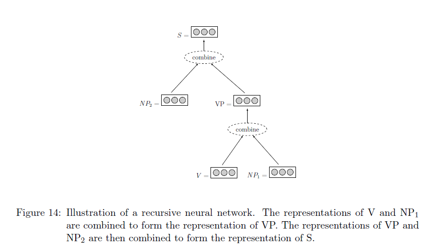

[TOC]

# Feature Representation

When dealing with natural language, the input $x$ encodes features such as words, part-of-speech tags or other linguistic information. Perhaps the biggest jump when moving from sparse-input linear models to neural-network based models is to stop representing **sparse vectors** in which each feature as a unique dimension (the so called **one-hot representation**) and representing them instead as **dense vectors**. That is, each core feature is **embedded** into a $d$ dimensional space, and represented as a vector in that space. 

Note: Those feature **embeddings** (the vector representation of each core feature) are treated as **model parameters** that need to be trained together with the other components of the network.

## Sparse vs. Dense Representations

What are the benefits of representing our features as dense instead of as sparse vectors? Should we always represent features as dense vectors?

### Sparse Representation

Sparse representation is also called **one-hot** representation, it is a sparse vector representation, each feature of input is its own dimension.

* Dimensionality of representation vector is same as number of distinct features of input.
* The input features are completely independent from one another.

### Dense Representation

Each feature of input is a d-dimensional vector in dense representation, in other words, a input feature is represented by a vector of hidden features.

* Dimensionality of representation vector is d.
* Similar input features will have similar vectors, i.e., information is shared between similar features.

### Which one should be used?

One benefits of using dense and low-dimensional vectors is **computational**. And the main benefits of the dense representations is in **generalization** power: if we believe some input features may provide similar clues, it is worthwhile to provide a representation that is able to capture these similarities. 

For example, assume we have observed the word 'dog' many times during training, but only observed the word 'cat' a few times. Can we share knowledge learned from 'dog' to 'cat'? In the dense vectors representation the learned vector for 'dog' may be similar to the learned vector from 'cat', allowing the model to **share statistical strength** between the two events.

It may be the case that under some circumstances, when the feature space is relatively small and the training data is plentiful, or when we do not wish to share statistical information between distinct words, there are gains to be made from using the one-hot representations. However, this is still an open research question, and there are no strong evidence to either side.

Representing words as dense vectors for input to a neural network was introduced by Bengio et al (Bengio et al., 2003) in the context of neural language modeling. It was introduced to NLP tasks in the pioneering work of Collobert, Weston and colleagues (2008, 2011). Using embeddings for representing not only words but arbitrary features was popularized following Chen and Manning (2014).

## Core Features and Combination Features

In the **traditional linear-model-based** NLP systems in which the feature designer had to manually specify not only the **core features** of interests but also interactions between them that called **combination features** (e.g., introducing not only a feature stating word is "X" and a feature stating tag is "Y" but also combined feature stating word is "X" and tag is "Y" or sometimes even "word is X, tag is Y and previous word is Z").

The combination features are crucial in linear models because they introduce more dimensions to the input, transforming it into a space where the data points are closer to being linearly separable. On the other hand, the space of possible combinations is very large, and the feature designer has to spend a lot of time coming up with an effective set of feature combinations.

One of the promises of the **non-linear neural network models** is that one needs to define only the core features. The non-linearity of the classifier, as defined by the network structure, is expected to take care of finding the indicative feature combinations, alleviating the need for feature combination engineering.

**Kernel methods** (Shawe-Taylor & Cristianini, 2004), and in particular polynomial kernels (Kudo & Matsumoto, 2003), also allow the feature designer to specify only core features, leaving the feature combination aspect to the learning algorithm. In contrast to neural network models, kernels methods are **convex**, admitting exact solutions to the optimization problem. However, the classification efficiency in kernel methods **scales linearly with the size of the training data**, making them too slow for most practical purposes, and not suitable for training with large datasets. On the other hand, **neural network** classification efficiency **scales linearly with the size of the network**, regardless of the training data size.

## Representation for sequences of varying length

**Feed-forward networks** assume the input with **fixed size**. However, in some cases the size of input features is not known in advance. For example, in document classification it is common that each word in the document is a feature, and the number of words is varying. We thus need to represent an unbounded number of features using a fixed size vector.

### Bag of words

One way of achieving this is through a bag of words representation. We discard order information, and works by either summing or averaging the one-hot vectors of the corresponding features:

$$
\text{BoW}(d=f_1,f_2,\dots,f_n) = \frac{1}{n} \sum_{i}^{n}{v(f_i)}
$$

where $v(f_i)$ is the sparse **one-hot** encoding for the $f_i$ feature.

But this is really a bad idea. Because features are independent in one-hot representation, summing or averaging operator will discard lots of useful information in the input features.

### Continuous bags of words

Instead of bags of words, we can use the continuous bags of words to convert the varying sequence into a vector with fixed size.

$$
\text{CBoW}(d=f_1,f_2,\dots,f_n) = \frac{1}{n} \sum_{i}^{n}{v(f_i)}
$$

where $v(f_i)$ is the dense **word embedding** vector for the $f_i$ feature.

### Weighted continuous bags of words

We can assign a weight for each continuous bags of words representation:

$$
\text{WCBoW}(d=f_1,f_2,\dots,f_n) = \frac{1}{\sum_{i}^{n}{a(f_i)}} \sum_{i}^{n}{a(f_i)}{v(f_i)}
$$

where $v(f_i)$ is the **word embedding** vector for the $f_i$ feature; $a(i)$ is the weight of embedding vector.

For example, in a document classification task, a feature $f_{i}$ may correspond to a word in the document, and the associated weight $a(f_i)$ could be the word's TF-IDF score.

## Representation for distance features

The linear distance in between two words in a sentence may serve as an informative feature. 

In the **traditional NLP** setup, distances are usually encoded by binning the distances into several groups (i.e. 1, 2, 3, 4, 5-10, 10+) and associating each bin with a **one-hot** vector. 

In a **neural architecture**, where the input vector is not composed of binary indicator features, it may seem natural to allocate a single input vector entry to the distance feature, where the numeric value of that entry is the distance. However, this approach is not taken in practice. Instead, distance features are encoded similarly to the other feature types: each bin is associated with a **dense vector**, and these **distance embedding** vectors are then trained as regular parameters in the network (Zeng et al., 2014; dos Santos et al., 2015; Zhu et al., 2015a; Nguyen & Grishman, 2015).

## Sharing representation

Image that, when assigning a part-of-speech to a given word, we may have a set of features considering the previous word and the next word. When feeding the input to the classifier, we will concatenate the vector representation of the previous word to the vector representation of the next word.  But should the representation for the previous-word "dog" be the same as the representation of the next-word "dog"? Or should we assign them two distinct representation vectors?

This is mostly an empirical question. If you believe words behave differently when they appear in different positions then it may be a good idea to use two different vocabularies and assign a different set of vectors for each feature type. However, if you believe the words behave similarly in both locations, then something may be gained by using a shared vocabulary for both feature types.

## The dimensionality of dense representation

Assume we should embed words, part-of-speech, and distance features as dense representation in some NLP task. How many dimensions should we allocate for each feature?

Unfortunately, there are no theoretical bounds or even established best-practices. Clearly, the dimensionality should grow with the number of the members in the class (you probably want to assign more dimensions to word embeddings than to part-of-speech embeddings) but how much is enough?

Since the dimensionality of the vectors has a direct effect on memory requirements and processing time, a good rule of thumb would be to experiment with a few different sizes, and choose a good trade-off between speed and task accuracy.

## Dense representation for output

For multi-class classification problems with k classes, the network's output is a k-dimensional vector in which every dimension represents the strength of a particular output class. That is, the output remains as in the traditional linear models - scalar scores to items in a discrete set. 

However, there is a d*k matrix associated with the output layer in some applications. The columns of this matrix can be thought of as d dimensional embeddings of the output classes. The vector similarities between the column vector representations of the k classes indicate the model's learned similarities between the output classes.

# Neural Network Architectures Review

Neural networks are powerful learning models. We will discuss two kinds of neural network
architectures, that can be mixed and matched, **feed-forward networks** and **recurrent /
recursive networks**. Feed-forward networks include networks with fully connected layers,
such as the multi-layer perceptorn, as well as networks with convoluational and pooling
layers. All of the networks act as classifiers, but each with different strengths.

## Fully connected feed-forward neural networks

Fully connected feed-forward neural networks are **non-linear** learners that
can, for the most part, be used as a drop-in replacement wherever a linear learner is used.

The non-linearity of the network, as well as the
ability to easily integrate pre-trained **word embeddings**, often lead to superior classication
accuracy.

## Feed-forward networks with convolutional and pooling layers

Networks with convolutional and pooling layers are useful for classification
tasks in which we expect to find strong local clues regarding class membership, but these
clues can appear in different places in the input.

Convolutional and pooling layers allow the model to learn to find **local features**, regardless of their position.

In natural language we often work with structured data of **arbitrary sizes**, such as
sequences and trees. We would like to be able to capture regularities in such structures,
or to model similarities between such structures. In many cases, this means encoding
the structure as a **fixed width vector**, which we can then pass on to another statistical
learner for further processing.

For sequence input with variable size, While convolutional and pooling architectures allow us to
encode arbitrary large items as fixed size vectors capturing their most **salient features**,
they do so by sacrificing most of the structural information. 

Recurrent and Recursive Networks, on the other hand, allow us to work with sequences
and trees while preserving a lot of the **structural information**.

## Recurrent Networks

Recurrent networks (Elman, 1990) are designed to model **sequences**.

Recurrent models have been shown to produce very strong results for **language modeling**, **sequence tagging**, **machine translation**,  **dependency parsing**, **sentiment analysis** and so on.

## Recursive Networks

Recursive networks (Goller & Kuchler, 1996) are generalizations of recurrent networks that can handle **trees**. We will also discuss an extension of recurrent networks that allow them to model **stacks** (Dyer, Ballesteros, Ling, Matthews, & Smith, 2015; Watanabe & Sumita, 2015).

Recursive models were shown to produce state-of-the-art or near state-of-the-art results
for constituency and dependency parse re-ranking, discourse parsing, semantic relation classication, political ideology detection based on parse trees, question answering and so on.

# Feed-forward neural networks

## Network Architectures

Neural network consists of computation units called neurons. Each input has an associated weight, reflecting its importance to the output of neuron. The neuron multiplies each input by its weight, and then sums them, applies a non-linear function to the result, and passes it to its output. The neurons are connected to each other, forming a network: the output of a neuron may feed into the inputs of one or more neurons.

Math for the above neural network:

$$
h^{(1)}=\alpha(xW^{(1)} + b^{(1)}) \\
h^{(2)}=\alpha(h^{(1)}W^{(2)} + b^{(2)}) \\
y=h^{(2)}W^{(3)}
$$

where $\alpha$  non-linear activation function has a crucial role in the network's ability to represent complex functions. Without the it, the neural network can only represent linear transformations of the input.

Layers resulting from linear transformations are often referred to as **fully connected**, or **affine**. Other types of architectures exist. In particular, image recognition problems benefit from **convolutional** and **pooling** layers.

## Network Components

### Input layer

The input of the network is a $d_{\text{in}}$ dimensional vector. The element of input vector can be any real value, this always relates to application.

### Hidden layer

You can have any number of hidden layers as you need. The more hidden layers in the network, the more complex is for your model.

### Output layer

The output of the network is a $d_{\text{out}}$ dimensional vector. 

In case $d_{\text{out}}=1$, the network's output is a scalar. Such networks can be used for regression (or scoring) by considering the value of the output, or for binary classification by consulting the sign of the output.

Networks with $d_{\text{out}}=k>1$ can be used for k-class classification, by associating each dimension with a class, and looking for the dimension with maximal value.

Similarly, if the output vector entries are positive and sum to one, the output can be interpreted as a distribution over k-classes. We can apply a **softmax** transformation on the output layer to achieve this.

### Parameters

The matrices and the bias terms that define the linear transformations are the parameters of the network. It is common to refer to the collection of all parameters as $\theta$. Together with the input, the parameters determine the network's output. The training algorithm is responsible for setting their values such that the network's predictions are correct.

### Word Embeddings

The raw features in natural language, like words and part-of-speech and so on, should be mapped into a more dense representation. The word embedding is a way to represent dense vector for those features.

The word embeddings are an essential part of the network's design, it's worked just like another layer and commonly it's inserted before the first hidden layer, be called an **embedding layer** or **lookup layer**.

Word embeddings are just like other parameters in the network, will be learned during training.

## Why we need deep learning

Networks with many hidden layers are said to be deep networks, hence the name deep learning.

### Universal approximator

The feed-forward network with just one hidden layer is capable to approximate with any desired non-zero amount of error a family of functions that include all continuous functions and any function mapping from any finite dimensional discrete space to another. So you may ask that why we need the deeper architectures.

### Practical consideration

* the theoretical result does not state how large the hidden layer should be, nor does it say anything about the **learnability** of the neural network (in practice, it may be will hard to learn the network with a very very large hidden layer.)
* With the same number of neurons, the number of features that a deep network can represent is an exponential times of the shallow network.

## The general framework for NLP tasks

The general structure for an NLP classification system based on a feed-forward neural network as follows:

1. Extract a set of core linguistic features $f_1,f_2,\dots,f_n$ that are relevant for predicting the output class.
2. For each feature $f_{i}$ of interest, retrieve the corresponding representation vector $v(f_{i})$.
3. Combine the representation vectors (either by concatenation, summation or a combination of both) into an input vector $x$.
4. Feed $x$ into a non-linear feed-forward neural network classifier.

### Embedding layers

We'll represent each input feature as a vector in a low dimensional space, i.e., map the sparse representation to the dense representation.

#### Embedding matrix

Consider a vocabulary of $|V|$ words, each embedded as a $d$ dimensional vector. The collection of vectors can then be thought of as a embedding matrix $E_{|V| \times d}$ in which each row corresponds to an embedded feature. This matrix, just like other weights and biases, is adjusted during training models.

#### Input Features to embedded features

Assume the input to the network is a collection of one-hot vectors, i.e., the input feature $f_{i}$ is represented as one-hot vector, then the corresponding embedded vector as follows:

$$
v(f_{i})=f_iE
$$

But in practice, we have an efficient implementation, e.g., the input feature is represented as the index of vocabulary, then use a hash-based data structure mapping input features to their corresponding embedding vectors, without going through the one-hot representation.

#### Features combined

In general, the input vector $x$ for feed-forward neural network is composed of various embeddings vectors.  How can we combine those vectors?

**concatenate**

$$
x = [v(f_1);v(f_2);\dots;v(f_n)]
$$

**sum**

$$
x=v(f_1)+v(f_2)+\dots+v(f_n)
$$

The way of combination embedding vectors is an essential part of the network's design, and likewise treat the word embeddings $v(f_{i})$ as resulting from an **embedding layer** or **lookup layer**.

### Implicit embedding

It is important to note that representing features as dense vectors is an integral part of the neural network framework. In fact, using sparse, one-hot vectors as input when training a neural network amounts to dedicating the first layer of the network to learning a dense embedding vector for each feature based on the training data.

Assume we don't have the embedding layer, and the input feature $f_{i}$ is one-hot representation and the network's input is $x=\sum_{i}^{n}{f_{i}}$, the first layer affine transformation as follows:

$$
h^{(1)}=xW^{(1)}=\sum_{i}^{n}{f_{i}}W^{(1)}=\sum_{i}^{n}W_{index(f_i):,}^{(1)}
$$

where $index(f_{i})$ returns the index of non-zero element in the $f_{i}$ feature.

Now assume we have a embedding layer $E$,  the input feature $f_{i}$ is the index of vocabulary and we'll sum all features:

$$
x=\sum_i^n{v(f_i)}=\sum_i^n{E_{f_i,:}}
$$

As you can see, If we don't have a embedding layer, the weights matrix $W^{(1)}$ will be equal to the embedding matrix $E$, and the first hidden layer $h^{(1)}$ will be equal to the input $x$ for the network equipped with embedding layer.

### Output layer transforming

A common transformation for **multi-class** tasks is **softmax**, to make the output as a discrete probability distribution over k possible outcomes:

$$
softmax(score_i)=\frac{exp(score_i)}{\sum_{j}{\exp(score_j)}}
$$

The softmax output transformation is used when we are interested in modeling a probability distribution over the possible output classes. To be effective, it should be used in conjunction with a probabilistic training objective function such as **cross-entropy**.

The likelihood function of data set for softmax output layer is:

$$
\prod_{n}^{N}{\prod_{k}^{K}{o_k}^{l_k}}
$$

where $o$ is the vector of output layer; and $l$ is the ground label vector;

The goal of training is to minimize the objective function as follows:

$$
-\log(\prod_{n}^{N}{\prod_{k}^{K}{o_k}^{l_k}})=-\sum_{n}^{N}{\sum_{k}^{K}{l_k}\log({o_k})}
$$

## Activation functions

The non-linear activation function $\alpha$ can take many forms. There is currently no good theory as to which non-linearity to apply in which conditions, and choosing the correct non-linearity for a given task is for the most part an empirical question. 

### Sigmoid

**Sigmoid** is an S-shaped function, mapping x into range [0, 1]

$$
\sigma(x)=\frac{1}{1+\exp(-x)}=\frac{exp(x)}{exp(x)+1} \in (0, 1) \\
\sigma^{'}(x)=\sigma(x)(1-\sigma(x))
$$

### Tanh

**Hyperbolic tangent (tanh)** is an S-shaped function, mapping x into range [-1, 1]
$$
\tanh(x)=\frac{\exp(x)-\exp(-x)}{\exp(x)+\exp(-x)}=\frac{exp(2x)-1}{exp(2x)+1}=2\sigma(2x)-1 \in (-1, 1) \\
\tanh^{'}(x)=4\sigma(2x)(1-\sigma(2x))
$$

### Hard Tanh

**Hard tanh** is an approximation of the tanh function which is faster to compute and take derivatives
$$
\begin{equation}
hardtanh(x)=
  \begin{cases}
  -1, & x<-1 \\
  1, & x>1 \\
  x, & otherwise
  \end{cases}

\\

hardtanh^{'}(x)=
  \begin{cases}
  0, & x<-1 \\
  0, & x>1 \\
  1, & otherwise
  \end{cases}
\end{equation}
$$

### ReLU

**Rectified linear unit (ReLU)** is a very simple activation function that is easy to work with and was shown many times to produce excellent results, especially when combined with the dropout regularization technique

$$
\begin{equation}
ReLu(x)=
  \begin{cases}
  0, & x<0 \\
  x, & otherwise
  \end{cases}

\\

ReLU^{'}(x)=
  \begin{cases}
  0, & x<0 \\
  1, & otherwise
  \end{cases}
\end{equation}
$$

The technical advantages of the ReLU over the sigmoid and tanh activation functions is that it does not involve expensive-to-compute functions, and more importantly that it does not **saturate**. The sigmoid and tanh activation are capped at 1, and the gradients at this region of the functions are near zero, driving the entire gradient near zero. The ReLU activation does not have this problem, making it especially suitable for networks with multiple layers, which are susceptible to the **vanishing gradients problem** when trained with the saturating units.

### Cube

**Cube** activation function $cube(x)=x^{3}$ was suggested by (Chen & Manning, 2014), who found it to be more effective than other non-linearities in a feed-forward network that was used to predict the actions in a greedy transition-based dependency parser.

### Tanh Cube

**Tanh Cube** activation function $tanhcube(x)=tanh(x^{3}+x)$ was proposed by (Pei et al., 2015), who found it to be more effective than other non-linearities in a feed-forward network that was used as a component in a structured-prediction graph-based dependency parser.

## Loss functions

When training a neural network, the **training objective** is to **minimize loss function** across the different training examples. The **adjusted parameters** of the network are then set in order to minimize the loss function over the training examples.

Before go further, we should figure out the question: what is a loss function?

A loss function $L(\hat y, y)$ is to measure the loss of predicting $\hat y$ when the true output is $y$. The loss value is always non-negative, and should be zero only for cases where the network's output is correct, i.e., $\hat y = y$.

The loss can be an arbitrary function mapping $(\hat y, y)$ to a scalar. For practical purposes of **optimization**, we restrict ourselves to functions for which we can easily compute **gradients** (or sub-gradients). In most cases, it is sufficient and advisable to rely on a common loss function rather than defining your own.

See more (LeCun, Chopra, Hadsell, Ranzato, & Huang, 2006; LeCun & Huang, 2005; Bengio et al., 2015).

### Hinge Loss

The hinge losses are useful whenever we require a hard decision rule, and do not attempt to model class membership probability.

#### Binary classification

For **binary classification** problems, the network's output is a **single scalar** $\hat y$ and the intended output $y \in \{-1,1\}$. The classification rule is: $prediction=sign(\hat y)$.

The **hinge loss**, also known as **margin loss** or **SVM loss**, is defined as:

$$
L_{hinge}(\hat y, y)=max(0, 1-{\hat y*y})
$$

The loss is zero if and only if $sign(\hat y)=sign(y)$ and $|\hat y|>1$, i.e., the loss attempts to achieve a correct classification with a margin of at least 1.

#### Multi-class classification

The hinge loss was extended to the multi-class setting by Crammer and Singer (2002).

Let the output $\hat y = {\hat y_1}, {\hat y_2}, \dots, {\hat y_k}$ and $y$ be the one-hot vector for the correct output class. The classification rule is defined as selecting the class with the highest score: $prediction = \mathop{\arg \max}_i {\hat y_i}$.

The **multi-class hinge loss** is defined as:

$$
L_{hinge}(\hat y, y)=max(0, 1-(\hat y_t - \hat y_p))
$$

where $t$ is the correct class label and $p$ is the prediction class label with the highest score. The loss attempts to score the correct class above all other classes with a margin of at least 1.

### Log Loss

The log loss is a common variation of the hinge loss, which can be seen as a **soft version of the hinge loss** with an **infinite margin** (LeCun et al., 2006).

Log loss for multi-class is defined as follows:

$$
L_{log}(\hat y, y)=\log(1+\exp(-(\hat y_t - \hat y_p)))
$$

where $t$ is the correct class label and $p$ is the prediction class label with the highest score. The loss attempts to score the correct class above all other classes as large as possible.

### Negative Log Likelihood Loss

Negative  log likelihood loss (**NLL**), also referred to **categorical cross-entropy loss**, is used when a **probabilistic** interpretation of the scores is desired.

The negative log likelihood loss is very common in the neural networks literature, and produces a multi-class classifier which does not only predict the one-best class label but also predicts a distribution over the possible labels. The prediction distribution is achieved by transforming the output of network using softmax.

#### Training example with probability label

Let $y=y_1,y_2,\dots,y_k$ be a vector representing the true multinomial distribution $P(y)$ over the labels ($0 \leq y_{i} \leq 1$) and let $\hat y = {\hat y_1}, {\hat y_2}, \dots, {\hat y_k}$ be the network's output, which was transformed by the **softmax** activation function, and represent the class membership conditional distribution $\hat y_i = P(\hat y=i|x)$. The classification rule is: $prediction = \mathop{\arg \ max}_{i} {\hat y_i}$. 

Negative  log likelihood loss is defined as follows:

$$
L_{NNL}(\hat y, y) = -\log(\prod_i^{k} {P(\hat y = i | x)}^{P(y=i)} )=-\log(\prod_i^{k} {\hat y_i}^{y_i} )= - \sum_{i}^{k} y_i \log(\hat y_i)
$$

Negative  log likelihood loss is also defined as **cross entropy** (so you know why we have an alias categorical cross-entropy loss for the loss) to measure the dissimilarity between the true label distribution $P(y)$ and the predicted label distribution $P(\hat y|x)$:

$$
L_{NNL}(\hat y, y) = - \sum_{i}^{k}P(y_i) \log(P(\hat y_i | x))= - \sum_{i}^{k} y_i \log(\hat y_i)
$$

#### Train example with hard label 

A special case is for the **hard classification problems** in which each training example has a single correct
class assignment, $y$ is a one-hot vector representing the true class, i.e., $y_{i} \in \{0, 1\} \; and \; \sum_i {y_i}=1$. The NNL loss is simplified to:

$$
L_{NNL}(\hat y, y)=-\log(\hat y_t)
$$

where $t$ is the index of the non-zero in the $\hat y$ vector, i.e., the correct class label.

#### The relation with multi-class hinge loss 

The multi-class hinge loss attempts to score the correct class above all other classes with a margin of at least 1; the negative log likelihood loss attempts to maximize the prediction probability for the correct label. Because the prediction is transformed from softmax, thus maximize the correct label means surpass the other incorrect labels.

 ### Ranking Loss

Image a situation, we have only positive examples $x$, and negative examples $x^{'}$ generated by corrupting a positive example, there is no hand-label for training examples. The goal of us to to score positive items above negative ones.

The ranking loss based on the margin loss is defined as:

$$
L_{rank-margin}(x, x^{'})=\max(0, 1-(NN(x) - NN(x^{'})))
$$

The ranking loss based on log loss is defined as:

$$
L_{rank-log}(x, x^{'})=\log(1+\exp(-(NN(x) - NN(x^{'}))))
$$

Examples using the ranking hinge loss in language tasks include training with the auxiliary tasks used for deriving **pre-trained word embeddings**, in which we are given a correct word sequence and a corrupted word sequence, and our goal is to score the correct sequence above the corrupt one (Collobert & Weston, 2008).

## Word Embeddings

In this section, we'll figure out how to initialize and train word embeddings.

In general, there are two ways to initialize the word embeddings: **random initialization** and **pre-training**.

In practice, one will often use the **random initialization** approach to initialize the embedding vectors of **commonly occurring features**, such as part-of-speech tags or individual letters, while using some form of supervised or unsupervised **pre-training** to initialize the **potentially rare features**, such as features for individual words. The pre-trained vectors can then either be treated as fixed during the network training process, or, more commonly, treated like the randomly-initialized vectors and further tuned to the task at hand(this is called **transfer learning**).

### Random Initialization

We can initialize the embedding vectors to random values just like the other model parameters, then let training procedure tune them.

Additional, there are some tricks we can use. The method used by the effective **word2vec** implementation (Mikolov et al., 2013; Mikolov, Sutskever, Chen, Corrado, & Dean, 2013) is to initialize the word vectors to **uniformly sampled** random numbers in the range $[-\frac{1}{2d}, \frac{1}{2d}]$ where the $d$ is the dimensionality of representation. Another tirck is to use **xavier initialization** and initialize with uniformly sampled values from $[-\frac{\sqrt 6}{\sqrt d}, \frac{\sqrt 6}{\sqrt d}]$.

### Supervised Pre-training

If we are interested in **task A**, for which we only have a **limited amount of labeled data** (for example, syntactic parsing), but there is an **auxiliary task B** (say, part-of-speech tagging) for which we have **much more labeled data**, we may want to **pre-train word vectors** so that they perform well as predictors for task B, and then use the trained vectors for training task A. Or we can train jointly for A and B tasks.

### Unsupervised Pre-training

The common case is that we do not have an auxiliary task with large enough amounts of annotated data. We need use unsupervised methods to pre-train word vectors on **huge amounts of unannotated data**.

it is worth noting that the word embeddings derived by unsupervised training algorithms have a wide range of applications in NLP beyond using them for initializing the word-embeddings layer of a neural-network model.

#### Supervised auxiliary tasks

We create practically unlimited number of supervised training instances from raw text, hoping that the tasks that we created will match (or be close enough to) the final task we care about. 

And then we use the unannotated data to train those auxiliary tasks by supervised learning methods to improve their performance. Thus the trained embedding vectors for those auxiliary tasks can be used by the final task we care about.

#### Choosing auxiliary tasks

About the choice of auxiliary tasks, we should answer two questions:

1. What kind of embedding vectors we want to learn from auxiliary tasks?
2. Which auxiliary tasks can learn the word vectors, allowing the model to generalize better on unseen events?

For the first question, the answer is: we would like the embedding vectors of similar words to have similar vectors, i.e., we want word embeddings to learn the similarity between words.

While **word similarity** is hard to define and is usually very **task-dependent**, the current approaches derive from the **distributional hypothesis** (Harris, 1954), stating that **words are similar if they appear in similar contexts**. Thus, the different approaches all create supervised training instances in which the goal is to either **predict the word from its context**, or **predict the context from the word**.

Now we can answer the second question: we desire that the similarity between word vectors learned by the those auxiliary tasks capture the same aspects of similarity that are useful for performing the final task we care about.

For auxiliary tasks ,what is being predicted that based on what kind of context, affects the resulting vectors much more than the learning method that is being used to train them.

#### Common unsupervised algorithms

Common unsupervised word-embedding algorithms include word2vec 13 (Mikolov et al., 2013, 2013), GloVe (Pennington, Socher, & Manning, 2014) and the Collobert and Weston (2008, 2011) embeddings algorithm.

#### Advantages of unsupervised approaches

An important benefit of training word embeddings on large amounts of unannotated data is that it provides vector representations for words that do not appear in the supervised training set. Ideally, the representations for these words will be similar to those of related words that do appear in the training set, allowing the model to generalize better on unseen events.

### Training Objectives of auxiliary tasks

Given a word $w$ and its context $c$, different algorithms formulate different auxiliary tasks. Training the model to perform the auxiliary tasks well will result in good word embeddings for relating the words to the contexts, which in turn will result in the embedding vectors for similar words to be similar to each other.

Language-modeling inspired approaches such as those taken by (Mikolov et al., 2013; Mnih & Kavukcuoglu, 2013) as well as GloVe (Pennington et al., 2014) use auxiliary tasks in which the goal is to predict the word given its context, i.e., to model the conditional probability $P(w|c)$.

### The Choice of Contexts

In most cases, the contexts of a word are taken to be other words that appear in its **surrounding**, either in a short window around it, or within the same sentence, paragraph or document.

In some cases the text is automatically parsed by a syntactic parser, and the contexts are derived from the **syntactic neighbourhood** induced by the automatic parse trees. 

Sometimes, the definitions of words and context change to include also **parts of words**, such as prefixes or suffixes.

Neural word embeddings originated from the world of language modeling(Bengio et al., 2003). Training the language modeling auxiliary prediction problems indeed produce useful word embeddings, and the context   in here is allowed to look only at the previous words. That doesn't mean we must train word embeddings by constraint the context as the previous words for other NLP tasks. We can ignore this constraint and taking the context to be a **symmetric window** around the **focus word**.

#### Sliding Window

The most common approach is a sliding window approach, in which auxiliary tasks are created by looking at a sequence of $2k+1$ words. The middle word is called the **focus word** and the $k$ words to each side are the **contexts**.

##### Training models

There are two kinds of  auxiliary tasks for training:

* Predict the focus word given the context words.

  The goal of task is to predict the focus word based on all of the context words. Context words are represented either using **CBOW** (Mikolov et al., 2013) or **vector concatenation** (Collobert & Weston, 2008)

* Predict the context words given the focus word. $2k$ different tasks are created, each pairing the focus word with a different context word. This is popularized by (Mikolov et al., 2013) is referred to as a **skip gram** model.

Skip-gram based approaches are shown to be robust and efficient to train (Mikolov et al., 2013; Pennington et al., 2014), and often produce state of the art results.

##### Effect of Window Size

The size of the sliding window has a strong effect on the resulting vector similarities. **Larger windows** tend to produce more **topical similarities**, while smaller windows tend to produce more **functional and syntactic similarities**.

##### Positional Contexts

When using the CBOW or skip-gram context representations, all the different context words within the window are treated equally. There is no distinction between context words that are close to the focus words and those that are farther from it, and likewise there is no distinction between context words that appear before the focus words to context words that appear after it.

We can consider positional information by using **positional contexts**: indicating for each context word also its relative position to the focus words, i.e., instead of the context word being "the" it becomes "the:+2", indicating the word appears two positions to the right of the focus word.

Positional vectors were shown by (Ling, Dyer, Black, & Trancoso, 2015a) to be more effective than window-based vectors when used to initialize networks for **part-of-speech** tagging and syntactic **dependency parsing**.

##### Variants

Many variants on the window approach are possible. One may lemmatize words
before learning, apply text normalization, lter too short or too long sentences, or remove
capitalization (see, e.g., the pre-processing steps described in (dos Santos & Gatti, 2014).
One may sub-sample part of the corpus, skipping with some probability the creation of tasks
from windows that have too common or too rare focus words. The window size may be
dynamic, using a dierent window size at each turn. One may weigh the dierent positions
in the window dierently, focusing more on trying to predict correctly close word-context
pairs than further away ones. Each of these choices will eect the resulting vectors. Some
of these hyperparameters (and others) are discussed in (Levy et al., 2015).

#### Sentences, paragraphs and documents

Using a **skip-grams** or **CBOW** approach, one can consider the contexts of a word to be all the other words that appear with it in the same sentence, paragraph or document. This is equivalent to using **very large window sizes**, and is expected to result in word vectors that capture **topical similarity**.

#### Syntactic window

Some work replace the linear context within a sentence with a **syntactic** one (Levy & Goldberg, 2014a; Bansal, Gimpel, & Livescu, 2014). The text is automatically parsed using a **dependency parser**, and the context of a word is taken to be the words that are in its proximity in the parse tree, together with the syntactic relation by which they are connected.

Such approaches produce highly **functional similarities**, grouping together words that can fill the same role in a sentence (e.g. colors, names of schools, verbs of movement). The grouping is also syntactic, grouping together words that share an inflection (Levy & Goldberg, 2014a).

#### Multilingual contexts

Another option is using multilingual, translation based contexts (Hermann & Blunsom,
2014; Faruqui & Dyer, 2014). Here, the context of a word instance are the foreign language words that are aligned to it. Such alignments tend to result in synonym words receiving similar vectors.

### Character and sub-word level representation

An interesting line of work attempts to derive the vector representation of a word from the characters or sub-words that compose it.

**Character based** approaches are likely to be particularly useful for tasks which are syntactic in nature, as the character patterns within words are strongly related to their **syntactic function**. These approaches also have the benefit of producing very small model sizes (only one vector for each character in the alphabet), and being able to provide an embedding vector (concatenation the characters vectors) for every word that may be encountered. 

Deriving representations of words from the representations of their characters is motivated by the unknown words problems. Working on the level of characters alleviates the unknown words problem to a large extent, as the vocabulary of possible characters is much smaller than the vocabulary of possible words.

dos Santos and Gatti (2014) and dos Santos and Zadrozny (2014) model the embedding of a word using a **convolutional network** over the characters.

Ling et al (2015b) model the embedding of a word using the concatenation of the final states of two RNN (LSTM) encoders (**Bi-LSTM**), one reading the characters from left to right, and the other from right to left.

The work of Ballesteros et al (2015) show that the two-LSTMs encoding of (Ling et al., 2015b) is beneficial also for representing words in dependency parsing of morphologically rich languages.

**Sub-word based** approaches in which a word is represented as a combination of a vector for the word itself with vectors of sub-word units that comprise it. Because working on the character level is very challenging, as the relationship between form (characters) and function (syntax, semantics) in language is quite loose. Thus, some researchers propose a compromise method - using sub-word representation to words. 

The sub-word embeddings then help in sharing information between different words with similar forms, as well as allowing back-off to the sub-word level when the word is not observed, and the models are not forced to rely solely on form (sub-words) when enough observations of the word are available.

Botha and Blunsom (2014) suggest to model the embedding vector of a word as a sum of the word-specfic vector if such vector is available, with vectors for the different morphological components that comprise it.

Gao et al (Gao et al., 2014) suggest using as core features not only the word form itself but also a unique feature (hence a unique embedding vector) for each of the letter-trigrams in the word.

## Neural Network Training

Neural network training is done by trying to **minimize** a **loss function** over a **training set**, using a **gradient-based method**.

### Training with SGD

The common approach for training neural networks is using the **stochastic gradient descent** (SGD) algorithm (Bottou, 2012; LeCun, Bottou, Orr, & Muller, 1998a) or a variant of it.

#### Vanilla SGD

The parameters are updated in SGD as follows:

$$
\theta = \theta - \eta {\frac {\partial L(f(x_i;\theta), y_i)} {\partial \theta}}
$$

#### Mini-batch SGD

The SGD calculates the error base on a single training example, and is thus just a rough estimate of the  loss for the whole training set that we are really aiming to minimize. The noise in the loss computation may result in inaccurate gradients. A common way of reducing this noise is to estimate the error and the gradients based on a sample of m samples. This gives rise to the **mini-batch SGD**. The parameters are updated as follows:

$$
grad = \frac {1}{m} \sum_i^m {\frac {\partial L(f(x_i;\theta), y_i)}{\partial \theta}} \\
\theta = \theta - \eta * grad
$$

Besides the improved accuracy of the gradients estimation, the mini-batch algorithm provides opportunities for improved training efficiency, GPUs can speed up matrix operations in the mini-batch algorithm.

The size of mini-batch is a hyperparameter. Higher values provide better estimates of the whole training set gradients, while smaller values allow more updates and in turn faster convergence.

#### Variants of SGD

The SGD+**Momentum** (Polyak, 1964) and **Nesterov Momentum** (Sutskever, Martens, Dahl, & Hinton, 2013) algorithms are variants of SGD in which previous **gradients are accumulated** and affect the current update.

**Adaptive learning rate** algorithms including **AdaGrad** (Duchi, Hazan, & Singer, 2011), **AdaDelta** (Zeiler, 2012), **RMSProp** (Tieleman & Hinton, 2012) and **Adam** (Kingma & Ba, 2014) are designed to select the learning rate for each minibatch, sometimes on a per-coordinate basis, potentially alleviating the need of fiddling with learning rate scheduling.

#### The converge of SGD

With a small enough learning rate, SGD is guaranteed to converge to a global optimum if the function is **convex***. However, it can also be used to optimize **non-convex** functions such as neural-network. While there are no longer guarantees of finding a global optimum, the algorithm proved to be robust and performs well in practice.

### Auto Differentiation

#### Calculate gradients

When training a neural network, the parameterized function $f$ is the neural network, and the **parameters** $\theta$ are the layer-transfer matrices, bias terms, embedding matrices and so on. The gradient computation is a key step in the SGD algorithm. 

The question is, then, how to compute the **gradients** of the network's error with respect to the parameters. Fortunately, there is an easy solution in the form of the **backpropagation algorithm** (Rumelhart, Hinton, & Williams, 1986; Lecun, Bottou, Bengio, 1998b).

More generally, the backpropagation algorithm is a special case of the **reverse-mode automatic differentiation** algorithm (Neidinger, 2010; Baydin, Pearlmutter, Radul, & Siskind, 2015; Bengio, 2012)

#### Computation graph and Reverse mode differentiation

Gradients can be efficiently and automatically computed using **reverse mode differentiation** on a **computation graph** - a general algorithmic framework for automatically computing the gradient of any network and loss function.

The computation-graph abstraction allows us to easily construct arbitrary networks, evaluate their predictions for given inputs (**forward pass**), and compute gradients for their parameters with respect to arbitrary scalar losses (**backward pass**). We can use software to build computation graph for our neural networks. Once the graph is built, it is straightforward to run either a forward computation (compute the result of the computation) or a backward computation (computing the gradients).

**Forward pass**

The forward pass computes the outputs of the nodes in the
graph. Since each node's output depends only on itself and on its incoming edges, it is
trivial to compute the outputs of all nodes by traversing the nodes in a topological order and
computing the output of each node given the already computed outputs of its predecessors.

**Backward pass**

The backward pass begins by designating a node with **scalar output as a loss-node**, and running forward computation up to that node. 

For further information on automatic differentiation see (Neidinger, 2010, Section 7),
(Baydin et al., 2015). For more in depth discussion of the backpropagation algorithm and
computation graphs (also called  ow graphs) see (Bengio et al., 2015, Section 6.4), (Lecun
et al., 1998b; Bengio, 2012). For a popular yet technical presentation, see Chris Olah's
description at http://colah.github.io/posts/2015-08-Backprop/.

#### Softwares

Theano involves an optimizing compiler for computation graphs, which is both a blessing
and a curse. On the one hand, once compiled, large graphs can be run eciently on either
the CPU or a GPU, making it ideal for large graphs with a xed structure, where only the
inputs change between instances. However, the compilation step itself can be costly, and it
makes the interface a bit cumbersome to work with. In contrast, the other packages focus on
building large and dynamic computation graphs and executing them \on the 
y" without a
compilation step. While the execution speed may suer with respect to Theano's optimized
version, these packages are especially convenient when working with the recurrent and recursive networks.

#### Advantages

As long as the network's output is a vector , it
is trivial to compose networks by making the output of one network the input of another,
creating arbitrary networks. The computation graph abstractions makes this ability explicit:
a node in the computation graph can itself be a computation graph with a designated output
node. One can then design arbitrarily deep and complex networks, and be able to easily
evaluate and train them thanks to automatic forward and gradient computation.

### Training  Recipe

Here, `build_computation_graph` is a user-dened function that builds the computation
graph for the given input, output and network structure, returning a single loss node.
update parameters is an optimizer speficic update rule. The recipe spefcies that a new
graph is created for each training example. This accommodates cases in which the network
structure varies between training example, such as recurrent and recursive neural networks. For networks with fixed structures, such as an MLPs, it may be more effcient to create one base computation graph and vary only the inputs and expected outputs between examples.

For further discussion on optimization techniques and algorithms for neural networks, refer
to (Bengio et al., 2015, Chapter 8). For some theoretical discussion and analysis, refer to (Glorot & Bengio, 2010). For various practical tips and recommendations, see (LeCun et al., 1998a; Bottou, 2012).

## Optimization

### Parameters Initialization

The **non-convexity** of the loss function means the optimization procedure
may **get stuck in a local minimum or a saddle point**, and that starting from **different initial**
points (e.g. different random values for the parameters) may result in **different results**. Thus,
it is advised to run several restarts of the training starting at different random initializations,
and choosing the best one based on a development set.

The magnitude of the random values has an important effect on the success of training.
An effective scheme due to Glorot and Bengio (2010), called **xavier initialization**, initializing a weight matrix $W \in \R ^{d_{in} \times d_{out}}$ as:

$$
W \sim {Uniform} \left[ -\frac{\sqrt 6}{\sqrt {d_{in} + d_{out}}}, +\frac{\sqrt 6}{\sqrt {d_{in} + d_{out}}} \right]
$$

Analysis by He et al (2015) suggests that when using **ReLU non-linearities**, the weights
should be initialized by sampling from a zero-mean Gaussian distribution whose standard
deviation is $\sqrt {\frac{2}{d_{in}}}$,  initializing a weight matrix $W \in \R ^{d_{in} \times d_{out}}$ as:

$$
W \sim Guassian(0, I\sqrt {\frac{2}{d_{in}}})
$$

This initialization method is better than xavier initialization in an image classication task, especially when deep networks were involved.

### Learning rate scheduling

Too large learning rates will prevent the network from converging on an effective solution. Too small learning rates will take very long time to converge.

We can experiment with a range of initial learning rates in range [0; 1], e.g. 0.001, 0.01, 0.1, 1. Monitor
the network's loss over time, and decrease the learning rate once the network seem to be stuck in a fixed region.

We can also use learning rate scheduling. Learning rate scheduling decrease the rate as a function of the number of observed mini-batches. A common schedule is dividing the initial learning rate by the iteration number. 

Leon Bottou (2012) recommends using a learning rate of the form:

$$
\eta ^ {t} = \frac{\eta ^ 0}{1+t \eta ^ 0 \lambda}
$$

### Mini-batch

Large minibatched training can be benefcfical in terms of computation effciency on specialized computing architectures such as GPUs.

### Vanishing and Exploding Gradients

In deep networks, it is common for the error
gradients to either vanish (become exceedingly close to 0) or explode (become exceedingly
high) as they propagate back through the computation graph. The problem becomes more
severe in deeper networks, and especially so in recursive and recurrent networks (Pascanu,
Mikolov, & Bengio, 2012). 

Dealing with the **vanishing gradients** problem is still an open
research question. Solutions include making **the networks shallower**, **step-wise training** (first
train the first layers based on some auxiliary output signal, then fix them and train the upper
layers of the complete network based on the real task signal), or **specialized architectures**
that are designed to assist in gradient flow (e.g., the LSTM and GRU architectures for recurrent networks).

Dealing with the **exploding gradients** has a simple but very effective solution: clipping the gradients if their norm exceeds a given threshold. Pascanu et al (2012) suggest to set:

$$
\hat g \leftarrow \frac{threshold}{||\hat g||} {\hat g} \qquad if \; ||\hat g||>threshold
$$

where $\hat g$ is the gradients of all parameters in the network.

### Saturated and Dead

Layers with **tanh** and **sigmoid** activations can become **saturated** - resulting in output values for that layer that are all close to one, the upper-limit of the activation function. Saturated neurons have very small gradients, and should be avoided.

Saturated neurons are caused by **too large values** entering the layer. This may be controlled for by changing the initialization, scaling the range of the input values, or changing the learning rate.

For saturated layers, another option is to normalize the values in the saturated layer after the activation, i.e. instead of $\tanh (h)$ using $\frac{tanh(h)}{||tanh(h)||}$.

Layers with the **ReLU** activation cannot be saturated, but can **die** most or all values are negative and thus clipped at zero for all inputs, resulting in a gradient of zero for that layer.

Dead neurons are caused by all weights entering the layer being negative (for example this can happen after a large gradient update). Reducing the learning rate will help in this situation.

## Regularization

Neural network models have many parameters, and overtting can easily occur. Overtting
can be alleviated to some extent by regularization.

A common regularization method is $L_2$ regularization, placing a squared penalty on parameters with large values by adding an additive $\frac{\lambda}{2}||\theta||$ term to the objective function to be minimized, where the $\lambda$ is a hyperparameter for controlling regularization.

A recently proposed alternative regularization method is **dropout** (Hinton, Srivastava,
Krizhevsky, Sutskever, & Salakhutdinov, 2012). The dropout method is designed to prevent
the network from learning to rely on specic weights. It works by randomly dropping (setting
to 0) half of the neurons in the network (or in a specic layer) in each training example.

Work by Wager et al (2013) establishes a strong connection between the dropout method and $L_2$ regularization.Gal and Gharamani (2015) show that a multi-layer perceptron with dropout applied at every layer can be interpreted as Bayesian model averaging. 

## Model Cascading and Multi-task Learning

### Model Cascading

Model cascading is a powerful technique in which large networks are built by composing
them out of smaller component networks. For example, we may have a feed-forward network
for predicting the part of speech of a word based on its neighbouring words and/or the
characters that compose it. In a pipeline approach, we would use this network for predicting
parts of speech, and then feed the predictions as input features to neural network that does
syntactic chunking or parsing. Instead, we could think of the hidden layers of this network
as an encoding that captures the relevant information for predicting the part of speech. In
a cascading approach, we take the hidden layers of this network and connect them (and not
the part of speech prediction themselves) as the inputs for the syntactic network. We now
have a larger network that takes as input sequences of words and characters, and outputs a
syntactic structure. The computation graph abstraction allows us to easily propagate the
error gradients from the syntactic task loss all the way back to the characters.
To combat the vanishing gradient problem of deep networks, as well as to make better
use of available training material, the individual component network's parameters can be
bootstrapped by training them separately on a relevant task, before plugging them in to
the larger network for further tuning. For example, the part-of-speech predicting network
can be trained to accurately predict parts-of-speech on a relatively large annotated corpus,
before plugging its hidden layer into the syntactic parsing network for which less training
data is available. In case the training data provide direct supervision for both tasks, we can
make use of it during training by creating a network with two outputs, one for each task,
computing a separate loss for each output, and then summing the losses into a single node
from which we backpropagate the error gradients.
Model cascading is very common when using convolutional, recursive and recurrent
neural networks, where, for example, a recurrent network is used to encode a sentence into
a xed sized vector, which is then used as the input of another network. The supervision
signal of the recurrent network comes primarily from the upper network that consumes the
recurrent network's output as it inputs.

### Multi-task Learning

Multi-task learning is used when we have related prediction tasks that do not necessarily
feed into one another, but we do believe that information that is useful for one type
of prediction can be useful also to some of the other tasks. For example, chunking, named
entity recognition (NER) and language modeling are examples of synergistic tasks. Information
for predicting chunk boundaries, named-entity boundaries and the next word in the
sentence all rely on some shared underlying syntactic-semantic representation. Instead of
training a separate network for each task, we can create a single network with several outputs.
A common approach is to have a multi-layer feed-forward network, whose final hidden
layer (or a concatenation of all hidden layers) is then passed to different output layers. This
way, most of the parameters of the network are shared between the different tasks. Useful
information learned from one task can then help to disambiguate other tasks. Again, the
computation graph abstraction makes it very easy to construct such networks and compute
the gradients for them, by computing a separate loss for each available supervision signal,
and then summing the losses into a single loss that is used for computing the gradients. In
case we have several corpora, each with different kind of supervision signal (e.g. we have
one corpus for NER and another for chunking), the training procedure will shuffle all of the
available training example, performing gradient computation and updates with respect to
a different loss in every turn. Multi-task learning in the context of language-processing is
introduced and discussed in (Collobert et al., 2011).

## Structured Output Prediction

Many problems in NLP involve structured outputs: cases where the desired output is not
a class label or distribution over class labels, but a structured object such as a **sequence**,
a **tree** or a **graph**. Canonical examples are sequence tagging (e.g. part-of-speech tagging)
sequence segmentation (chunking, NER), and syntactic parsing.

### Greedy Structured Prediction

The greedy approach to structured prediction is to decompose the structure prediction
problem into a sequence of local prediction problems and training a classier to perform
each local decision. At test time, the trained classfier is used in a greedy manner.

Examples of this approach are left-to-right tagging models (Gimenez & Marquez, 2004) and greedy
transition-based parsing (Nivre, 2008). Such approaches are easily adapted to use neural
networks by simply replacing the local classier from a linear classier such as an SVM or a
logistic regression model to a neural network, as demonstrated in (Chen & Manning, 2014;
Lewis & Steedman, 2014).

The greedy approaches suer from error propagation, where mistakes in early decisions
carry over and in
uence later decisions. The overall higher accuracy achievable with nonlinear
neural network classiers helps in offsetting this problem to some extent. In addition,
training techniques were proposed for mitigating the error propagation problem by either
attempting to take easier predictions before harder ones (the easy-rst approach (Goldberg
& Elhadad, 2010)) or making training conditions more similar to testing conditions by
exposing the training procedure to inputs that result from likely mistakes (Hal Daume III,
Langford, & Marcu, 2009; Goldberg & Nivre, 2013). These are effective also for training
greedy neural network models, as demonstrated by Ma et al (Ma, Zhang, & Zhu, 2014)
(easy-rst tagger) and (?) (dynamic oracle training for greedy dependency parsing).

### Search Based Structured Prediction

The common approach to predicting natural language structures is **search based**. For indepth
discussion of search-based structure prediction in NLP, see the book by Smith (Smith,
2011). In the neural-networks literature, such models were discussed under the framework of **energy based** learning (LeCun et al., 2006).

Search-based structured prediction is formulated as a search problem over possible structures:

$$
\hat y = predict(x) = \mathop{\arg\max}_{y \in Y(x)} score(x, y)
$$

where $x$ is an input structure, $y$ is an output over $x$ (in a typical example $x$ is a sentence and $y$ is a tag-assignment or a parse-tree over the sentence), $Y(x)$ is the set of all valid output structures over $x$.

The scoring function is defined as a linear model:

$$
score(x,y)=w \cdot \Phi(x,y)
$$

where $\Phi(x,y)$ is a feature extraction function and $w$ is a weight vector.

In order to make the search for the optimal y tractable, the structure $y$ is decomposed
into parts, and the feature function is defined in terms of the parts, where $\phi(y)$ is a part-local
feature extraction function:

$$
\Phi(x,y)=\sum_{p \in parts(x,y)} {\phi(p)}
$$

Each part is scored separately, and the structure score is the sum of the component
parts scores:

$$
score(x,y)=\sum_{p}w \cdot \phi(p)=\sum_{p} {score(p)}
$$

The decomposition of $y$ into parts is such that there exists an inference algorithm that allows for effcient search for the best scoring structure given the scores of the individual parts. We can now trivially replace the scoring function over parts with a neural network:

$$
score(x,y)=\sum_{p} {score(p)}=\sum_{p} {NN(c(p))}
$$

where $c(p)$ is used to map the parts into neural network input.

So the prediction as follows:

$$
\hat y = predict(x) = \mathop{\arg\max}_{y \in Y(x)} score(x, y)= \mathop{\arg\max}_{y \in Y(x);\; p \in parts(x,y)} {\sum_{p}NN(c(p))}
$$

A common objective in structured prediction is making the gold structure $y$ score higher than any other structure $y^{'}$, leading to the following **generalized perceptron loss**:

$$
\max_{y^{'}} (score(x, y^{'})-score(x,y))
$$

As argued in (LeCun et al., 2006, Section 5), the generalized perceptron loss may not
be a good loss function when training structured prediction neural networks as it does not
have a margin, and a **margin-based hinge loss** is preferred:

$$
max(0, m+score(x,y)-\max_{y^{'}}score(x,y^{'}))
$$

#### CRF

#### Reranking

When searching over all possible structures is intractable, ineffcient or hard
to integrate into a model, reranking methods are often used. In the reranking framework
(Charniak & Johnson, 2005; Collins & Koo, 2005) a base model is used to produce a list of the k-best scoring structures. A more complex model is then trained to score the
candidates in the k-best list such that the best structure with respect to the gold one is
scored highest.

Works using the reranking
approach include (Socher et al., 2013; Auli et al., 2013; Le & Zuidema, 2014; Zhu et al.,
2015a)

#### MEMM

Other formulations are, of course, also possible. For
example, an MEMM (McCallum, Freitag, & Pereira, 2000) can be trivially adapted to the
neural network world by replacing the logistic regression (\Maximum Entropy") component
with an MLP.

#### Hybrid approaches

Hybrid approaches between neural networks and linear models are also explored. In
particular, Weiss et al (Weiss et al., 2015) report strong results for transition-based dependency
parsing in a two-stage model.

## Convolutional Layers

### Motivation

Sometimes we are interested in making predictions based on ordered sets of items (e.g. the sequence of words in a sentence, the sequence of sentences in a document and so on). Some of the sentence words are very informative of the sentiment, other words are less informative, and to a good approximation, an **informative clue is informative regardless of its position in the sentence**. We would like to feed all of the sentence words into a learner, and let the training process figure out the important clues.

Some solutions as follow:

* One possible solution is
  feeding a **CBOW representation** into a fully connected network such as an MLP. However,
  a downside of the CBOW approach is that it ignores the ordering information completely,
  assigning the sentences "it was not good, it was actually quite bad" and "it was not bad,
  it was actually quite good" the exact same representation.
* A naive approach would suggest embedding word-pairs (bi-grams) rather
  than words, and building a CBOW over the **embedded bigrams**. While such architecture
  could be effective, it will result in huge embedding matrices, will not scale for longer n-grams,
  and will suffer from data sparsity problems as it does not share statistical strength
  between different n-grams.

Convolutional solution:

The convolution-and-pooling (also called convolutional neural networks, or CNNs) architecture
is an elegant and robust solution to this modeling problem. A convolutional neural network
is designed to **identify indicative local predictors in a large structure**, and combine them
to **produce a fixed size vector representation of the structure**, capturing these local aspects
that are most informative for the prediction task at hand.

When applied to images, the architecture is using **2-dimensional (grid) convolutions**. When applied to text, NLP we are mainly concerned with **1-d (sequence) convolutions**. Convolutional networks were introduced to the NLP community in the pioneering work of Collobert, Weston and Colleagues (2011) who used them for semantic-role labeling, and later by Kalchbrenner et al (2014) and Kim (Kim, 2014) who
used them for sentiment and question-type classication.

### Convolution and Pooling

The main idea behind a **convolution** for language tasks is to apply a non-linear (learned) function (also called **filter**) over each instantiation of a k-words sliding window over the sentence. This filter transforms a window of **k-words** into a **d-dimensional vector** that captures important properties of the words in the window, and each dimension is sometimes referred as **channel**. Intuitively, when the sliding window is run over a sequence, the filter function learns to **identify informative k-grams**.

Then, a **pooling** operation is used combine the vectors resulting from the different windows into **a single d-dimensional vector**, by taking the max or the average value observed in each of the d-channels over the different windows. The intention is to focus on the most important "features" in the sentence, **regardless of their location**.

Finally, the d-dimensional vector is fed further into a network that is used for prediction. The **gradients** that are propagated back from the network's loss during the training process are used to **tune the parameters of the filter function to highlight the aspects of the data that are important for the task** the network is trained for.

More formally, consider a sequence of words $x=x_1,x_2,\dots,x_n$, each with their corresponding word embedding vector $v(x_i)$, and assuming there are $m$ windows in total. The convolution and pooling as follows:

**word to vector**: Concatenate the word embedding vectors of k-words for the i-th sliding window

$$
w_i=[v(x_i);v(x_{i+1});\dots;v(x_{i+k-1})]
$$

**convolution**: Apply the non-linear learnable filter function for the sliding window to get d-dimensional vector that captures important properties of the words in the window

$$
p_i=\alpha(w_iW+b)
$$

**pooling**: Apply max pooling for each channel of all sliding windows vectors to get a single d-dimensional vector that to get the most salient information across window positions. Ideally, each dimension will "specialize" in a particular sort of predictors, and max operation will pick on the most important predictor of each type. Each dimension of the output vector will be extracted as follows:

$$
c_j=\max_{1 \leq i \leq m} p_i
$$

Now we have a d-dimensional vector $c$ that is a representation of the sentence in which each dimension
reflects the most salient information with respect to some prediction task. c is then fed
into a downstream network layers, perhaps in parallel to other vectors, culminating in an
output layer which is used for prediction. The training procedure of the network calculates
the loss with respect to the prediction task, and the error gradients are propagated all the
way back through the pooling and convolution layers, as well as the embedding layers.

### Variations

#### group pooling

Rather than performing a single pooling operation over the entire sequence, we may want
to **retain some positional information** based on our **domain understanding** of the prediction
problem at hand.

We can split the convolutional vectors $p_i$ into $\ell$ distinct groups, apply the pooling separately on each group, and then concatenate the resulting vectors $c_1,c_2,\dots,c_{\ell}$. The division of the $p_i$ vectors into groups is performed based on domain knowledge.

For example, Johnson and Zhang (Johnson
& Zhang, 2014) found that when classifying documents into topics, it is useful to have 20
average-pooling regions, clearly separating the initial sentences (where the topic is usually
introduced) from later ones, while for a sentiment classication task a single max-pooling
operation over the entire sentence was optimal (suggesting that one or two very strong
signals are enough to determine the sentiment, regardless of the position in the sentence).

Similarly, in a relation extraction kind of task we may be given two words and asked to
determine the relation between them. We could argue that the words before the first word,
the words after the second word, and the words between them provide three different kinds
of information (Chen et al., 2015). So we can split $p_i$ accordingly, pooling
separately the windows resulting from each group.

#### hierarchical convolution and pooling

We have a succession of convolution and pooling layers, where each stage applies a convolution to a sequence, pools every k neighboring vectors, performs a convolution on the resulting pooled sequence,
applies another convolution and so on. This architecture allows sensitivity to increasingly
larger structures.

#### k-max pooling

(Kalchbrenner et al., 2014) introduced a k-max pooling operation, in which the
top k values in each dimension are retained instead of only the best one, while preserving
the order in which they appeared in the text.

The k-max pooling operation makes it possible to pool the k most active indicators that
may be a number of positions apart; it preserves the order of the features, but is insensitive
to their specic positions. It can also discern more nely the number of times the feature
is highly activated (Kalchbrenner et al., 2014).

#### multi-convolutional layers

Rather than a single convolutional layer, several convolutional layers may be applied in
parallel. For example, we may have four different convolutional layers, each with a different
window size in the range 2-5, capturing n-gram sequences of varying lengths. The result
of each convolutional layer will then be pooled, and the resulting vectors concatenated and
fed to further processing (Kim, 2014).

#### non-sequence convolution

The convolutional architecture need not be restricted into the linear ordering of a sentence.
For example, Ma et al (2015) generalize the convolution operation to work over
syntactic dependency trees. There, each window is around a node in the syntactic tree,
and the pooling is performed over the dierent nodes. Similarly, Liu et al (2015) apply a
convolutional architecture on top of dependency paths extracted from dependency trees. Le
and Zuidema (2015) propose to perform max pooling over vectors representing the dierent
derivations leading to the same chart item in a chart parser.

# Recurrent Neural Networks

## Motivation

When dealing with language data, it is very common to work with **arbitrary length sequences**, such as words (sequences of letters), sentences (sequences of words) and documents (sequences of sentences).

How can we encode arbitrary length sequences as **fixed sized vectors**, while keep the structured properties of the input?

* CBoW

  CBOW representations allows to encode arbitrary length sequences as fixed sized vectors. However,
  the CBOW representation is quite limited, and forces one to disregard the order of features.

* Convolutional networks

  The convolutional networks allow encoding a sequence into a fixed size vector.
  While representations derived from convolutional networks are an improvement above the
  CBOW representation as they offer some sensitivity to word order, their order sensitivity is
  restricted to mostly local patterns, and disregards the order of patterns that are far apart
  in the sequence.

* Recurrent networks

  Recurrent neural networks (RNNs) (Elman, 1990) allow representing arbitrarily sized
  structured inputs in a fixed-size vector, while paying attention to the structured properties
  of the input.

## RNN Abstraction

### Graphical Representation

The RNN model provides a framework for conditioning on the entire history $x_1,\dots,x_n$ without resorting to the Markov assumption which is traditionally used for modeling sequences. Indeed, RNN-based language models result in very good perplexity scores when compared to n-gram based models.

### Mathematical Representation

The RNN abstraction takes as **input an ordered list** of input vectors $x_1,\dots,x_n$ together with an **initial state vector** $s_{0}$, and **returns an ordered list** of state vectors $s_1,\dots,s_n$, as well as **another ordered list** of output vectors $y_1,\dots,y_n$.

$$
s_{1:n},y_{1:n}=RNN(s_0,x_{1:n})
$$

where the state vector $s_{i}$ is a function of previous state $s_{i-1}$ and input vector $x_{i}$; the output vector $y_{i}$ is a function of the corresponding state vector $s_{i}$ and $y_{i}$ is then used for further prediction, for example, $P(e|x_{1:n})=softmax(y_iW+b)$.

We have a recursively defined function $R$ that takes as input a state vector $s_{i-1}$ and an input vector $x_{i}$, and results in a new state vector $s_{i}$, defined as follows:

$$
s_i = R(s_{i-1},x_i)
$$

An additional function $O$ is used to map a state vector $s_{i}$ to an output vector $y_{i}$, defined as follows:

$$
y_i = O(s_i)
$$

Note: The functions $R$ and $O$ are the same across the sequence positions. And the same parameters are shared across all time steps.

### RNN Instances

Different instantiations of $R$ and $O$ will result in different network structures, and will exhibit different
properties in terms of their running times and their ability to be trained effectively using
gradient-based methods. However, they all adhere to the same abstract interface. We will
provide details of concrete instantiations of  $R$ and $O$ - the **Simple RNN**, the **LSTM** and the
**GRU**.

### Representation for Input Sequence

We note that the value of $s_{n}$ is based on the entire input $x_1,\dots,x_{n}$. Thus, $s_{n}$ (as well as $y_{n}$) could be thought of as encoding the entire input sequence.

Is the encoding useful? This depends on our denfition of usefulness. The job of the network training is to set the parameters of $R$ and $O$ such that the state conveys useful information for the task we are tying to solve.

## Various Ways for Learning RNN

The unrolled RNN is just a very deep neural network, in which the same parameters are shared across many parts of the computation. We can use the backward (backpropagation) algorithm to compute the gradients with respect to loss to train RNN. This procedure is referred to in the RNN literature as backpropagation through time, or **BPTT** (Werbos, 1990).

There are various ways in which the supervision signal can be applied.

### Acceptor

One option is to base the supervision signal only on the final output vector $y_{n}$. The RNN is viewed as an acceptor. We observe the final state, and then decide on the outcome.

For example, consider training an RNN to read the characters of a word one by one and then use the final state to predict the part-of-speech of that word (this is inspired by (Ling et al., 2015b)), an RNN that reads in a sentence and, based on the final state decides if it conveys positive or negative sentiment (this is inspired by (Wang et al., 2015b)) or an RNN that reads in a sequence of words and decides whether it is a valid noun-phrase.

### Transducer

Another option is to treat the RNN as a transducer, producing an output for each input it reads in. Modeled this way, we can compute a local loss signal $L_\text{local}(\hat y_{i}; y_{i})$ for each of the outputs $\hat y_{i}$ based on a true label $y_{i}$. The loss for unrolled sequence will then be: $L(\hat y_{1:n}, y_{1:n})=\sum_{i}^{n}L_\text{local}(\hat y_{i}; y_{i})$, or using another combination rather than a sum such as an average or a weighted average.

One example for such a transducer is a **sequence tagger**, in which we take $x_{i:n}$ to be feature representations for the words of a sentence, and $y_{i}$ as an input for predicting the tag assignment of word $i$ based on words $1:i$. A CCG super-tagger based on such an architecture provides state-of-the art CCG super-tagging results (Xu et al., 2015).

A very natural use-case of the transduction setup is for **language modeling**, in which the sequence of words $x_{1:i}$ is used to predict a distribution over the $i + 1$ th word. language models are shown to provide much better perplexities than traditional language models (Mikolov et al., 2010; Sundermeyer, Schluter, & Ney, 2012; Mikolov, 2012).

Using RNNs as transducers allows us to relax the Markov assumption that is traditionally
taken in language models and HMM taggers, and condition on the entire prediction
history. The power of the ability to condition on arbitrarily long histories is demonstrated
in generative character-level RNN models, in which a text is generated character by character,
each character conditioning on the previous ones (Sutskever, Martens, & Hinton, 2011).
The generated texts show sensitivity to properties that are not captured by n-gram language
models, including line lengths and nested parenthesis balancing. For a good demonstration
and analysis of the properties of RNN-based character level language models, see (Karpathy,
Johnson, & Li, 2015).

### Encoder

Similar to the acceptor case, an encoder supervision uses only the final output vector $y_{n}$. However, unlike the acceptor, where a prediction is made solely on the basis of the final vector, here the final vector is treated as an encoding of the information in the sequence, and is used as additional information together with other signals.

For example, an extractive document summarization system may first run over the document with an RNN,
resulting in a vector $y_{n}$ summarizing the entire document. Then, $y_{n}$ will be used together with other features in order to select the sentences to be included in the summarization.

### Encoder-Decoder

An important special case of the encoder scenario is the Encoder-Decoder framework (Cho, van Merrienboer, Bahdanau, & Bengio, 2014a; Sutskever et al., 2014). The RNN is used to encode the sequence into a vector representation $y_n$, and this vector representation is then used as auxiliary input to another RNN that is used as a decoder.

For example, in a **machine-translation** setup the first RNN encodes the source sentence into a vector representation $y_{n}$, and then this state vector is fed into a separate (decoder) RNN that is trained to predict (using a transducer-like language modeling objective) the words of the target language sentence based on the previously predicted words as well as $y_{n}$. The supervision happens only for the decoder RNN, but the gradients are propagated all the way back to the encoder RNN.Such an approach was shown to be surprisingly effective for Machine Translation (Sutskever et al., 2014) using LSTM RNNs. In order for this technique to work, Sutskever et al found it effective to input the source sentence in reverse, such that $x_n$ corresponds to the first word of the sentence. In this way, it is easier for the second RNN to establish the relation between the first word of the source sentence to the first word of the target sentence. 

Another use-case of the encoder-decoder framework is for **sequence transduction**. Here, in order to generate tags $t_1,\dots,t_n$, an encoder RNN is first used to encode the sentence $x_{1:n}$ into fixed sized vector. This vector is then fed as the initial state vector of another (transducer) RNN, which is used together with $x_{1:n}$ to predict the label $t_i$ at each position $i$. This approach was used in (Filippova, Alfonseca, Colmenares, Kaiser, & Vinyals, 2015) to model sentence compression by deletion.

## Stacked-RNN

RNNs can be **stacked** in layers, i.e. **multi-layers RNN**, forming a grid (Hihi & Bengio, 1996).

Such layered architectures are often called **deep RNNs**. A visual representation of a 3-layer RNN is given as follows:

While it is not theoretically clear what is the additional power gained by the deeper
architecture, it was observed empirically that deep RNNs work better than shallower ones
on some tasks. In particular, Sutskever et al (2014) report that a 4-layers deep architecture
was crucial in achieving good machine-translation performance in an encoder-decoder
framework.

## Bi-RNN

A useful elaboration of an RNN is a bidirectional-RNN (**Bi-RNN**) (Schuster & Paliwal, 1997; Graves, 2008). When used with a specfic RNN architecture such as an LSTM, the model is called **Bi-LSTM**.

Consider the task of sequence tagging over a sentence $x_{1:n}$. An RNN allows us to compute a function of the i-th word $x_{i}$ based on the past - the words $x_{1:i}$ up to and including it. However, the following words $x_{i:n}$ may also be useful for prediction, as is evident by the common sliding-window approach in which the focus word is categorized based on a window of k words surrounding it. Much like the RNN relaxes the Markov assumption and allows looking arbitrarily back into the past, the BI-RNN relaxes the fixed window size assumption, allowing to look arbitrarily far at both the past and the future.

The Bi-RNN works by maintaining two separate states, $s_i^f$ and $s_i^b$ for each input position $i$. The forward state $s_i^f$ is based on $x_{1:i}$, while the backward state $s_i^b$ is based on $x_{n:i}$. The forward and backward states
are generated by two different RNNs. The first RNN ($R^f$ , $O^f$ ) is fed the input sequence $x_{1:n}$ as is, while the second RNN ($R^b$, $O^b$) is fed the input sequence in reverse. The output at position $i$ is based on the concatenation of the two output vectors $y_i=[y_i^f;y_i^b]=[O^f(s_i^f);O^b(s_i^b)]$. The vector $y_i$ can then be used directly for prediction, or fed as part of the input to a more complex network. 

The use of BI-RNNs for sequence tagging was introduced to the NLP community by Irsoy and Cardie (2014).

## RNNs for Representing Stacks

Some algorithms in language processing, including those for transition-based parsing (Nivre,
2008), require performing feature extraction over a stack. Instead of being confined to looking at the k top-most elements of the stack, the RNN framework can be used to provide **a fixed-sized vector encoding of the entire stack**.

The main intuition is that a stack is essentially a sequence, and so the stack state can be
represented by taking the stack elements and feeding them in order into an RNN, resulting
in a final encoding of the entire stack. In order to do this computation efficiently (without
performing an O(n) stack encoding operation each time the stack changes), the **RNN state
is maintained together with the stack state**.

If the stack was push-only, this would be trivial: whenever a new element $x$ is pushed into the stack, the corresponding vector $x$ will be used together with the RNN state $s_i$ in order to obtain a new state $s_{i+1}$. Dealing with pop operation is more challenging, but can be solved by using the **persistent-stack
data-structure** (Okasaki, 1999; Goldberg, Zhao, & Huang, 2013). Persistent, or immutable,
data-structures keep old versions of themselves intact when modfied. The persistent stack
construction represents a stack as a pointer to the head of a linked list. The push operation appends an element to the list, returning the new head. The pop operation then returns the parent of the head, but keeping the original list intact. Applying this procedure throughout the lifetime of the stack results in a tree, where the root is an empty stack and **each path from a node to the root represents an intermediary stack state**.

The same process can be applied in the computation graph construction, creating an RNN with a tree structure instead of a chain structure.

This modeling approach was proposed independently by Dyer et al and Watanabe et al (Dyer
et al., 2015; Watanabe & Sumita, 2015) for transition-based dependency parsing.

## RNN Instances

### Simple RNN

The simplest RNN formulation, known as an Elman Network or Simple-RNN (**S-RNN**), was proposed by Elman (1990) and explored for use in language modeling by Mikolov (2012).

The S-RNN takes the following form:

$$
s_i = R(s_{i-1},x_i)=\alpha(x_iW^x+s_{i-1}W^s+b) \\
y_i = O(s_i)=s_i
$$

where the non-linear activation $\alpha$ is tanh or ReLU.

In spite of its simplicity, the Simple RNN provides strong results for **sequence tagging** (Xu et al., 2015) as well as **language modeling**. For comprehensive discussion on using Simple RNNs for language modeling, see the PhD thesis by Mikolov (2012).

The S-RNN is hard to train effectively because of the **vanishing gradients problem**. Error signals (gradients) in later steps in the sequence diminish quickly in the back-propagation process, and do not reach earlier input signals, making it hard for the S-RNN to capture **long-range dependencies**.

### LSTM

The Long Short-Term Memory (LSTM) architecture (Hochreiter
& Schmidhuber, 1997) was **designed to solve the vanishing gradients problem**. The main
idea behind the LSTM is to introduce as part of the state representation also **memory
cells** (a vector) that can preserve gradients across time. Access to the memory cells is
controlled by **gating components** - smooth mathematical functions that simulate logical
gates. At each input state, a gate is used to decide how much of the new input should be
**written to the memory cell**, and how much of the current content of the **memory cell should
be forgotten**.

LSTM architecture is defined as:

$$
\begin{equation}
\begin{split}

s_j = R(s_{j-1},x_j) &=[c_j;h_j] \\
\\
i &= \sigma(x_jW^{xi}+h_{j-1}W^{hi}) \\
f &= \sigma(x_jW^{xf}+h_{j-1}W^{hf}) \\
o &= \sigma(x_jW^{xo}+h_{j-1}W^{ho}) \\
g &= \tanh(x_jW^{xg}+h_{j-1}W^{hg}) \\
c_j &= c_{j-1} \odot f + g \odot i \\
h_j & = \tanh(c_j) \odot o \\
\\
y_j = O(s_j) &= h_j
\end{split}
\end{equation}
$$

The state $s_{j}$ at time $j$ is composed of two vectors, $c_j$ and $h_j$, where $c_j$ is the **memory component** and $h_j$ is the **output component**. There are three gates, $i$, $f$ and $o$, controlling for **input**, **forget** and **output**. An update candidate $g$ is computed as a linear combination of $x_j$ and $h_{j-1}$, passed through a tanh activation function. The memory $c_j$ is then updated: the forget gate controls how much of the previous memory to keep ($c_{j-1} \odot f$), and the input gate controls how much of the proposed update to keep ($g \odot i$). The gating mechanisms allow for gradients related to the memory part $c_j$ to stay high across very long time ranges.

When training LSTM networks, Jozefowicz et al (2015) strongly
recommend to always initialize the bias term of the forget gate to be close to one. When
applying dropout to an RNN with an LSTM, Zaremba et al (2014) found out that it is crucial to apply dropout only on the non-recurrent connection, i.e. only to apply it between
layers and not between sequence positions. 

For further discussion on the LSTM architecture see the PhD thesis by Alex Graves
(2008), as well as Chris Olah's description. For an analysis of the behavior of an LSTM
when used as a character-level language model, see (Karpathy et al., 2015).

### GRU

The LSTM architecture is very effective, but also quite complicated. The complexity of the
system makes it hard to analyze, and also computationally expensive to work with. The
gated recurrent unit (**GRU**) was recently introduced by Cho et al (2014b) as an alternative
to the LSTM. It was subsequently shown by Chung et al (2014) to perform comparably to
the LSTM on several (non textual) datasets.

Like the LSTM, the GRU is also based on a gating mechanism, but with substantially fewer gates and without a separate memory component.

$$
\begin{equation}
\begin{split}

s_j = R(s_{j-1},x_j) &=(1-z) \odot s_{j-1} + z \odot h_{j} \\
\\
z &= \sigma(x_jW^{xz}+h_{j-1}W^{hz}) \\
r &= \sigma(x_jW^{xr}+h_{j-1}W^{hr}) \\
h_j &= \tanh(x_jW^{xh}+(h_{j-1} \odot r)W^{hg}) \\
\\
y_j = O(s_j) &= s_j
\end{split}
\end{equation}
$$

The updated state $s_j$ is determined based on an interpolation of the previous state $s_{j-1}$ and the proposal $h_j$, where the proportions of the interpolation are controlled using the gate $z$. The gate $r$ is used to control access to the previous state.

The GRU was shown to be eective in language modeling and machine translation.
However, the jury between the GRU, the LSTM and possible alternative RNN architectures
is still out, and the subject is actively researched. For an empirical exploration of the GRU
and the LSTM architectures, see (Jozefowicz et al., 2015).

### Other Variants

The gated architectures of the LSTM and the GRU help in alleviating the vanishing gradients
problem of the Simple RNN, and allow these RNNs to capture dependencies that span
long time ranges. Some researchers explore simpler architectures than the LSTM and the
GRU for achieving similar benefits.

Please see (Mikolov et al 2014) and (Le, Jaitly, & Hinton, 2015).

# Recursive Neural Networks

## Motivation

The RNN is very useful for modeling sequences. In language processing, it is often natural
and desirable to work with **tree structures**. The trees can be syntactic trees, discourse trees,
or even trees representing the sentiment expressed by various parts of a sentence (Socher
et al., 2013). We may want to predict values based on specic tree nodes, predict values
based on the root nodes, or assign a quality score to a complete tree or part of a tree. In
other cases, we may not care about the tree structure directly but rather reason about spans
in the sentence. In such cases, the tree is merely used as a backbone structure which help
guide the encoding process of the sequence into a fixed size vector.

The recursive neural network (**RecNN**) abstraction (Pollack, 1990), popularized in NLP
by Richard Socher and colleagues (Socher, Manning, & Ng, 2010; Socher, Lin, Ng, & Manning,
2011; Socher et al., 2013; Socher, 2014) is a generalization of the RNN from sequences
to (binary) trees.

Much like the RNN encodes each **sentence prefix** as a state vector, the RecNN encodes each **tree-node** as a state vector. We can then use these state vectors either to predict values of the corresponding nodes, assign quality values to each node, or as a semantic representation of the spans rooted at the nodes.

The main intuition behind the **recursive** neural networks is that each subtree is represented as a d dimensional vector, and the representation of a node $p$ with children $c_1$ and $c_2$ is a function of the representation of the nodes: $v(p)=f(v(c_1), v(c_2))$, where $f$ is a composition function taking two d-dimensional vectors and returning a single d-dimensional vector. The RecNN state associated with a tree node $p$ encodes the entire subtree rooted at $p$. 

## Tree Representation

An unlabeled tree over a sequence $x_{i:n}$ can be represented as a unique set of triplets $(i,k,j)$. Each such triplet indicates that a node spanning words $x_{i:j}$ is parent of the nodes spanning $x_{i:k}$ and $x_{k+1:j}$. Moving from the unlabeled case to the labeled one, we can represent a tree as a set of 6-tuples $(A \to B,C,i,k,j)$, where  A, B and C are the node labels of of the nodes spanning $x_{i:j}$, $x_{i:k}$ and $x_{k+1:j}$ respectively. We refer to such tuples as **production rules**. 

For an example, consider the **syntactic tree** for the sentence "the boy saw her duck".

Its corresponding unlabeled and labeled representations are :

The given set of production rules can be uniquely converted to a set tree nodes.

## RecNN Architecture

A Recursive Neural Network (RecNN) is a function that takes as **input** a parse tree over an n-word sentence $x_1,\dots,x_n$. And the tree is represented as a set $T$ of production rules $(A \to B,C,i,k,j)$. The nodes of tree is denoted by $q_{i:j}^A$.

The RecNN returns as **output** a corresponding set of inside state vectors $s_{i:j}^A$, where each inside state vector represents the corresponding tree node  $q_{i:j}^A$, and encodes the entire structure rooted at that node.

Like the sequence RNN, the tree shaped RecNN is defined recursively using a function $R$, where
the inside vector of a given node is defined as a function of the inside vectors of its direct children:

$$
\begin{equation}
\begin{split}
RecNN(x_{1:n},T) &=\{s_{i:j}^A | q_{i:j}^A \in T\} \\
s_{i:i}^A &=v(x_i) \\
s_{i:j}^A &=R(A,B,C,s_{i:k}^B,s_{k+1:j}^C) \qquad q_{i:k}^B \in T \quad q_{k+1:j}^C in T
\end{split}
\end{equation}
$$

The function $R$ usually takes the form of a simple linear transformation, which may or may not be followed by a non-linear activation function:

$$
R(A,B,C,s_{i:k}^B,s_{k+1:j}^C)=\alpha([s_{i:k}^B;s_{k+1:j}^C]W)
$$

This formulation of R ignores the tree labels, using the same matrix $W$ for combinations. This may be a useful formulation in case the node labels do not exist (e.g. when the tree does not represent a syntactic structure with clearly defined labels) or when they are unreliable. However, if the labels are available, it is generally useful to include them in the composition function. One approach would be to introduce label embeddings $v(A)$ mapping each non-terminal symbol to a vector:

$$
R(A,B,C,s_{i:k}^B,s_{k+1:j}^C)=\alpha([s_{i:k}^B;s_{k+1:j}^C;v(A);v(B)]W)
$$

Such approach is taken by (Qian, Tian, Huang, Liu, Zhu, & Zhu, 2015).

An alternative approach, due to (Socher et al., 2013) is to untie the weights according to the non-terminals, using a different composition matrix for each B;C pair of symbols:

$$
R(A,B,C,s_{i:k}^B,s_{k+1:j}^C)=\alpha([s_{i:k}^B;s_{k+1:j}^C]W^{BC})
$$

This formulation is useful when the number of non-terminal symbols (or the number of
possible symbol combinations) is relatively small, as is usually the case with phrase-structure
parse trees. A similar model was also used by (Hashimoto et al., 2013) to encode subtrees
in semantic-relation classification task.

## Variants

As all of the denitions of R above suer from the vanishing gradients problem of the
Simple RNN, several authors sought to replace it with functions inspired by the Long Short-
Term Memory (LSTM) gated architecture, resulting in **Tree-shaped LSTMs** (Tai, Socher, &
Manning, 2015; Zhu, Sobhani, & Guo, 2015b).

Other proposed variants on tree-structured RNNs includes
a recursive matrix-vector model (Socher, Huval, Manning, & Ng, 2012) and recursive neural
tensor network (Socher et al., 2013). In the rst variant, each word is represented as a
combination of a vector and a matrix, where the vector denes the word's static semantic
content as before, while the matrix acts as a learned \operator" for the word, allowing
more subtle semantic compositions than the addition and weighted averaging implied by
the concatenation followed by linear transformation function. In the second variant, words
are associated with vectors as usual, but the composition function becomes more expressive
by basing it on tensor instead of matrix operations

