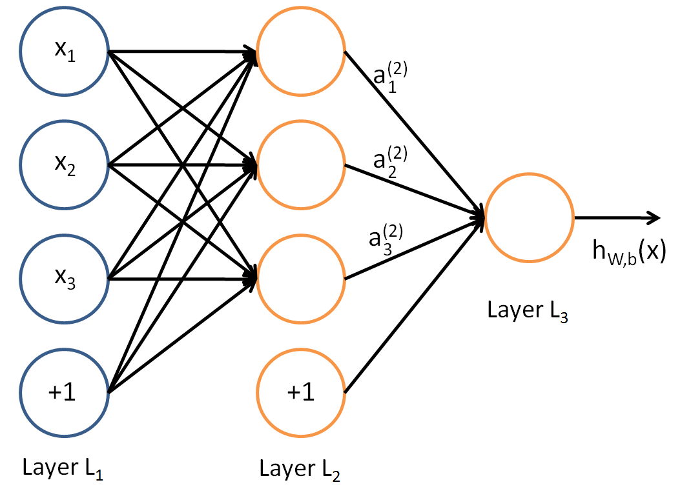

[TOC]

# Introduction

Consider a supervised learning problem where we have access to labeled training examples $(x^{(i)}, y^{(i)})$. Neural networks give a way of defining a complex, **non-linear** form of hypotheses $h_{W,b}(x)$, with parameters $W,b$ that we can fit to our data.

To describe neural networks, we will begin by describing the simplest possible neural network, one which comprises a single “neuron.”

This “neuron” is a computational unit that takes as input $x_1, x_2, x_3$ and a intercept term $b$, and outputs: $\textstyle h_{W,b}(x) = f(W^Tx) = f(\sum_{i=1}^3 W_{i}x_i +b)$, where $f: \R \to \R$ is called **activation function**. If the activation function is a sigmoid function, this neuron is same with logistic regression model.

# Multi-Layer Neural Networks

## Architectures

A neural network is put together by hooking together many of our simple “neurons,” so that the output of a neuron can be the input of another. For example, here is a small neural network:

In this figure, we have used circles to also denote the inputs to the network. The circles labeled “+1” are called **bias units**, and correspond to the intercept term. The leftmost layer of the network is called the **input layer**, and the rightmost layer the **output layer** (which, in this example, has only one node). The middle layer of nodes is called the **hidden layer**, because its values are not observed in the training set. We also say that our example neural network has 3 **input units** (not counting the bias unit), 3 **hidden units**, and 1 **output unit**.

We will let $n_l$ denote the number of layers in our network; thus $n_l=3$ in our example. We label the layer $l$ as $L_l$, so layer $L_1$ is the input layer, and layer $L_{n_l}$ the output layer. 

We have so far focused on one example neural network, but one can also build neural networks with other **architectures** (meaning patterns of connectivity between neurons), including ones with multiple hidden layers. The most common choice is a multi-layered network where layer $1$ is the input layer, layer $n_l$ is the output layer, and each layer $l$ is densely connected to next layer $l+1$. This is one example of a **feedforward neural network**, since the connectivity graph does not have any directed loops or cycles.

Neural networks can also have multiple output units. For example:

### Forward propagation

Our neural network has parameters $(W,b) = (W^{(1)}, b^{(1)}, W^{(2)}, b^{(2)})$, where we write $W_{ij}^{(l)}$ to denote the parameter (or weight) associated with the connection between unit $j$ in layer $l$, and unit $i$ in layer $l+1$, i.e. $W_{i,:}^{(l)}$ is the parameters to activate the unit $i$ in layer $l+1$. Also, $b_{i}^{(l)}$ is the bias associated with unit $i$ in layer $l+1$. We also write $a_{i}^{(l)}$ to denote the activation (meaning output value) of unit $i$ in layer $l$. Thus the unit $i$ in layer $l+1$ is computed as follows: 
$$
a_{i}^{(l+1)}=f(W_{i,:}^{(l)}a^{(l)}+b_{i}^{(l)})=f(b_{i}^{(l)} + \sum_j W_{ij}^{(l)} a_{j}^{(l)})
$$

 We can also compute all of units in layer $l+1$ in vector form:
$$
\begin{align}
z^{(l+1)} &= W^{(l)} a^{(l)} + b^{(l)}   \\
a^{(l+1)} &= f(z^{(l+1)})
\end{align}
$$
and we assume the activation function $f(.)$ is element-wise for vectors. We call this step **forward propagation.** By organizing our parameters in matrices and using matrix-vector operations, we can take advantage of fast linear algebra routines to quickly perform calculations in our network.

For the above example, we can get:
$$
\begin{align}
a^{(1)} &= x \\
z^{(2)} &= W^{(1)} a^{(1)} + b^{(1)} \\
a^{(2)} &= f(z^{(2)}) \\
z^{(3)} &= W^{(2)} a^{(2)} + b^{(2)} \\
a^{(3)} &= f(z^{(3)}) \\
h_{W,b}(x) &= a^{(3)} \\
\end{align}
$$

### Optimization

#### Cost function

Suppose we have a fixed training set $\{ (x^{(1)}, y^{(1)}), \ldots, (x^{(m)}, y^{(m)}) \}$ of $m$ training examples. We can train our neural network using batch gradient descent. we then define the overall **cost function** to be:
$$
\begin{align}
J(W,b)
&= \left[ \frac{1}{m} \sum_{i=1}^m J(W,b;x^{(i)},y^{(i)}) \right]
                       + \frac{\lambda}{2} \sum_{l=1}^{n_l-1} \; \sum_{i=1}^{s_l} \; \sum_{j=1}^{s_{l+1}} \left( W^{(l)}_{ji} \right)^2
 \\
&= \left[ \frac{1}{m} \sum_{i=1}^m \left( \frac{1}{2} \left\| h_{W,b}(x^{(i)}) - y^{(i)} \right\|^2 \right) \right]
                       + \frac{\lambda}{2} \sum_{l=1}^{n_l-1} \; \sum_{i=1}^{s_l} \; \sum_{j=1}^{s_{l+1}} \left( W^{(l)}_{ji} \right)^2
\end{align}
$$
The first term in the definition of $J(W,b)$ is an **average sum-of-squares error** term. The second term is a regularization term (also called a **weight decay** term) that tends to decrease the magnitude of the weights, and helps prevent overfitting. Usually weight decay is not applied to the bias terms $b_{i}^{(l)}$. Applying weight decay to the bias units usually makes only a small difference to the final network.

This cost function above is often used both for classification and for regression problems. For classification, we let y=0 or 1 represent the two class labels (recall that the sigmoid activation function outputs values in [0,1]; if we were using a tanh activation function, we would instead use -1 and +1 to denote the labels). For regression problems, we first scale our outputs to ensure that they lie in the [0,1] range (or if we were using a tanh activation function, then the [−1,1] range).

#### Initialization parameters

Our goal is to minimize $J(W,b)$ as a function of $W$ and $b$. To train our neural network, we will initialize each parameter $W_{ij}^{(l)}$ and each $b_{i}^{(l)}$ to a small random value near zero, and then apply an optimization algorithm such as batch gradient descent. Since $J(W,b)$ is a **non-convex** function, gradient descent is susceptible to local optima; however, in practice gradient descent usually works fairly well. Finally, note that it is important to initialize the parameters randomly, rather than to all 0’s. If all the parameters start off at identical values, then all the hidden layer units will end up learning the same function of the input. The random initialization serves the purpose of **symmetry breaking**.

#### Gradient descent

One iteration of gradient descent updates the parameters $W, b$ as follows:
$$
\begin{align}
W_{ij}^{(l)} &= W_{ij}^{(l)} - \alpha \frac{\partial}{\partial W_{ij}^{(l)}} J(W,b) \\
b_{i}^{(l)} &= b_{i}^{(l)} - \alpha \frac{\partial}{\partial b_{i}^{(l)}} J(W,b)
\end{align}
$$
where $\alpha$ is the learning rate.

The key step is computing the partial derivatives above. We will now describe the **backpropagation** algorithm, which gives an efficient way to compute these partial derivatives.

We will first describe how backpropagation can be used to compute $\textstyle \frac{\partial}{\partial W_{ij}^{(l)}} J(W,b; x, y)$ and $\textstyle \frac{\partial}{\partial b_{i}^{(l)}} J(W,b; x, y)$, the partial derivatives of the cost function $J(W,b;x,y)$ defined with respect to **a single example** $(x, y)$.

Then we get the partial derivatives of the cost function $J(W,b)$ respect to **the entire training set** as follows:
$$
\begin{align}
\frac{\partial}{\partial W_{ij}^{(l)}} J(W,b) &=
\left[ \frac{1}{m} \sum_{i=1}^m \frac{\partial}{\partial W_{ij}^{(l)}} J(W,b; x^{(i)}, y^{(i)}) \right] + \lambda W_{ij}^{(l)} \\
\frac{\partial}{\partial b_{i}^{(l)}} J(W,b) &=
\frac{1}{m}\sum_{i=1}^m \frac{\partial}{\partial b_{i}^{(l)}} J(W,b; x^{(i)}, y^{(i)})
\end{align}
$$

### Backward propagation

The intuition behind the backpropagation algorithm is as follows:

- Given a training example $(x, y)$, we will first run a “forward pass” to compute all the activations throughout the network, including the output value of the hypothesis $h_{W,b}(x$). 
- Then, for each node $i$ in layer $l$, we would like to compute an “**error term**” $\delta^{(l)}_i$ that measures how much that node was “responsible” for any errors in our output.
  - For an **output node**, we can directly measure the difference between the network’s activation and the true target value, and use that to define $\delta_{i}^{(n_l)}$
  - For a **hidden node**, we will compute $\delta_{i}^{(l)}$ based on a weighted average of the error terms of the nodes that uses $a^{(l)}_i$ as an input
- Compute the desired partial derivatives of parameters from the error terms.

The error term $\delta_{i}^{(n_l)}$ of output node $i$ in layer $n_l$ is defined:
$$
\begin{align}
\delta^{(n_l)}_i
= \frac{\partial}{\partial z^{(n_l)}_i} \;\;
\frac{1}{2} \left\|y - h_{W,b}(x)\right\|^2 = - (y_i - a^{(n_l)}_i) \cdot f'(z^{(n_l)}_i)
\end{align}
$$
The error term $\delta_{i}^{(l)}$ of hidden node $i$ in layer $l$ is defined:
$$
\delta^{(l)}_i = \frac{\partial}{\partial z^{(l)}_i} \;\;
\frac{1}{2} \left\|y - h_{W,b}(x)\right\|^2 = \left( \sum_{j=1}^{s_{l+1}} W^{(l)}_{ji} \delta^{(l+1)}_j \right) f'(z^{(l)}_i)
$$
The partial derivatives of parameters:
$$
\begin{align}
\frac{\partial}{\partial W_{ij}^{(l)}} J(W,b; x, y) &= a^{(l)}_j \delta_i^{(l+1)} \\
\frac{\partial}{\partial b_{i}^{(l)}} J(W,b; x, y) &= \delta_i^{(l+1)}.
\end{align}
$$
Finally, we can also re-write the algorithm using matrix-vectorial notation:
$$
\begin{align} \delta^{(n_l)} = - (y - a^{(n_l)}) \odot f'(z^{(n_l)}) \end{align} 
$$

$$
\begin{align} \delta^{(l)} = \left((W^{(l)})^T \delta^{(l+1)}\right) \odot f'(z^{(l)}) \end{align}
$$

$$
\begin{align}
\nabla_{W^{(l)}} J(W,b;x,y) &= \delta^{(l+1)} (a^{(l)})^T, \\
\nabla_{b^{(l)}} J(W,b;x,y) &= \delta^{(l+1)}.
\end{align}
$$

## Activation functions

There are many activation functions you can use. We'll introduce several common choices: **sigmoid**, **tanh**, **ReLU**.

### Sigmoid

The sigmoid function takes the following form:

$$
f(z)=\frac {1} {1 + \exp(-z)}
$$

And its derivative function is:

$$
f'(z) = f(z) (1-f(z))
$$

### Tanh

The hyperbolic tangent, or tanh, function:

$$
f(z) = \tanh(z) = \frac{e^z - e^{-z}}{e^z + e^{-z}}.
$$

And its derivation function:

$$
f'(z) = 1 - (f(z))^2
$$

The tanh function is a rescaled version of the sigmoid, and its output range is $[-1, 1]$ instead of $[0, 1]$. 

### ReLU

The rectified linear function, often works better in practice for deep neural networks. This activation function is different from sigmoid and tanh because it is not bounded or continuously differentiable.

$$
f(z) = \max(0, z)
$$

The rectified linear function is piece-wise linear and saturates at exactly 0 whenever the input $z$ is less than 0, and it is not bounded for $z$ larger than 0.

And its derivation function:

$$
f'(z)=1 \quad \text{if} \quad z>0 \quad \text{else} \quad 0
$$

The gradient is undefined at $z=0$, though this doesn’t cause problems in practice because we average the gradient over many training examples during optimization.

Here are plots of the sigmoid, tanhtanh and rectified linear functions:

