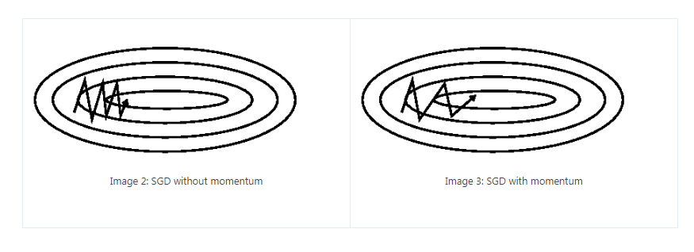

[TOC]

# Motivation

**Batch methods**, such as limited memory BFGS, which use the full training set to compute the next update to parameters at each iteration tend to converge very well to local optima. They are also straight forward to get working provided a good off the shelf implementation because they have very few hyper-parameters to tune. There are some disadvantages for batch methods:

- However, often in practice computing the cost and gradient for the entire training set can be very slow and sometimes intractable on a single machine if the dataset is too big to fit in main memory. 
- Another issue with batch optimization methods is that they don’t give an easy way to incorporate new data in an ‘online’ setting. 

Stochastic Gradient Descent (SGD) addresses both of these issues by following the negative gradient of the objective after seeing only a single or a few training examples. The use of SGD In the neural network setting is motivated by the high cost of running back propagation over the full training set. SGD can overcome this cost and still lead to fast convergence.

# SGD

The standard gradient descent algorithm updates the parameters $\theta$ as:
$$
\theta = \theta - \alpha \nabla_\theta E[J(\theta)] \approx \theta - \alpha \nabla_\theta J(\theta;X,Y)
$$
where the expectation in the above equation is approximated by evaluating the cost and gradient over the full training set.

Stochastic Gradient Descent (SGD) simply does away with the expectation in the update and computes the gradient of the parameters using only a single or a few training examples:
$$
\theta = \theta - \alpha \nabla_\theta J(\theta; x^{(i)},y^{(i)})
$$
where a pair $(x^{(i)},y^{(i)})$ from training set.

The major difference between SGD and batch gradient descent: there is much more variance in the SGD update, i.e. convergence is more unstable.

## Working with mini-batch

Generally each parameter update in SGD is computed w.r.t a few training examples or a **mini-batch** as opposed to a single example. The reason for this is twofold: 

- first this reduces the variance in the parameter update and can lead to more stable convergence
- second this allows the computation to take advantage of highly optimized matrix operations that should be used in a well vectorized computation of the cost and gradient

Note the size of mini-batch is a hyper-parameter for your model.

## Learning rate schedule

In SGD the learning rate $\alpha$ is typically much smaller than a corresponding learning rate in batch gradient descent because there is much more variance in the update. Choosing the proper learning rate and schedule (i.e. changing the value of the learning rate as learning progresses) can be fairly difficult. 

One standard method that works well in practice is to use a small enough constant learning rate that gives stable convergence in the initial epoch (full pass through the training set) or two of training and then halve the value of the learning rate as convergence slows down. 

An even better approach is to evaluate a held out set after each epoch and anneal the learning rate when the change in objective between epochs is below a small threshold. This tends to give good convergence to a local optima. 

Another commonly used schedule is to anneal the learning rate at each iteration $t$ as $\frac{a}{b+t}$ where $a$ and $b$ dictate the initial learning rate and when the annealing begins respectively.

More sophisticated methods include using a backtracking line search to find the optimal update.

## The order of examples feed into SGD

One final but important point regarding SGD is the order in which we present the data to the algorithm. If the data is given in some meaningful order, this can bias the gradient and lead to poor convergence. Generally a good method to avoid this is to randomly shuffle the data prior to each epoch of training.

# Momentum

If the objective has the form of a long shallow ravine leading to the optimum and steep walls on the sides, standard SGD will tend to oscillate across the narrow ravine since the negative gradient will point down one of the steep sides rather than along the ravine towards the optimum. The objectives of deep architectures have this form near local optima and thus standard SGD can lead to very slow convergence particularly after the initial steep gains.

(This picture copy from http://ruder.io/optimizing-gradient-descent/index.html#momentum)

Momentum is one method for pushing the objective more quickly along the shallow ravine. The momentum update is given by,
$$
\begin{align}
v &= \gamma v+ \alpha \nabla_{\theta} J(\theta; x^{(i)},y^{(i)}) \\
\theta &= \theta - v
\end{align}
$$
In the above equation $v$ is the current velocity vector which is of the same dimension as the parameter vector $\theta$. The learning rate $\alpha$ is as described above, although when using momentum $\alpha$ may need to be smaller since the magnitude of the gradient will be larger. Finally $\gamma \in (0,1]$ determines for how many iterations the previous gradients are incorporated into the current update. Generally $\gamma$ set to 0.5 until the initial learning stabilizes and then is increased to 0.9 or higher.

