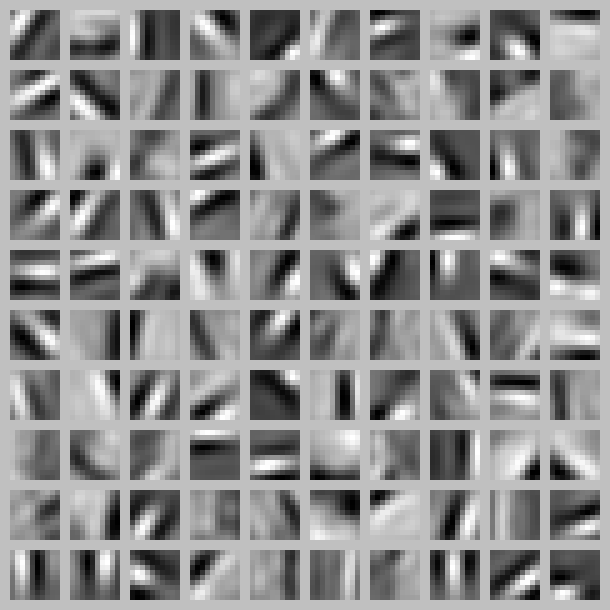

# Introduction

In supervised learning, we have labeled training examples. Now suppose we have only a set of unlabeled training examples. An **autoencoder** neural network is an **unsupervised learning** algorithm that applies backpropagation, setting the target values to be equal to the inputs.

The autoencoder tries to learn a function $\textstyle h_{W,b}(x) \approx x$. In other words, it is trying to learn an approximation to the **identity function**, so as to output $\hat x$ that is similar to $x$. The identity function seems a particularly trivial function to be trying to learn; but by placing constraints on the network, such as by *limiting the number of hidden units*, we can discover interesting structure about the data. 

For example, suppose the inputs $x$ are the pixel intensity values from a 10×1010×10 image, $x \in \R^{100}$, and there are $s_2 = 50$ hidden units in layer $L_2$. Note that we also have $y \in \R^{100}$.  Since there are only 50 hidden units, the network is forced to learn a compressed representation of the input. I.e., given only the vector of hidden unit activations $a^{(2)} \in \R^{50}$, it must try to ”‘reconstruct”’ the 100-pixel input $x$.

# Compressed representation learning

## Motivation

If the input were completely random—say, each $x_i$ comes from an IID Gaussian independent of the other features. Then to learn a compressed representation would be very difficult. Fortunately, in real applications, the input features are correlated more or less. Thus autoencoders will be able to discover some of those correlations and compress them.  In fact, the above simple autoencoder often ends up learning a low-dimensional representation very similar to PCAs.

## Does limiting the number of hidden units work?

How can we place constraints on the network to learn compressed representation? In the above example, we constraint network by limiting the number of hidden units, does this apply to all situations? How can we determine the number of hidden units? hand-design? learn from a hold-out dataset? It seems that it is not a very general approach.

## Sparsity constraints

Actually, even when the number of hidden units is large, we can still discover interesting structure, by imposing other constraints on the network. In particular, if we impose a **sparsity constraint** on the hidden units, then the autoencoder will still discover interesting structure in the data, even if the number of hidden units is large, i.e. the dimension of $a^{(2)}$ is larger than $x$ for the above example.

What is a sparsity constraint? Informally, We would like to constrain the neurons to be inactive most of the time. For a sigmoid neuron, it is active (or as firing) if its output value is close to 1, or inactive if its output value is close to 0. For a tanh neuron, it is inactive if its output value is close to -1.

Formally, recall that $a_j^{(2)}(x^{(i)})$ the activation of hidden unit $j$ in the autoencoder when given the specific input $x^{(i)}$ in the above example, we can define sparsity constraint as follows:
$$
\begin{align}
\begin{split}
\hat\rho_j &= \frac{1}{m} \sum_{i=1}^m \left[ a^{(2)}_j(x^{(i)}) \right] \\
\hat\rho_j &= \rho
\end{split}
\end{align}
$$
where $m$ is the number of training examples; $\rho$ is a ”‘sparsity parameter”’, typically a small value close to zero (say $\rho = 0.05$). In other words, we would like the average activation of each hidden neuron $j$ to be close to 0.05 (say). To satisfy this constraint, the hidden unit’s activations must mostly be near 0.

## Integrate sparsity constraint in optimization

We can add an extra penalty term to our optimization objective that penalizes $\hat\rho_j$ deviating significantly from $\rho$. Many choices of the penalty term will give reasonable results. We will choose the following:
$$
\begin{align}
\sum_{j=1}^{s_2} {\rm KL}(\rho || \hat\rho_j)

=

\sum_{j=1}^{s_2} \rho \log \frac{\rho}{\hat\rho_j} + (1-\rho) \log \frac{1-\rho}{1-\hat\rho_j}.
\end{align}
$$
where $\textstyle {\rm KL}(\rho || \hat\rho_j)
= \rho \log \frac{\rho}{\hat\rho_j} + (1-\rho) \log \frac{1-\rho}{1-\hat\rho_j}$ is the Kullback-Leibler (KL) divergence between a Bernoulli random variable with mean $\rho$ and a Bernoulli random variable with mean $\hat \rho_j$.

Our overall cost function is now:
$$
\begin{align}
J_{\rm sparse}(W,b) = J(W,b) + \beta \sum_{j=1}^{s_2} {\rm KL}(\rho || \hat\rho_j),
\end{align}
$$
And the derivative for the second layer is:
$$
\begin{align}
\delta^{(2)}_i =
  \left( \left( \sum_{j=1}^{s_{2}} W^{(2)}_{ji} \delta^{(3)}_j \right)
+ \beta \left( - \frac{\rho}{\hat\rho_i} + \frac{1-\rho}{1-\hat\rho_i} \right) \right) f'(z^{(2)}_i) .
\end{align}
$$

# Visualizing a Trained Autoencoder

Having trained a (sparse) autoencoder, we would now like to visualize the function learned by the algorithm, to try to understand what it has learned. Consider the case of training an autoencoder on 10×1010×10 images. Each hidden unit $j$ computes a function of the input $x$:
$$
\begin{align}
a^{(2)}_j = f\left(\sum_{k=1}^{100} W^{(1)}_{jk} x_k  + b^{(1)}_j \right)=f\left(W_{j,:}^{(1)}x+b^{(1)}_j\right)
\end{align}
$$
In particular, we think of $a_j^{(2)}$ as some non-linear feature of the input $x$. We ask: What input image $x$ would cause $a_j^{(2)}$ to be maximally activated?  Less formally, what is the feature that hidden unit $j$ is looking for? We  can display the normed $\frac {W_{j,:}} {||W_{j,:}||}$ as image to check the feature that hidden unit $j$ is looking for.

When we do this for a sparse autoencoder (trained with 100 hidden units on 10x10 pixel inputs we get the following results:

We see that the different hidden units have learned to detect edges at different positions and orientations in the image. These features are, not surprisingly, useful for such tasks as object recognition and other vision tasks. When applied to other input domains (such as audio), this algorithm also learns useful representations/features for those domains too.