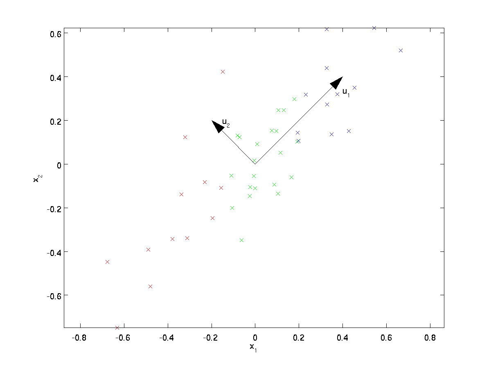

[TOC]

# Introduction

Principal Components Analysis (**PCA**) is a dimensionality reduction algorithm that can be used to significantly speed up your unsupervised feature learning algorithm. 

More importantly, understanding PCA will enable us to later implement **whitening**, also called **sphering**, which is an important pre-processing step for many algorithms.

Suppose you are training your algorithm on images. Then the input will be somewhat redundant, because the values of adjacent pixels in an image are highly correlated. Concretely, suppose we are training on 16x16 grayscale image patches. Then $x \in \R^{256}$ are 256 dimensional vectors, with one feature $x_i$ corresponding to the intensity of each pixel. Because of the correlation between adjacent pixels, PCA will allow us to approximate the input with a much lower dimensional one, while incurring very little error.

# PCA example

For our running example, we will use a dataset $\textstyle \{x^{(1)}, x^{(2)}, \ldots, x^{(m)}\}$ with n=2 dimensional inputs, so that $x \in \R^2$. Suppose we want to reduce the data from 2 dimensions to 1.

Here is our dataset which is pre-processed so that each of the features $x_1$ and $x_2$ have about the same mean (zero) and variance (the color of points is just for the purpose of illustration):

## The goal of PCA

The goal of PCA is to find a lower-dimensional subspace onto which to project our data. 

From visually examining the data, it appears that $u_1$ is the principal direction of variation of the data, and $u_2$ the secondary direction of variation:

To more formally find the directions $u_1$ and $u_2$, we first compute the matrix $\Sigma$ as follows:
$$
\begin{align}
\Sigma = \frac{1}{m} \sum_{i=1}^m (x^{(i)})(x^{(i)})^T. 
\end{align}
$$
Because $x$ has zero mean (after pre-process), then $\Sigma$ is exactly the covariance matrix of $x$. It can then be shown that $u_1$—the principal direction of variation of the data—is the top (principal) eigenvector of $\Sigma$, and $u_2$ is the second eigenvector. Concretely, let us compute the eigenvectors of $\Sigma$, and stack the eigenvectors in columns to form the matrix $U​$:
$$
\begin{align}
U = 
\begin{bmatrix} 
| & | & & |  \\
u_1 & u_2 & \cdots & u_n  \\
| & | & & | 
\end{bmatrix}       
\end{align}
$$
One of the properties of $U$ is that it is an “orthogonal” matrix, which means that it satisfies $\textstyle U^TU = UU^T = I$. 

The vectors $u_1$ and $u_2$ in our example form a new basis in which we can represent the data. I.e. $u^T_1x$ is the length (magnitude) of the projection of $x$ onto the vector $u_1$ and $u^T_2x$ is the length (magnitude) of the projection of $x$ onto the vector $u_2$.

PCA is invariant to the scaling of the data, and will return the same eigenvectors regardless of the scaling of the input. More formally, if you multiply each feature vector $x$ by some positive number (thus scaling every feature in every training example by the same number), PCA’s output eigenvectors will not change, but the corresponding eigenvalues will multiply the same number.

## Rotating the Data

Thus, we can represent $x$ in the $(u_1, u_2)$-basis by computing:
$$
\begin{align}
x_{\rm rot} = U^Tx = \begin{bmatrix} u_1^Tx \\ u_2^Tx \end{bmatrix} 
\end{align}
$$
Plotting this transformed/rotated data $\textstyle x_{\rm rot}$:

The convariance matrix for the rotated data $x_{\rm rot}$:
$$
\begin{align}
\begin{bmatrix}
\lambda_1 & 0  \\
0 & \lambda_2
\end{bmatrix}.
\end{align}
$$
If you need to go from the rotated vectors $x_{\rm rot}$ back to the original data $x$, you can compute:
$$
\begin{align}
x = U x_{\rm rot}=U U^T x = I x
\end{align}
$$

## Reducing the Data Dimension

We see that the principal direction of variation of the data is the first dimension $\textstyle x_{\rm rot,1}$ of this rotated data. Thus, if we want to reduce this data to one dimension, we can set:
$$
\begin{align}
\tilde{x}^{(i)} = x_{\rm rot,1}^{(i)} = u_1^Tx^{(i)} \in \R
\end{align}
$$
Another way of explaining PCA is that $\textstyle x_{\rm rot}$ is an $n$ dimensional vector, where the first few components are likely to be large and the later components are likely to be small (e.g., in our example, the $x_{\rm rot,1}^{(i)}$ is larger than $x_{\rm rot,2}^{(i)}$ for most examples). What PCA does it it drops the the later (smaller) components of $\textstyle x_{\rm rot} $, and just approximates them with 0’s. Concretely, our definition of $\tilde x$  can also be arrived at by using an approximation to $\textstyle x_{\rm rot} $ where all but the first $k$ components are zeros.
$$
\begin{align}
\tilde{x} = 
\begin{bmatrix} 
x_{\rm rot,1} \\
\vdots \\ 
x_{\rm rot,k} \\
0 \\ 
\vdots \\ 
0 \\ 
\end{bmatrix}
\approx 
\begin{bmatrix} 
x_{\rm rot,1} \\
\vdots \\ 
x_{\rm rot,k} \\
x_{\rm rot,k+1} \\
\vdots \\ 
x_{\rm rot,n} 
\end{bmatrix}
= x_{\rm rot} 
\end{align}
$$

Thus deciding which components to keep becomes just keeping the top $k$ components. When we do this, we also say that we are “retaining the top $k$ PCA (or principal) components.”

Plot the approximated points $\tilde x$ for our example:

If you are training an autoencoder or other unsupervised feature learning algorithm, the running time of your algorithm will depend on the dimension of the input. If you feed $\tilde x \in \R^k$ into your learning algorithm instead of $x \in \R^n$, where $k<n$, then you’ll be training on a lower-dimensional input, and thus your algorithm might run significantly faster. For many datasets, the lower dimensional $\tilde x$ representation can be an extremely good approximation to the original, and using PCA this way can significantly speed up your algorithm while introducing very little approximation error.

## Recovering an Approximation of the Data

Now, $\tilde x \in \R^k $ is a lower-dimensional, “compressed” representation of the original $x \in \R^n$. Given $\tilde x$, how can we recover an approximation $\hat x$ to the original value of $x$? 

From an earlier section, we know that $x = U x_{\rm rot}$. Further, we can think of $\tilde x$ as an approximation to $x_{\rm rot}$, where we have set the last $n-k$ components to zeros. Thus, given $\tilde x$, we can pad it out with $n-k$ zeros to get our approximation to $x_{\rm rot}$. Finally, we pre-multiply by $U$ to get our approximation to $x$:
$$
\begin{align}
\hat{x}  = U \begin{bmatrix} \tilde{x}_1 \\ \vdots \\ \tilde{x}_k \\ 0 \\ \vdots \\ 0 \end{bmatrix}  
= \sum_{i=1}^k u_i \tilde{x}_i. 
\end{align}
$$
Applying this to our dataset, we get the following plot for $\hat x$:

## Number of components to retain

How do we set $k$; i.e., how many PCA components should we retain? In our simple 2 dimensional example, it seemed natural to retain 1 out of the 2 components, but for higher dimensional data, this decision is less trivial. If $k$ is too large, then we won’t be compressing the data much; in the limit of $k=n$, then we’re just using the original data (but rotated into a different basis). Conversely, if $k$ is too small, then we might be using a very bad approximation to the data.

To decide how to set $k$, we will usually look at the **percentage of variance retained**  for different values of $k$. Let $\textstyle \lambda_1, \lambda_2, \ldots, \lambda_n$ be the eigenvalues of $\Sigma$ (sorted in decreasing order), so that $\lambda_j$ is the eigenvalue corresponding to the eigenvector $u_j$. Then if we retain $k$ principal components, the percentage of variance retained is given by:
$$
\begin{align}
\frac{\sum_{j=1}^k \lambda_j}{\sum_{j=1}^n \lambda_j}.
\end{align}
$$
In the case of images, one common heuristic is to choose $k$ so as to retain 99% of the variance. In other words, we pick the smallest value of $k$ that satisfies:
$$
\begin{align}
\frac{\sum_{j=1}^k \lambda_j}{\sum_{j=1}^n \lambda_j} \geq 0.99. 
\end{align}
$$
Depending on the application, if you are willing to incur some additional error, values in the 90-98% range are also sometimes used. When you describe to others how you applied PCA, saying that you chose $k$ to retain 95% of the variance will also be a much more easily interpretable description than saying that you retained 120 (or whatever other number of) components.

# Preprocess for PCA on Images

For PCA to work, usually we want each of the features $\textstyle x_1, x_2, \ldots, x_n$ to have a similar range of values to the others (and to have a mean close to zero). If you’ve used PCA on other applications before, you may therefore have *separately pre-processed each feature to have zero mean and unit variance, by separately estimating the mean and variance of each feature* $x_i$. In detail, in order for PCA to work well, informally we require that (i) The features have approximately zero mean (**mean normalization**), and (ii) The different features have similar variances to each other (**variance normalization**).

However, this isn’t the pre-processing that we will apply to most types of images. Specifically, suppose we are training our algorithm on **natural images**. By “natural images,” we informally mean the type of image that a typical animal or person might see over their lifetime.

## The variance normalization on images

When training on natural images, it makes little sense to estimate a separate mean and variance for each pixel, because the statistics in one part of the image should (theoretically) be the same as any other.
This property of images is called **stationarity**. That means natural images already satisfied (ii) even without variance normalization, i.e. different features have similar variances to each other in the raw images. Thus we won’t perform any variance normalization.

## The mean normalization on images

What about mean normalization? We need to perform to ensure that the features have a mean around zero. Depending on the application, very often we are not interested in how bright the overall input image is. For example, in object recognition tasks, the overall brightness of the image doesn’t affect what objects there are in the image. More formally, we are not interested in the mean intensity value of an image patch; thus, we can subtract out this value, as a form of mean normalization:
$$
\mu^{(i)} := \frac{1}{n} \sum_{k=1}^n x^{(i)}_k  \\
x^{(i)}_j := x^{(i)}_j - \mu^{(i)} \qquad \text{for all} \quad j
$$
where $\mu^{(i)}$ is the mean intensity of the image $x^{(i)}$.

If you are training your algorithm on images other than natural images (for example, images of handwritten characters, or images of single isolated objects centered against a white background), other types of normalization might be worth considering, and the best choice may be application dependent. But when training on natural images, using the per-image mean normalization method as given in the equations above would be a reasonable default.

# Whitening

We have used PCA to reduce the dimension of the data. There is a closely related preprocessing step called **whitening** (or, in some other literatures, **sphering**) which is needed for some algorithms. If we are training on images, the raw input is redundant, since adjacent pixel values are highly correlated. The goal of whitening is to make the input less redundant:

- the features are less correlated with each other.
- the features all have the same variance, like unit variance.

I.e. we want data has covariance equal to the identity matrix $I$.

## PCA whitening

Let's consider 2D example. How can we make our input features uncorrelated with each other? We had already done this when computing $\textstyle x_{\rm rot}^{(i)} = U^Tx^{(i)}$:

The convariance matrix for the rotated data $x_{\rm rot}$:
$$
\begin{align}
\begin{bmatrix}
\lambda_1 & 0  \\
0 & \lambda_2
\end{bmatrix}.
\end{align}
$$
To make each of our input features have unit variance, we can simply rescale each feature by $\textstyle 1/\sqrt{\lambda_i}$. Concretely, we define our whitened data $\textstyle x_{\rm PCAwhite} \in \R^n$ as follows:
$$
\begin{align}
x_{\rm PCAwhite,i} = \frac{x_{\rm rot,i} }{\sqrt{\lambda_i}}.   
\end{align}
$$
Plot the whitened data $x_{\rm PCAwhite}$:

This data now has covariance equal to the identity matrix $I$. We say that $x_{\rm PCAwhite}$ is our **PCA whitened** version of the data: The different components of $x_{\rm PCAwhite}$ are uncorrelated and have unit variance.

### Combined with dimensionality reduction

If you want to have data that is whitened and which is lower dimensional than the original input, you can also optionally keep only the top $k$ components of $x_{\rm PCAwhite}$.

## ZCA Whitening

The solutions of PCA whitening isn’t unique. Assume $R$ is any orthogonal matrix, then $Rx_{\rm PCAwhite}$ will also have identity covariance.

In **ZCA whitening**, we choose $R=U$:
$$
\begin{align}
x_{\rm ZCAwhite} = U x_{\rm PCAwhite}
\end{align}
$$
It can be shown in the following picture that out of all possible choices for $R$, this choice of rotation causes $x_{\rm ZCAwhite}$ to be as close as possible to the original input data $x$.

When using ZCA whitening (unlike PCA whitening), we usually keep all $n$ dimensions of the data, and do not try to reduce its dimension.

ZCA whitening is a form of pre-processing of the data that maps it from $x$ to $x_{\rm ZCAwhite}$. It turns out that this is also a rough model of how the biological eye (the retina) processes images. Specifically, as your eye perceives images, most adjacent “pixels” in your eye will perceive very similar values, since adjacent parts of an image tend to be highly correlated in intensity. It is thus wasteful for your eye to have to transmit every pixel separately (via your optic nerve) to your brain. Instead, your retina performs a decorrelation operation (this is done via retinal neurons that compute a function called “on center, off surround/off center, on surround”) which is similar to that performed by ZCA. This results in a less redundant representation of the input image, which is then transmitted to your brain.

## Regularizaton

When implementing PCA whitening or ZCA whitening in practice, sometimes some of the eigenvalues $\lambda_i$ will be numerically close to 0, and thus the scaling step where we divide by$\sqrt {\lambda_i}$ would involve dividing by a value close to zero; this is numerically unstable.

In practice, we therefore implement this scaling step using a small amount of regularization, and add a small constant $\epsilon$ to the eigenvalues before taking their square root and inverse:  
$$
\begin{align}
x_{\rm PCAwhite,i} = \frac{x_{\rm rot,i} }{\sqrt{\lambda_i + \epsilon}}.
\end{align}
$$
where $\epsilon \approx 10^{-5}$ might be typical.

