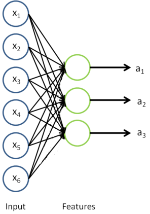

# Motivation

Assuming that we have a sufficiently powerful learning algorithm, one of the most reliable ways to get better performance is to give the algorithm more data. One can always try to get more labeled data, but this can be expensive. While having large numbers of people **hand-label lots of data** is probably a step forward compared to having large numbers of researchers **hand-engineer features**, it would be nice to do better. 

In particular, the promise of **self-taught learning** and **unsupervised feature learning** is that if we can get our algorithms to learn from ”unlabeled” data, then we can easily obtain and learn from massive amounts of it. Even though a single unlabeled example is less informative than a single labeled example, if we can get tons of the former—for example, by downloading random unlabeled images/audio clips/text documents off the internet—and if our algorithms can exploit this unlabeled data effectively, then we might be able to achieve better performance than the massive hand-engineering and massive hand-labeling approaches.

In Self-taught learning and Unsupervised feature learning, we will give our algorithms a large amount of unlabeled data with which to learn a good feature representation of the input. If we are trying to solve a specific classification task, then we take this learned feature representation and whatever (perhaps small amount of) labeled data we have for that classification task, and apply supervised learning on that labeled data to solve the classification task.

These ideas probably have the most powerful effects in problems where we have a lot of unlabeled data, and a smaller amount of labeled data. However, they typically give good results even if we have only labeled data (in which case we usually perform the feature learning step using the labeled data, but ignoring the labels).

# Learning features

## RICA learns features

We have already seen how **RICA** (an unsupervised feature learning algorithm) can be used to learn features from unlabeled data. Concretely, suppose we have an unlabeled training set $\textstyle \{ x_u^{(1)}, x_u^{(2)}, \ldots, x_u^{(m_u)}\}$ with $m_u$ unlabeled examples (The subscript “u” stands for “labeled.”). We can then train an RICA on this data (perhaps with appropriate whitening or other pre-processing):

Now, suppose we have a labeled training set $\textstyle \{ (x_l^{(1)}, y^{(1)}), (x_l^{(2)}, y^{(2)}), \ldots (x_l^{(m_l)}, y^{(m_l)}) \}$ (The subscript “l” stands for “labeled.”).

## Work with supervised learning

We can now find a better representation for the inputs. For example, to represent example $x_l^{(1)}$, we can either just **replace** the original feature vector with $a_l^{(1)}$. Alternatively, we can **concatenate** the two feature vectors together, getting a representation $\textstyle (x_l^{(1)}, a_l^{(1)})$. 

Thus, our training set now becomes $\textstyle \{ (a_l^{(1)}, y^{(1)}),
(a_l^{(2)}, y^{(2)}), \ldots (a_l^{(m_l)}, y^{(m_l)}) \}$ or $\textstyle \{ ((x_l^{(1)}, a_l^{(1)}), y^{(1)}), ((x_l^{(2)}, a_l^{(1)}), y^{(2)}), \ldots, ((x_l^{(m_l)}, a_l^{(1)}), y^{(m_l)}) \}$. In practice, the concatenated representation often works better; but for memory or computation representations, we will sometimes use the replacement representation as well.

Finally, we can train a supervised learning algorithm such as an SVM, logistic regression, etc. to obtain a function that makes predictions on the $y$ values.

## Pre-processing on data

During the feature learning stage where we were learning from the unlabeled training set $\textstyle \{ x_u^{(1)}, x_u^{(2)}, \ldots, x_u^{(m_u)}\}$, we may have computed various pre-processing parameters. 

For example, one may have computed a mean value of the data and subtracted off this mean to perform mean normalization, or used PCA to compute a matrix $U$ to represent the data as $U^Tx$ (or used PCA whitening or ZCA whitening). If this is the case, then *it is important to save away these preprocessing parameters, and to use the ”same” parameters during the labeled training phase and the test phase, so as to make sure we are always transforming the data the same way to feed into RICA*. In particular, if we have computed a matrix $U$ using the unlabeled data and PCA, we should keep the ”same” matrix $U$ and use it to preprocess the labeled examples and the test data. We should not re-estimate a different $U$ matrix (or data mean for mean normalization, etc.) using the labeled training set, since that might result in a dramatically different pre-processing transformation, which would make the input distribution to RICA very different from what it was actually trained on.

# On the terminology of unsupervised feature learning

There are two common **unsupervised feature learning** settings, depending on what type of unlabeled data you have:

- The more general and powerful setting is the **self-taught learning** setting, which does not assume that your unlabeled data $x_u$ has to be drawn from the same distribution as your labeled data $x_l$. 

  For example, suppose your goal is a computer vision task where you’d like to distinguish between images of cars and images of motorcycles; so, each labeled example in your training set is either an image of a car or an image of a motorcycle.
  Where can we get lots of unlabeled data? The easiest way would be to obtain some random collection of images, perhaps downloaded off the internet. We could then train RICA on this large collection of images, and obtain useful features from them. Because here the unlabeled data is drawn from a different distribution than the labeled data (i.e., perhaps some of our unlabeled images may contain cars/motorcycles, but not every image downloaded is either a car or a motorcycle), we call this self-taught learning.

- The more restrictive setting where the unlabeled data comes from exactly the same distribution as the labeled data is sometimes called the **semi-supervised learning** setting.

  In contrast, if we happen to have lots of unlabeled images lying around that are all images of ”either” a car or a motorcycle, but where the data is just missing its label (so you don’t know which ones are cars, and which ones are motorcycles), then we could use this form of unlabeled data to learn the features. This setting—where each unlabeled example is drawn from the same distribution as your labeled examples—is sometimes called the semi-supervised setting. In practice, we often do not have this sort of unlabeled data (where would you get a database of images where every image is either a car or a motorcycle, but just missing its label?), and so in the context of learning features from unlabeled data, the self-taught learning setting is more broadly applicable.

